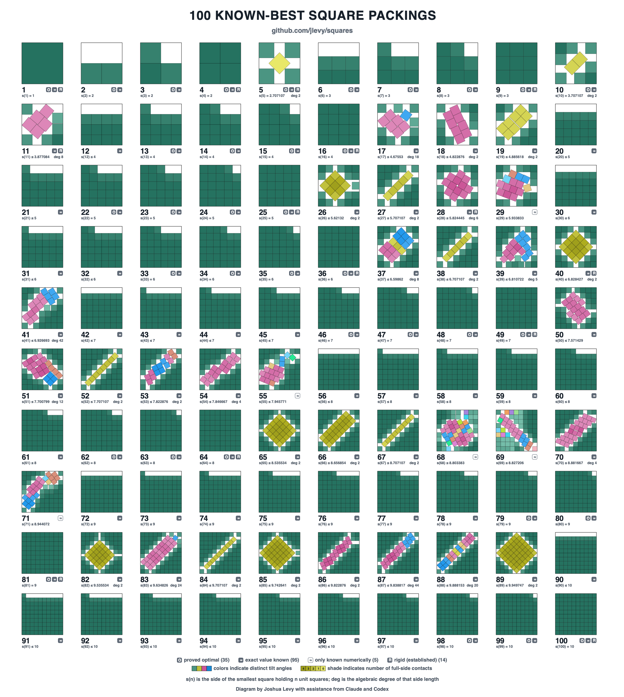

# Square Packing

`s(n)` is the side of the smallest square that holds `n` non-overlapping unit squares.
The question is elementary to state and stubbornly open: at `n = 11` the best known
packing dates from 1979, and roughly `0.088` in side length still separates it from the
best proved lower bound.

This repository aims to be the most comprehensive research resource on square packing
assembled anywhere: the primary literature readable offline, a per-case record of what
is actually known for every `n`, code that searches for packings and certifies them
exactly, and the full experimental history of running it.
Every claim carries the evidence that earns it, and says which kind of evidence that is.

[](explorations/packing/atlas/known-best/known-best-1-100.svg)

*The retained `n = 1…100` atlas, each packing normalized to its own container and
labeled with its best known side upper bound.
Badges mark the 35 side lengths proved optimal, and whether a side length is pinned
exactly by a radical or minimal polynomial or is so far known only numerically.
Select the image for the zoomable SVG, or take the
[print-ready PDF](explorations/packing/atlas/known-best/known-best-1-100.pdf).*

## What Is Here

| Where | What |
| --- | --- |
| [**The frontier**](explorations/packing/frontier/STATUS.md) | One schema-validated record per case for `n = 1…100`, tracking reported and formally verified bounds as separate lanes, plus a generated reader-first status table |
| [**The atlas**](explorations/packing/atlas/README.md) | Deterministic renderings of the known-best packing for every `n ≤ 100`, a source map for the prospective range `n = 101…324`, and an enumeration of size-five contact scaffolds |
| [**The literature**](explorations/packing/resources/README.md) | 27 papers and 13 web sources held locally and greppable: the original PDF or HTML, a cleaned Markdown transcription, and the unedited extraction to check it against |
| [**The reports**](explorations/packing/README.md#reports) | Six research reports: the mathematics of `s(11)`, the algorithms and tooling, a search philosophy, and three on what to build |
| [**The code**](explorations/packing/development.md) | An exact verifier over algebraic number fields, an LP-in-cell quench, and `sqsearch`, a Rust search engine |
| [**The experiment record**](explorations/packing/campaign/README.md) | A registry of falsifiable hypotheses, experiments that freeze their criterion before measuring, the agent-session record, and a generated ledger |
| [**The defect log**](explorations/packing/defects.md) | Every defect found in this project’s own reasoning and code, with what caught each one |

The verifier certifies Walter Trump’s 1979 `n = 11` packing exactly, over a degree-8
number field, rather than to a tolerance.

## How Claims Are Ranked

An archive is only as good as its willingness to say what it does not know, so assurance
is tracked rather than assumed.

**Verified** means formal: an exact check, a rigorous interval certificate, or a
complete proof decides the claim and its preconditions.
**Numerically checked** covers every finite-precision calculation, whether binary64 or a
tolerance of `1e-100` — arbitrary precision describes a library, not a result.
A source claim that has crossed neither boundary is **reported**, and stays labeled that
way.

Upper and lower bounds are tracked separately for the same reason.
A verified feasible witness proves an upper bound and says nothing about optimality;
that needs a matching verified lower bound.
The status table shows all four side by side.

The record is also honest where it falls short.
Twelve archive entries do not yet meet the three-way transcription discipline, and
[the archive README](explorations/packing/resources/README.md) names each one instead of
rounding up.

## Start Here

| Document | What it is |
| --- | --- |
| [TUTORIAL](explorations/packing/TUTORIAL.md) | The problem from first principles: the objects, why the approach is shaped this way, and what is established versus open |
| [SYNOPSIS](explorations/packing/SYNOPSIS.md) | The technical root: terminology contract, assurance vocabulary, current state, and the active handoff |
| [Project README](explorations/packing/README.md) | The map: operating principles, the seven workflow entry points, and the directory layout |

## Working in This Repository

```bash
make hooks-install   # once after cloning: installs the lefthook pre-commit hook
make format          # format all Markdown
```

Python, Rust, and the research validation gate are documented in
[development.md](explorations/packing/development.md).
From `explorations/packing`, use
`uv run --frozen --all-extras --group dev packing-validate --fast` while editing and the
full `packing-validate` at a research or merge checkpoint.

[AGENTS.md](AGENTS.md) carries the conventions for agents working here.

The standalone research reports this repository once carried, on topics unrelated to
packing, now live in [jlevy/thinking](https://github.com/jlevy/thinking).

<!-- This document follows common-doc-guidelines.md.
See github.com/jlevy/practical-prose and review guidelines before editing.
-->
