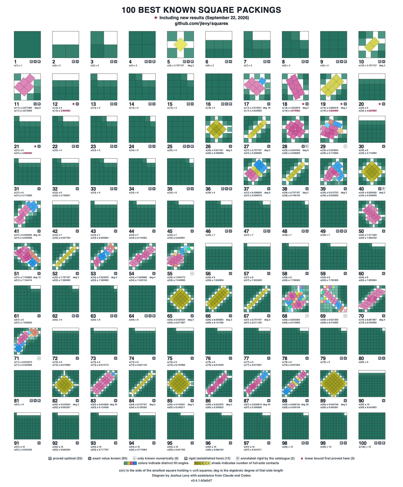

# Square Packing

This repository aims to be the most comprehensive research resource on square packing
assembled anywhere: the primary literature readable offline, a per-case record of what
is actually known for every `n`, code that searches for packings and certifies them
exactly, and the full experimental history of running it.

[](packing/atlas/known-best/known-best-1-100.svg)

*The retained `n = 1…100` atlas, each packing normalized to its own container and
labeled with its best known side upper bound.
Badges mark the 35 side lengths proved optimal (`O`), and whether a side length is
pinned exactly by a radical or a minimal polynomial (`=`) or is so far known only
numerically (`≈`); `deg` gives the algebraic degree where one is recorded.
Select the image for the standalone, zoomable SVG, or take the
[print-ready PDF](packing/atlas/known-best/known-best-1-100.pdf) (vector, 25 × 26.2
in).*

`s(n)` is the side of the smallest square that holds `n` non-overlapping unit squares.
The question is elementary to state and stubbornly open: at `n = 11` the best known
packing dates from 1979, and roughly `0.088` in side length still separates it from the
best proved lower bound.
Every claim here carries the evidence that earns it and says which kind of evidence that
is; [Assurance in One Minute](#assurance-in-one-minute) is the whole vocabulary.

## What Has Been Established

The four theorems, one line each.
The synopsis’s [results section](SYNOPSIS.md#results-established-here) owns the full
statements, assurance labels, and the command that replays each one:

- **Trump’s 1979 packing for `n = 11` is verified exactly** — over the degree-8 field
  `ℚ(u)`, `u = tan(a/2)`, with 14 of the 55 square pairs touching at exactly zero gap:
  contacts no floating-point tolerance can certify.
  The check also independently confirms all 33 published digits of the record (**T-1**).
- **The printed 2003 lower-bound proof for `s(11)` contains an exact gap, and a repair
  is certified.**
  [exp-016](packing/campaign/series/series-000-smoke-and-calibration/experiments/exp-016-h-010-stromquist-printed-figure14.md)
  exhibits a strict counterexample to the printed Figure 14 unavoidability claim;
  [exp-017](packing/campaign/series/series-000-smoke-and-calibration/experiments/exp-017-h-041-stromquist-repaired-figure14.md)
  proves `s(11) ≥ 2 + 4/√5` from a preregistered, source-distinct repaired point set
  (**T-4** — apparently novel, and not externally peer-reviewed).
- **Fix every angle and one separating axis per pair, and the problem becomes a linear
  program** (**T-2**). On Trump’s contact cell, the optimum over the five tilted
  squares’ shared angle is a **corner**, not a smooth peak (**T-3**) — a smooth local
  model is misspecified exactly at the record.
- **A verified upper bound at `n = 29`**: an exact rational witness, replayed here and
  by an independent checker, proves `s(29) ≤ 5.93388579981…`, retained beside the
  tighter numerically checked record it does not replace
  ([`n-029`](packing/frontier/n-029.md)).

The same source scrutiny runs against the literature itself: the earliest published
proof of `s(7) = 3` (El Moumni 1999) carries four recorded defects in its printed route
(D-344–D-347), and the case’s proved status rests on the independent later proofs
([`n-007`](packing/frontier/n-007.md), with the audit in
[the `n = 11` report](docs/project/research/research-2026-08-22-packing-11-unit-squares.md)).

## What Is Here

| Where | What |
| --- | --- |
| [**The frontier**](packing/frontier/STATUS.md) | One schema-validated record per case for `n = 1…100`, tracking reported and formally verified bounds as separate lanes, plus a generated reader-first status table |
| [**The atlas**](packing/atlas/README.md) | Deterministic renderings of the known-best packing for every `n ≤ 100`, a source map for the prospective range `n = 101…324`, and an enumeration of size-five contact scaffolds |
| [**The literature**](packing/resources/README.md) | 27 papers and 13 web sources held locally and greppable: the original PDF or HTML, a cleaned Markdown transcription, and the unedited extraction to check it against |
| [**The reports**](#reports) | Six research reports: the mathematics of `s(11)`, the algorithms and tooling, a search philosophy, and three on what to build |
| [**The code**](development.md) | An exact verifier over algebraic number fields, an LP-in-cell quench, and `sqsearch`, a Rust search engine |
| [**The experiment record**](packing/campaign/README.md) | A registry of falsifiable hypotheses, experiments that freeze their criterion before measuring, the agent-session record, and a generated ledger |
| [**The defect log**](defects.md) | Every defect found in this project’s own reasoning and code, with what caught each one |

The verifier certifies Walter Trump’s 1979 `n = 11` packing exactly, over a degree-8
number field, rather than to a tolerance.

## Start Here

[`TUTORIAL.md`](TUTORIAL.md) is the first-principles orientation: what the objects are,
why the approach is shaped the way it is, and what is established versus open.
Read it once, then [`SYNOPSIS.md`](SYNOPSIS.md) for the state of the program.
To resume work rather than only understand it, continue to the synopsis’s
[current handoff](SYNOPSIS.md#current-handoff); it names the active session when one
exists, otherwise the latest terminal session, together with the owning bead and exact
next bounded slice.

## Reports

Written to be read in this order.
They move from what is known, to how it is computed and checked, to what to build, to
where a proof assistant fits, and finally to how to search: the strategy the tooling
exists to serve.

| Report | Scope |
| --- | --- |
| [Packing 11 Unit Squares in a Square](docs/project/research/research-2026-08-22-packing-11-unit-squares.md) | The mathematics of `s(11)`: what is proved, what is only conjectured, and why the available proof technique cannot close the gap |
| [Algorithms and Tooling for Square Packing](docs/project/research/research-2026-08-22-square-packing-algorithms-and-tooling.md) | How packings are searched for, refined from numerical to exact algebraic form, and verified; who holds the records and with what |
| [FrankenSim as a Rust Toolkit for Square Packing](docs/project/research/research-2026-08-22-frankensim-rust-toolkit-for-square-packing.md) | First-hand study of a large Rust simulation framework as a source of certified-arithmetic and determinism building blocks |
| [Infrastructure for Square-Packing Exploration](docs/project/research/research-2026-08-22-infrastructure-for-packing-exploration.md) | Synthesis of the two above into a build order: three latency tiers, the language boundary, which symbolic layer to use where, and what to deliberately not build |
| [Lean for Square-Packing Proofs and Validation](docs/project/research/research-2026-08-22-lean-for-packing-proofs-and-validation.md) | Where a proof assistant fits: the upper bound is formalisable today and unclaimed, the lemma layer is the diagnostic first target, and certificates make a result checkable by someone who does not trust our code |
| [A Search Philosophy for Square Packing](docs/project/research/research-2026-08-23-search-philosophy-and-landscape-cartography.md) | The strategy layer: why volume-weighted search fails precisely at records, the basin atlas over the LP-quench map as the deliverable, diversity over structural descriptors instead of loss-shaping, the LLM at the structural layer, and relaxation ladders into the hard instances |

These six are the research reports.
For the full document set, including the reviews, the postmortem, the campaign runbook
and what each one owns, see the synopsis’s [document map](SYNOPSIS.md#document-map).

**Five of the six survey outside work and move only when a source does.
The `n = 11` report is the exception**, because `n = 11` is where this project does most
of its own exact work, so every result about that case is a result about the report.
Read it with its date in view and the [synopsis](SYNOPSIS.md#what-is-built) beside it:
the synopsis carries the current state, and the report carries what was established when
it was written.

The structured record of the problem’s frontier, meaning the best known packing and best
proved lower bound for every `n ≤ 100` with provenance and per-case editorial, lives in
[`frontier/`](packing/frontier/README.md) as soft-schema artifacts rather than as a
table inside a report, so it can be validated and queried.

Claims in the reports distinguish formal proof or verification, finite numerical checks,
and source reports. Every citation resolves both to a full reference and to a local copy
in [`resources/`](packing/resources/README.md).

The reports went through a full technical review on 2026-08-22: substantive claims were
re-checked against the then-current primary-source archive and the central algebra was
re-derived independently at 50-digit precision.
The named frontier source set was refreshed again on 2026-08-25; its scope and replay
dispositions live in
[`frontier/source-coverage.yaml`](packing/frontier/source-coverage.yaml), so neither
date is presented as an exhaustive web claim.
Corrections from the technical review are recorded in the `n = 11` report’s
[Corrections to Common Summaries](docs/project/research/research-2026-08-22-packing-11-unit-squares.md#corrections-to-common-summaries),
its remaining gaps in
[Open Questions](docs/project/research/research-2026-08-22-packing-11-unit-squares.md#open-questions),
and the prioritized path forward in
[A Research Program](docs/project/research/research-2026-08-22-packing-11-unit-squares.md#a-research-program).

## Exact Verification

`sqpack` can formally verify complete rational witnesses and algebraic witnesses whose
field preconditions it certifies.
It can also inspect and numerically check decimal witnesses without upgrading their
assurance.

Why precision is not enough: a record packing has squares touching at exactly zero
separation, floating point can certify a strict inequality but not an equality, and
every tolerance that accepts the true contacts also accepts overlaps smaller than
itself. The argument in full, with what it cost when ignored, is
[Why Exactness Is Not Optional](SYNOPSIS.md#why-exactness-is-not-optional).
`cases.trump11.verifier_limits` demonstrates both failure modes.

### Use

```shell
uv run --frozen packing-witness inspect witnesses/schadt-n029-2025-decimal.yaml
uv run --frozen packing-witness check witnesses/schadt-n029-2025-decimal.yaml \
  --method numerical-multiprecision --precision 300 --tolerance 1e-100
uv run --frozen packing-witness verify witnesses/schadt-n029-2025-rational.yaml

uv run --frozen python -m cases.trump11.verify_exact
uv run --frozen python -m cases.gobel5.verify_exact
uv run --frozen python -m cases.gobel10.verify_exact
uv run --frozen python -m cases.trump11.verifier_limits
uv run --frozen python -m benchmarks.exact_verification
uv run --frozen python -m cases.trump11.derive_field
uv run --frozen --group dev packing-validate
```

Only `cases.trump11.derive_field` needs the optional symbolic dependency (SymPy).

The Schadt source pose passes its declared 300-digit check at tolerance `1e-100`; that
is numerical evidence, not a verified record.
The retained rational witness is a separate, slightly relaxed construction produced by
robust rational promotion and verified exactly by the public tool and an independent
checker. It proves `s(29) ≤ 5.93388579981302587863645209`, not the tighter reported
record and not optimality.
See [`n-029.md`](packing/frontier/n-029.md) for the complete disposition.

`cases.trump11.verify_exact` output:

```
VALID: 11 squares, 55 pairs tested
  container: 20 corner coordinates exactly on the boundary
  pairs:     14 separated with zero gap, 41 strictly
  field:     Q(u), degree 8, u = tan(a/2)
  P(s) == 0 for the published degree-8 polynomial: True
  s = 3.87708359002281417730789706010096270637645566846
```

The 14 zero-gap pairs are the ones no floating-point verifier can certify.
The 33 leading digits match the value published on the
[Squares in Squares](https://kingbird.myphotos.cc/packing/squares_in_squares.html)
record page, so this is also an independent check of that record.

### Verifying Another Packing

Use [`Witness/v2`](packing/witnesses/witness.schema.yaml) for supported rational,
algebraic, or decimal center/basis, center/angle, and corner data.
Source adapters should stop at that interchange boundary; `packing-witness inspect`,
`check`, and `verify` then provide the shared behavior.

Library callers can also supply corners in an exact field and call `verify_packing`:

```python
from sqpack.field import NumberField
from sqpack.verify import verify_packing, exact_sign

field = NumberField(min_poly, isolating_interval)  # coefficients high degree first
squares = [...]  # 11 x 4 corners of FieldElements
print(verify_packing(squares, side, sign=exact_sign))
```

The constructor rejects a reducible polynomial or an interval that does not isolate one
real root. It uses exact finite-field irreducibility when that certificate exists, a
complete factor-exclusion check for supported monic integer quartics, and exact Sturm
root counting. Inputs outside those certified paths fail closed.
Recovering a correct field and exact geometry from arbitrary decimal input remains the
hard step; [`cases/trump11/packing.py`](packing/cases/trump11/packing.py) is the worked
algebraic example. Robust rational promotion is built for suitable decimal center-angle
poses and may need an explicit side relaxation.
Generic interval-existence certification at the reported value is not built and may fail
even after it is built when the contact system is singular, ambiguous, or
ill-conditioned.

The [synopsis](SYNOPSIS.md#verification-capability-ladder) classifies each path as
built, buildable engineering, or mathematically contingent.
The module docstrings in [`src/sqpack/`](packing/src/sqpack/) carry the maintained APIs,
including the non-certifying numerical backends.

### Scope

This checks that a *proposed* packing is valid, which is a different and far easier
question than whether it is optimal.
The only rigorous computer-assisted optimality proof for rotatable unit squares in any
container covers three squares in a circle (Montanher et al.
2018); nothing comparable exists for squares in a square.

## What Has Gone Wrong Here

[`defects.md`](defects.md) is the generated defect log: every bug, inefficiency, and
record defect found in this toolchain, what caught it, and what now stops it recurring.
It is generated from [`defects.yaml`](packing/defects.yaml) and checked in the gate.
It is separate from the
[research-loop logbook](packing/campaign/research-loop-logbook/README.md), which
summarizes bounded runs and links their positive, negative, and unresolved scientific
results to the experiment records that own them.

It is kept because the aggregate says things no individual bug report can, and two of
those things shape how this project works:

- **The dangerous defects flatter.** Most soundness failures found here pointed in the
  direction that looks like success, which is why a run that beats the record is treated
  as a bug until proved otherwise.
- **The automated gate is not where soundness failures have been found.** No soundness
  defect in the log was caught by it.
  The rest came from control cells whose answers were known in advance, rules written
  down before the measurement, generated views contradicting their sources, and careful
  reading. Gates confirm what someone already thought to check.

The counts live in [`defects.md`](defects.md), which is generated, and in
[the synopsis](SYNOPSIS.md#the-defect-record), which is reconciled against the same
source in the gate. They are deliberately not repeated here: this paragraph carried them
before, and copied aggregates repeatedly went stale.

## Operating Principles

Work is organized at three levels.
Four **operating principles** define what quality means and which concerns may veto
promotion. Seven **workflow entry points** define the purpose and durable output of one
phase of work. A bounded **slice** is the smallest action taken inside that phase.
Keeping these levels separate lets an agent emphasize one dimension without silently
changing the kind of work it promised to do.
The focus is primary, not exclusive: the other three principles continue to constrain
and contribute to the phase.

Successful research here is the result of four principles held in balance.
None can stand in for another, and each has a preeminent goal:

| Principle | Agent focus | Preeminent goal |
| --- | --- | --- |
| **Correctness** | Soundness | Formal validation checkable by third parties, and cross-validation of every claim and report against known research—accurate surveys of prior work included |
| **Process** | Discipline | The minimum effective structure needed to keep consequential decisions, evidence, and handoffs reconstructible without slowing routine work |
| **Insight** | Creativity | Extreme freedom to understand the problem creatively and to form a wide range of hypotheses, using all available information and tooling |
| **Efficiency** | Infrastructure | Iteration on every layer of the stack, as fast as possible, through efficient algorithms and systems engineering |

Balance carries one asymmetry.
Correctness is non-negotiable: no claim is promoted past its evidence, however costly
the required proof or check may be.
Process is proportional infrastructure, not a second mathematical standard.
Missing evidence may block promotion when it makes a consequential result impossible to
audit or replay; a preferred form, table, clock, or checkpoint may not block useful work
merely because it looks more disciplined.
Insight remains free to propose, and efficiency may simplify process but never weaken
the assurance required by a claim.

### Assurance in One Minute

**Verified means formal.** Use it only when an exact check, rigorous interval
certificate, or complete mathematical proof decides the claim and its preconditions.
Every finite-precision calculation is **numerically checked**, whether it uses binary64,
30 decimal digits, or a tolerance of `1e-100`. A named source claim that has not crossed
either boundary is **reported**.

Assurance and method are separate facts.
Numerical methods record the arithmetic actually used, its precision, rounding, and
tolerance; “arbitrary precision” describes a library capability, not a result.
Formal methods name an exact representation, replayable interval certificate, or scoped
proof. Displays also distinguish an external proof or certificate from evidence replayed
or audited by this repository, and a **novelty** marker records whose result it is:
common knowledge, previously published, or apparently novel—new to the best of this
project’s knowledge, never an assertion of priority.

A verified feasible witness proves an upper bound.
It does not prove global optimality; that requires a matching verified lower bound.
The reader-first [frontier status](packing/frontier/STATUS.md) therefore shows reported
and verified upper and lower bounds side by side.
The [synopsis](SYNOPSIS.md#assurance-methods-and-claims) owns the full vocabulary,
logical consequences, and current tool gaps.

### Workflow Entry Points

Choose the workflow whose promised output matches the work, then choose the operating
focus that will judge it.
The full entry, exit, and transition contracts live in the
[synopsis](SYNOPSIS.md#workflow-entry-contracts).
Workflow selection is a routing decision, not a form to complete.

| ID | Workflow | Enter when | Durable result | Usual handoff |
| --- | --- | --- | --- | --- |
| W1 | `research-pass` | The source record or research document is incomplete | Corrected research prose, source notes, and explicit gaps | W2 |
| W2 | `factual-review` | Existing claims need a correctness-only audit | Findings, authorized bounded corrections, or defects; no new theory smuggled into the review | W3 or W4 |
| W3 | `insight-iteration` | Current evidence needs new explanations or hypotheses | Candidate `X-NNN`/`H-NNN` items with mechanisms, falsifiers, and information value | W6 |
| W4 | `process-review` | Work is hard to reconstruct or the discipline itself needs review | Process findings, beads, and narrowly scoped contract or check changes | W5 or the next owning workflow |
| W5 | `efficiency-loop` | A measured bottleneck limits useful iterations | A baseline, profile, equivalence-safe change, and measured decision | W6 |
| W6 | `research-loop` | A registered hypothesis has a fixed criterion, regime, budget, and instrument contract | A frozen instrument and one or more `exp-NNN` records, raw evidence, verdicts, and a current ledger | W2 for promoted or high-risk claims; otherwise W3 or another W6 slice |
| W7 | `pipeline-improvement` | A named packing-pipeline surface or research consumer needs a new, stronger, simpler, or repaired capability | A bounded implementation or refactor, executable controls, explicit evidence limits, cost receipt, and readiness decision; no scientific verdict | W2 before a materially changed trust boundary reaches W6; otherwise W5 or W6 |
| W8 | `documentation-pass` | A period of research has left the reader-facing documents behind what the record now says | Reconciled root documents — README, tutorial, synopsis — checked against the artifacts and against each other, with every drift either fixed or logged as a defect; no new claim introduced | W2 for any claim the pass could not verify; otherwise the next owning workflow |

The handoff column is the *usual* successor, not a rule the record enforces.
Across 171 recorded phases only about a third of transitions follow it, and workflows
repeat back-to-back when a purpose needs more than one slice.
Treat it as the expected path and state a `switch_reason` when leaving it.

Bounded implementation stays inside the workflow that owns its promised result: W1 or W2
may correct research prose, W3 may implement a bounded exploratory derivation or
visualization without spending an undeclared experiment budget, W4 may repair a process
contract, W5 may implement a measured speedup, and W6 may build a one-round instrument
that freezes before measurement.
W7 owns the implementation itself when the promised result is a packing-pipeline
capability, targeted refactor, robustness repair, visualization surface, or cleanup for
a named pipeline surface or research consumer.
W8 owns the reader-facing tier when research has moved past it.
It is a *reconciliation* workflow, not an authoring one: it may correct, cut, reorder
and clarify, and it may not introduce a claim the record does not already carry.
A drift it cannot resolve from the artifacts is a defect, not a rewrite.
Schedule it after a run that closed several commitments rather than continuously — the
documents are meant to trail the record slightly, and a pass with nothing to reconcile
is a pass that should not have been opened.

Use `general-improvement` only for genuine repository maintenance whose output belongs
outside the packing pipeline and fits none of W1–W8. It is not a core-work catchall or
permission to mix several purposes without checkpoints.

For routine single-purpose work, record only the workflow, the bounded objective or
question, the intended artifact, and the focused check.
A bead, working note, or conversation can carry that declaration; do not create a
session artifact just to restate it.

Escalate to a versioned
[agent-session artifact](packing/campaign/agent-sessions/README.md) when work will cross
multiple workflow or material-focus phases, run autonomously beyond an ordinary
checkpoint, coordinate independently tracked delegates, supervise an expensive
experiment or proof search, or need durable recovery and handoff state.
Only then does each phase carry the full objective, output, validation, clock, stop,
fallback, outcome, and evidence contract.
Record material switches at a planned or evidence checkpoint, on a user request, or when
the active premise is falsified; momentary changes of emphasis are not new phases.

### W6: The Research Loop

W6 is the recurring experiment loop that turns a registered hypothesis into durable
evidence. It is the final research work, not an umbrella name for every kind of session:
creative execution is expected inside the registered question, criterion, regime,
budget, and stop rule, but those constraints stay fixed for the round.

```
W3 insight iteration ──> H-NNN ──> W6 research loop ──> exp-NNN + raw evidence
        ^                                      │                    │
        └──────── successor hypotheses <── W2 factual review <─────┘
```

W1 keeps the research record complete enough to orient the loop.
W4 improves its discipline, W5 removes measured bottlenecks, and W7 improves named
pipeline surfaces or supplies capabilities that research cells lack.
W6 itself does not change a criterion, repair the process, or invent a replacement
hypothesis mid-round.
It executes the preregistered question under a declared budget, records every outcome,
and stops at the criterion or clock.
An independent W2 pass is required before a promoted, novel, disputed, or otherwise
high-risk claim moves forward.
Routine W6 rounds whose preregistered guards and independent replay already decide the
stated criterion may proceed directly to W3 or another W6 slice.
The [campaign runbook](packing/campaign/README.md) owns those mechanics; the agenda
orders ready cells, and the [ledger](packing/campaign/ledger.md) is generated from the
artifacts rather than typed.

### Work Units at a Glance

The [synopsis](SYNOPSIS.md#work-units-and-records) owns the exact vocabulary.
The short hierarchy is:

| Unit | Meaning |
| --- | --- |
| Packing exploration | This self-contained project directory: research, code, sources, and records |
| Campaign | The durable, multi-session square-packing research program and its shared record contract |
| Series | One campaign-wide tooling regime and comparability boundary; `series-000` is a documented legacy exception awaiting migration |
| Agenda | One mutable, ordered queue of bounded commitments |
| Bounded commitment (`BC-NNN`) | One planned unit of work: a question, entry conditions, acceptable exits, and a budget, declared before it starts |
| Bead (`think-xxxx`) | One durable work item in the `tbd` queue; what a commitment is *for* |
| Agent session | One bounded interval of orchestrated work, containing one or more workflow phases |
| Workflow phase / slice | One declared purpose and focus / one time-bounded action inside it |
| Hypothesis / experiment | One falsifiable claim / one durable recorded round testing it |
| Run / result / ledger | One tool invocation / one typed observation / the generated view of the record |

Three of those are easy to confuse, because they share a shape — each declares a
question, an entry condition, an acceptable ending, and a budget.
They differ by lifetime and by who checks them:

|  | Bead | Bounded commitment | Workflow phase |
| --- | --- | --- | --- |
| **Is** | A durable work item | A planned attempt at one | One executed step |
| **Lives in** | `tbd` | An agenda | One session |
| **Lifetime** | Until closed | Across sessions | Minutes to an hour |
| **Typed by** | issue type | `purpose` and `owner_focus` | `workflow` (W1–W8) and `focus` |
| **Falsifier** | none | `exit`, judged | `kill_condition` and `validation_command`, runnable |

Read it as: a **bead** says what needs doing; a **bounded commitment** says what would
have to be true to call it settled; a **workflow phase** is one typed move toward that,
with a command you can run right now to check it.

The relation is one-to-many downward and it is not tidy.
A commitment is attempted over many phases — measured across the recorded sessions, the
median is eight phases per commitment and no commitment has ever been settled by a
single one. Several commitments may also share a bead when the same work is re-attempted
under changed prerequisites.

### The Record, by ID

Every artifact the loop touches carries a typed id.
The one-line meanings; [`conventions.md`](conventions.md) is the definitive registry of
every id class and naming rule, and [`SYNOPSIS.md`](SYNOPSIS.md#terminology) carries the
full definitions:

| Id | Names |
| --- | --- |
| `H-NNN` | A registered hypothesis or open question, with its criterion and budget written before measurement |
| `X-NNN` | An exploration report: the recorded idea source hypotheses are mined from |
| `exp-NNN` | One experiment: the durable artifact for one research round, which may aggregate several raw runs |
| `series-NNN` | One campaign tooling regime; experiments also record their narrower subject and provenance |
| `session-NNN` | One escalated agent-session record: entry workflow, ordered phase history, budget, evidence, stop reason, and handoff |
| `agenda-NNN` | One mutable coordination queue ordering bounded commitments by dependency and readiness |
| `BC-NNN` | One **bounded commitment**: a planned, budgeted unit of work in an agenda, with declared entry conditions, acceptable exits, and an owning bead |
| `D-NNN` | One defect: what went wrong, what caught it, and what now stops it recurring |
| `T-N` | The synopsis’s shorthand for a theoretical result established in this repository |
| `think-xxxx` | One bead: a tracked work item in the `tbd` queue |

### Essential Terms

The eight words a reader meets everywhere here, in one line each;
[`SYNOPSIS.md`](SYNOPSIS.md#terminology) owns the full definitions:

| Term | Means |
| --- | --- |
| **configuration** | A placement of all `n` squares plus the container side: `3n + 1` coordinates |
| **cell** | A choice of separating axis and order for every pair of squares; at fixed angles, one cell is one linear program. This is the only meaning of *cell* here: `BC-NNN` is a bounded **commitment**, not a cell |
| **quench** | The deterministic refinement carrying a configuration to a local optimum |
| **basin** | For a fixed deterministic quench, the preimage of one returned pose; this point-basin can split one connected terminal component |
| **polish** vs **exploration** | Refining within the basin you are in, versus reaching a different one; neither term says anything about formal assurance |
| **standing best** | The best side ever published for that `n`—an upper bound, not known optimal in open cases |
| **gap** | `best_side − standing_best`, always signed |
| **assurance** | `reported`, `numerically-checked`, or `verified`; only the last is formal, and method, precision, tolerance, origin, and any novelty qualification are recorded separately |

The operating documents divide ownership rather than repeat one another:

| Document | Owns |
| --- | --- |
| This README | Operating principles, the compact workflow selector, and repository orientation |
| [Synopsis](SYNOPSIS.md#workflow-entry-contracts) | Full workflow contracts, work-unit vocabulary, transitions, and current technical state |
| [Campaign runbook](packing/campaign/README.md#the-bounded-research-cycle) | W6 experiment mechanics, portable slice protocol, clocks, result routing, and refusal rules |
| [Agent sessions](packing/campaign/agent-sessions/README.md) | Versioned objective, entry workflow, phase history, budget, evidence, stop reason, and handoff |
| [Agendas](packing/campaign/agendas/) | Mutable, ordered queues of bounded commitments, separating tool validation, measurement validation, and genuine research; agenda-001 is the original size-by-size confidence ladder |
| [Current launch agenda](docs/project/specs/active/plan-2026-08-23-overnight-cartography-run.md) | Broader scientific and operational readiness; the agent loop can work now, while the generic numerical runner remains a no-go |
| [Program review](docs/project/reviews/review-2026-08-23-square-packing-program-and-pr14.md#the-epic-and-its-bead-map) | Four-focus epic, durable findings, and bead map |

## The Autonomous Work Loop

The outer loop is a portable repository protocol, not a feature of one agent platform.
The `tbd` queue owns dependencies and ready work; the active launch agenda freezes an
explicit portfolio whenever landed-versus-branch-ahead bead state is not yet reconciled.
Commits and research artifacts own results, and a versioned
[agent-session artifact](packing/campaign/agent-sessions/README.md) owns phase, clock,
and recovery state only when the escalation criteria apply.
Changing agents changes the driver, not the work.
Mechanical delegations inherit the coordinating workflow unless they need independently
recoverable session state.

Breadth lives in [`campaign/ideas.md`](packing/campaign/ideas.md), the hypothesis
registry, and the bead queue.
Routine entry uses the four-fact declaration above; escalated sessions add their full
phase and clock contract.
At a checkpoint in a versioned session, close the phase before changing purpose or
material focus so the ledger can summarize what kinds of work actually occurred.
The slice protocol, clocks, result routing, budgets, and stop rules are the campaign
runbook’s
[bounded research cycle](packing/campaign/README.md#the-bounded-research-cycle); which
validation loop to run at each step is
[`conventions.md`](conventions.md#11-what-the-gate-actually-enforces).
[`packing-campaign`](packing/src/sqpack/campaign/runner.py) stays the smaller tool that
executes already-preregistered numerical rounds, never a second project manager.

## Plan

The implementation plan for the first experiments, meaning search, verify and iterate on
`n = 11` and `n = 12`, is
[plan-2026-08-22-minimal-packing-toolkit.md](docs/project/specs/active/plan-2026-08-22-minimal-packing-toolkit.md).
It turns the six reports into seven phases and a bead tree, one epic per phase;
`tbd list --spec docs/project/specs/active/plan-2026-08-22-minimal-packing-toolkit.md`
shows the work items.
Use `tbd ready` only as an input to a coordinator checkpoint after proving claimed
implementation commits are ancestors of the session base; the current eight-hour
portfolio is frozen in the active launch agenda.

The implemented engineering reorganization and its evidence are recorded in
[Packing Engineering Maturity and Research-Loop Scalability](docs/project/specs/active/plan-2026-08-24-packing-engineering-maturity.md).
[`development.md`](development.md) is the maintained operating guide for that design.

The current standing review,
[review-2026-08-23-toolkit-docs-and-first-experiments.md](docs/project/reviews/review-2026-08-23-toolkit-docs-and-first-experiments.md),
is the historical source of the initial experiment method and `H-001`–`H-015` register.
Once those claims were codified, their registry artifacts became authoritative; use the
[idea board](packing/campaign/ideas.md) and
[generated ledger](packing/campaign/ledger.md) for current status, not the review’s
tables. The review also contains the proof that fixed angles and a fixed cell reduce the
problem to a linear program.
The synopsis records that current result as [T-2](SYNOPSIS.md#the-cell-decomposition),
backed by two independent implementations.

## Conventions

[`conventions.md`](conventions.md) is the definitive registry of every convention and
naming this directory runs on: the id scheme across all layers, file naming, artifact
discipline, the assurance levels and what each may claim, provenance, corrections, and
which rules are machine-checked versus which rest on care.
Read it before adding an artifact, a round, or a tool.

[`operating-rules.md`](operating-rules.md) is the other half of the pair: conventions
govern the *shape of what is produced*, operating rules govern *how the work is done*.
[`AGENTS.md`](AGENTS.md) carries a generated one-line summary of each.

## Layout

```
.
├── TUTORIAL.md             First-principles orientation for a newcomer: the objects,
│                           why the approach is shaped this way, what is established
├── SYNOPSIS.md             The technical root: results, status, and the experiment
│                           roll-up. Read this after the tutorial.
├── conventions.md          Every rule this project runs on, and which are checked
├── operating-rules.md      How a session is conducted: what to pick up, how to spend
│                           it, and the mistakes that cost the most wall clock
├── development.md          Python 3.14 setup, maturity boundaries, validation loops,
│                           CLI policy, and the refactoring workflow
├── defects.md              generated from packing/defects.yaml; never edited by hand
├── docs/project/           Reports, reviews, specs, postmortems, and historical
│                           handoffs; active specs and the campaign agenda own priority
├── docs/project/research/  The six research reports (see below)
├── packing/                Everything that is code, data, or research record, kept one
│   │                       level down so the root stays readable
│   ├── campaign/           The experiment record: hypothesis registry, series, rounds,
│   │                       and a generated ledger. See campaign/README.md.
│   ├── frontier/           What is known about s(n) for every n <= 100: one
│   │                       schema-validated reported/formal claim register per case,
│   │                       plus the generated reader-first STATUS.md.
│   ├── witnesses/          Generic Witness/v2 interchange, controls, and retained
│   │                       decimal and exact rational examples
│   ├── golden/             Stored calibration endpoint snapshots for small PROVED
│   │                       cases, distinct from provisional discovery rows
│   ├── atlas/              Endpoint-observation schema and deterministic SVG gallery
│   ├── resources/          Local archive of the primary literature: papers and web
│   │                       sources, each kept as original, cleaned .md, and raw
│   │                       extraction
│   ├── src/                Maintained sqpack package; dependencies flow downward only
│   ├── cases/              E1 retained code scoped to a named n, source, theorem,
│   │                       hypothesis, or campaign smoke experiment
│   ├── devtools/           Developer-only checkers, source adapters, SVG generators,
│   │                       and mutation controls
│   ├── benchmarks/         Explicit performance probes, outside the runtime package
│   ├── tests/              Fast behavior, command, and architecture contracts
│   ├── sqsearch/           Tier-1 screening annealer (Rust)
│   ├── defects.yaml        the defect log: every bug and record defect found here
│   ├── defects.schema.yaml its contract, enforced in the gate
│   └── frankensim-probe/   two experiments run against Jeffrey Emanuel's FrankenSim,
│                           asking whether its certified-arithmetic and RNG layers help
├── AGENTS.md               Conventions for agents working here; CLAUDE.md points at it
├── CLAUDE.md               Bridge to AGENTS.md
├── Makefile                Markdown formatting, git hooks, and skill mirroring
├── lefthook.yml            The pre-commit hook that formats Markdown
├── package.json            Tooling-only package for lefthook
└── package-lock.json       Its lockfile
```

## Rendering Packing Figures

`sqpack.render` turns retained pose arrays and exact constructions into deterministic,
self-contained SVG without adding a runtime dependency.
The base overview is compact enough for ordinary Markdown, HTML, Word, PDF, and slide
documents.
Comparison and trajectory views are opt-in; animation is enabled only inside a
`prefers-reduced-motion: no-preference` media query, so unsupported or reduced-motion
renderers show the useful final packing.

The renderer preserves the input’s evidence tier.
Its caption and metadata distinguish candidates, numerically checked constructions,
certified upper bounds, and proved optima; typography cannot upgrade a numerical check
to formal verification.
Numerically checked figures retain the arithmetic, actual precision, rounding,
tolerance, method, and outcome in SVG metadata.
Exact annotations retain algebraic or rational source expressions in SVG comments and
namespaced metadata while using stable high-precision decimal projections for geometry.
The container and every packed square use the same boundary treatment, so contacts
remain visually continuous.
Exact-source adapters attach certified contact geometry: segments mark shared boundary
intervals, and dots mark point contacts.
Each mark is clipped to its participating square interiors.
The contact layer is shown by default, can be removed with `--no-contacts`, and is never
guessed for numerical candidate poses.

See the [SVG gallery README](packing/atlas/rendering/README.md) for the focused
rendering contract, the diagnostic start/final comparison, API and CLI examples,
retained fixtures, and portability review.
The [gallery manifest](packing/atlas/rendering/manifest.json) joins each artifact to its
frontier case, evidence tier, view level, motion support, alt text, and exact
regeneration command.
From this directory:

```bash
uv run --frozen --all-extras --group dev python -m devtools.render_packing_gallery --list
uv run --frozen --all-extras --group dev python -m devtools.render_packing_gallery --update
uv run --frozen --all-extras --group dev python -m devtools.render_packing_gallery --check
```

The Motion Lab now has two scenarios on one shared visual system.
The [self-contained exact `n = 5` lab](packing/atlas/rendering/n5-motion-lab.html)
reuses the exact R4/R5 and `+W` case functions while leaving the publication renderer’s
script-free SVG contract unchanged.
The served setup-and-quench scenario accepts arbitrary seeded configurations, supports
temporary sticky chunks for placement, releases every chunk before numerical
optimization, and presents fixed-angle LP states separately from angular probes and
accepted rotations.

**The Motion Lab is a rough draft.** It landed on 2026-08-28 out of a single `n = 5`
spike, has produced no research result, and its first review found six defects in it —
all in the new instrument, none in the mathematics it displays.
Its contracts are versioned because they are expected to change.
Use it to look at what the quench does; do not cite it.
The
[runbook](packing/atlas/rendering/README.md#general-motion-lab-setup-and-free-quench)
states the maturity boundary in full and records what that review found.

From this directory, open the served lab in the default browser:

```bash
uv run --frozen --all-extras --group dev python \
  -m devtools.serve_packing_motion_lab serve --open
```

The
[Motion Lab runbook](packing/atlas/rendering/README.md#general-motion-lab-setup-and-free-quench)
documents setup controls, phase marks, trace download and replay, the retained known
answer, service limits, and the explicit absence of persistent optimization constraints.
The
[generalized Motion Lab plan](docs/project/specs/active/plan-2026-08-25-generalized-motion-lab.md)
owns the versioned contracts and keeps rigid groups and contact locks behind a separate
Phase 2 decision.

The focused read-only gate is:

```bash
uv run --frozen --all-extras --group dev packing-validate --only "deterministic SVG rendering"
```

<!-- This document follows common-doc-guidelines.md.
See github.com/jlevy/practical-prose and review guidelines before editing.
-->
