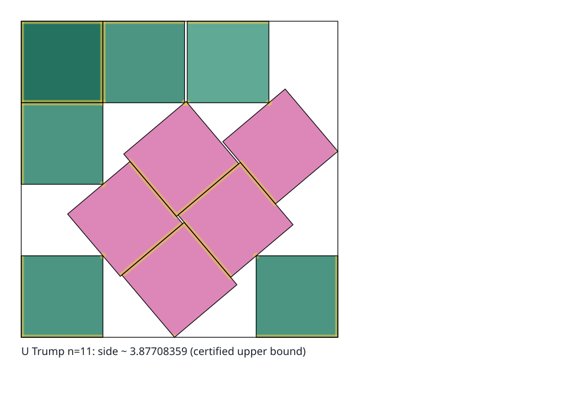
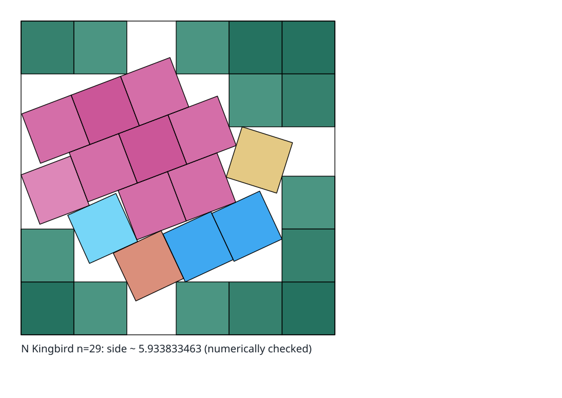

# Synopsis: The `s(n)` Program

**Date:** 2026-08-25

**Status:** Living document, revised whenever a result lands.

**Owns:** The single technical account of what this project knows, how it knows it, and
what it is doing next.

> Every number here also appears in a schema-validated artifact in this repository, or
> is reproducible by a command given in the text, and the artifact is authoritative
> where the two differ.
> `devtools.check_synopsis` enforces that in the gate.

## The Program at a Glance

`s(n)` is the side of the smallest square that contains `n` non-overlapping unit
squares, which may be rotated freely.
The motivating case is `n = 11`, the smallest instance nobody has solved.

This project works under four independent principles, defined at the top level in
[`README.md`](README.md#operating-principles): **Correctness** (Soundness) owns
mathematical truth and may veto promotion; **Process** (Discipline) owns reproducible
research operations and adds only the controls needed to preserve consequential evidence
and handoffs; **Insight** (Creativity) owns hypotheses and strategy but cannot certify
them; and **Efficiency** (Infrastructure) owns stable, measured throughput without
relaxing mathematical assurance.
These are quality dimensions, not session types.
Routine work chooses a workflow and bounded output; a versioned multi-phase session also
declares one primary focus per phase while the other principles continue to constrain
and contribute to the work.

Those principles govern four capabilities built so far:

1. **Know the frontier.** A schema-validated reported and formal claim register for
   every `n ≤ 100`, reconciled against a dated named-source inventory, with a generated
   reader-first status view and a local archive of the primary literature.
2. **Inspect, check, and verify witnesses.** One interchange accepts supported decimal,
   rational, and algebraic geometry.
   Decimal data can be inspected or numerically checked under explicit arithmetic;
   rational and certified algebraic witnesses can be verified exactly, including field
   irreducibility and unique-root preconditions.
3. **Search, under an experiment contract.** A hypothesis registry with kill criteria
   written before the run, a metric vector, an accept rule, a declared timebox, and a
   ledger generated from the artifacts rather than typed.
4. **Account for what goes wrong.** A defect log with the same discipline as the
   experiment record, because most soundness failures found so far pointed in the
   *flattering* direction and none was caught by the automated gate.

Capability 2 has two promotion boundaries.
Robust rational promotion is built for suitable decimal center-angle poses and may prove
a slightly weaker upper bound by making its side relaxation explicit.
A generic path that infers contacts and certifies an exact solution at the reported
value is not built and may not succeed for singular, ambiguous, or ill-conditioned
systems. [What Is Built](#what-is-built) states, component by component, what runs, what
its output may claim, and what remains engineering or mathematics.
Read it before citing any capability here.

### Current research readiness

The program has two promoted mathematical outputs: an exactly verified packing that
improves an upper bound, or a proof certificate that improves a lower bound.
Search, refinement, local geometry, component statistics, and visualization are
instruments for producing those outputs.
They do not inherit the status of a bound merely because they run or reveal structure.

The judgments below concern safe research use, not whether code exists.
The detailed implementation statuses remain in [What Is Built](#what-is-built).

<!-- BEGIN CURRENT-RESEARCH-READINESS -->

| Layer | Safe use now | Blocking boundary or next gate | Owner |
| --- | --- | --- | --- |
| Research record and process | Reconstruct hypotheses, experiments, sessions, effort, and known failures | A closed bead or plausible output is not evidence until the artifact, landed tree, and generated views agree | [Ledger](packing/campaign/ledger.md), [defect log](defects.md), and [confidence ladder](packing/campaign/agendas/agenda-001-basin-confidence-ladder.md) |
| Agent loop and throughput | Run bounded phases with declared clocks, checkpoint each result, and select the next dependency-ready bead | Portable recovery and final receipts remain incomplete; wall-clock budgets do not define equal scientific work under load | [Campaign runbook](packing/campaign/README.md), [launch agenda](docs/project/specs/active/plan-2026-08-23-overnight-cartography-run.md#the-autonomous-agent-loop), and [D-126](defects.md) |
| Frontier and literature | Read reported and verified bounds side by side through `n = 100`; reconcile the named public sources and retain conflicts | Most reported records still lack a public formal witness; dated named-source coverage is not universal web completeness | [`frontier/STATUS.md`](packing/frontier/STATUS.md), [`frontier/`](packing/frontier/README.md), and [`resources/`](packing/resources/README.md) |
| Witness inspection and verification | Inspect or numerically check supported decimal geometry; verify rational and certified algebraic witnesses exactly | Interval-certificate replay is represented by the contract but no generic interval checker is built | [Exact layer](#the-exact-layerbuilt) and [capability ladder](#verification-capability-ladder) |
| Numerical refinement | Polish and compare fixed-cell controls above the measured solver floor | A stopped quench is neither certified stationary nor comparable by wall-clock budget under load | [Refinement layer](#the-refinement-layerbuilt-with-a-floor) and [D-021, D-052, D-126](defects.md) |
| Exact local geometry and proof | Run the specialized small-`n`, Trump, and Stromquist checkers; this is the most productive mathematical lane so far | There is no generic proof-synthesis or interval branch-and-bound pipeline | [Proof lane](#the-proof-lanebuilt-and-producing-theorems) |
| Proposal and search | Use the stock annealer for calibration and candidate generation; its two search paths emit exact pair-test work | Pair-budget enforcement, the proposer interface, campaign-wide aggregation, and mechanism-diverse proposers are unbuilt | [Proposer layer](#the-proposer-layerone-instrument-and-the-interface-is-unbuilt) |
| Event capture and replay | Retain and independently replay watched control events | A valid terminal event is an observation, not a connected terminal component | [Map layer](#the-map-layerbuilt-not-admissible) and [confidence ladder](packing/campaign/agendas/agenda-001-basin-confidence-ladder.md) |
| Basin identity, census, and atlas | Use exact `n = 3` and `n = 4` models as identity controls | Component counting is not admissible until the `n = 5` ambiguity is bounded and the classifier is validated successively | [Map layer](#the-map-layerbuilt-not-admissible) and [confidence ladder](packing/campaign/agendas/agenda-001-basin-confidence-ladder.md) |
| Numerical-to-formal promotion | Robustify suitable decimal center-angle poses into explicitly relaxed rational witnesses, infer and assemble a contact system, recover a minimal polynomial under a decidable margin rule, certify a root by Krawczyk, and receive typed failures throughout | The robust path may weaken the bound; every component of the reported-value route is built, but the `n = 29` certificate is retained `unresolved` and moving `verified_upper_bound` is a reviewed human decision, not a pipeline inference | [Promotion pipeline](#the-promotion-pipelinebuilt-end-to-end-with-the-promotion-itself-withheld) |
| Visualization | Inspect the exact `n = 3` moduli SVG and design evidence-typed views from retained artifacts | The scalable basin atlas and the first `n = 5` ambiguity view are unbuilt; endpoint rows must not be pictured as components | [Visualization ladder](docs/project/reviews/review-2026-08-23-mathematical-frontier-strategy.md#basin-ontology-and-visualization-ladder) |
| Unattended numerical execution | Run bounded supervised slices and let an agent resume dependency-ready work | The numerical runner remains **NO-GO** until its independent validity, recovery, receipt, and capacity gates pass | [Numeric launch agenda](docs/project/specs/active/plan-2026-08-23-overnight-cartography-run.md#the-numeric-runner-launch-gate) |

The generated ledger currently derives three confirmed hypotheses, six refuted
hypotheses, one open hypothesis, seven open questions, and thirty-two blocked
hypotheses. One additional hypothesis is unresolved because its formal prerequisite is
missing. Its active confidence ladder has completed the exact and event controls up to
the first nontrivial identity question; the next scientific transition is from
specialized `n = 5` local geometry to a defensible component relation, not to a larger
raw census.

#### Refresh rule

Refresh this block whenever a layer’s admissibility or built state changes, the
confidence-ladder head moves, or the numerical launch decision changes.
Take counts and verdicts from the [generated ledger](packing/campaign/ledger.md), cell
order from the
[confidence ladder](packing/campaign/agendas/agenda-001-basin-confidence-ladder.md),
blockers from the [defect log](defects.md), and numeric go/no-go from the
[launch agenda](docs/project/specs/active/plan-2026-08-23-overnight-cartography-run.md).
Do not copy a ready bead, dated throughput, or a candidate mathematical verdict into
this table. Reconcile the table with [What Is Built](#what-is-built) and
[Where This Stands](#where-this-stands), then run
`uv run --frozen python -m devtools.check_synopsis`; the checker keeps the marked block
attached to these canonical owners without freezing its wording.

<!-- END CURRENT-RESEARCH-READINESS -->

The strategy that organises lanes 3 and 4 is stated in
[A Search Philosophy for Square Packing](docs/project/research/research-2026-08-23-search-philosophy-and-landscape-cartography.md):
**a validated map of terminal components is the intended deliverable, and records are
corollaries.** The current endpoint map remains provisional while identity and local
certification are unresolved.
The argument for it, and the measurement registered to kill it if it is wrong, are in
[Theoretical Results](#theoretical-results) and
[The Hypothesis Registry](#the-hypothesis-registry) below.

[Terminology](#terminology) below fixes both the work units—campaign, session, phase,
slice, experiment, round, and run—and the mathematical terms used narrowly here.
Those definitions apply in the campaign artifacts and the beads too, not only here.

### Document Map

The validated [document map](docs/project/document-map.yaml) distinguishes current rules
and synthesis from supporting research, dated records, generated views, and transient
plans. Follow the replacement link instead of using a superseded review or handoff for
current status. Collection rows cover homogeneous typed artifacts without listing every
case or experiment separately.

<!-- BEGIN GENERATED: document-map (devtools.render_document_map) -->

| Document or collection | Role | Authority | Lifecycle | Current replacement |
| --- | --- | --- | --- | --- |
| [Square Packing](README.md) | reader orientation | definitive | maintained | — |
| [Synopsis: The `s(n)` Program](SYNOPSIS.md) | current technical state and terminology | definitive | maintained | — |
| [Tutorial: Square Packing from First Principles](TUTORIAL.md) | first-principles tutorial | supporting | maintained | — |
| [Packing Atlas](packing/atlas/README.md) | component scope and use | supporting | maintained | — |
| [Enumerated Contact-Scaffold Atlas](packing/atlas/enumerated/README.md) | component scope and use | supporting | maintained | — |
| [Known-Best Packing Atlas, `n = 1..100`](packing/atlas/known-best/README.md) | component scope and use | supporting | maintained | — |
| [Composite figure playbook](packing/atlas/known-best/FIGURE-PLAYBOOK.md) | component scope and use | supporting | maintained | — |
| [Prospective Packing Atlas, `n = 101..324`](packing/atlas/prospective/README.md) | component scope and use | supporting | maintained | — |
| [Deterministic SVG Gallery](packing/atlas/rendering/README.md) | component scope and use | supporting | maintained | — |
| [Conventions for `packing/`](conventions.md) | artifact and naming conventions | definitive | maintained | — |
| [Operating Rules](operating-rules.md) | how a session is conducted | definitive | maintained | — |
| [Packing Development Guide](development.md) | engineering and validation rules | definitive | maintained | — |
| [The `s(n)` Research Campaign — W6 Runbook](packing/campaign/README.md) | W6 experiment mechanics | definitive | maintained | — |
| [The W8 Documentation Pass — Runbook](packing/campaign/documentation-pass.md) | W6 experiment mechanics | definitive | maintained | — |
| [Agent Sessions](packing/campaign/agent-sessions/README.md) | escalated session and recovery contract | definitive | maintained | — |
| [Research Loop Logbook](packing/campaign/research-loop-logbook/README.md) | reader-facing research-run summaries | definitive | maintained | — |
| [Resource Usage](packing/campaign/resource-usage/README.md) | component scope and use | definitive | maintained | — |
| [Idea board — the `s(n)` search campaign](packing/campaign/ideas.md) | hand-maintained registry | definitive | maintained | — |
| [Experiment ledger](packing/campaign/ledger.md) | generated status view | generated | generated | — |
| [Agenda map](packing/campaign/agenda-map.md) | generated status view | generated | generated | — |
| [series-000 (S0) — smoke and calibration](packing/campaign/series/series-000-smoke-and-calibration/README.md) | series scope and comparability | definitive | maintained | — |
| [Frontier: What Is Known About `s(n)`, Case by Case](packing/frontier/README.md) | frontier semantics and contribution path | definitive | maintained | — |
| [Current Square-Packing Frontier](packing/frontier/STATUS.md) | generated status view | generated | generated | — |
| [Evidence inventory](packing/frontier/INVENTORY.md) | generated status view | generated | generated | — |
| [Research Resources: Square Packing](packing/resources/README.md) | source retention and archive policy | definitive | maintained | — |
| [Defect log](defects.md) | generated status view | generated | generated | — |
| [FrankenSim probes](packing/frankensim-probe/README.md) | component scope and use | supporting | maintained | — |
| [Research: FrankenSim and the Franken Constellation as a Rust Toolkit for Square Packing](docs/project/research/research-2026-08-22-frankensim-rust-toolkit-for-square-packing.md) | research synthesis | supporting | maintained | — |
| [Research: Infrastructure for Square-Packing Exploration](docs/project/research/research-2026-08-22-infrastructure-for-packing-exploration.md) | research synthesis | supporting | maintained | — |
| [Research: Lean for Square-Packing Proofs and Validation](docs/project/research/research-2026-08-22-lean-for-packing-proofs-and-validation.md) | research synthesis | supporting | maintained | — |
| [Research: Packing 11 Unit Squares in a Square](docs/project/research/research-2026-08-22-packing-11-unit-squares.md) | research synthesis | supporting | maintained | — |
| [Research: Algorithms and Tooling for Square Packing](docs/project/research/research-2026-08-22-square-packing-algorithms-and-tooling.md) | research synthesis | supporting | maintained | — |
| [Research: A Search Philosophy for Square Packing](docs/project/research/research-2026-08-23-search-philosophy-and-landscape-cartography.md) | research synthesis | supporting | maintained | — |
| [Review: Loop Speed, Iteration Cost, and What Actually Gates the Research (PR #17)](docs/project/reviews/review-2026-08-23-engineering-loops-and-efficiency.md) | dated review record | record | superseded | [Packing Development Guide](development.md) |
| [Review: The Experiment Loop, the Campaign, and the Consolidation (PR #5)](docs/project/reviews/review-2026-08-23-experiment-loop-and-campaign.md) | dated review record | record | superseded | [The `s(n)` Research Campaign — W6 Runbook](packing/campaign/README.md) |
| [Review: The Mathematical Frontier, Its Gaps, and How to Search It Fast](docs/project/reviews/review-2026-08-23-mathematical-frontier-strategy.md) | dated review record | record | superseded | [Synopsis: The `s(n)` Program](SYNOPSIS.md) |
| [Response to the PR #15 Review: what it got right, one thing it got wrong, and what is missing](docs/project/reviews/review-2026-08-23-response-to-pr15-review.md) | dated review record | record | superseded | [Synopsis: The `s(n)` Program](SYNOPSIS.md) |
| [Review: PR #14 and the Executable Square-Packing Research Program](docs/project/reviews/review-2026-08-23-square-packing-program-and-pr14.md) | dated review record | record | superseded | [Synopsis: The `s(n)` Program](SYNOPSIS.md) |
| [Review: The Tooling Layout, and What It Would Take to Clean Up](docs/project/reviews/review-2026-08-23-tooling-layout.md) | dated review record | record | superseded | [Packing Development Guide](development.md) |
| [Review: The Toolkit Docs and the First Experiment Series](docs/project/reviews/review-2026-08-23-toolkit-docs-and-first-experiments.md) | dated review record | record | superseded | [Experiment ledger](packing/campaign/ledger.md) |
| [Review: `TUTORIAL.md`, Read as Its Declared Audience](docs/project/reviews/review-2026-08-25-tutorial-pedagogy-and-accuracy.md) | dated review record | record | retained | — |
| [Review: `TUTORIAL.md` Soundness, Iteration 2, on the Merged Record](docs/project/reviews/review-2026-08-25-tutorial-soundness-iteration-2.md) | dated review record | record | retained | — |
| [Review: Soundness of the Session-011 Continuation (PR #34)](docs/project/reviews/review-2026-08-25-pr34-soundness-review.md) | dated review record | record | retained | — |
| [Review: PR #44, Constructive Enumeration, and the Known-Best Atlas](docs/project/reviews/review-2026-08-26-pr44-constructive-enumeration-and-known-best-atlas.md) | dated review record | record | retained | — |
| [Review: Square Packing Research-Loop Efficiency](docs/project/reviews/review-2026-08-25-research-loop-efficiency.md) | dated review record | record | retained | — |
| [Handoff: Basin Identity and the Integrated PR Reviews](docs/project/handoff-2026-08-23-basin-identity-and-two-reviews.md) | dated handoff record | record | superseded | [Synopsis: The `s(n)` Program](SYNOPSIS.md) |
| [Handoff: Where the Square-Packing Loop Stands](docs/project/handoff-2026-08-23-quench-spine.md) | dated handoff record | record | superseded | [Synopsis: The `s(n)` Program](SYNOPSIS.md) |
| [Postmortem: The Soundness Class, and the Perimeter That Let D-014 Through](docs/project/postmortems/postmortem-2026-08-23-soundness-class.md) | failure analysis and lessons | supporting | maintained | — |
| [Feature: Minimal Packing Toolkit](docs/project/specs/active/plan-2026-08-22-minimal-packing-toolkit.md) | implementation plan | current | transient | — |
| [Feature: Unattended Square-Packing Research Readiness](docs/project/specs/active/plan-2026-08-23-overnight-cartography-run.md) | implementation plan | current | transient | — |
| [Feature: Frontier Assurance and Verification](docs/project/specs/active/plan-2026-08-24-frontier-assurance-and-verification.md) | implementation plan | current | transient | — |
| [Feature: Research-Loop Efficiency Infrastructure](docs/project/specs/active/plan-2026-08-25-research-loop-efficiency-infrastructure.md) | implementation plan | current | transient | — |
| [Overnight Run: Constructive Enumeration Groundwork](docs/project/specs/active/plan-2026-08-26-overnight-constructive-enumeration.md) | implementation plan | current | transient | — |
| [Plan: The Symbolic Promotion Gap, and What a Complete Atlas Would Need](docs/project/specs/active/plan-2026-08-28-symbolic-promotion-and-the-atlas.md) | implementation plan | current | transient | — |
| [Feature: The Numeric–Symbolic Round Trip](docs/project/specs/active/plan-2026-08-28-numeric-symbolic-round-trip.md) | implementation plan | current | transient | — |
| [Feature: Promotion Pipeline Implementation](docs/project/specs/active/plan-2026-08-28-promotion-pipeline-implementation.md) | implementation plan | current | transient | — |
| [Feature: The Interval Certification Bridge](docs/project/specs/active/plan-2026-08-28-interval-certification.md) | implementation plan | current | transient | — |
| [Feature: Gate Validation Speed](docs/project/specs/active/plan-2026-08-29-gate-validation-speed.md) | implementation plan | current | transient | — |
| [Feature: Deterministic SVG Rendering Toolkit](docs/project/specs/active/plan-2026-08-24-deterministic-svg-rendering-toolkit.md) | implementation plan | record | superseded | [Packing Atlas](packing/atlas/README.md) |
| [Packing Engineering Maturity and Research-Loop Scalability](docs/project/specs/active/plan-2026-08-24-packing-engineering-maturity.md) | implementation plan | record | superseded | [Packing Development Guide](development.md) |
| [Spike: Interactive `n = 5` Motion Lab](docs/project/specs/active/spike-2026-08-25-n5-motion-lab.md) | implementation plan | record | retained | — |
| [Feature: Generalized Square-Packing Motion Lab](docs/project/specs/active/plan-2026-08-25-generalized-motion-lab.md) | implementation plan | current | transient | — |
| `packing/frontier/n-*.md` | typed case claim register | definitive | maintained | — |
| `packing/campaign/hypotheses/H-*.md` | typed hypothesis record | definitive | maintained | — |
| `packing/campaign/series/*/experiments/exp-*.md` | typed experiment record | record | retained | — |
| `packing/campaign/agent-sessions/session-*.md` | typed session record | record | retained | — |
| `packing/campaign/research-loop-logbook/run-*.md` | typed research-run synopsis | record | retained | — |
| `packing/campaign/agendas/agenda-*.md` | mutable coordination agenda | current | maintained | — |
| `packing/campaign/explorations/X-*.md` | typed idea provenance | record | retained | — |

<!-- END GENERATED: document-map -->

The code that produces the numbers: [`sqpack.verify`](packing/src/sqpack/verify.py)
decides validity exactly,
[`sqpack.research.quench`](packing/src/sqpack/research/quench.py) is the LP-in-cell
quench,
[`cases.trump11.independent_lp_cell`](packing/cases/trump11/independent_lp_cell.py) is a
second, independent implementation of the quench’s linear program, and
[`sqsearch/`](packing/sqsearch/) is the screening annealer.

## Workflow Entry Contracts

A workflow is the purpose-and-output contract for one contiguous phase of agent work.
It is independent of the operating focus: a focus identifies the phase’s primary quality
emphasis, not the only principle that applies.
W6 may run under a Correctness focus while an exact certificate is checked, then enter
another W6 phase under Insight when the same registered question needs a creative
construction. The focus changed; the workflow did not.

Workflow selection should reduce context, not create paperwork.
Routine single-purpose work records four facts where the work is already tracked: the
workflow, bounded objective or question, intended artifact, and focused check.
No `session-NNN` artifact is required.

Use the fuller session contract only when the work crosses multiple workflow or
material-focus phases, continues autonomously beyond an ordinary checkpoint, coordinates
independently tracked delegates, supervises an expensive experiment or proof search, or
needs durable recovery and handoff state.
Each phase in that escalated record begins with its workflow and primary focus;
objective and required inputs; expected durable output and validation command; stopping
condition and fallback; and start and deadline.
Actual outcome and evidence are terminal fields recorded when the phase closes, not
placeholders invented when it opens.
The generated ledger summarizes those versioned sessions; it is not a census of every
routine task.

| ID | Workflow | Enter with | Work boundary | Durable exit | Default handoff |
| --- | --- | --- | --- | --- | --- |
| W1 | `research-pass` | A bounded question, source corpus, and identified coverage gap | Establish and source the state of knowledge; do not turn untested connections into campaign verdicts | Corrected or enriched research docs, source notes, explicit conflicts, and unresolved gaps | W2 audits the claims; W3 may mine supported gaps |
| W2 | `factual-review` | A fixed artifact set, its sources, and the claims to audit | Correctness only; read-only by default, but an authorized review may apply an obvious bounded correction whose evidence and scope are unchanged; do not invent successor theory or redesign the process inside the review | Claim-by-claim dispositions, authorized corrections, or defects with exact evidence | Required before promoted, novel, disputed, or high-risk claims; otherwise W3 for new hypotheses or W4 for a process failure |
| W3 | `insight-iteration` | Current synopsis, idea board, ledger, negative results, and a sharp frontier | Generate explanations and hypotheses freely; do not certify them or spend an undeclared experiment budget | `X-NNN` reports and candidate `H-NNN` items with mechanism, falsifier, expected information, and limits | Codification, then W6 |
| W4 | `process-review` | Artifacts, beads, logs, checks, and a reconstructability or discipline question | Inspect ownership, handoffs, refusals, and controls; do not substitute process polish for a scientific result | Review findings, beads, and narrowly scoped contract or checker changes | W5 for a measured bottleneck or the next workflow that owns the result |
| W5 | `efficiency-loop` | A measured baseline, profile, target metric, and equivalence or validity guard | Improve time, cost, or throughput under the same regime; never relax correctness or provenance to win | Benchmark record, change or rejection, measured delta, and preserved guards | W6 when the research bottleneck moves; W4 if the process contract is wrong |
| W6 | `research-loop` | A registered hypothesis, fixed criterion, regime, budget, stop rule, and instrument contract | Build or repair the bounded instrument, freeze it before measurement, then use creative effort inside the registered scope to execute the smallest fair test; never change the criterion, suppress a failure, or improvise a replacement hypothesis mid-round | Frozen instrument, `exp-NNN`, raw data or proof record, verdict, regenerated views, and the next bounded question | W2 before promoted or high-risk claims; otherwise W3 or another W6 slice |
| W7 | `pipeline-improvement` | Named packing-research consumers, the smallest reusable capability or cleanup they need, controls or an independent oracle, a budget, and expected comparability impact | Add, strengthen, simplify, or repair only the bounded packing pipeline surface; do not collect a target verdict while it is mutable, optimize an unchanged implementation without a W5 baseline, or generalize beyond named consumers | Code, entry point or refactor; replayable positive and negative controls; exact validation command; cost and complexity receipt; evidence limits; and a readiness or retained-blocker decision | W2 before a new or materially changed trust boundary reaches W6; W5 if measured throughput remains the blocker; otherwise W6 |
| W8 | `documentation-pass` | A period of research that closed several commitments, the artifacts it left, and the reader-facing documents that have not caught up | Reconcile the root tier — README, tutorial, synopsis, and the conventions they cite — against the artifacts and against each other; correct, cut, reorder and clarify, but never introduce a claim the record does not already carry, and never soften a claim boundary to make a document read better | A checklist run over each root document, every drift either fixed or filed as a defect, generated views regenerated, and an explicit statement of what was checked and what was left | W2 for any claim the pass could not verify against an artifact; otherwise the next owning workflow |

Implementation is an action inside the workflow that owns its promised result, not an
undefined handoff: W1 and W2 can make bounded research corrections, W3 can implement a
bounded exploratory derivation or visualization without spending an undeclared
experiment budget, W4 can make a narrow accepted process correction, W5 can implement a
measured optimization, and W6 can build a one-round instrument that freezes before
measurement. W7 owns reusable packing-pipeline capabilities, targeted refactors,
robustness, visualization infrastructure, and cleanup for named consumers.
W8 owns the reader-facing tier when research has moved past it, and it is a
*reconciliation* workflow rather than an authoring one — its edits answer to the record,
not to taste. Two boundaries make that real.
It may not introduce a claim the artifacts do not already carry: a document that wants
to say something new is asking for W1 or W6, not for a documentation pass.
And it may not resolve a disagreement by choosing the more readable side — where a
document and an artifact conflict and the artifact is not obviously right, the output is
a defect, because a documentation pass that quietly picks a winner is how a wrong claim
becomes the tidy one.
Schedule it after a run that closed several commitments rather than continuously; the
documents are meant to trail the record slightly, and a pass with nothing to reconcile
is a pass that should not have been opened.

`general-improvement` remains only for repository maintenance outside the packing
pipeline whose output fits none of W1–W8. It must not hide core work or a session
alternating among research, review, and infrastructure; those are separate phases.

### Switching Workflows in One Session

One phase is active at a time per versioned agent session.
Start a new phase when its purpose, primary focus, or bounded slice objective changes.
A focus-only change repeats the workflow name and is a phase boundary, not a workflow
switch. A momentary shift in emphasis is not a phase.
A renewed slice may repeat both workflow and focus, but it must close the prior slice,
change the objective, and state the new fact that justifies another clock.
An orchestrator may switch or renew at a planned checkpoint, after a concrete evidence
checkpoint, on a user request, or because the active premise was falsified.
It closes the old phase first with status, evidence, stop reason, and next action; then
it declares the new workflow, primary focus, objective, expected output, validation,
kill condition, fallback, start, and deadline.
It does not relabel mixed work after the fact.

Sessions 001–008 predate this workflow vocabulary.
Their v2 phase rows are explicit retrospective reconstructions from the durable session
record, not evidence that those workflows, focuses, clocks, or transitions were declared
contemporaneously. Current and future phases are declared before work begins.

The normal research cadence is not a mandate to traverse every workflow:

```
W1 research-pass ──> W2 factual-review ──> W3 insight-iteration
                                               │
                         missing reusable tool v
W4 process-review ──> W7 pipeline-improvement ──> W2 ──> W6 research-loop
        │                    │                              │
        └─ accepted repair ──┘        W5 efficiency-loop ──┘
                         promoted/high-risk result ──> W2 ──> W3
```

At any checkpoint, the human operator may choose the next phase, narrow the question, or
stop. Long autonomous sessions use the same rule; autonomy changes the duration and
controller, not permission to blur contracts.

### Current Handoff

[Open the house rendering of the retained 100-square witness.](packing/atlas/known-best/rendering/n-100.svg)

The renderer’s standing exact-motion control remains independently replayable:



**As of 2026-08-30 — start here.**
[agenda-008](packing/campaign/agendas/agenda-008-queue-repair-and-the-discriminating-control.md)
is closed with all four commitments terminal;
[session-045](packing/campaign/agent-sessions/session-045-agenda008-queue-and-identity.md)
then ran nine unplanned phases on `BC-049` at `n = 40` and carries a handoff at its end
that is the authoritative summary, and
[session-046](packing/campaign/agent-sessions/session-046-gobel-family-constructions.md)
took the cheapest thing that handoff named.
[session-047](packing/campaign/agent-sessions/session-047-assurance-structure-and-what-is-ours.md)
then left the mathematics alone and worked on the record itself: it promoted the three
sizes whose exact certificates were already running in this gate while their records
denied one existed, and filled in the two facts the register could not previously state
— whether anyone here has read an external argument, and what a novelty claim was
searched against.
[session-048](packing/campaign/agent-sessions/session-048-what-every-session-cost.md)
closed the same gap one level up, joining every session to what it cost and finding that
both obvious ways of totalling that were wrong in the flattering direction — see
[Sessions Conducted](#sessions-conducted).
[session-049](packing/campaign/agent-sessions/session-049-reassess-and-first-sequenced-slice.md)
then did three things in one morning: reconciled the queue against the tree (`BC-085`
and `BC-087` had landed while the agenda still advertised both as ready), built the
pre-push floor `BC-086` asked for (`packing-validate --push`, 58s against `--fast`’s
646s), and ran the `BC-088` reassessment whose sequenced plan is
[X-009](packing/campaign/explorations/X-009-where-a-new-packing-is-reachable.md) — then
executed that plan’s first block: **twelve verified ceilings moved off the integer grid
onto exact sides** at `n = 18, 19, 26, 27, 38, 52, 66, 67, 82, 84, 85, 86`, every one
decided by exact sign — ten over `Q(sqrt 2)` and the last two over `Q(sqrt 7)`, the
first exact verification outside `Q(sqrt 2)` — from a published rule or a coordinate
lift, about `3.2` of aggregate gap.
The widest trailing ceiling is now `n = 50`’s `3/7`.

**Queued for the next run:
[agenda-010](packing/campaign/agendas/agenda-010-two-lane-overnight-run.md)** — the
two-lane overnight program from
[X-010](packing/campaign/explorations/X-010-two-lanes-two-ladders.md): nine hours in
blocks of two to three hours, instruments before research in both lanes, a checkpoint
(`BC-098`) resequencing the tentative half mid-run, and the standard unattended rules
stated in the agenda’s own objective.
**The run is live: blocks 1 and 2 are complete** —
[session-050](packing/campaign/agent-sessions/session-050-block1-certifier-and-falsifier.md)
landed the certifier core and the falsifier (`BC-093`, `BC-094`), and
[session-051](packing/campaign/agent-sessions/session-051-block2-reprice-and-lp-gate.md)
landed the stage-1 price and the exact-LP measurement (`BC-095`, `BC-096`) — **and the
checkpoint
([session-052](packing/campaign/agent-sessions/session-052-midrun-checkpoint.md)) has
resequenced the tentative half; block 3 opens as session-053 on `BC-099` under
`think-1o1f`**, the Bentz `m = 4` machine-check; `BC-097` and `BC-089`’s remainder are
the sanctioned gate filler.

**The parallel research slice is `BC-089`’s remainder on `think-d0j1`** in
[agenda-009](packing/campaign/agendas/agenda-009-pipeline-hygiene-and-the-search-reassessment.md):
the last two witness lifts — `n = 50` rational, `n = 54` quartic — then the
robust-rational sweep, then the typed refusal at `n = 53`. `BC-049` on `think-xdly` is
the research cell all of the mathematics below sits under, and it stays open.

**`n = 40` is infinitesimally flexible**, exactly, over `Q(sqrt 2)`: seven retained
directions turn the sixteen squares of its tilted block and leave the frame fixed, and
every one is refused at second order by a verified self-stress.
The property stays `undetermined` because an infinitesimal flex is not a motion — the
gaps curve shut at order `t²` — so what is settled is that no *first-order* argument can
establish rigidity there.
Getting further needs an instrument this repository does not have: the cone is bounded
to dimension 45 against six dimensions of anything found admissible, and closing that
gap means reasoning about `2^42` corner disjunctions without enumerating them.

The correction underneath it generalized.
Göbel’s published family is *exactly* the best known at `n = 5`, `40`, `65` and `89`;
all four now have exact constructions here, and the last two turn out to be what their
retained decimal witnesses were all along — agreement to `5e-33` identifies rather than
merely permits. `n = 28` is the near miss that stops the obvious guess: the family gives
it a valid packing `0.004` worse than the best known, whose optimum is at algebraic
degree 6 and is not in the family at all.
Take the next slice from [`agenda-map.md`](packing/campaign/agenda-map.md).

`BC-017` delivered its readiness input and stopped there.
The `n = 3` full-cell control already retained the target-free execution-plan receipt
the commitment asked for, so the slice produced what that receipt authorizes instead: on
the same three-square subject the structural plan reports 4 seated-wall equalities and 8
open-wall inequalities against 2 contact equalities and 1 non-edge inequality, while
`solve_cell` builds 12 containment rows and 3 pair rows — **the same twelve and the same
three**. Every total agrees and every composition does not, so the LP-solve half of the
exit is reachable and `pair_tests` does not transfer between instruments that both
report it.

`BC-019` is closed. The contact-assembly contract is at `contact-assembly-v2-draft` and
carries the clause it never had — **17 certificates and 13 typed limitations** over
`n <= 30` — with the missing grammar move named rather than guessed: a primitive for
axis-aligned polyominoes that are not a bar, rectangle or corner L. `BC-024` is what
made that safe to say:
[X-008](packing/campaign/explorations/X-008-the-residue-is-axis-aligned.md) measures
that **every** component the grammar cannot express is axis-aligned — every
`other-polyomino` in the corpus has angle exactly zero — so all 295 tilted components
are already covered.
Wall seating splits the residue into two populations with nothing between them: 44
whole-record grid subsets on four walls, 65 corner-seated blocks on two.
`BC-038` is closed and rejected on measured arithmetic — 35 `evaluate_stress` calls
arrive with **eleven** distinct number fields, and `RowJetInventory` refuses a foreign
field by identity, so the floor is a `1.54x` ceiling against an exit wanting five-fold.
`BC-010` and `BC-029` are **not** takeable despite what the map’s priority says: both
are gated on independent acceptance of `exp-045`’s preregistered criterion, which
records `decision: unresolved` with `needs_review: true`, and an unattended runner may
not grant that acceptance to itself.

**`n = 5` is second-order rigid, and that is a first-party result.**
[X-007](packing/campaign/explorations/X-007-the-n5-optimum-flexes-once-and-that-once-is-shut.md)
settles the question `BC-049` asked, exactly, over `Q(sqrt 2)` at Göbel’s construction
rather than at the retained decimal witness — which is `2.4e-30` off the diagonal and so
infeasible at the scale a certificate works at.
The cone of infinitesimal motions is exactly the line spanned by rotation of the middle
square; the other fourteen coordinates are pinned by Farkas certificates verified in the
field; and that one direction is refused at second order by a verified self-stress.
This confirms and strengthens the numerical account `BC-069` reached from the promotion
side, including its observation that the contacting corner sits at the midpoint of the
contacted edge — which turns out to be the reason for both the first-order blindness and
the second-order obstruction.

The frontier property stays `undetermined`, and the reason is worth carrying forward:
second-order rigidity is not local rigidity, the step that would close the gap is a
curve-selection argument that `X-007` writes out as prose and no replay checks, and the
property enum has no word for what was actually established.
What did change is everything saying why — `verified` rather than `numerically-checked`,
`exact-algebraic` rather than `numerical-multiprecision`, and a first-party evidence id
in place of the screen’s — which takes `n = 5` out of the assessment tool’s ownership,
so it joins `n = 11` as left to a stronger argument.
Both `D-354` guards stayed green without being edited, which was the test the change was
held to.

**Read [`OR-4`](operating-rules.md) before trusting any older queue.** `BC-081` found
that agenda-005 was advertising four commitments as takeable which agenda-006 had
already discharged, and four more blocked on conditions no reader could observe.
That is `D-374`, and the repair is [`agenda-map.md`](packing/campaign/agenda-map.md),
generated from every agenda and drift-checked in `--records` at `0.14s`. It is the queue
now; the live set is seven, and `BC-010` on `think-1s0h` is its only P0.

**The identity question moved twice, and both moves were corrections.**
[X-005](packing/campaign/explorations/X-005-identity-relation-and-its-controls.md) still
declares `contact + closure` the relation the atlas should count, but `D-375` records
that it had scored the atlas’s own relation at the wrong level — both of that relation’s
inputs are canonical under relabelling and `D4` by construction, so it is a quotient
statement, and the `n = 4` labelled control it was refuted on can refute no
relabelling-invariant relation at all.

[X-006](packing/campaign/explorations/X-006-the-discriminating-control-at-n5.md) then
answers the question this handoff previously posed.
`n = 5` **does** admit a discriminating control, and it is the pair `D-034` has been
quoting since 2026-08-23 without ever retaining: two endpoints sharing a contact
certificate, differing in geometric key, at a side difference of `8.9e-16`. It is
retained now, and it discriminates whichever way its component count resolves — the
branch where the count is two refutes `contact + closure` itself.
What it waits on is that count, and `exp-042` already names the missing claim:
`A_to_B_stationary_connection`, first of its eleven declared scope refusals.
`D-034` stays outstanding, and no proof obligation shrank.

Everything below this paragraph is the accumulated record of how the program got here,
not the next action; `agenda-005` is closed and appears in it as history.
Block A is **closed**: `BC-047` under `think-y85e` and `BC-042` under `think-zmh8` both
met their declared exits in
[session 035](packing/campaign/agent-sessions/session-035-agenda005-block-a.md), which
is terminal. Precision is now manufactured in-repository rather than read off a source —
the published `n = 29` system refines to 1000 declared digits with a reported residual
bound of `1.09829e-1039` — and the `n = 29` contact structure is frozen with 89
incidences, six orientation classes, an empty ambiguity report and `97.5013` decades of
separation, with the same extractor reproducing the known `n = 11` structure exactly
under exact arithmetic.
`BC-045` is now closed at all four phases, in
[session 036](packing/campaign/agent-sessions/session-036-block1-interval-operator.md)
and
[session 037](packing/campaign/agent-sessions/session-037-block2-interval-calibration.md),
under [agenda-006](packing/campaign/agendas/agenda-006-overnight-research-blocks.md).
The interval route is built, calibrated against `n = 5`, `n = 10` and `n = 11`, and run
at `n = 29`, where it certifies `s(29) <= 5.93383346267692918974379895098` at a declared
relaxation of `1e-20`. That certificate is retained `unresolved` with
`needs_review: true` and promotes nothing: it sits `5.23371e-5` below the standing
verified ceiling, and whether it moves `verified_upper_bound` is a reviewed human
decision through the evidence contract.
`BC-054` is closed in
[session 038](packing/campaign/agent-sessions/session-038-block3-contact-assembly.md):
contacts now identify which features meet, and assembly turns a structure into equations
that vanish at the packing they came from.
Three findings there went against the promotion spec — counting rows cannot say whether
a system determines the pose, an angle class does not license an angle identity, and
seven of the `n = 29` squares are reflected and refused by name.
The rank half of the first was later found to be measuring a bug rather than the
packings: see the `BC-059` paragraph below and [D-361](defects.md).
`BC-056` closed that first stretch, and the run then resumed rather than ending: a
review of the commit timestamps showed it had misread its own clock and stopped with
most of its budget unspent ([D-358](defects.md)). `BC-057` is closed in
[session 039](packing/campaign/agent-sessions/session-039-block5-witness-plumbing.md),
which built the interval checker and recorded the `n = 29` certificate as evidence
without promoting it.
`BC-058` is closed in
[session 040](packing/campaign/agent-sessions/session-040-block6-chirality.md): a pose
is now a centre, an angle **and** a chirality, so the reflected squares are assembled
rather than refused and the `n = 29` residual falls from `2.0` to `1.3e-15` with the
`n = 11` calibration unmoved.
The feature-renaming cost that commitment was written to weigh was not paid — reflecting
the local axis leaves the corner indices alone.
`BC-059` is closed in
[session 041](packing/campaign/agent-sessions/session-041-block7-collinearity.md), and
the answer was that there were no stationarity conditions to derive.
The shortfall `close` had been reporting — four at `n = 11`, seven at `n = 29` — was a
bug in assembly rather than a property of the packings: an `edge-edge` contact was
written as one equation where collinearity in the plane is two, which left one square
free to pivot about the shared point and drive its neighbour open at first order.
With both endpoints of the edge on the line the contact Jacobian reaches **full rank at
both sizes** — `34` of `34` at `n = 11` and `88` of `88` at `n = 29` — residuals unmoved
at `8.9e-16` and `1.3e-15`, and `close` now refuses at both.
It is [D-361](defects.md), class `soundness`, direction `conservative`: it made the
pipeline look further from a solvable system than it was.
Göbel’s `n = 5` has no `edge-edge` contact, is untouched by the repair, and kept a
genuine shortfall of one.
`BC-069` closes it, and the answer corrects the form the pipeline had been promising.
The condition is not first-order: `side_leak` reads `1.00e-16` there, so “no admissible
motion decreases the side” is already true and adds a dependent row.
The single free direction is a rotation of the centre square about its own centre, and
the contacts fail along it at `−0.25 t²` in both signs — an ordinary second-order
obstruction, so the pose is infinitesimally flexible and second-order rigid, and the
shortfall is a degenerate root rather than an unpinned optimum.
Differentiating the contact map along that direction takes the rank to **16 of 16** with
the residual unmoved at `1.11e-16`, and each emitted condition expands to exactly the
statement that the contacting corner sits at the **midpoint of the contacted edge** — an
identity of the corner-edge contact type, checked against a midpoint expression written
independently of the derivative.
Both determined sizes are unmoved.
The misnaming is [D-363](defects.md).
`BC-060` is closed in
[session 042](packing/campaign/agent-sessions/session-042-block8-exact-solve.md), with
one answer and one refusal.
At `n = 11` the promotion spec’s frozen margin rule recovers Trump’s published
degree-eight minimal polynomial from digits alone — `C = 12420`, `B = 36.85`, `M = 200`,
a relative residual of `4.99e-338` at `B + M` still falling to `3.38e-412` at `2B + 2M`
— and discharges it as irreducible over `Q` with an isolating interval containing the
refined value. At `n = 29`, on a thousand digits with a reported residual bound of
`1.09829e-1039`, `pslq` returns **nothing at any degree from 2 through 20** below a
coefficient bound of `10^22`: not one degree reached a clause.
The contrast is the finding, because the planning probe on the ~98 serialized digits got
relations at almost every degree from 8 to 21. A search that answers when under-fed and
falls silent when fed properly is evidence about the number, and what it bounds is
concrete: if the Kingbird solution has degree twenty or less, some coefficient of its
minimal polynomial is at least `10^22`. That is the measured reason the interval route
carries the `n = 29` bound.
`BC-065` is closed in
[session 043](packing/campaign/agent-sessions/session-043-block9-degree-bound.md), and
it says how to read that refusal.
Under `u = tan(θ/2)` the published system rationalises over `Q` into six polynomials
with total degrees `[11, 15, 10, 15, 7, 6]`, so the Bézout bound on the solution variety
is `1,039,500`: **degree twenty surveyed a corner of the space, not the space.** Every
equation is degree one in `s`, and solving the smallest for it gives `s` as a rational
function of two half-angles alone, leaving five equations in five unknowns.
Eliminating those is where the exact-algebraic route either succeeds or is shown to be
out of reach at `n = 29`, and it is left to its own budget on `think-obgk`. The bound
reads as “not small” rather than “this large” — Bézout is loose for a structured system.
The next slice is **`BC-066` under `think-obgk`** — eliminate the five equations in five
half-angles that `BC-065` left, inside a declared cap, because it is the only remaining
block that can change what this run concludes about `n = 29`. `BC-061`, `BC-069`,
`BC-067`, `BC-068`, `BC-062` and `BC-063` follow, with `BC-064` reserved and last; the
ordering and its reasons are the
[continuation schedule](packing/campaign/agendas/agenda-006-overnight-research-blocks.md#the-continuation-schedule),
and
[run-002](packing/campaign/research-loop-logbook/run-002-2026-08-29-overnight-promotion-blocks.md#where-to-resume)
carries what a fresh agent needs that the diff does not show.
[Session 044](packing/campaign/agent-sessions/session-044-agenda006-continuation.md) is
terminal, and closed eleven commitments.

**The next slice is `BC-074` under `think-eb29`, and it is a `documentation-pass`.**
That workflow — W8 — is new, added because this run demonstrated the gap it fills: the
record moved a long way in a day while the front door did not move at all, and nothing
in the gate noticed.
`check_synopsis` binds this document to the artifacts; there is no equivalent for
[`README.md`](README.md) or [`TUTORIAL.md`](TUTORIAL.md), so they drift silently.
Its checklist is the
[documentation-pass runbook](packing/campaign/documentation-pass.md), and its one hard
rule is that it reconciles rather than authors: a claim the record does not already
carry is not a documentation change, and a disagreement the artifacts cannot settle is a
defect rather than a rewrite.
[D-367](defects.md) is what the alternative looks like.

`BC-066` attempted the elimination and reached **a measured wall rather than an
eliminant**, which is the exit that commitment names.
Three `msolve` runs on the six-equation system: over `Q` in an elimination order, F4 was
OOM-killed at degree 32 after 25m09s with `13.8 GB` resident, having completed degree 31
on a `656126 × 1670545` matrix; mod `1073741827` in the same order the matrix dimensions
were identical degree for degree; and mod the same prime in plain grevlex — an order of
magnitude cheaper per matrix — the pair list still grew monotonically to 21,661 with no
basis inside a declared 25-minute cap.
**Neither predicted failure mode is what stopped it.** Coefficients cannot swell over
`F_p`, and the cheapest monomial order did not terminate either, so what the runs
measure is the size of the ideal rather than the arithmetic carried through it.
The claim is narrower than “out of reach”: two threads and 15 GB is not a proof of
intractability.
What it establishes is that the interval route carries the `n = 29` bound
for a measured reason, and that the next thing to try is a smaller question rather than
a bigger computer.

That is `BC-070`, and its first half has landed.
Homotopy continuation needs no basis at all, and the mixed volume of the Newton
polytopes bounds the isolated solutions at **`15,744`** — sixty-six times tighter than
the Bézout bound of `1,039,500`, computed in nine seconds.
The stable mixed volume is equal to it, so the bound covers every isolated solution
rather than only those in the torus.
So **the Kingbird solution has algebraic degree at most `15,744`**. Kingbird’s, not
`s(29)`'s: `s(29)` is the optimum, Kingbird’s packing is the best known and is not
proved optimal, and the bound gap there is about `0.46`. That is still far beyond what
an integer-relation search can reach, and saying otherwise would overstate it: what it
replaces is an unusable bound with a merely large one, computed from the system rather
than guessed.

`BC-067` closed the exact route’s loop at `n = 11`, where the answer is published.
`discharge` stops at the side, which is a claim about a *number*; the round trip carries
it back to a claim about a *packing* — eleven squares, fourteen touching pairs, valid
under `exact_sign`, and the reconstructed side equal to the field generator **exactly**.
The obstacle is real and `n = 11` is where it is avoidable: a pose unknown `t_i` is an
angle and has no representation in `Q(s)` at all, but Trump’s construction is already
over `Q(u)` with `u = tan(a/2)`, so the question reduces to recovering `u` from `s`.
That recovery is a derivation rather than a search — `Q(s) = Q(u)`, both degree eight,
so writing each `s^i` in the power basis of `Q(u)` gives a square rational system with
one solution, and a singular one is refused rather than fitted.
The continuation runs the missing middle layers first, with the efficiency and research
cells deliberately last.
The full ordering for the sessions after it — including which of the two `priority: 0`
commitments goes first and why — is the
[session queue](packing/campaign/agendas/agenda-005-symbolic-promotion-and-identity.md#the-session-queue),
which is the one place that ordering is written down.
The narrative below is historical and its earlier “next bounded slice” pointers are
superseded by this paragraph.

The replan followed a correction recorded in
[X-004](packing/campaign/explorations/X-004-n29-exact-promotion.md).
The retained `n = 29` SVG does not merely serialize a `FindRoot` result: it publishes
the **complete closed system** — nine slide scalars in closed form and six equations
`f1 … f6` in `{s, a, b, c, d, i}` — **and the layout map**, whose `<use>` transforms are
written symbolically in those same names.
[`cases.kingbird29.verify_svg`](packing/cases/kingbird29/verify_svg.py) had already
transcribed all of it and used it only to evaluate residuals, never to solve.
Solving that same transcription reproduces the record to all fifteen published digits
and reaches a maximum equation residual of `1.11e-1200` in about six seconds.
So `BC-042` and `BC-043` gate nothing at `n = 29`; they generalize the route to sizes
with no published system.

That moved the prize onto `BC-045`. Certifying the reported `n = 29` value would move
`verified_upper_bound` from the Schadt rational to Kingbird’s, closing `5.23e-5`. Two
routes reach it: `BC-044` recovers a minimal polynomial and discharges it exactly, which
is stronger but of uncertain feasibility — a completed sweep found no integer relation
through degree twenty with coefficients below `10^22` — while `BC-045` needs no
polynomial at all. The robust route was the one with no specification, so that
specification now exists.
The witness contract already named `interval-certified` as a method that may carry
`verified`, and the checker is now built: `scalar.kind` gains `interval-enclosure`,
`exact_verify` replays an interval witness instead of raising `checker-not-built`, and
the `n = 29` certificate is retained as
[`kingbird-n029-2026-interval`](packing/witnesses/kingbird-n029-2026-interval.yaml)
under [`E-n029-interval-certified-upper`](packing/frontier/evidence.yaml).
Recording is not promotion: `verified_upper_bound` has not moved to it.

The standing rule is unchanged and applies to every block: an unattended runner may
apply the accept rule only conservatively.
A round that certifies `n = 29` is recorded `unresolved` with `needs_review: true`, and
a human makes the accept decision.

PR 45 is merged and
[session 025](packing/campaign/agent-sessions/session-025-pr45-performance-continuation.md)
is terminal.
[Session 026](packing/campaign/agent-sessions/session-026-balanced-research-session-a.md)
is the terminal first-session midpoint in the two-session
[balanced ten-hour agenda](packing/campaign/agendas/agenda-003-balanced-ten-hour-research-program.md).
[Session 027](packing/campaign/agent-sessions/session-027-balanced-research-session-b.md)
stopped on an external provider usage limit after ten of eleven phases, and
[session 028](packing/campaign/agent-sessions/session-028-bc032-n29-promotion-inventory.md)
is the terminal successor that executed its one unexecuted phase.
[Session 029](packing/campaign/agent-sessions/session-029-finish-agenda-003-cycles.md)
closed the remaining agenda-003 commitments on measurement, and
[session 030](packing/campaign/agent-sessions/session-030-work-model-and-cell-collision.md)
re-glossed `BC` as *bounded commitment*, retiring a collision with the
linear-programming sense of `cell`, and made the bead / commitment / phase layering
explicit in the orientation docs.
[Session 031](packing/campaign/agent-sessions/session-031-merge-main-and-land-pr48.md)
merged main and found the merged tree failing two gate steps the pre-merge tree passed,
because the atlas SVG work pushed the negative-control mutation snapshot past its size
cap. That is fixed and pinned, and the gate is green on the merged revision.
[Session 032](packing/campaign/agent-sessions/session-032-block1-missing-mutations.md)
closed agenda-004’s first block: twelve pre-certificate mutations are now enforced on
twelve distinct failure identifiers, so exp-045’s admission gap is closed.
[Session 033](packing/campaign/agent-sessions/session-033-block2-run-exp045.md) ran
exp-045 itself, and
[session 034](packing/campaign/agent-sessions/session-034-block3-guards-and-joins.md) is
the terminal successor: it closed `BC-035` and `BC-041`, adding four guards that did not
exist, each verified to fire rather than merely to pass and each pinned by its own
negative control. Negative controls rise from 76 to 80. The next bounded slice is
`BC-038` under `think-kdil`, the row-jet inventory reuse, which exp-045’s terminal
disposition unfroze.
Both declared determinations report `criterion_met` — canonical pure `-W` is excluded at
A, the interior, and B, and the `-W` coefficients equal the separately derived `+W`
values — and record-and-replay agree.
The round is recorded `unresolved` with `needs_review`, not accepted: an unattended
runner may apply the accept rule only conservatively, and the sixth admission condition,
an independent post-change audit, is outstanding.
The next bounded slice is `BC-035` under `think-cja6`, the pipeline guard consolidation,
because exp-045’s acceptance waits on a human and the mixed and transverse successor
directions have no instrument.
Exactly four distinct reachable failure modes existed, with no slack: a first inventory
counted seven candidates by grepping raise sites, and tracing `proof_core`’s call graph
cut that to three reachable identifiers across four conditions.
The n=29 certificate was also regenerated at the tool’s default precision, closing a gap
between the documented command and the recorded artifact.
Q-BC032-a is answered: the `4.94e-11` relaxation is an artifact of the promotion route,
not a property of the pose, and six independently verified promotions beat the recorded
baseline. `BC-028`’s trigger passed, so its inventory-reuse implementation is ready but
sequenced behind exp-045. The outstanding work is now carried by
[agenda-004](packing/campaign/agendas/agenda-004-guard-repair-and-instrument-unblock.md),
which gives each remaining item its own workflow entry.
`BC-027` is complete.
The `n = 5` H-023 successor under `BC-029`, `think-whwc`, and `think-1s0h` is no longer
an instrument blocker: exp-045 has run and is terminal at `unresolved` with
`needs_review`, excluding canonical pure `-W` at all three strata while every
connectivity, component, isolation and terminality claim stays refused.
CG-010 is structurally complete under `BC-030`; BC-016 is blocked under `think-3yv8` on
retained poses, an executable glued row, symbolic tie labels, and a receipt checker,
while BC-017 under `think-u97a` remains the ready constructive W7 lane.

All `n = 1..100` frontier entries now point to normalized witnesses and deterministic
house renderings. The source-complete corpus is calibration evidence, not an unseen
holdout and not a new proof of optimality.
The atlas source inventory retains attributed Kingbird-derived numerical facts but no
raw Kingbird SVG because the review located no express redistribution terms; that
conservative repository policy is not a legal conclusion.
A broad same-angle contact census covers 1,780 of 1,860 non-grid squares, but the
stricter bar/L/rectangle partition establishes 3 of 36 non-grid cases inside its narrow
budget. Two cases are conclusively outside that budget, 23 have no partition in the
registered candidate universe, and eight are search-capped and therefore indeterminate.
Contact components also retain substantial internal sliding freedom, so component count
alone is not a defensible chunk cost.

The target-free contact-scaffold layer now retains 11,013 exact size-five signed-contact
orbits as an abstract, no-geometry atlas.
Its local realization prefilter rejects mixed angle classes before solving and still
omits walls, non-edge separation, container fit, whole-packing feasibility, and
optimality. CG-010 now adds one separate literal axis-aligned three-square structural
cell: all twelve wall decisions, every contact/non-edge pair and oriented axis, the 48
D4-by-relabeling images, a replayable canonical witness, and separate candidate-domain
and executed-work prices.
It performs zero LP solves and contains no geometry.
BC-016 prerequisite instrumentation remains blocked, so the next boundary is BC-017’s
target-free tagged structural execution plan and derived accounting.
Actual numerical compilation remains blocked on unfrozen open-wall, nonedge, and
contact-overlap semantics.
This is not an H-044 verdict or an `n = 11` run on the inspected calibration corpus.

The H-023 line shows why the distinction matters.
Session 004 used W3 to turn an ambiguous terminal-family observation into the
falsifiable connectivity hypothesis.
Session 009 first used W4 to make basin events and exact identity controls admissible.
W6 then produced exp-033’s exact fixed-angle face and exp-034’s angle-and-slide sheet.
A W2 instrument review found D-194 and D-195 before the next measurement, preventing a
reused contact differential and an invalid alternative-row interpretation from entering
the result.
W6 resumed only after the corrected criterion was frozen; exp-035 then proved
exact first-order directions outside the sheet without proving nonlinear realization.
W3 turned that limitation into exp-036’s registered second-order obstruction, and W6
then excluded the displayed direction from the true tangent cone.
Exp-038 now certifies the complete branchwise linearization-cone inventory and leaves
transverse and mixed nonlinear realization open.
Exp-039 then certifies one connected five-dimensional fixed-angle cell-local LP-optimal
position polytope and twelve exact paths in release classes R1, R2, R3, and R6. Its
positive pathwise first-order stresses do not make the whole polytope stationary or
classify a terminal component.
When the post-round strict gate failed, W4 separated stale controls from an independent
deep-golden solver rejection.
That bounded solver repair was recorded under the owning review phase before W7 existed.
Future packing-pipeline repairs whose promised output is the implementation itself enter
W7; historical phases are not relabelled after the fact.
The current line is owned by `BC-010` under `think-1s0h`.
[Session 015](packing/campaign/agent-sessions/session-015-four-hour-r4-r5-loop.md) is
terminal after reaching its declared eight-phase cap, and
[session 016](packing/campaign/agent-sessions/session-016-final-hour-continuation.md) is
the completed final-hour continuation; it preserved the original deadline without
extending an expired phase or relying on controller memory.
[Session 017](packing/campaign/agent-sessions/session-017-research-loop-efficiency.md)
is the initial W5 efficiency record, and
[session 018](packing/campaign/agent-sessions/session-018-efficiency-plan-refinement.md)
is its measured planning refinement.
[Session 019](packing/campaign/agent-sessions/session-019-native-timing-correction-spike.md)
corrects the Codex timing instrument, freezes both named task trees, and replaces
estimated delay attribution with native per-turn rollups by model and thinking level.
[Session 020](packing/campaign/agent-sessions/session-020-fast-pr-lane-spike.md) acts on
that baseline: the first hosted required surface finishes in 46 seconds, exhaustive
exact work and complete macOS move to direct integration events, and two-worker controls
save 58.22 seconds on the full branch.
[Session 021](packing/campaign/agent-sessions/session-021-pr41-performance-integration.md)
updates that lane onto current main, restores cheap exact guards to required PR
validation, preserves explicit worker caps, and targets PR 45’s measured census tail.
These W5 sessions measure and improve the research and validation loops but do not
supersede session 016’s scientific handoff or authorize exp-045 implementation.
Session 015’s first bounded W6 slice stopped exp-040 unresolved before retained
measurement after independent review found five finite proof-perimeter gaps in the draft
R4/R5 checker. Exp-041 froze the exact five-blocker correction at `e26fae9`, then
rejected its complete-zero-inventory criterion on a new endpoint-only axis without
refuting path feasibility.
Exp-042 corrects that endpoint inventory and meets the full frozen criterion from engine
commit `2980fdc`: six R4/R5 paths, both owner stresses, and twenty semantic controls
pass retained generation and replay.
The result is pathwise first-order only.
Exp-043 then stops its pure `-W` test before retained measurement: the draft checker is
a resume point, but it does not yet derive production rowwise second-order constants,
consume a full exp-034 acceleration witness, or mechanically route the two-scale proof.
The following W7 phases provide a case-free exact-jet helper, complete production row
builders for all six source matrices, normalized nine-row stress evaluation with every
correction column retained, and a formula-derived exp-034 sheet control across both
owner inventories. Focused tests and independent review accept that substrate at
checkpoint `8ee367b` while refusing branch completeness, scale routing, and obstruction.
Exp-044 freezes the separate case-level integration but is terminal unresolved with no
target run or result JSON. The published checkpoints separate helper substrate
`8ee367b`, accepted memoryless design `027349b`, and full-gate pre-terminal state
`3629bf4`. Session 016’s terminal handoff owns the branch, read order, validation, exact
fifteen-record scale inventory, mutation map, and successor artifact paths, so no
controller memory is required.
Session 027’s active BC-017 slice under `think-u97a` builds the admitted target-free
tagged structural plan and exact derived accounting.
It retains `full-cell-execution-semantics-unfrozen` instead of compiling or running a
numerical full-cell solver before returning to the scheduled W5 inventory.
Exp-045 remains a typed instrument blocker with no pure `-W` target data.
The `-W`, mixed-angle, whole-stationary-component, and unequal-side-clearance questions
remain later slices; D-239 is a separate W7 line.
Do not start basin-frequency work or reinterpret exp-035 through exp-040 as a
connectivity proof.

## What Is Built

A documented method here is not necessarily an available one, and implementation status
has three values rather than two.

| Status | Means |
| --- | --- |
| **built** | Exists, runs, and is exercised by `packing-validate` |
| **built, not admissible** | Runs and produces output, but that output cannot yet support the claim it looks like it supports. The blocking defect is named |
| **unbuilt** | Documented, tracked as a bead, and not implemented. No result may assume it |

Most of the risk in this project lives in the middle row, because a component that runs
and prints a plausible number is the shape of every flattering soundness defect logged
here.

### The exact layer—built

| Component | What it does |
| --- | --- |
| [`sqpack.field`](packing/src/sqpack/field.py) | Exact arithmetic in `ℚ(α)`: exact zero and sign, modular or complete supported-quartic irreducibility certificates, and Sturm certification that an interval isolates one real root |
| [`sqpack.verify`](packing/src/sqpack/verify.py) | Separating-axis validity generic over scalar type; exact predicates support verification and numerical predicates support checks |
| [`sqpack.witness`](packing/src/sqpack/witness.py) | `Witness/v2` loading, inspection, finite numerical checks, rational/algebraic verification, SVG rendering, and robust rational promotion |
| [`cases.trump11.packing`](packing/cases/trump11/packing.py) | The `n = 11` witness, exactly, in `ℚ(u)` |
| [`cases.gobel5`](packing/cases/gobel5/) and [`cases.gobel10`](packing/cases/gobel10/) | Exact degree-two constructions and negative controls at `n = 5` and `n = 10` |
| [`cases.trump11.derive_field`](packing/cases/trump11/derive_field.py) | Re-derives the degree-8 field from the published polynomial, factors over `ℚ`, and selects the root by isolating interval |
| [`cases.trump11.verifier_limits`](packing/cases/trump11/verifier_limits.py) | Demonstrates both float failure modes against the same packing |

[D-053](defects.md) is fixed.
`NumberField` now rejects reducible polynomials, intervals with zero or multiple roots,
and endpoint roots before any sign decision.
It uses an irreducible finite-field reduction when available and a complete
factor-exclusion fallback for monic integer quartics; other inputs fail closed when
neither supported certificate establishes irreducibility.
Exact rational input is the explicit degree-one case.
This makes supported generic algebraic input sound at the field boundary; it does not
infer the correct field or exact geometry from an arbitrary decimal source.

### The refinement layer—built, with a floor

[`sqpack.research.quench`](packing/src/sqpack/research/quench.py) is the LP-in-cell
quench with class bracketing, and
[`cases.trump11.independent_lp_cell`](packing/cases/trump11/independent_lp_cell.py) is
an independent second formulation of the same feasible set.
Both are built and agree to `4.4e-16` on Trump’s cell.

Three named limits travel with every number they produce:

- [D-021](defects.md)—the float LP solver has a noise floor of about `1e-11` in the
  side. No numerical comparison may claim a difference finer than that floor.
  The general fix is an **exact LP over certified rational or algebraic coefficients,
  which is unbuilt**; it is purely rational only for rational-coefficient cells.
- [D-052](defects.md)—coordinatewise stopping is not a certified local optimum.
  A quench that stops has stopped; it has not proved stationarity.
- [D-126](defects.md)—the work budget is wall-clock time, so contention changes how many
  LP solves a run performs.
  Price basin experiments by retained work units, not by the clock.

### The proposer layer—one instrument, and the interface is unbuilt

[`sqsearch/`](packing/sqsearch/) is the `f64` screening annealer, and it is the only
proposer the campaign has run.
Uniform multistart draws exist inside the census and the checkers, with the census
declaring its regime; the proposer *interface*—the contract that would make two
proposers comparable—is unbuilt.

The stock annealer now counts and emits every search-side pair evaluation, including
restart initialization, both local scans per move, and final retained-pose screening.
Its CLI still enforces move budgets, and the first downstream quench adapter discards
the all-chain summary, so this is a meter seam rather than an equal-work proposer
interface.

**Unbuilt, and each is a registered hypothesis with nothing behind it yet:** the
proposer interface and pair-budget enforcement (so no two proposers have ever been
compared at equal budget), δ-continuation, angle-class search *as a search*,
neighbour-transfer seeding, MAP-Elites retention, and billiard/inflation.

This is the record-finding lane’s live bottleneck.
The refiner takes the tested proved-control starts to residuals of `1e-15` and leaves
the tested `n = 11` starts at `6e-02`, so proposal is where the gap is—and proposal is
the layer with the fewest built parts.

### The map layer—built, not admissible

| Component | Runs | Why its output is not yet the thing it looks like |
| --- | --- | --- |
| [`sqpack.research.canonical`](packing/src/sqpack/research/canonical.py) | yes | Tolerance grouping and exact hash pairs do not form a stable equivalence relation ([D-048](defects.md)); canonicalization is factorial on sparse symmetric endpoints ([D-049](defects.md)) |
| [`sqpack.research.atlas`](packing/src/sqpack/research/atlas.py) | yes | Promotes non-converged stopping points and cannot reconstruct discovery order ([D-050](defects.md)); frequencies merge without regime or identity provenance ([D-051](defects.md)) |
| [`cases.campaign_smoke.basin_events`](packing/cases/campaign_smoke/basin_events.py) | yes | An admissible `BasinEvent/v3` event certifies the producer contract and a terminal outcome, not a terminal component—identity stays blocked ([D-034](defects.md), [D-048](defects.md)). The twelve historical v2 poses remain inadmissible under the since-fixed [D-165](defects.md) |

**`distinct_basins` is a count of endpoint keys, not of connected terminal components.**
The exact `n = 3` sliding family shows one connected optimal set producing many keys, so
the store can split a single component.
Until [D-034](defects.md) is resolved the discovery curve cannot plateau, the census
cannot saturate, and the rarity premise is **untestable rather than untested**.

Cheap endpoint summaries such as angle signatures and contact counts exist.
Exp-032 now supplies an exact known-answer boundary: complete `n = 3` and `n = 4`
quotient models may assign components, while unsupported numerical observations remain
unresolved. A scalable retained-pose classifier is still unbuilt, so steering strategies
that depend on sampled component identity or descriptor distances remain unbuilt too.

### The promotion pipeline—built end to end, with the promotion itself withheld

The public `packing-witness promote` command implements **robust rational promotion**
for suitable decimal center-angle poses.
It rationalizes centers and rotations, tries an explicitly bounded dilation, writes
every corner as a rational, and verifies the result exactly before emitting it.
Failure is typed and leaves the source witness unchanged.

The retained Schadt `n = 29` pose is the regression case.
The source decimal geometry passes its declared 300-digit calculation at tolerance
`1e-100`, with thirteen slightly negative best pair gaps hidden by that tolerance.
Robust promotion produces a different, slightly relaxed rational packing at
`2966942899906512939318226046481160904289990651293931822604648091421/500000000000000000000000000000000000000000000000000000000000000000`,
an increase of about `4.93e-31` in the container side.
The generic exact verifier and a small independent rational checker both accept all 29
squares and 406 pairs.
This formally proves the weaker upper bound; it does not verify the original decimal
pose, the tighter current Kingbird report, or global optimality.

The **reported-value path** now has every component built, and still promotes nothing.
Those are two separate facts and the distance between them is the point.

Each step named as missing when this section was first written now exists and is
replayable. [`promote.contacts`](packing/src/sqpack/promote/contacts.py) infers which
features meet and issues a typed refusal for any incidence it cannot decide rather than
choosing one. [`promote.system`](packing/src/sqpack/promote/system.py) assembles those
into equations that vanish at the packing they came from, one per contact type rather
than one per contact.
[`promote.solve`](packing/src/sqpack/promote/solve.py) recovers a minimal polynomial
under a margin rule frozen as a test, because an integer-relation search given enough
digits returns a relation whether or not one exists.
[`promote.krawczyk`](packing/src/sqpack/promote/krawczyk.py) decides existence and
uniqueness over a box with directed rounding, returning `exists` and `unique`
separately, and nothing may be promoted from `exists` alone.
[`promote.roundtrip`](packing/src/sqpack/promote/roundtrip.py) rebuilds the packing from
the recovered field and compares the reconstructed side against the input, which is what
catches a contact structure that is valid but suboptimal.

The contingencies that made this look unbuildable are reported rather than assumed away.
At `n = 29` the Jacobian turned out well-conditioned enough to contract in two
iterations, which was an open question rather than a given, and the contact Jacobian
reaches full rank at both determined sizes — `34` of `34` at `n = 11` and `88` of `88`
at `n = 29`. The shortfall that had suggested otherwise was [D-361](defects.md), a bug
in assembly rather than a property of the packings.

**Two things remain, and neither is a missing component.** The first is wiring: the
public `packing-witness promote --strategy interval-existence` still raises the typed
`checker-not-built` gap, because the certification that has been done ran through
[`cases.kingbird29.certify_interval`](packing/cases/kingbird29/certify_interval.py), a
case-specific driver over generic library code.
A general path from an arbitrary `Witness/v2` to a certificate is not exposed, and the
typed refusal is the honest answer until it is.

The second is a decision.
The interval route certifies `s(29) <= 5.93383346267692918974379895098` at a declared
relaxation of `1e-20`, and that certificate is retained `unresolved` with
`needs_review: true`. It sits `5.23371e-5` below the standing verified ceiling, and
whether it moves `verified_upper_bound` is a reviewed human decision through the
evidence contract rather than an inference this pipeline is permitted to make.
A built path is not a promoted bound, and an unattended run may decline a marginal
result and may not accept one.

Exp-033 remains a distinct dedicated result: it bound two retained `n = 5` float poses
to exact endpoints on one certified fixed-angle optimal face and supplied an exact dual
for that cell. The early quench archives still lack complete centers, and current
`BasinEvent/v3` controls are known-answer material rather than open-case record
candidates. Most public frontier entries still record side values without an imported
geometry witness.

### Verification Capability Ladder

| Capability | Current state | Boundary |
| --- | --- | --- |
| Inspect or render a supported witness | built and sound | Makes no assurance claim |
| Check decimal geometry with binary64 or multiprecision | built, numerical only | Requires actual precision and tolerance; output is always numerically checked |
| Verify rational witness geometry | built and sound | Proves feasibility and an upper bound, not optimality |
| Verify algebraic-number-field geometry | built and sound for accepted metadata | Constructor proves irreducibility and one isolated real root; caller must still supply the correct field and geometry |
| Import center-angle, center-basis, or corner data | built at `Witness/v2` | A source-specific adapter must resolve the source’s units and coordinate convention without guessing |
| Robustify a suitable decimal center-angle pose | built | May require an explicit side increase and certifies the new rational pose only |
| Certify existence at the reported value | buildable for suitable systems; checker unbuilt | Needs outward-rounded boxes and a well-posed contact system; not guaranteed to succeed |
| Infer the correct contact model from arbitrary serialized geometry | mathematically contingent | Ambiguous near-contacts and underdetermined models must remain explicit failures |
| Prove global optimality from a feasible witness | separate mathematics | Requires a matching verified lower bound; no generic witness conversion supplies it |

### The proof lane—built and producing theorems

This is the lane that moved furthest in the recent rounds: it carries formal results,
not only instruments.

| Tool | What it establishes |
| --- | --- |
| [`cases.stromquist.printed_cover`](packing/cases/stromquist/printed_cover.py) | The printed `n = 11` lower-bound proof is false as printed (exp-016) |
| [`cases.stromquist.repaired_cover`](packing/cases/stromquist/repaired_cover.py) | A source-distinct repair certifies `s(11) ≥ 2 + 4/√5` exactly (**T-4**, exp-017) |
| [`cases.trump11.tangent_cones`](packing/cases/trump11/tangent_cones.py) | Trump’s pose is locally isolated in the anchored chart (exp-013) |
| [`cases.small_n.optimal_moduli`](packing/cases/small_n/optimal_moduli.py) | Exact optimal configuration spaces at `n = 3, 4` (exp-014, exp-015) |
| [`cases.n5.equal_side_face`](packing/cases/n5/equal_side_face.py) | Two retained equal-side `n = 5` poses share one exact fixed-angle optimal face (exp-033) |
| [`cases.n5.angle_sheet`](packing/cases/n5/angle_sheet.py) | That face lies in an exact two-parameter angle-and-slide sheet of optima (exp-034) |
| [`cases.n5.tangent_cones`](packing/cases/n5/tangent_cones.py) | Complete active first-order systems admit one displayed non-sheet direction (exp-035) |
| [`cases.n5.second_order_obstruction`](packing/cases/n5/second_order_obstruction.py) | That displayed direction is excluded from the true Bouligand tangent cone (exp-036) |
| [`cases.n5.tangent_inventory`](packing/cases/n5/tangent_inventory.py) | Both owner branches have the same complete first-order V-representation at A, the interior, and B (exp-038) |
| [`cases.n5.fixed_angle_polytope`](packing/cases/n5/fixed_angle_polytope.py) | Four release classes have exact paths in one connected five-dimensional cell-local LP-optimal position polytope, with positive pathwise first-order stresses (exp-039) |
| [`cases.kingbird29.verify_svg`](packing/cases/kingbird29/verify_svg.py) | A 160-digit numerical reconstruction of the `n = 29` SVG, rejecting H-042’s serialization-scoped three-class claim (exp-037). H-024’s formal prerequisite remains unresolved; the SVG is not a formal feasibility or optimality certificate |

**Unbuilt on this lane:** the `PoseBox` scalar and the interval branch-and-bound hook,
LP duals as unavoidable-set generators, and any Lean formalization.

### Compiled acceleration—unbuilt, deliberately

`sqpack-core`, the filtered kernel, the FLINT-backed algebraic scalar, and the language
bindings are all unbuilt.
That is a scheduling decision made by measurement rather than an omission: the current
pipeline is quench-dominated, and moving only the geometry kernel to another language
would not remove the measured LP-solver and wrapper cost.
Direct solver bindings or a compiled batch path may still matter; the phase begins by
re-measuring and builds only what the profile names.

### Reading the gate

`packing-validate` runs the steps registered by its validation table;
`packing-validate --list` prints the authoritative current inventory.
A green gate means every *built* component behaves as its checks describe; it says
nothing about the unbuilt ones, and it does not upgrade an inadmissible output.

**The gate is not environment-independent.** Endpoint identity depends on floating-point
behaviour in a degenerate linear program, so the same seed can reach a different
endpoint under a different toolchain, and a check written around one observed endpoint
can fail elsewhere. Separating portable mathematical predicates from stochastic
characterization is open work ([D-059](defects.md)).

## Terminology

These words are used in a narrow sense throughout this directory, the campaign
artifacts, and the beads.
Three carry controlled multiple senses—**exploration**, **cell**, and **quench**—and for
each, the rule for which form to write is stated with the definition.
Nothing below is a synonym for anything else below.

### Assurance, Methods, and Claims

**Verified means formal throughout this project.** An exact check, rigorous certificate,
or complete proof must decide the scoped claim and discharge its preconditions.
Every finite-precision calculation is **numerically checked**, regardless of its digit
count or tolerance. A source statement not established through either path is
**reported**.

| Assurance | Meaning | Formal conclusion? |
| --- | --- | --- |
| `reported` | A named source states the claim; the record preserves it without endorsement | no |
| `numerically-checked` | A finite calculation checked the declared predicates under recorded arithmetic, precision, rounding, and tolerance | no |
| `verified` | An exact check, rigorous certificate, or complete proof decides the claim and all assumptions are discharged | yes |

Assurance does not encode the method:

| Method | Required record | Assurance it can support |
| --- | --- | --- |
| `numerical-f64` | implementation and tolerance; binary precision is 53 bits | `numerically-checked` |
| `numerical-multiprecision` | implementation, actual decimal digits or binary bits, rounding, and tolerance | `numerically-checked` |
| `interval-certified` | outward-rounding implementation, input boxes, certificate, and replay | `verified` |
| `exact-algebraic` | rational or algebraic representation, field preconditions, certificate, and replay | `verified` |
| `published-proof` | complete source, theorem, scope, pinpoints, and assumptions | external `verified` |
| `proof-audited` | the published-proof record plus an independent audit | `verified` |
| `proof-assistant-checked` | proof object, theorem statement, kernel and toolchain, and replay | `verified`, with the smaller trust kernel named |

“Arbitrary precision” may describe a library; a result states the precision actually
used. `numerical-multiprecision` at 30, 100, or 300 digits remains numerical, and a
tolerance of `1e-100` remains a tolerance.
Conversely, a rigorous interval certificate can be formal without listing one symbolic
coordinate, because outward rounding proves the claim for every point in its enclosure.

Reader views also name **origin** and **independence**. A complete published proof may
be formally valid without a local audit.
Whether anyone here has *read* it is a separate fact and is recorded separately, in
`external_review`: `not-reviewed` when the claim is transcribed and nobody here has
worked through the argument, `informally-verified` when someone here read it and found
no error, `defect-found` when someone here read it and it was wrong.

That field changes no assurance and promotes no method — a published proof proves its
claim whether or not we read it, and reading one is a careful human act, not the machine
check `proof-assistant-checked` names.
What it changes is whether a reader can tell the two apart.
All six external proofs the register carries are `not-reviewed`, including
[Nagamochi 2005], which supplies the lower bound for every `n` from 4 to 100 and is
therefore the most load-bearing argument here and the least examined.
The distinction is not hypothetical: [Stromquist 2003]'s `n = 11` argument needed a
source-distinct repair, which `E-n011-repaired-lower` supplies without repairing the
printed proof. An external certificate and a repository replay remain separate evidence
records. Running the generator’s own checker is not an independent implementation.
A page that says “interval verified” but publishes no certificate or replayable checker
stays reported with a `public-certificate-missing` blocker.

The [evidence inventory](packing/frontier/INVENTORY.md) is the generated roll-up of all
four facts across the register, including which evidence the hundred cases actually lean
on.
That last column is the one worth reading, and it needs its qualifier: the most-cited
record overall is the Kingbird register at 98, which is the catalogue everyone reports
from and is labelled `reported`. The dependency that matters is the most-cited argument
this repository did not produce — `E-nagamochi-lower`, carrying the verified lower bound
for 88 of the hundred.
Being cited that heavily is a reason to open an argument, not a reason to trust it, so
it was read here on 2026-08-30; its record carries what was re-derived and the four
things that were not.

Novelty—whose result this is—is a further separate fact.
Its values differ in what they oblige, which is why each is recorded explicitly rather
than inferred from an absence:

| Novelty | Meaning | What it obliges |
| --- | --- | --- |
| `common-knowledge` | Elementary or folklore, like the area and grid bounds; nobody claims it | No citation is owed |
| `previously-published` | A named prior source established it; this entry reports, confirms, or replays it | Must name `source_key`; any public attributable artifact counts—paper, preprint, record table, or repository |
| `apparently-novel` | First established here and, to the best of this project’s knowledge from the archived corpus and the sources reviewed, not previously published | Must carry `source_reviewed`, dating the assessment. A statement about the search performed, never an assertion of priority |
| `confirmed-novel` | Priority independently established | Reserved; no entry carries it yet |

An entry without the field makes no novelty statement: not yet assessed, or the record
declines one, as exp-014 does for the quotient refinements.
Absence never means “not novel”.
`check_evidence_semantics` enforces the two obligations a machine can check.

Every formal conclusion names its object:

| Claim | Verification establishes | It does not establish |
| --- | --- | --- |
| witness feasibility | The supplied placement contains `n` non-overlapping unit squares | best-known status or optimality |
| upper bound | `s(n) ≤ u`, normally from a verified feasible witness | a matching lower bound |
| lower bound | `s(n) ≥ l` under the proof’s stated scope | a construction at `l` |
| exact value | verified upper and lower bounds coincide exactly | uniqueness or rigidity |
| derived structure | the named property, such as an orientation-class count | feasibility unless that is an explicit prerequisite |

Thus a verified feasible placement is a formal upper bound, not a verified record
optimum. The frontier may call the optimum proved only when its verified lower and upper
lanes meet. “Exact” should qualify the object—exact coordinates, predicate, bound, or
proof step. An exact formulation passed to a floating solver still produces a numerical
result.

### Work Units and Records

**Packing exploration.** The complete self-contained project at `packing/`: research
documents, sources, code, tests, plans, and campaign record.
Write the full phrase when this directory is meant.
Bare *exploration* retains the mathematical meaning under
[The Operations](#the-operations).

**Campaign.** The durable, multi-session square-packing research program under one
registry, evidence contract, and generated record.
This campaign lives in `campaign/` and contains bounded search, proof, validation, and
infrastructure questions.
Basin cartography is its current search objective, not the definition of the whole
program.
A campaign can span many series and agent sessions; neither is a synonym for it.

**Series.** One campaign-wide tooling generation and comparability boundary.
Open a new series when an instrument or regime change makes earlier conclusions unsafe
to compare or carry forward.
Each experiment still records its narrower subject, instrument, and provenance, so
sharing a series does not make unlike result shapes comparable.
The open `series-000` predates strict application of this rule; its
[series note](packing/campaign/series/series-000-smoke-and-calibration/README.md#current-scope-and-safe-reading)
states the safe reading, and `think-i08r` owns the persisted-record migration.

**Agent session.** One bounded interval of orchestrated work.
It may produce zero, one, or many experiments.
Most routine sessions need no separate record; `session-NNN` is the versioned recovery
and handoff artifact used when the escalation criteria apply, not a scientific
measurement.

**Workflow phase.** One contiguous interval inside a versioned agent session with one
workflow, one primary focus, one objective, and one clock.
A focus-only change starts another phase with the same workflow; a changed purpose
starts a phase under a different workflow.

**Focus.** The primary quality dimension emphasized during a phase: correctness,
process, insight, or efficiency.
The other principles still constrain and may contribute to the work.
Focus answers *what quality is being privileged*, while workflow answers *what kind of
result the phase promises*.

**Slice.** The smallest time-bounded action inside a phase.
It ends at a concrete evidence checkpoint and may be renewed only by stating the next
bounded question. A slice is not automatically an experiment; source inspection, a
checker repair, or one proof derivation can each be a slice.
A delegated mechanical slice inherits the coordinating phase unless it opens its own
independently tracked session.

**Hypothesis.** One registered claim stated so it could be wrong, with a criterion,
regime, and instrument.
It persists across sessions and series and may be tested by several experiments.
An open question that cannot yet carry a falsifiable criterion is recorded honestly as
such.

**Experiment.** One durable `exp-NNN` artifact recording one preregistered research
round in exactly one series.
It contains the method, typed results, effort, verdict, and links to raw evidence.
An experiment can aggregate several lower-level runs and is not an agent session.

**Round.** The bounded research work recorded by one experiment.
Use *round* for the act or its place in a sequence and *experiment* for the durable
`exp-NNN` record. They are one-to-one in this campaign; neither means one solver
invocation.

**Run.** One invocation or trial of a tool, solver, or proof checker.
Several seeds or conditions can produce several runs inside one experiment.
`runner.py run` is a command name that sequences experiments; it does not change this
definition.

**Result.** One typed observation inside an experiment—a record score, categorical
determination, paired comparison, or condition comparison.
The verdict applies the preregistered rule to the results; it is not another result
shape.

**Ledger.** A generated view over session, agenda, series, hypothesis, experiment, and
effort artifacts. It summarizes authoritative sources and is never edited by hand.

**Exploration report.** One free-form `X-NNN` idea record from which hypotheses may be
mined. Write the full phrase for the artifact.
It is distinct from both the packing exploration directory and the basin-exploration
operation below.

### The objects

**Configuration.** A placement of all `n` squares: a centre `(xᵢ, yᵢ)` and an angle
`θᵢ ∈ [0, π/2)` for each, together with a container side `s`. That is `3n + 1` real
coordinates, 34 at `n = 11`. A configuration is *valid* when the interiors are pairwise
disjoint and all squares lie in `[0, s]²`; touching is valid.

**Cell**—always a *cell of configuration space*: a choice, for each of the `C(n,2)`
pairs, of one candidate separating axis together with an order (which square is on the
low side). A configuration *lies in* a cell when those choices genuinely separate those
pairs in that order.
Fixing the angles and a cell turns the problem into a linear program; that is
[T-2](#the-cell-decomposition).

**Instance cell**—an `n` carrying a declared role in the sweep: `n = 10` positive
control, `n = 11` target, `n = 12` open-case calibration, `n = 17` mechanism-matched
calibration.
A **control cell** is an instance cell whose answer is known before the run,
and a breach of one rejects the round regardless of outcome.

> The two senses collide, and both appear in this document.
> **Write “cell” for the configuration-space object and “instance cell”—never bare
> “cell”—for a sweep position.** In running prose about a round, prefer naming the `n`.

**Basin (point-basin where the distinction matters).** The preimage of one pose returned
by a deterministic quench: the set of configurations the refiner carries to that
numerical endpoint. A point-basin is therefore defined *relative to a specific quench*,
which is why basin identity may not inherit the search’s tuning parameters—a quench that
merged nearby angles would make the word depend on the merge tolerance
([D-020](defects.md)). The current quench gives each terminal pose a reproducible
numerical candidate, but that does not make the terminal set discrete or decide whether
two candidates belong to one connected component.
D-021 bounds error in the scalar side only; it is not a pose- or component-resolution
theorem ([D-039](defects.md)).

**The point-basin exists, but it can be the wrong counted object.** A deterministic
quench returns a pose even when that pose lies on a connected terminal family.
Different neutral coordinates then produce different point-preimages and keys inside one
terminal component. D-034 records why a component census must quotient that family using
independently validated connectivity rather than declare the quench map undefined.

**The ladder.** The proved instances used as controls—`n = 5` and `n = 10`, both `45°`
mechanisms with closed-form optima.
The ladder validates *machinery*: no proved case exercises an irrational oblique angle,
so passing it says nothing about strategy at `n = 11`.

### The operations

**Quench.** Two senses, both in use, and they do not conflict.
As a *map*, in Stillinger and Weber’s sense: the function sending a configuration to the
local optimum a deterministic refinement carries it to.
As a *component*, [`sqpack.research.quench`](packing/src/sqpack/research/quench.py):
this project’s implementation of that map—solve the LP in the current cell, move the
angles, re-solve, until fixed.
Say “the quench map” where the distinction matters.

**Polish.** Refinement *within* the basin a configuration is already in—driving the side
down to the local optimum without changing which local optimum that is.
This is what the quench does, and all it does.

**Exploration**—without a qualifier, the operation of reaching a different basin.
No amount of polish performs it, and nothing currently in the toolkit does it reliably
at `n = 11`. Write **packing exploration** for the project directory and **exploration
report** for an `X-NNN` artifact.

**Proposer** and **refiner**. The two halves of the loop, named separately because the
measurement that matters is which one is failing.
The proposer emits candidate configurations (today: the `sqsearch` annealer); the
refiner is the quench.
Building a better refiner cannot fix a proposer failure.

**Angle class.** A set of squares constrained to share one angle.
Trump’s packing has two classes at `n = 11`: six squares at `0°`, five at `a*`. **Class
bracketing** is the angle search that optimises over merged classes by bracketing rather
than by gradient, which is what a corner requires; `class_tol` is the tolerance that
decides which angles merge into one class.

**Corner** (equivalently *kink*). A point where the LP optimum as a function of the
angles has distinct one-sided derivatives, so no method assuming a smooth local model
converges to it. Measured at `n = 11`: `0.1747` and `0.384` per radian, through two
independent implementations ([T-3](#the-corner-and-the-method-it-forced)). Not a synonym
for “sharp minimum”—the derivative does not become large, it fails to exist.

**Rigidity.** A packing that has no non-trivial feasible infinitesimal or local motion
under the declared quotient and container condition.
Contact counts and visual pinning are candidates for this property, not proofs; they
require an active-constraint rank or stronger local certificate.
Exp-013 supplies that stronger certificate for Trump’s packing: every complete
branchwise fixed-side linearized cone is zero, and a finite-branch argument proves local
isolation. It does not quantify the neighborhood or prove global optimality.

**Terminal family** (called a *flat basin* in older campaign prose).
A local-optimal terminal set that is not an isolated point.
Its local dimension is the nullity of the appropriate independent active-constraint
Jacobian after quotienting symmetries and accounting for inequalities and stratum
changes. Raw contact counts cannot supply that rank: contacts may be dependent, one
contact description may encode several scalar conditions, and angles and separating
cells may change along a motion.

At `n = 3`, the exact family with centres `(1/2,1/2)`, `(3/2,1/2)`, and `(t,3/2)` for
`t ∈ [1/2,3/2]` proves that terminal continua occur and that the current endpoint key
splits one connected optimum component.
At `n = 5`, exp-033 proves that the two equal-side rows with different geometric keys
share one exact connected fixed-angle LP optimal face.
Its fixed-side active nullity is one in the interior and zero at the two boundary
strata. Exp-034 proves that face lies in a two-parameter angle-and-slide sheet of
orientation-indexed LP optima.
Exp-035 derives the full active first-order systems at both endpoints and one interior
point; every owner branch admits one exact direction outside that sheet.
Exp-036 proves that displayed direction is not a true Bouligand tangent: both possible
nearby owner axes have strict exact second-order obstructions.
Exp-038 certifies the complete branchwise linearization inventory: endpoint quotients
have eight rays, interior quotients have six, and both owner branches coincide.
Transverse and mixed nonlinear realization remains unclassified.
This is not a local-isolation theorem, a proof of a five-dimensional family, or a
classification of the complete nonsmooth stationary component ([D-034](defects.md),
[D-041](defects.md)).

**This distinction should have existed from the first day.** “Rigidity” was treated as
an informal visual property of the target while the census silently assumed every
terminal was isolated.
The exact `n = 3` control falsifies that assumption directly.
That is a documentation failure before it is a code one, and it is why
[D-034](defects.md) was found by reading a census output rather than by reading the
plan.

### The measurements

**Gap.** Always `best_side − standing_best`, in units of the container side, and always
signed. A *negative* gap from a numerical method is solver noise, never a discovery.

**Standing best.** The best side ever published for that `n`, read from
[`frontier/`](packing/frontier/README.md)—an upper bound, and for the open cases not
known to be optimal.
Distinct from the **analytic optimum**, which exists only where the case is proved.
At `n = 5` and `n = 10` they coincide; at `n = 11` the standing best is Trump’s
construction and the optimum is unknown.

**Polish failure** and **exploration failure.** The decomposition of a gap, and the
campaign’s central diagnostic.
A **polish failure** is a gap that the declared refiner closes, as `n = 10` was, from
`4.19e-04` to `1.33e-15`. An **exploration-or-model failure** is a gap that remains
after that local procedure, as the tested `n = 11` starts did, from `8.85e-02` to
`6.29e-02`. Neither numerical behavior proves a terminal-component relation.
“Right basin” and “wrong basin” require the component evidence tracked by H-021 through
H-023.

**`reached_basin`.** A recorded outcome meaning `best_side − standing_best < 1e-4`. It
is a **numerical proxy** for “found the right combinatorial class”, not evidence of
it—establishing the class means comparing contact graphs.
A round claiming `reached_basin` must say which it means.

**Pair-test.** The budget currency: one evaluation of one pair of squares for overlap.
Machine-independent, unlike wall clock or moves, which is why proposer comparisons are
denominated in it. Tiers S/M/L are `1e9`/`1e11`/`1e13`.

**Assurance.** What the evidence may conclude: reported, numerically checked, or
verified. Assurance is separate from method, actual precision, tolerance, and origin.
The full contract is under
[Assurance, Methods, and Claims](#assurance-methods-and-claims).
**`beat_record: true` requires verified assurance.** A floating LP endpoint is
numerically checked and remains subject to the `1e-11` side floor in
[D-021](defects.md).

### Not used here

Two coinages appear in side work and are deliberately **not** adopted, because the
project already has clearer words for both.

- **“polish gap” / “exploration gap.”** Write **polish failure** and **exploration-or-
  model failure** for the scoped procedure outcome.
  Reserve *right basin* / *wrong basin* for a state supported by a declared
  terminal-component relation.
  A gap is a number; whether it is polish or exploration is a *conclusion about* that
  number, and the two-word compound hides the inference.
  Neither compound occurs anywhere in this directory and neither should start.
- **“the quench” for a fixed-angle solve.** A quench includes its angle half.
  See
  [A cell is not a basin](#a-cell-is-not-a-basin-and-this-trap-has-been-walked-into)—the
  conflation cost a correct finding ([D-029](defects.md)).

### The deliverables, and what each one currently is

These four words name the cartography strategy’s intended outputs.
Two now have code behind them and two do not, and neither pair has yet produced the
object the word promises.
[What Is Built](#what-is-built) is the component-level view.

**Atlas.** The deduplicated store of known basins for an `n`, keyed by canonical basin
identity. The stated deliverable of the cartography strategy.
*Code exists; it stores endpoint keys, which are not certified terminal components.* The
atlas is also the flagship cross-focus instrument: Insight specifies views that could
expose mathematical structure—symmetry orbits, terminal components, contact types,
transitions, continuation across `n`, proposer-conditioned frequency with uncertainty;
Efficiency makes those views responsive and reproducible; Process owns the event and
provenance contract; and Correctness decides which relations are observed, inferred, or
certified.
A visual embedding is never evidence by itself that two basins are adjacent or
that a sampled cluster is a connected component.

**Census.** An enumeration of the basins at one `n`, run to saturation.
*Code exists; saturation is unreachable while the thing being counted is undefined.*

**Descriptors.** Structural coordinates of a packing—contact counts, angle classes,
symmetry—used to steer search toward diversity rather than toward loss.
*Unbuilt, and every steering strategy waits on them.*

**Meter.** The instrument that counts pair-tests, so two proposers can be compared at
equal budget.
*The stock annealer’s search paths are metered; pair-budget enforcement and
campaign-wide stage receipts are unbuilt, so no two proposers have been compared at
equal budget.*

### Identifiers and Control Records

Round and series are defined once under
[Work Units and Records](#work-units-and-records).
Under the current experiment contract, every round tests exactly one registered
hypothesis. The field remains an array for format compatibility; one verdict is never
applied to several claims.

**Agenda.** A mutable priority queue of cells (`BC-001`, …) ordering upcoming work by
dependency and readiness, rendered into the ledger.
It is a coordination artifact, not a second hypothesis registry and not a scheduler.

**Defect.** One record in [`defects.yaml`](packing/defects.yaml)—what went wrong, what
caught it, and what now stops it recurring—rendered to [`defects.md`](defects.md).

**Bead.** One tracked work item (`think-xxxx`) in the `tbd` queue; every open defect
carries one.

**Soundness perimeter.** The rule that every component emitting a configuration is
checked by `sqpack` through code it does not share, enforced by
`devtools.check_soundness_perimeter`. A component joins it in the same change that
introduces it—not doing so is how [D-014](defects.md) was possible.

## The Problem

A **packing** of `n` unit squares in a container square of side `s` is a placement of
the `n` squares, each free to translate and rotate, whose interiors are pairwise
disjoint and which all lie inside the container.
`s(n)` is the infimum of the `s` for which one exists.
Touching is allowed, and in good packings it is pervasive.

For most `n` the answer is uninteresting: `s(m²) = m` by the grid.
It becomes interesting just above a perfect square, where the leftovers must be tilted
in.

At `n = 11` the two ends of the interval have barely moved in a generation:

|  | value | source |
| --- | --- | --- |
| Best known packing (upper bound) | `3.87708359002281417730789706010096…` | Walter Trump, 1979 |
| Best certified lower bound | `2 + 4/√5 = 3.788854382…` | exp-017 exact source-distinct repair; value stated by Stromquist 2003, whose printed proof has gap D-152 |
| Published gap | `0.088229208023` | the fourth-smallest open gap at `n ≤ 100` in this corpus |



*The upper-bound endpoint of the interval: a certified degree-8 construction, still
separated from the independently certified lower bound.
The segment and dot contact marks are exact, not tolerance-based visual guesses.*

The current audit found an explicit strict box avoiding all twelve printed Figure 14
points, so the paper’s unavoidability subclaim is false as printed
([D-152](defects.md)). Exp-017 independently certifies the same numerical inequality by
moving only `G=(.8,1.85)` to the source-distinct `G'=(.79,1.85)` and replaying the
complete finite cover and capacity argument.
The repaired coordinate and certificate are results of this repository, not claims
attributed to Stromquist.

Trump’s packing is six axis-aligned squares plus a block of five tilted at
`a* ≈ 40.181937290329714°`. The container side is an algebraic number of degree 8, the
root of

```
s⁸ − 20s⁷ + 178s⁶ − 842s⁵ + 1923s⁴ − 496s³ − 6754s² + 12420s − 6865 = 0
```

lying in `[3.87, 3.88]`. Exp-013 exactly certifies every complete branchwise fixed-side
linearized cone and proves the pose locally isolated by a finite-branch subsequence
argument. This qualitative local theorem does not provide an explicit radius or explain
the global search difficulty.

### Why exactness is not optional

Disjoint *interiors* means touching is legal, and record packings touch a great deal.
In Trump’s packing 14 of the 55 pairs are separated by exactly zero, and 20 corner
coordinates lie exactly on the container boundary.

Floating-point evaluation can certify a strict inequality when a sound error bound stays
away from zero. It cannot infer that an unrecognised near-contact is exactly equal to
zero merely because a computed residual is small.
A tolerance-based f64 verifier therefore needs a tolerance to accept Trump’s rounded
algebraic contacts, and that tolerance is a blind spot that also accepts overlaps
smaller than itself; setting it to zero rejects this true packing instead.
Both failure modes are demonstrated by
[`cases.trump11.verifier_limits`](packing/cases/trump11/verifier_limits.py).

The fix is representational rather than numerical: express the configuration in the real
algebraic number field it actually lives in, where equality is decidable.
That is what the exact `sqpack` path does.
A rigorous outward-rounded interval certificate can also be formal; a finite point
evaluation cannot. This is why the campaign permits `beat_record: true` only under
verified assurance.

This is not an abstract concern.
The same failure reappeared *inside the refiner* eight rounds later: an LP solver at its
default tolerance returned a packing violating its own separation constraint, and so a
side below Trump’s ([D-014](defects.md), critical, caught by the pre-registered rule
that beating the record means you have a bug).

## The Lay of the Land, by `n`

Where the program has spent effort, and what came of it.

| `n` | Status | Standing best | Role here | What has been done |
| --- | --- | --- | --- | --- |
| 5 | proved, `2 + ½√2` | `2.70710678…` | positive control | `sqsearch --selftest` recovers it on every run. [exp-007](packing/campaign/series/series-000-smoke-and-calibration/experiments/exp-007-quench-bracket-n5.md): the bracketing quench refines annealer output to `2.22e-15`—the analytic value to machine precision |
| 8 | proved, `3` | `3` | census kill line | The `n` at which [H-011](packing/campaign/hypotheses/H-011-small-n-census.md)’s discovery curve must plateau, or enumeration is abandoned. No rounds |
| **10** | **proved**, `3 + ½√2` | `3.70710678…` | **positive control** | Five rounds. The annealer stops `4.19e-04` short ([exp-002](packing/campaign/series/series-000-smoke-and-calibration/experiments/exp-002-baseline-n10-positive-control.md)); [exp-008](packing/campaign/series/series-000-smoke-and-calibration/experiments/exp-008-quench-bracket-n10.md) closes it to `1.33e-15`; exp-031 returns all four source perturbations within `2.221e-15` |
| **11** | **open** | `3.87708359…` (Trump 1979) | **target** | Exact verification over `ℚ(u)` (**T-1**); the cell decomposition (**T-2**), corner (**T-3**), and repaired lower-bound certificate (**T-4**); nine rounds. Search remains `≈ 6e-02` short, exp-013 proves Trump’s exact pose locally isolated, exp-016 rejects Stromquist’s printed proof, and exp-017 independently restores its numerical bound |
| **12** | open; `4` believed optimal | `4` | **open-case calibration** | Two rounds. Returns exactly `4.0` on all five seeds, which is baseline evidence rather than a known-answer guard. Also where the search and proof lanes are planned to meet |
| 16 | proved, `4` | `4` | proved not-below control | The valid replacement for the old `n=12` guard: any reported side below `4` is known to be invalid |
| 17 | open | `4.67553009…` (Bidwell 1998) | mechanism-matched calibration | The nearest case whose record uses genuinely oblique structure—tilts of `0°`, `+39.80496°`, and `−36.62379°`. One round: [exp-011](packing/campaign/series/series-000-smoke-and-calibration/experiments/exp-011-h-020-n17.md) reports `5.0`, the trivial `5×5` grid, on all five binary64 screening seeds |
| 61, 78, 97 | open, `m² − 3` | `8`, `9`, `10` (grids) | opportunistic slot | The narrowest gaps in the table. An analytic Cleemann-style attempt at `arctan(3/4)` is registered and **not yet made** |
| 1–100 | 35 proved, 65 open | — | the corpus | One schema-validated artifact per case in [`frontier/`](packing/frontier/README.md); 63 of the 65 open cases are bounded below by Nagamochi’s general theorem |

Three facts about this table drive the strategy.

**Every proved case in the ladder is a 45° mechanism.** `n = 5` and `n = 10` are
symmetric arrangements that blind search reaches without help.
`n = 11` needs an oblique core at an irrational angle, which **no proved case
exercises**, so the ladder validates *machinery*, not *strategy*.

**The ladder now discriminates sharply, and the target does not move.** The bracketing
quench takes `n = 5` and `n = 10` to machine precision and leaves `n = 11` essentially
where the annealer put it.
That is the cleanest statement of where the difficulty lives: the refiner is not the
problem.

**`n = 17` adds one mechanism-matched negative result.** It was the only registered
instance cell testing record-*finding* rather than machinery, and it was the last one
never run.
[exp-011](packing/campaign/series/series-000-smoke-and-calibration/experiments/exp-011-h-020-n17.md)
ran it: the annealer reports `5.0` on all five binary64 screening seeds—the trivial
`5×5` grid—against Bidwell’s `4.67553`, a gap of `+0.324`. The retained final states do
not leave the grid basin.

That scopes one failure at a second cell: this implementation, five seeds, and the
registered `1e8` moves per chain did not reach Bidwell’s oblique record at `n = 17`. The
retained final best does not show which orientations the trajectory visited, and a
single budget cannot establish that no larger budget or related proposer can reach
oblique records as a class
([H-020](packing/campaign/hypotheses/H-020-oblique-record-finding-n17.md)).

## Theoretical Results

Results state their assurance and basis rather than compressing both into a tier name.
`verified` below is formal; numerical rows say `numerically-checked` and name their
method.
A mathematical proof may be external, locally audited, or replayed here, and that
origin remains visible in the frontier evidence.
The results themselves carry the same distinction: T-1 confirms a published
construction, T-2 is elementary and proved in place, and T-3 and T-4 are **apparently
novel**—first established here and, to the best of this project’s knowledge, not
previously published; computer-assisted and not externally peer-reviewed.
[Assurance, Methods, and Claims](#assurance-methods-and-claims) defines the
qualification.

### Results relied on from the literature

Cited near the claims they support in the
[`n = 11` report](docs/project/research/research-2026-08-22-packing-11-unit-squares.md);
listed here so the dependencies of this program are explicit.

- **`s(10) = 3 + ½√2`**, Stromquist 2003, Theorem 1. Ten unavoidable points, then case
  analysis. Not pigeonhole alone.
- **The published statement `s(11) ≥ 2 + 4/√5`**, Stromquist 2003, Theorem 2. D-152 and
  exp-016 give a strict counterexample to the printed Figure 14 unavoidability claim, so
  the published proof is not relied on as complete.
  The same inequality is established independently as **T-4** below, using H-041’s
  separately preregistered source-distinct repaired point set.
- **`s(11) ≤ 3.877083590022814…`**, Trump 1979, by construction.
  Every upper bound in this subject is a construction; no non-constructive upper bound
  has ever been obtained.
- **The `0°`/`45°` class cannot achieve it.** Stromquist bounds that orientation class
  below at `2 + (4/3)√2 ≈ 3.885618`, which Trump’s oblique packing beats.
  This makes `n = 11` the first case where genuinely oblique tilt is proved to improve
  on the `0°`/`45°` class, and is the sharpest available statement of why the target
  differs structurally from the ladder.

### Results established here

| Id | Statement | Assurance or basis | Where it lives | Reproduce with |
| --- | --- | --- | --- | --- |
| **T-1** | Trump’s 1979 packing is valid: 11 unit squares in a square of side `s`, the degree-8 algebraic number above, with 14 of 55 pairs touching at exactly zero separation and 20 corner coordinates exactly on the boundary | **verified** (`exact-algebraic`; a published construction, confirmed here) | `sqpack` | `uv run --frozen python -m cases.trump11.verify_exact` |
| **T-2** | Fixing every angle and every pair’s separating axis reduces the problem to a **linear program** in the centres and the side. All nonconvexity lives in the angles and in the combinatorial choice of cell | **proved**; instantiated numerically | [R-2](docs/project/reviews/review-2026-08-23-toolkit-docs-and-first-experiments.md#r-2), built as [`sqpack.research.quench`](packing/src/sqpack/research/quench.py) | `uv run --frozen python -m cases.trump11.independent_lp_cell` |
| **T-3** | On Trump’s fixed contact cell, the one-dimensional LP optimum obtained by varying the five tilted squares’ shared angle has a **corner** at the published tilt—distinct one-sided slopes—so a smooth local model is misspecified on that slice | **numerically checked** (`numerical-f64`) | [H-019](packing/campaign/hypotheses/H-019-angle-optimum-is-a-kink.md), confirmed by [exp-010](packing/campaign/series/series-000-smoke-and-calibration/experiments/exp-010-angle-kink-n11.md) | `uv run --frozen python -m cases.trump11.independent_lp_cell` |
| **T-4** | The source-distinct replacement `G=(.8,1.85) → G'=(.79,1.85)` restores the complete Figure 13 localization, A-triple forcing, repaired Figure 14 unavoidability, and `3+9` capacity chain, proving `s(11) ≥ 2 + 4/√5` | **verified** (`exact-algebraic`; apparently novel here, not externally peer-reviewed) | [H-041](packing/campaign/hypotheses/H-041-repaired-stromquist-point-set.md), confirmed by [exp-017](packing/campaign/series/series-000-smoke-and-calibration/experiments/exp-017-h-041-stromquist-repaired-figure14.md) | `uv run --frozen python -m cases.stromquist.repaired_cover --replay campaign/series/series-000-smoke-and-calibration/results/exp-017-h-041-stromquist-repaired-figure14.json` |

**T-1** is also an independent check of the published record: the 33 digits on the
*Squares in Squares* record page agree with the value computed here from the field.
The 14 zero-gap pairs are precisely the ones a finite point evaluation cannot decide as
exact contacts.

**T-2** originated in the standing review as observation R-2 and has now been
implemented twice, independently—see below for why that matters.

**Apparently novel here**, in the qualified sense above: the falsification of
Stromquist’s printed Figure 14 argument and the source-distinct repaired certificate for
`s(11) ≥ 2 + 4/√5` (exp-016, exp-017); the corner at Trump’s cell (T-3, exp-010); the
local-isolation theorem for Trump’s pose (exp-013); and the exact `n = 5`
terminal-family chain—shared optimal face, two-parameter sheet, second-order
obstruction, complete first-order inventory, and connected position polytope (exp-033
through exp-039); and the verified relaxed rational witness at `n = 29`
(E-n029-schadt-rational-upper), a new construction proving a slightly weaker bound than
the reported record.
The `n = 3` and `n = 4` quotient classifications are established here with no novelty
claim: the published hard-squares computations cover their labelled and unlabelled
pieces, and the record declines to call the quotient refinements new.
**T-3** was found while building the quench, registered as `H-019` *before* the round
that observed it was recorded, and confirmed as its own round.
Under the directory’s ownership rule the registry artifact decides both; the `T-` ids
here are this document’s shorthand.

## The Cell Decomposition

The result the refiner rests on, stated so it can be checked.

### Setup

Fix `n` unit squares.
A configuration is

- a **centre** `(xᵢ, yᵢ) ∈ ℝ²` and an **angle** `θᵢ ∈ [0, π/2)` for each square `i`, and
- the container side `s`,

so `3n + 1` real coordinates in all, which is 34 at `n = 11`.

The four corners of square `i` are `(xᵢ, yᵢ) + Rᵢ·(±½, ±½)` where `Rᵢ` is rotation by
`θᵢ`. Write `oᵢₖ ∈ ℝ²` for the four corner offsets, `k = 1…4`. **Once `θᵢ` is fixed the
`oᵢₖ` are constants**, and every corner is an affine function of the centre alone.

Two squares have disjoint interiors exactly when some line separates them, and for
convex polygons it suffices to test lines parallel to their edges.
A square has two distinct edge normals (opposite edges are parallel), so a pair has four
candidate axes; these too are functions of the angles alone.

Define a **cell** of the configuration space to be a choice, for each of the `C(n,2)`
pairs, of one candidate axis together with an order (which square lies on the low side).
A configuration lies in a cell when that axis genuinely separates that pair in that
order.

### Statement

> **T-2.** Fix the angle vector `θ` and fix a cell `C`. Then
> 
> ```
> minimise   s
> subject to  the configuration lies in cell C and inside [0, s]²
> ```
> 
> is a linear program in the `2n + 1` variables `(x₁,…,xₙ, y₁,…,yₙ, s)`.

### Why

Four observations, each immediate once the angles are fixed.

1. **Corners are affine in the centres.** Corner `k` of square `i` is `(xᵢ, yᵢ) + oᵢₖ`
   with `oᵢₖ` constant.
2. **Containment is linear.** Each corner must satisfy `0 ≤ xᵢ + oᵢₖ,ₓ ≤ s` and
   `0 ≤ yᵢ + oᵢₖ,ᵧ ≤ s`. Note that `s` appears here, and only here, as a variable.
3. **Separation along a *fixed* axis is linear.** For axis `ν` and order `(i before j)`,
   separation says every corner of `i` projects at or before every corner of `j`:
   `⟨ν, (xᵢ,yᵢ) + oᵢₖ⟩ ≤ ⟨ν, (xⱼ,yⱼ) + oⱼₗ⟩` for all `k, l`. Since `ν` is a constant
   vector, each is a linear inequality in four of the variables.
4. **The objective is linear**, being `s` itself.

The nonlinearity of the original problem is entirely in two places: the trigonometric
dependence of `oᵢₖ` and `ν` on the angles, and the *discrete* choice of cell.
Neither is present once both are fixed.

Note what the statement does **not** claim.
The LP optimises within one cell.
A different cell may have a lower optimum, and finding the best cell is the
combinatorial part of the problem, which none of this makes easy.

### A cell is not a basin, and this trap has been walked into

The statement above fixes the angles and a cell.
A **point-basin** does not: it is the preimage of a quench endpoint, and the quench
moves the angles and may cross cells.
So a configuration can sit at exactly its fixed-angle cell optimum and still be far from
its quench endpoint, with every remaining unit of gap in the angles and none of it in
the centres.

### Nor does a point-basin classify a flat terminal component

The section above separates a fixed-angle cell solve from the full quench.
There is a second separation, discovered later and the harder of the two: the quench
returns a point, while [the terminal optimum need not be isolated](#terminology).

Where the optimum is flat, two quenches into the same connected terminal component can
legitimately stop at different places in it.
Every symptom then mimics a real discovery—distinct coordinates, distinct geometric
keys, two rows in the atlas—while the side agrees exactly and an open stratum can share
one contact graph. Neither the key nor that graph alone decides component identity; wall
strata can change inside the same connected family.
That is [D-034](defects.md), and the shape of the error is the same as the cell/basin
trap: an object that fixes more than the mathematics does, mistaken for the mathematics.

The consequence is a reading that looks safe and is not: **a fixed-angle solve that
stops improving has not converged to a local optimum of the problem—it has run out of
things it is allowed to move.** Watching it flatten and concluding “wrong basin” is
exactly backwards, and it is what the right basin looks like when the residual is
angular.

That is not hypothetical.
Checking exp-001’s polish/exploration split, an agent built a probe doing one LP solve
at fixed angles, called it “the quench”, and retracted a correct finding when it stalled
([D-029](defects.md)). On exp-002’s seed 2:

|  | gap to `s(10) = 3 + ½√2` |
| --- | ---: |
| annealer output, as found | `+5.6440e-04` |
| fixed-angle solve, carried to its cell fixed point | `+5.6440e-04`—*no improvement at all* |
| `quench_bracket`, with the angle half | `+4.4409e-16` |

**“Quench” names all three stages**—solve the cell, re-read the cell to a fixed point,
refine the angles. The cell solve alone is one third of it and answers a different
question. `devtools.check_regressions` pins this discrimination under D-029.

### Two implementations, on purpose

The row count depends on how separation is written, and this directory now has both
forms:

| Implementation | Separation rows per pair | Total rows at `n = 11` |
| --- | --- | --- |
| [`sqpack.research.quench`](packing/src/sqpack/research/quench.py) | 1, from projected half-extents | small |
| [`cases.trump11.independent_lp_cell`](packing/cases/trump11/independent_lp_cell.py) | 16, one per ordered corner pair | 1,056 = 16 × (11 + 55) |

Both are correct formulations of the same feasible set, and neither shares
constraint-assembly code with the other.
That redundancy is deliberate, and it is the postmortem’s rule **R1**: *a component
checked against its own model of correctness is checked against the thing most likely to
be wrong.* [D-014](defects.md) happened precisely because the quench was validated only
against its own constraint rows.

### The instance: Trump’s cell

`cases.trump11.independent_lp_cell` reads the cell off `sqpack`’s exact
certificate—eleven angles and fifty-five axis choices, and nothing else—rebuilds the LP
from scratch, and solves it.
**The centres are never given to the solver.** They are what it must reconstruct.

```
The cell, read off the exact certificate
  distinct angles:  [0.0, 40.18193729] deg
  tilted squares:   [6, 7, 8, 9, 10]
  axis choices:     55 pairs
  LP shape:         23 variables, 1056 constraints  (= 16 x (11 + 55))

Solving it, without telling the solver where the squares go
  LP optimum        s = 3.8770835900228136
  exact value       s = 3.8770835900228140
  |difference|        = 4.441e-16
  worst centre error  = 1.332e-15
```

`sqpack.quench`’s single-cell solve at the same angles agrees to the digit—`4.441e-16`,
recorded as a mechanism result of
[exp-006](packing/campaign/series/series-000-smoke-and-calibration/experiments/exp-006-lp-quench-n5-n10-n11.md).
**The cell containing Trump’s packing, solved as a linear program, is Trump’s packing**,
through two unrelated constraint sets.

### What “exact” does and does not mean here

The formulation is exact; the *build* is not, and conflating the two caused a critical
defect. Three corrections, recorded in the
[plan spec’s revision note](docs/project/specs/active/plan-2026-08-22-minimal-packing-toolkit.md):

- **A float LP solver does not deliver the cell optimum.** At its default primal
  feasibility tolerance of `1e-7` HiGHS returned a packing violating its own separation
  constraint by `9.876e-08`, and so a side below Trump’s ([D-014](defects.md)). Pinned
  at the solver’s floor of `1e-10`, and with every returned solution post-checked
  against the constraints imposed on it, the residual in the side is about `1e-11`. That
  floor is [D-021](defects.md), still open, and eight rounds sit on it.
- **The polish step does not produce exact output.** R-2 said it produced rational
  output; HiGHS returns floats.
  Exact output needs an exact LP over the cell’s certified rational or algebraic
  coefficients, which is unbuilt and tracked.
- **A finite-precision LP endpoint remains a numerical result.** Earlier records called
  this precision stage `polished`; that local label was retired because it says neither
  which arithmetic ran nor what precision was achieved.
  The method is `numerical-f64`, its actual tolerance and residual must be recorded, and
  it is only numerically checked.
  Formal promotion requires a separate exact or rigorous certificate that `sqpack` can
  replay.

### Thirty-four dimensions become one

Trump’s packing uses two distinct angles: `0°` on six squares and `a*` on five.
Holding the cell fixed and varying the single free angle gives a function

```
φ(a) = the LP optimum of Trump's cell with the five tilted squares at angle a
```

which is the entire problem, restricted to this cell, in **one** variable.

| `a` (deg) | `φ(a)` | `φ(a) − s*` |
| --- | --- | --- |
| 39.000000 | 3.880706142326 | `+3.623e-03` |
| 39.500000 | 3.879169268857 | `+2.086e-03` |
| 40.000000 | 3.877638844995 | `+5.553e-04` |
| 40.100000 | 3.877333546175 | `+2.500e-04` |
| **40.181937** | **3.877083590023** | `−4.441e-16` ← Trump |
| 40.300000 | 3.877877577363 | `+7.940e-04` |
| 40.500000 | 3.879235737993 | `+2.152e-03` |
| 41.000000 | 3.882703521786 | `+5.620e-03` |
| 42.000000 | 3.889950463054 | `+1.287e-02` |

A 2,001-point scan of `[38°, 42°]` puts the minimum at `40.182°`, one grid step
(`0.002°`) from `a*`.

Trump’s angle is not an input to this computation.
It is **the argument that minimises a one-dimensional function anyone can plot.** For
this structured cell, the centre coordinates remain LP variables and only one nonlinear
angle parameter remains.
This demonstrates a useful compression, not a theorem that angle-class count equals the
local dimension of the full packing problem; other records already use more classes, and
each reduction must be derived from its contact structure.

## The Corner, and the Method It Forced

The most useful result the campaign has produced, because it is a full loop: a
measurement, a mechanism, a prediction, and a method built on the prediction that works.

### The measurement

`φ` is not smooth at its minimum.
Measuring one-sided slopes and refining the step:

| `h` (deg) | left, per deg | right, per deg | left, per rad | right, per rad |
| --- | --- | --- | --- | --- |
| `1e-02` | `3.049623e-03` | `6.702833e-03` | `0.1747` | `0.3840` |
| `1e-03` | `3.049503e-03` | `6.700977e-03` | `0.1747` | `0.3839` |
| `1e-04` | `3.049491e-03` | `6.700791e-03` | `0.1747` | `0.3839` |
| `1e-05` | `3.049490e-03` | `6.700772e-03` | `0.1747` | `0.3839` |

Both converge, and they converge to **different** values, ratio `2.1973`. The derivative
does not vanish at `a*`; it jumps.

[exp-010](packing/campaign/series/series-000-smoke-and-calibration/experiments/exp-010-angle-kink-n11.md)
measured the same quantity through `sqpack.quench`—a different LP formulation, a
different code path—and recorded `0.1747` and `0.3841`, ratio `2.198`, stable over five
decades on each side.
Two implementations, one number.

### The mechanism

Where the LP’s optimal basis is locally constant, `φ` is smooth and its derivative is
read off the active constraints.
A corner is a **change of optimal basis**: the set of contacts that bind switches as `a`
crosses `a*`. The switch at the minimum establishes a kink in this one-dimensional
class-angle objective.
It does not by itself prove rigidity of the full packing; that requires ruling out every
other feasible motion, not just motion along this slice.

### The prediction, and what it cost to ignore

A kink invalidates derivative-based smooth local models, but does not imply that every
derivative-free method must fail.
In this implementation and from these starts,
[exp-006](packing/campaign/series/series-000-smoke-and-calibration/experiments/exp-006-lp-quench-n5-n10-n11.md):
finite-difference descent stalled five orders short, and **Powell and Nelder-Mead both
did worse than descent** (`+1.06e-02` and `+3.34e-06` against descent’s `+2.78e-07`).

### The method, and what it bought

Replace the smooth descent with a **bracketing search over merged angle classes**—a
method that tolerates non-smoothness—and hold everything else fixed.
On the same annealer output:

| `n` | annealer | + angle descent | + class bracketing |
| ---: | ---: | ---: | ---: |
| 5 | `3.4274e-08` | `3.1875e-08` | **`2.2204e-15`** |
| 10 | `5.318e-03` | `4.507e-03` | **`1.3323e-15`** |
| 11 | `8.846e-02` | `6.999e-02` | `6.2894e-02` |

Seven orders at `n = 5` and twelve at `n = 10`, from changing only *how the angle half
searches*. At `n = 5` both quenches find the same contact structure and the same two
angle classes, so the difference is entirely in whether the search can land on the
corner.

This is strong method-selection evidence, not a convergence theorem.
The successful bracketing run and the failed tested alternatives justify the current
implementation choice;
[H-019](packing/campaign/hypotheses/H-019-angle-optimum-is-a-kink.md) does not prove
that every derivative-free method fails or that bracketing is necessary.

### And what it did not buy

Nothing at `n = 11`. The bracketing quench moves the target from `8.85e-02` to
`6.29e-02`
([exp-009](packing/campaign/series/series-000-smoke-and-calibration/experiments/exp-009-quench-bracket-n11.md)),
against machine precision on both proved instance cells.
The tested starts remain far from Trump’s construction after the local procedure.
An LP-in-cell solve is local: it returns the best packing in the cell it is given.
That explains the lack of rescue without deciding whether the endpoints belong to a
distinct terminal component.

### Other consequences

- **The refiner is an LP solve per cell**, at solver precision, and it is built.
  That is the campaign’s middle tier, and it is real.
- **Terminal endpoint observations become inspectable.** The free-angle pass removes one
  merge-tolerance artifact and returns a pose with side length good to `≈1e-11`, so
  retained endpoints can be compared and replayed.
  It does not make local minima discrete or define component identity: the exact `n = 3`
  continuum proves that one connected stationary family can produce many endpoint keys.
  A census, atlas, or basin statistic remains inadmissible until the component relation
  is resolved ([D-020](defects.md), [D-034](defects.md)).
- **The search space factorises** into a small continuous part (the angles) and a
  combinatorial part (the cell), which is the premise of
  [H-001](packing/campaign/hypotheses/H-001-angle-class-reduction.md)—now with a
  concrete prior, since the class-constrained search reached the solver floor in **70 LP
  solves** where free descent needed **1,024** and landed five orders worse.
- **Rational-slope tilts would need no number field.** At a Pythagorean angle such as
  `arctan(3/4)` every coordinate and the cell optimum are rational, so exact
  verification would be `ℚ`-arithmetic at degree 1. Realising that needs the exact
  rational LP, which is unbuilt.

### Reproducing all of it

```bash
cd packing
uv run --frozen python -m cases.trump11.verify_exact
uv run --frozen python -m cases.trump11.independent_lp_cell
uv run --frozen python -m cases.campaign_smoke.quench_experiment
uv run --frozen --group dev packing-validate
```

`cases.trump11.independent_lp_cell` asserts every figure quoted above, including
agreement with `H-019`’s registered slopes, so a change that breaks one fails the gate
rather than silently editing the record.

## The Program So Far

Deliberately historical: it records the order in which things were done and why, because
several decisions were made by measurement and the measurements are why later work is
shaped as it is.

**Establish the frontier, then the mathematics.** The `n ≤ 100` corpus was built first,
one validated artifact per case, so that “the standing best” is a fact read from a file
rather than a number retyped into a paragraph.
Retrieving the primary sources corrected the record in ways secondary summaries had not:
one widely-repeated explicit constant appears in no primary paper at all.
That episode is why the grounding rule for every later lane is that nothing enters a
prompt or an artifact unverified.

**Build the exact verifier before the search.** Rigidity means a float check cannot
decide record packings, and the tolerance blind spot is a correctness concern rather
than a rounding one.
`sqpack` was written, validated against Trump’s packing (**T-1**), and given a negative
control demonstrating both float failure modes.

**Price the stack rather than argue it.** The pipeline spans seven orders of magnitude,
from a `0.025 µs` annealer move to a `129 ms` exact verification, and its middle—the LP
quench at `1.28 ms`—is where nearly every planned strategy spends its time, at the same
rate in any language.
So the spine is Python, and compiled code is deferred to a phase scoped by a profile of
a campaign that has actually run.

**Write the search engine; two formulations failed first.** Fixing a container side and
asking whether the squares fit needs an outer loop that decides when an anneal has
failed, and it starts from the trivial grid, which is exactly jammed.
Two versions were built and measured: the first crawled, the second never left the grid
basin ([D-001](defects.md)). The replacement removes the container from the variables,
minimising `required_side + λ·total_overlap` with a linear penalty.

**Run the baseline, and discover the instrument was lying.** A restart cap stopped every
chain before the declared move budget did, so `--budget-moves` was inert and two
strategies compared “at equal budget” would have had unequal work ([D-002](defects.md)).
The tell was that results got *worse* at a larger declared budget.

**Add the method, and find the missing stage.** A standing review audited the toolkit
documents and found that all of them presumed a refinement stage none of them built.
In looking for it, the review found **T-2** and supplied the experimental method the
project lacked: a hypothesis register with kill criteria written before the run, a run
protocol, and a seven-series plan.

**Adopt a strategy, and register the premise so it can fail.** Record packings may be
unusually constrained and may have low hit probability under specified baseline
proposers. If so, scaling the same proposer multiplies effort against the measured
probability. Because the whole strategy rests on that argument, the measurement that
would refute it ([H-012](packing/campaign/hypotheses/H-012-record-basins-are-rare.md))
is registered in the cheapest tier and scheduled early.

*Ask what the premise silently assumes about its denominator.* Optima need not be
isolated: the exact `n = 3` terminal family proves that one connected optimal component
can produce many endpoint keys.
So the census that is supposed to establish rarity is counting representation-dependent
objects, and the denominator of “rare” is not yet a number ([D-034](defects.md)). The
premise may well be true.
It is not yet *measurable*, which is a stronger objection than doubting it.

**Ask whether the basin has a wall, and get a better question back.**
[exp-005](packing/campaign/series/series-000-smoke-and-calibration/experiments/exp-005-basin-entry-n11.md)
started *inside* Trump’s packing and walked outward.
There is no wall to find: the return distance is linear in the perturbation over four
decades with no threshold, and halves when effort is multiplied by ten.
What was measured is the refiner’s convergence rate, not a basin radius.
The sharper result was incidental—started `1e-5` from a configuration that has stood
since 1979, the campaign’s **default annealing schedule wanders off and lands with a
median side gap of `0.27`**, worse than it reaches from cold starts.

**Build the quench, and have it beat the record.** The first working version reported a
side *below* Trump’s. The runbook’s pre-registered rule held—a run that beats the record
has found a bug—and it had ([D-014](defects.md)). The fix pinned the solver tolerance
and post-checks every solution against its own constraints; the postmortem generalised
it into four rules and a soundness perimeter that every configuration- emitting
component now joins.

**Follow the corner.** The quench’s angle half stalled, the reason turned out to be
geometric rather than numerical, and acting on it took the two proved instance cells to
machine precision. That chain runs
[exp-006](packing/campaign/series/series-000-smoke-and-calibration/experiments/exp-006-lp-quench-n5-n10-n11.md)
to [H-019](packing/campaign/hypotheses/H-019-angle-optimum-is-a-kink.md) to
[exp-007](packing/campaign/series/series-000-smoke-and-calibration/experiments/exp-007-quench-bracket-n5.md)–[exp-010](packing/campaign/series/series-000-smoke-and-calibration/experiments/exp-010-angle-kink-n11.md),
and is the campaign working as designed.

### How rounds are run

The full contract is the [runbook](packing/campaign/README.md); the parts that matter
for reading the results below:

- **Assurance, method, and arithmetic are separate.** A result is `reported`,
  `numerically-checked`, or `verified`; only the last is formal.
  The method may be `numerical-f64`, `numerical-multiprecision`, `interval-certified`,
  `exact-algebraic`, or a proof method.
  Numerical results record the precision, rounding policy, tolerance, and observed
  margins actually used.
  Basin or terminal-component identity requires its own evidence.
  **`beat_record: true` may only be written for a verified result.**
- **Four instance cells with different jobs**: `n = 10` positive control, `n = 11`
  target, `n = 12` open-case calibration, `n = 17` mechanism-matched calibration.
  A guard breach rejects a round regardless of outcome, because it means the instrument
  is wrong rather than the strategy good.
- **Five seeds minimum per cell**, median and min–max range both reported.
  Overlapping ranges mean *no detectable effect*, never “a small win”.
- **Every round declares a timebox before it starts** and records an `effort`
  block—`wall_seconds`, `agent_minutes`, and `stopped_by`. A round that stopped on its
  `criterion` answered its question; one that stopped on its `timebox` did not, and must
  name where a successor resumes.
- **Three terminal states are distinct**: `rejected` (measured and missed), `abandoned`
  (budget gone, no determination, resumable), `exhausted` (re-running under this regime
  would add nothing).
- **Negative results are kept**, and a defective artifact is corrected by dated
  annotation rather than rewriting.

## The Hypothesis Registry

Each claim or open question is codified as an artifact.
The standing review’s complete H-001 through H-015 block is now in the registry; later
ids carry campaign-native claims and explicit open questions.
The [ledger](packing/campaign/ledger.md) is generated from the artifacts and is the
current view; this section is the reading of it.
Rounds and effort below repeat the ledger’s per-hypothesis totals, which count every
round that names the hypothesis, control roles included.

| Id | Status | Claim, in short | Rounds | Effort |
| --- | --- | --- | --- | --- |
| [H-019](packing/campaign/hypotheses/H-019-angle-optimum-is-a-kink.md) | **confirmed** | Trump’s tested shared-tilt slice has a corner at the published optimum | 1 | 10m agent |
| [H-002](packing/campaign/hypotheses/H-002-lp-in-cell-polish.md) | **refuted** as stated | LP-in-cell polish refines *any* annealer output to the analytic value | 5 | 195m agent, 5.1m wall |
| [H-016](packing/campaign/hypotheses/H-016-stock-annealer-reaches-standing-best.md) | **refuted** | The stock annealer reaches the standing best on every instance cell | 4 | 10.2m wall |
| [H-018](packing/campaign/hypotheses/H-018-basin-entry.md) | **refuted** as stated | Perturbed starts return to Trump’s packing at least half the time | 1 | 75m agent, 1.3m wall |
| [H-020](packing/campaign/hypotheses/H-020-oblique-record-finding-n17.md) | **refuted** | The annealer reaches the standing best at `n = 17`, the nearest oblique record | 1 | 6.6m wall |
| [H-001](packing/campaign/hypotheses/H-001-angle-class-reduction.md) | blocked | An angle-class proposer beats free-coordinate annealing | 0 | — |
| [H-003](packing/campaign/hypotheses/H-003-basin-frequency-and-contacts.md) | blocked | Contact count predicts component attraction frequency on held-out data | 0 | — |
| [H-004](packing/campaign/hypotheses/H-004-neighbor-transfer-seeding.md) | blocked | Neighbor-transfer seeds improve paired `n=11` search | 0 | — |
| [H-005](packing/campaign/hypotheses/H-005-m2-minus-3-construction.md) | blocked | A 3-4-5-tilt construction packs 97 squares below side 10 | 0 | — |
| [H-006](packing/campaign/hypotheses/H-006-lp-dual-unavoidable-sets.md) | blocked | LP dual support yields refinement-stable proof candidates | 0 | — |
| [H-007](packing/campaign/hypotheses/H-007-saturation-curves.md) | blocked | Coverage models predict held-out component discovery | 0 | — |
| [H-008](packing/campaign/hypotheses/H-008-false-basin-rate.md) | blocked | The stronger-verifier rejection rate is measurable across `n` | 0 | — |
| [H-009](packing/campaign/hypotheses/H-009-symmetry-dedup-ratio.md) | blocked | Symmetry quotienting materially changes endpoint counts | 0 | — |
| [H-010](packing/campaign/hypotheses/H-010-stromquist-triple.md) | **refuted** | Stromquist’s five-node Theorem 2 mechanism reproduces | 1 | 180m agent, 0.55s wall |
| [H-011](packing/campaign/hypotheses/H-011-small-n-census.md) | blocked | The small-`n` landscape is censusable | 0 | — |
| [H-012](packing/campaign/hypotheses/H-012-record-basins-are-rare.md) | blocked | Record basins are rare in quench measure | 0 | — |
| [H-013](packing/campaign/hypotheses/H-013-delta-continuation.md) | blocked | Delta-continuation improves target-component arrival | 0 | — |
| [H-014](packing/campaign/hypotheses/H-014-superdisk-continuation.md) | blocked | Superdisk continuation imports new square components | 0 | — |
| [H-015](packing/campaign/hypotheses/H-015-map-elites-illumination.md) | blocked | MAP-Elites improves certified component discovery rate | 0 | — |
| [H-017](packing/campaign/hypotheses/H-017-budget-scaling.md) | open | 100× the budget reaches Trump’s basin | 0 | — |
| [H-021](packing/campaign/hypotheses/H-021-endpoint-identifiability.md) | blocked | At least 95% of small-`n` endpoint support is classifiable | 14 | 106m agent, 4.0m wall |
| [H-022](packing/campaign/hypotheses/H-022-trump-local-geometry.md) | open question | What quantitative neighborhood and transferable stress structure follow after exp-013’s local-isolation theorem? | 0 | — |
| [H-023](packing/campaign/hypotheses/H-023-n5-terminal-connectivity.md) | open question | How are the observed `n=5` endpoint candidates connected after the complete first-order inventory, one obstructed direction, known sheet lifts, and twelve fixed-angle paths? | 12 | 243m agent, 2.5m wall |
| [H-024](packing/campaign/hypotheses/H-024-record-angle-class-count.md) | unresolved | Formally supported record packings through `n=30` use at most three angle classes; the retained `n=29` SVG has no formal witness | 1 | 12m agent, 0.158s wall |
| [H-025](packing/campaign/hypotheses/H-025-record-angle-compressibility.md) | blocked | At least 80% of reported record configurations are approximated by three angle classes within `1e-4` side loss | 0 | — |
| [H-026](packing/campaign/hypotheses/H-026-trump-first-order-rigidity.md) | **confirmed** | Trump has no nonzero direction in any branchwise fixed-side linearized cone | 1 | 100m agent, 57.308s wall |
| [H-027](packing/campaign/hypotheses/H-027-record-angle-cones.md) | blocked | The imported `n=11,17` record cells have positive class-angle directional cones | 0 | — |
| [H-028](packing/campaign/hypotheses/H-028-reference-cell-angle-sheets.md) | blocked | Each published point is the sole refined local minimum on its declared reference-cell angle sheet, with a boundary margin | 0 | — |
| [H-029](packing/campaign/hypotheses/H-029-adaptive-splitting.md) | blocked | Calibrated adaptive splitting beats restarts on rare target events | 0 | — |
| [H-030](packing/campaign/hypotheses/H-030-public-parent-surgery.md) | blocked | Construction surgery reproduces at least two of six hidden public record improvements | 0 | — |
| [H-031](packing/campaign/hypotheses/H-031-load-guided-block-moves.md) | blocked | LP-load-guided block moves beat coordinate-only moves per pair-test | 0 | — |
| [H-032](packing/campaign/hypotheses/H-032-small-n-optimal-moduli.md) | open question | What are the exact optimal configuration spaces for `n=3…6`, given that `n=3,4` are solved? | 2 | 35m agent, 1.28s wall |
| [H-033](packing/campaign/hypotheses/H-033-m2-minus-3-at-n61.md) | open question | Can the `m²−3` theorem be extended to `s(61)=8`? | 0 | — |
| [H-034](packing/campaign/hypotheses/H-034-fractional-piercing-ceiling.md) | blocked | The fractional piercing value at Trump’s side is greater than ten | 0 | — |
| [H-035](packing/campaign/hypotheses/H-035-asymptotic-primitive-finite-transfer.md) | blocked | Current asymptotic construction primitives improve a finite public parent | 0 | — |
| [H-036](packing/campaign/hypotheses/H-036-robust-restricted-orientation.md) | blocked | Stromquist’s restricted-orientation gap survives a `0.25°` neighborhood | 0 | — |
| [H-037](packing/campaign/hypotheses/H-037-asymptotic-waste-exponent.md) | open question | What is the asymptotic waste exponent between `1/2` and `3/5`? | 0 | — |
| [H-038](packing/campaign/hypotheses/H-038-record-number-fields.md) | open question | Which exact fields and elimination mechanisms occur in verified records? | 0 | — |
| [H-039](packing/campaign/hypotheses/H-039-s12-proof-frontier.md) | open question | Can the lower bound for `s(12)` be improved and ultimately closed at four? | 0 | — |
| [H-040](packing/campaign/hypotheses/H-040-active-cell-neighbor-walk.md) | blocked | Active-cell neighbor walks beat multistart in new validated cells per LP solve | 0 | — |
| [H-041](packing/campaign/hypotheses/H-041-repaired-stromquist-point-set.md) | **confirmed** | Moving Figure 14 point `G.x` from `.8` to `.79` restores the complete lower-bound mechanism | 1 | 90m agent, 0.70s wall |
| [H-042](packing/campaign/hypotheses/H-042-n29-numerical-angle-classes.md) | **refuted** | The retained `n=29` SVG serialization has at most three numerical angle classes under the declared 160-digit regime | 1 | 15m agent, 0.165s wall |
| [H-043](packing/campaign/hypotheses/H-043-trump-incidence-rigidity-cores.md) | blocked | Every one of the 128 derivative-distinct fixed-side branches at Trump’s witness has a proper incidence rigidity core | 0 | — |
| [H-044](packing/campaign/hypotheses/H-044-chunk-expressibility-of-records.md) | blocked | Standing records are already chunk-structured: at most six one-angle bar/L/rectangle groups plus at most two free squares | 0 | — |
| [H-045](packing/campaign/hypotheses/H-045-chunk-grammar-rediscovery.md) | blocked | A grammar frozen on the proved cells ranks the standing best first at `n = 11` | 0 | — |
| [H-046](packing/campaign/hypotheses/H-046-regular-predecessor-continuation.md) | blocked | A class-angle path runs from Trump’s aligned chunk form to the record without chunk fission | 0 | — |
| [H-047](packing/campaign/hypotheses/H-047-chunk-regular-predecessors.md) | blocked | Rounding a pose to its chunk-regular predecessor and re-quenching returns the pose | 0 | — |
| [H-048](packing/campaign/hypotheses/H-048-glued-screen-fidelity.md) | blocked | The glued-chunk screen keeps the soft-mode winning stratum in its top decile | 0 | — |
| [H-049](packing/campaign/hypotheses/H-049-squeezable-20-in-4x6.md) | blocked | Twenty unit squares pack squeezably in a 4 by 6 rectangle, opening s(90) < 10 via Arslanov’s decomposition | 0 | — |
| [H-050](packing/campaign/hypotheses/H-050-n71-angle-split-load-bearing.md) | blocked | The n = 71 incumbent’s 0.0358-degree angle split survives a bracketed single-angle LP sweep | 0 | — |

### Confirmed

**[H-019](packing/campaign/hypotheses/H-019-angle-optimum-is-a-kink.md)—Trump’s tested
shared- tilt slice is non-smooth at the published optimum.** Registered by the runner of
`exp-006` *before* recording that round, because the round measured something `H-002`
did not predict; confirmed by
[exp-010](packing/campaign/series/series-000-smoke-and-calibration/experiments/exp-010-angle-kink-n11.md).
Elaborated in [The Corner](#the-corner-and-the-method-it-forced) above.
It is the campaign’s first confirmed claim, and the one that changed a method.

### Refuted, and what each refutation bought

**[H-016](packing/campaign/hypotheses/H-016-stock-annealer-reaches-standing-best.md).**
The null: a serious budget on a general-purpose annealer finds the best known packing.
Within `1e-4` only at `n = 12`. The refutation is not the interesting part—the two
failures were different in kind.
At `n = 10` later cell polishing showed the candidate had the record’s declared
structure and stopped `4.19e-04` short (**polish**); at `n = 11` it remained `3.73e-02`
above Trump and no terminal-component relation was measured.
That operational distinction set the next four rounds without proving a topological one.

**[H-002](packing/campaign/hypotheses/H-002-lp-in-cell-polish.md).** Claimed that
alternating LP solves with local angle moves refines *any* annealer output to the
analytic value. Refuted as stated, and the cell-level split is the result:

| Cell | Round | Outcome |
| --- | --- | --- |
| `n = 5` | [exp-007](packing/campaign/series/series-000-smoke-and-calibration/experiments/exp-007-quench-bracket-n5.md) | **accepted**—`2.22e-15`, machine precision |
| `n = 10` | [exp-008](packing/campaign/series/series-000-smoke-and-calibration/experiments/exp-008-quench-bracket-n10.md) | **accepted**—`1.33e-15`, twelve orders of improvement |
| `n = 11` | [exp-009](packing/campaign/series/series-000-smoke-and-calibration/experiments/exp-009-quench-bracket-n11.md) | **rejected**—`6.29e-02`; tested starts remain far from Trump after the local procedure |
| all three | [exp-006](packing/campaign/series/series-000-smoke-and-calibration/experiments/exp-006-lp-quench-n5-n10-n11.md) | **rejected**—the original free-angle descent, 1.1–1.3× everywhere |

The word that failed is *any*. The quench is a **polisher, not a rescue**: it makes the
declared cell optimum reproducible to solver precision, which is an input to the census
and atlas, and it does not lift the burden of finding a competitive region off the
proposer.

**[H-018](packing/campaign/hypotheses/H-018-basin-entry.md).** Predicted an `ε` at which
the return rate collapses, which would be the basin’s radius.
Observed rate at the registered `ε = 1e-3`: 0 of 40 in every arm.
The residual scaled approximately linearly with `ε` under the tested finite schedules
and decreased with more effort.
That diagnoses incomplete convergence of this refiner; it does not prove an attracting
basin through `ε = 1e-1`, distinguish an isolated endpoint from a terminal family, or
establish component membership for the perturbed trajectories.

### Blocked, and on what

The priority-1 agenda has two independent bottlenecks.
The basin lane is blocked on the measurement system around the quench:
terminal-component identity, endpoint classification, event provenance, coverage
estimation, independent validity, and a named proposer regime.
The proof lane now has both halves of its calibration: exp-016 falsifies Stromquist’s
printed certificate, while exp-017 certifies a complete source-distinct repair.
The same two-sided falsifier/certificate architecture can now target a new lower bound
at `n=12`.

- **[H-011](packing/campaign/hypotheses/H-011-small-n-census.md)** (census at `n ≤ 10`)
  needs H-021’s classification evidence, event records, and a coverage estimator.
- **[H-012](packing/campaign/hypotheses/H-012-record-basins-are-rare.md)** (the premise
  the cartography programme rests on) needs H-011’s machinery plus an explicit `n=11`
  sampling cell. Kill: record-basin probability within ~10× of the modal basin’s, in
  which case the cartography program stands down and the campaign reverts to throughput.
  **Still untested**, which is the largest open question about the strategy.
- **[H-001](packing/campaign/hypotheses/H-001-angle-class-reduction.md)** (angle
  classes) now has a strong prior from `exp-006` but remains unmeasured as a *search*
  claim: the class-constrained arm assumed the answer’s own structure, so it shows the
  angle search method decides the outcome, not that an unguided method would find that
  structure.
- **[H-010](packing/campaign/hypotheses/H-010-stromquist-triple.md)** (Stromquist
  calibration) is terminally refuted by exp-016. An exact strict box avoids every
  printed Figure 14 point, so the five-node conjunction fails at its fourth node.
  The result rejects the published proof as printed, not the numerical lower bound.
- **[H-041](packing/campaign/hypotheses/H-041-repaired-stromquist-point-set.md)** (proof
  repair) is confirmed by exp-017 after moving only `G.x` from `.8` to `.79`. The
  complete exact repair proves the same lower bound with 26 repaired Figure 14 faces and
  thirteen passing mutations; it does not make the published proof correct as printed.

**[H-017](packing/campaign/hypotheses/H-017-budget-scaling.md)** (100× budget) stays
open and demoted behind a short response curve.
It is operationally shaped but not admissible unattended while D-044 remains open.

The [idea board](packing/campaign/ideas.md) carries the full registered portfolio
alongside raw ideas and dead ends.
The registry artifact, not the review’s historical prose or this summary, owns each
current criterion and kill rule.

The mutable size-by-size run order lives in the
[basin-map confidence ladder](packing/campaign/agendas/agenda-001-basin-confidence-ladder.md),
not in this status document.
It labels every cell as tool validation, measurement validation, or genuine research.
The event-retention controls through `n = 8` and the bounded `n = 9` performance cell
are complete. The random-start size ladder stops there.
BC-008’s source-bound `n = 10` seeded-pose entry point now passes replay and a bounded
run-path smoke test.
Exp-031 completes its four-perturbation known-answer experiment at 4/4 converged,
independently valid, and admissible.
Exp-032 completes BC-009: exact `n = 3` and `n = 4` component controls pass while all 16
retained f64 observations remain unresolved.
Exp-033 completes the first bounded BC-010 `n = 5` connectivity slice: the equal-side
pair shares one exact fixed-angle optimal face.
Exp-034 embeds that face in an exact two-parameter angle-and-slide sheet, but complete
stationary identity and the unequal-side rows remain open.
Exp-035 derives the complete active first-order systems at both endpoints and one
interior point and finds an exact direction outside that sheet in every owner branch;
exp-036 excludes that displayed direction from the true Bouligand tangent cone by exact
second-order inequalities in both owner branches.
Exp-038 completes the first-order inventory with identical owner-branch
V-representations, eight endpoint quotient rays, six interior quotient rays, and both
derived face vectors.
Transverse and mixed nonlinear realization remains open.

## Sessions Conducted

An experiment records what was measured about square packing.
A session records what an agent did for a stretch of hours, and until recently it
recorded that without recording what the stretch cost: the phases and outcomes were in
one file and the turns and wall-clock were in another, keyed by harness log id, and
nothing joined them.
[`session-close-report.yaml`](packing/campaign/session-close-report.yaml) is that join,
one validated entry per session, written by `devtools.close_session --render` from the
session records and the rollups rather than from anybody’s recollection, and
drift-checked in `packing-validate --records`. The tables below are its reader-facing
view.

Two numbers here are easy to get wrong in the same direction, so both are stated.
**A session’s cost is not a share of a log, and the campaign’s cost is not a sum of
sessions.** Several sessions can run inside one harness log, each legitimately declaring
the whole of it; charging it to each of them read as 117.9 hours for a campaign that had
spent 43.7, so every total is taken over distinct rollups and the shared log gets its
own row rather than a footnote.
And a rollup exists on disk whether or not a session claims it, so the ones nobody
claims are counted rather than dropped — the gap between those two rows is coverage, not
rounding.

<!-- BEGIN GENERATED: session-close-report (devtools.close_session) -->

| Rollups | count | turns | tool calls | errors | one-off code | wall |
| --- | ---: | ---: | ---: | ---: | ---: | ---: |
| claimed by a session | 40 | 11,135 | 6,504 | 134 | 1,434 | 50.25 h |
| claimed by none | 10 | 1,460 | 878 | 32 | 173 | 6.87 h |
| **measured** | **50** | **12,595** | **7,382** | **166** | **1,607** | **57.12 h** |

| Session | Phases | Rollups | Turns | Tool calls | Errors | Wall |
| --- | ---: | ---: | ---: | ---: | ---: | ---: |
| [session-045](packing/campaign/agent-sessions/session-045-agenda008-queue-and-identity.md) | 23 | 16 | 1,248 | 765 | 11 | 4.03 h |
| [session-046](packing/campaign/agent-sessions/session-046-gobel-family-constructions.md) | 1 | 0 | 0 | 0 | 0 | 0 h |
| [session-047](packing/campaign/agent-sessions/session-047-assurance-structure-and-what-is-ours.md) | 6 | 14 | 1,230 | 841 | 18 | 2.56 h |
| [session-048](packing/campaign/agent-sessions/session-048-what-every-session-cost.md) | 3 | 0 | 0 | 0 | 0 | 0 h |
| [session-049](packing/campaign/agent-sessions/session-049-reassess-and-first-sequenced-slice.md) | 5 | 5 | 1,226 | 739 | 10 | 2.48 h |
| [session-050](packing/campaign/agent-sessions/session-050-block1-certifier-and-falsifier.md) | 2 | 2 | 88 | 64 | 0 | 0.13 h |
| [session-051](packing/campaign/agent-sessions/session-051-block2-reprice-and-lp-gate.md) | 2 | 1 | 38 | 28 | 0 | 0.05 h |
| [session-052](packing/campaign/agent-sessions/session-052-midrun-checkpoint.md) | 1 | 0 | 0 | 0 | 0 | 0 h |
| *shared by 8 sessions* | — | 2 | 7,305 | 4,067 | 95 | 41.0 h |

| Coverage | sessions |
| --- | ---: |
| measured | 8 |
| closed before `resource_rollups` existed, logs not retained | 44 |
| **total** | **52** |

<!-- END GENERATED: session-close-report -->

The sessions with no measurement closed before `resource_rollups` existed and their
harness logs are not retained, so that cost is gone rather than pending.
The rollups no session claims are the delegated half of the same period: sub-agent logs
that survived while the session records that would have claimed them predate the field.
Backfill needs nothing but a retained log — `close_session --update` writes its rollup,
and the entry fills in on the next render.

## Experiments Conducted

There are 45 terminal rounds registered in `series-000`. They record 1106 agent-minutes
and 30.8 wall-minutes.
Their instruments are `sqsearch` 0.1.0 (the `f64` screening annealer), `sqpack.quench`
(0.1.0 with angle descent and 0.2.0 with class bracketing), the high-precision Kingbird
SVG reconstruction, the exact Trump linearized-cone checker, the exact small-moduli
checker, the exact Stromquist printed-set falsifier, and the exact repaired-cover
certificate, the exact terminal-component known-answer checker, and the exact `n = 5`
fixed-angle face, angle-sheet, full-angle tangent, and second-order obstruction
checkers, plus the exact branchwise tangent-inventory checker.

No record-search round has produced verified assurance, so **no result below claims a
new record**. Exp-012 is an exploratory reconstruction of a published record witness;
its six-class determination leaves H-024 unresolved because the source has no formal
feasibility certificate.
Exp-037 separately rejects H-042’s serialization-scoped three-class claim.
Neither round certifies the source geometry or optimality.



*The roughly 100-digit retained `n = 29` witness is evaluated at 160 decimal digits of
working precision and passes all 406 pair checks at tolerance `1e-80`. The figure
therefore says “numerically checked,” not “verified,” “exact,” or “proved optimum.”*

### Roll-up

Every figure is lifted from the round’s frontmatter, which is lifted from the JSONL
archive beside it.

| Round | `n` | Role | H | Instrument | Headline number | Verdict |
| --- | --- | --- | --- | --- | --- | --- |
| [exp-001](packing/campaign/series/series-000-smoke-and-calibration/experiments/exp-001-baseline-sweep.md) | 10, 11, 12 | sweep | H-016 | annealer | gaps `+4.19e-04`, `+3.73e-02`, `0` | rejected |
| [exp-002](packing/campaign/series/series-000-smoke-and-calibration/experiments/exp-002-baseline-n10-positive-control.md) | 10 | positive control | H-016 | annealer | `3.7075262001`, gap `+4.194e-04` | rejected |
| [exp-003](packing/campaign/series/series-000-smoke-and-calibration/experiments/exp-003-baseline-n11-target.md) | 11 | target | H-016 | annealer | `3.9144165418`, gap `+3.733e-02` | rejected |
| [exp-004](packing/campaign/series/series-000-smoke-and-calibration/experiments/exp-004-baseline-n12-negative-control.md) | 12 | open-case calibration | H-016 | annealer | exactly `4.0`, all five seeds | accepted |
| [exp-005](packing/campaign/series/series-000-smoke-and-calibration/experiments/exp-005-basin-entry-n11.md) | 11 | target | H-018 | annealer | 0/40 returns; `max_dev ≈ 11·ε`, no threshold | rejected |
| [exp-006](packing/campaign/series/series-000-smoke-and-calibration/experiments/exp-006-lp-quench-n5-n10-n11.md) | 5, 10, 11 | sweep | H-002 | quench 0.1.0 | 1.1–1.3× only; single cell `4.441e-16` | rejected |
| [exp-007](packing/campaign/series/series-000-smoke-and-calibration/experiments/exp-007-quench-bracket-n5.md) | 5 | positive control | H-002 | quench 0.2.0 | `3.19e-08 → 2.2204e-15` | **accepted** |
| [exp-008](packing/campaign/series/series-000-smoke-and-calibration/experiments/exp-008-quench-bracket-n10.md) | 10 | positive control | H-002 | quench 0.2.0 | `4.507e-03 → 1.3323e-15` | **accepted** |
| [exp-009](packing/campaign/series/series-000-smoke-and-calibration/experiments/exp-009-quench-bracket-n11.md) | 11 | target | H-002 | quench 0.2.0 | `6.999e-02 → 6.2894e-02` | rejected |
| [exp-010](packing/campaign/series/series-000-smoke-and-calibration/experiments/exp-010-angle-kink-n11.md) | 11 | target | H-019 | quench 0.2.0 | slopes `0.1747` / `0.3841`, ratio `2.198` | **accepted** |
| [exp-011](packing/campaign/series/series-000-smoke-and-calibration/experiments/exp-011-h-020-n17.md) | 17 | mechanism-matched | H-020 | annealer | reported `5.0` on all five binary64 search seeds, gap `+3.245e-01` | rejected |
| [exp-012](packing/campaign/series/series-000-smoke-and-calibration/experiments/exp-012-h-024-n29-angle-classes.md) | 29 | target | H-024 | SVG reconstruction + SAT | six classes numerically; formal prerequisite missing | **unresolved** |
| [exp-013](packing/campaign/series/series-000-smoke-and-calibration/experiments/exp-013-h-026-trump-tangent.md) | 11 | target | H-026 | exact branchwise linearization | 128/128 exact zero-cone certificates | **accepted** |
| [exp-014](packing/campaign/series/series-000-smoke-and-calibration/experiments/exp-014-h-032-n3-optimal-moduli.md) | 3 | positive control | H-032 | exact configuration space | two labelled circles → one quotient interval | **accepted** |
| [exp-015](packing/campaign/series/series-000-smoke-and-calibration/experiments/exp-015-h-032-n4-optimal-moduli.md) | 4 | positive control | H-032 | exact configuration space | 24 labelled points → one quotient point | **accepted** |
| [exp-016](packing/campaign/series/series-000-smoke-and-calibration/experiments/exp-016-h-010-stromquist-printed-figure14.md) | 11 | proof calibration | H-010 | exact source-bound falsifier | strict side `1.0001` box avoids all 12 printed points | **rejected** |
| [exp-017](packing/campaign/series/series-000-smoke-and-calibration/experiments/exp-017-h-041-stromquist-repaired-figure14.md) | 11 | proof calibration | H-041 | exact repaired cover | 26-face cover; complete five-node certificate | **accepted** |
| [exp-018](packing/campaign/series/series-000-smoke-and-calibration/experiments/exp-018-h-021-n3-basin-event-calibration.md) | 3 | positive control | H-021 | full-pose event replay | 4 valid; 3 producer-converged; 0 admissible | **blocked** |
| [exp-019](packing/campaign/series/series-000-smoke-and-calibration/experiments/exp-019-h-021-n4-basin-event-calibration.md) | 4 | positive control | H-021 | full-pose event replay | 4 valid; 2 producer-converged; 0 admissible | **blocked** |
| [exp-020](packing/campaign/series/series-000-smoke-and-calibration/experiments/exp-020-h-021-n5-basin-event-calibration.md) | 5 | positive control | H-021 | full-pose event replay | 4 valid; 4 producer-converged; 0 admissible | **blocked** |
| [exp-021](packing/campaign/series/series-000-smoke-and-calibration/experiments/exp-021-h-021-n3-basin-event-v3.md) | 3 | positive control | H-021 | BasinEvent/v3 semantic replay | 1 valid; 2,037/2,037 fixed-point evaluations settled; 1 admissible | **baseline** |
| [exp-022](packing/campaign/series/series-000-smoke-and-calibration/experiments/exp-022-h-021-n3-basin-event-v3-completion.md) | 3 | positive control | H-021 | BasinEvent/v3 semantic replay | 3 valid; 8,364/8,364 evaluations settled; 3 admissible | **baseline** |
| [exp-023](packing/campaign/series/series-000-smoke-and-calibration/experiments/exp-023-h-021-n4-basin-event-v3.md) | 4 | positive control | H-021 | BasinEvent/v3 semantic replay | 4 valid; 3 converged/admissible; one typed unsettled stop | **baseline** |
| [exp-024](packing/campaign/series/series-000-smoke-and-calibration/experiments/exp-024-h-021-n4-basin-event-v3-repair.md) | 4 | positive control | H-021 | BasinEvent/v3 semantic replay | 4 valid; 14,301/14,301 evaluations settled; 4 admissible at side 2 | **baseline** |
| [exp-025](packing/campaign/series/series-000-smoke-and-calibration/experiments/exp-025-h-021-n5-basin-event-v3.md) | 5 | positive control | H-021 | BasinEvent/v3 semantic replay | 4 valid; 14,219/14,219 evaluations settled; 4 admissible | **baseline** |
| [exp-026](packing/campaign/series/series-000-smoke-and-calibration/experiments/exp-026-h-021-n6-basin-event-v3.md) | 6 | positive control | H-021 | BasinEvent/v3 semantic replay | 3 valid/admissible retained; seed 3 crashes before retention | **blocked** |
| [exp-027](packing/campaign/series/series-000-smoke-and-calibration/experiments/exp-027-h-021-n6-basin-event-v3-retention.md) | 6 | positive control | H-021 | BasinEvent/v3 semantic replay | 4 retained/valid; 3 admissible; one typed time-budget stop | **baseline** |
| [exp-028](packing/campaign/series/series-000-smoke-and-calibration/experiments/exp-028-h-021-n7-basin-event-v3.md) | 7 | positive control | H-021 | BasinEvent/v3 semantic replay | 4 retained/valid; 1 admissible; three typed time-budget stops | **baseline** |
| [exp-029](packing/campaign/series/series-000-smoke-and-calibration/experiments/exp-029-h-021-n8-basin-event-v3.md) | 8 | positive control | H-021 | BasinEvent/v3 semantic replay | 4 retained/valid; 1 admissible; one typed unsettled stop and two time-budget stops | **baseline** |
| [exp-030](packing/campaign/series/series-000-smoke-and-calibration/experiments/exp-030-h-021-n9-basin-event-v3.md) | 9 | positive control | H-021 | BasinEvent/v3 semantic replay | 1 retained/valid typed time-budget stop; full command 21.36 s | **baseline** |
| [exp-031](packing/campaign/series/series-000-smoke-and-calibration/experiments/exp-031-h-002-n10-source-return.md) | 10 | positive control | H-002 | source-bound BasinEvent/v3 replay | 4/4 admissible; max proved-side error `2.221e-15` | **baseline** |
| [exp-032](packing/campaign/series/series-000-smoke-and-calibration/experiments/exp-032-h-021-terminal-component-controls.md) | 3 | positive control | H-021 | exact component-policy replay | one n=3 interval; one n=4 point; 7/7 false policies rejected | **baseline** |
| [exp-033](packing/campaign/series/series-000-smoke-and-calibration/experiments/exp-033-h-023-n5-equal-side-face.md) | 5 | target | H-023 | exact fixed-angle face test | one segment; nullities `0/1/0`; five controls pass | **accepted** |
| [exp-034](packing/campaign/series/series-000-smoke-and-calibration/experiments/exp-034-h-023-n5-angle-sheet.md) | 5 | target | H-023 | exact angle-and-slide sheet | dimension at least two; four fixtures and four controls pass | **accepted** |
| [exp-035](packing/campaign/series/series-000-smoke-and-calibration/experiments/exp-035-h-023-n5-tangent-cones.md) | 5 | target | H-023 | exact full-angle active systems | non-sheet direction at A/interior/B; six controls pass | **accepted** |
| [exp-036](packing/campaign/series/series-000-smoke-and-calibration/experiments/exp-036-h-023-n5-second-order-obstruction.md) | 5 | target | H-023 | exact second-order branch obstruction | displayed direction excluded at A/interior/B; six controls pass | **accepted** |
| [exp-037](packing/campaign/series/series-000-smoke-and-calibration/experiments/exp-037-h-042-n29-numerical-angle-classes.md) | 29 | target | H-042 | multiprecision SVG reconstruction | six classes; minimum class gap `0.296067°` | **rejected** |
| [exp-038](packing/campaign/series/series-000-smoke-and-calibration/experiments/exp-038-h-023-n5-tangent-inventory.md) | 5 | target | H-023 | exact branchwise linearization-cone inventory | identical owner branches; endpoint/interior rays `8/6/8`; ten controls pass | **accepted** |
| [exp-039](packing/campaign/series/series-000-smoke-and-calibration/experiments/exp-039-h-023-n5-fixed-angle-polytope.md) | 5 | target | H-023 | exact fixed-angle optimal-position polytope | dimension 5; 12 sharp paths; ten controls pass | **accepted** |
| [exp-040](packing/campaign/series/series-000-smoke-and-calibration/experiments/exp-040-h-023-n5-rotating-release-paths.md) | 5 | target | H-023 | exact rotating-path draft | five audited proof gaps; no retained result | **unresolved** |
| [exp-041](packing/campaign/series/series-000-smoke-and-calibration/experiments/exp-041-h-023-n5-rotating-release-proof-perimeter.md) | 5 | target | H-023 | exact rotating-path proof perimeter | endpoint-only axis falsifies complete zero inventory | **rejected** |
| [exp-042](packing/campaign/series/series-000-smoke-and-calibration/experiments/exp-042-h-023-n5-endpoint-aware-rotating-paths.md) | 5 | target | H-023 | endpoint-aware exact rotating paths | 6 paths; 6 stresses; 20 controls pass | **accepted** |
| [exp-043](packing/campaign/series/series-000-smoke-and-calibration/experiments/exp-043-h-023-n5-minus-w-obstruction.md) | 5 | target | H-023 | exact pure -W second-order test | five instrument blockers; no retained result | **unresolved** |
| [exp-044](packing/campaign/series/series-000-smoke-and-calibration/experiments/exp-044-h-023-n5-minus-w-row-jets.md) | 5 | target | H-023 | exact pure -W row-jet test | reviewed row builder; no retained target | **unresolved** |
| [exp-045](packing/campaign/series/series-000-smoke-and-calibration/experiments/exp-045-h-023-n5-minus-w-scale-and-controls.md) | 5 | target | H-023 | exact pure -W scale and control test | pure -W excluded at A, interior and B; sign symmetry holds; awaiting independent audit and a human accept decision | **unresolved** |

### Cost and provenance

| Round | Budget | Wall | Agent | Stopped by | Engine commit |
| --- | --- | --- | --- | --- | --- |
| exp-001 | 12e9 moves | 302.4 s | — | criterion | `d6a1057` (**orphaned**) |
| exp-002 | 4e9 moves | 93.5 s | — | criterion | `1e70bc8` |
| exp-003 | 4e9 moves | 107.2 s | — | criterion | `1e70bc8` |
| exp-004 | 4e9 moves | 108.8 s | — | criterion | `1e70bc8` |
| exp-005 | 720 trials | 77.1 s | 75 m | criterion | `8b450a1` |
| exp-006 | 20,135 LP solves | 72.8 s | 115 m | criterion | `8b450a1` |
| exp-007 | 5 seeds, 30 s each | 3.4 s | 25 m | criterion | `8b450a1` |
| exp-008 | 5 seeds, 30 s each | 67.0 s | 20 m | criterion | `8b450a1` |
| exp-009 | 5 seeds, 30 s each | 150.0 s | 30 m | criterion | `8b450a1` |
| exp-010 | 11 probes | 1.0 s | 10 m | criterion | `8b450a1` |
| exp-011 | 4e9 moves | 397.474 s | 0 m | criterion | `60a50cc` |
| exp-012 | one SVG, 406 pairs | 0.158 s | 12 m | criterion | `5384209` |
| exp-013 | 512 raw branches | 57.308 s | 100 m | criterion | `faba023` |
| exp-014 | 64 raw separation branches | 0.63 s | 30 m | criterion | `257cb0d` |
| exp-015 | 4,096 raw separation branches | 0.65 s | 5 m | criterion | `257cb0d` |
| exp-016 | exact printed-set escape + replay | 0.55 s | 180 m | criterion | `178fc6b` |
| exp-017 | exact repaired cover + replay | 0.70 s | 90 m | criterion | `c6d036b` |
| exp-018 | 4 seeds, 10 s each | 10.025 s | 12 m | dependency | `ee3acc1` |
| exp-019 | 4 seeds, 10 s each | 13.322 s | 5 m | dependency | `ee3acc1` |
| exp-020 | 4 seeds, 10 s each | 14.821 s | 5 m | dependency | `ee3acc1` |
| exp-021 | 1 seed, 10 s cap | 1.897 s | 15 m | criterion | `8f20908` |
| exp-022 | 3 seeds, 10 s each | 6.274 s | 6 m | criterion | `8f20908` |
| exp-023 | 4 seeds, 10 s each | 12.506 s | 8 m | criterion | `8f20908` |
| exp-024 | 4 seeds, 10 s each | 16.967 s | 15 m | criterion | `f15d036` |
| exp-025 | 4 seeds, 10 s each | 14.473 s | 5 m | criterion | `5ab8dab` |
| exp-026 | 4 seeds declared; 3 retained | 19.017 s | 5 m | error | `da6bac3` |
| exp-027 | 4 seeds, 10 s each | 34.425 s | 5 m | criterion | `a3be8e4` |
| exp-028 | 4 seeds, 10 s each | 38.628 s | 5 m | criterion | `ce84ef6` |
| exp-029 | 4 seeds, 10 s each | 38.004 s | 5 m | criterion | `69c6008` |
| exp-030 | 1 seed, 20 s | 20.062 s | 5 m | criterion | `56bf66c` |
| exp-031 | 4 seeds, 15 s each | 10.337 s | 5 m | criterion | `dab797c` |
| exp-032 | exact n=3/n=4 models + 7 mutations | 0.92 s | 10 m | criterion | `d3d4ace` |
| exp-033 | one exact common-cell face + five controls | 0.24 s | 15 m | criterion | `26360f1` |
| exp-034 | one exact parameter sheet + four controls | 0.27 s | 10 m | criterion | `329b848` |
| exp-035 | six exact owner matrices + six controls | 0.28 s | 20 m | criterion | `aa63cf4` |
| exp-036 | two exact branch obstructions + six controls | 0.21 s | 20 m | criterion | `f2d2e53` |
| exp-037 | one SVG, 406 pairs | 0.165 s | 15 m | criterion | `5384209` |
| exp-038 | six exact matrices + ten controls | 1.06 s | 30 m | criterion | `b8d0104` |
| exp-039 | one exact polytope + ten controls | 4.047 s | 20 m | criterion | `27b999e` |
| exp-040 | 30m criterion, implementation, and review slice | 12.0 s | 30 m | guard | — |
| exp-041 | one 30-minute correction, measurement, and review slice | 3.234 s | 20 m | criterion | — |
| exp-042 | one 30-minute correction, measurement, and review slice | 26.17 s | 28 m | criterion | `2980fdc` |
| exp-043 | one 30-minute preregistration, implementation, and review slice | 3.071 s | 20 m | guard | — |
| exp-044 | one 30-minute criterion, integration, and review slice | 100.41 s | 30 m | guard | `a5a4ef0` (row builder only) |
| exp-045 | one 105-minute W6 mini-cycle inside agenda-004 block two | 6.64 s | 45 m | criterion | `caffcc3` |

### What the 45 rounds jointly establish

The 45 rounds use 1106 agent-minutes and 30.8 wall-minutes under the campaign’s retained
effort accounting.

**The numerical basin event trust boundary now retains complete declared blocks through
`n = 8` plus one bounded `n = 9` performance event; exact component controls pass only
at `n = 3` and `n = 4`.** Exp-018 through exp-020 retain twelve independently valid
historical v2 poses at `n=3` through `n=5`, including four at the proved `n=3` and `n=4`
optima, but D-165 correctly remains recorded on those artifacts.
Exp-021 adds one v3 `n=3` event whose 2,037 fixed-point evaluations are all retained and
settled, whose pose independently verifies, and whose admissibility claim replays.
Exp-022 completes the four-seed v3 block at 4/4 admissible: three endpoints reach side 2
and one reaches the valid nonoptimal side 2.362735797795. These events are evidence for
the producer contract and terminal outcomes, not terminal-component counts.
Exp-032 freezes the missing evidence rule: the complete exact `n = 3` quotient is one
interval across four geometric keys and two contact signatures, and the complete exact
`n = 4` quotient is one point.
All current f64 events remain unresolved because none carries an exact
component-membership witness.
Exp-033 adds the first exact relation between sampled `n = 5` source poses: after one D4
action and relabelling, two different golden keys share a one-dimensional fixed-angle
optimal face at side `1 + 5sqrt(2)/4`. It does not assign a full terminal component.
Exp-034 embeds that face in an exact two-parameter angle-and-slide sheet.
Exp-035 then retains six exact active-system matrices across A, the interior, and B and
verifies a non-sheet direction against every row.
Exp-036 proves that displayed direction cannot be a nonlinear path tangent: the only two
nearby pair `(3,4)` owner-axis branches have exact second-order obstruction margins.
Exp-038 then certifies the complete first-order inventory and both pointed-quotient face
vectors. This strict linearized-versus-true-tangent gap and finite inventory do not
classify transverse or mixed nonlinear realization or assign a component.
Exp-039 exactly continues four release classes through twelve sharp fixed-angle paths in
one connected five-dimensional cell-local LP-optimal position polytope.
Both owner branches carry positive structurally derived first-order stresses on those
paths. This does not make every point of the polytope stationary, certify an A-to-B
stationary path, classify R4, R5, -W, or mixed-angle directions, or assign a terminal
component. Exp-023 reaches proved side 2 on three of four n=4 starts and preserves the
fourth event’s post-check rejection.
That stop exposed D-171: two rows were already outside the screen before an argmax-only
retry. Exp-024 applies one complete offending-set retry and reaches side 2 on all four
starts, with 14,301 of 14,301 evaluations settled and all four events admissible.
Exp-025 extends the unchanged event path to `n=5`: all four starts independently replay,
all 14,219 fixed-point evaluations settle, and the run observes three descriptors at two
nonoptimal side values.
Those descriptors are not component identities, and none of the four starts finds the
proved optimum. Exp-026 then finds the next retention boundary: three `n=6` events reach
side 3 and replay, but seed 3 fails independent validity and is censored when event
validation raises before writing it.
D-183 now routes independently invalid endpoints through the same atomic retention path
as every other terminal outcome.
Exp-027 retains all four starts: three admissible side-3 events and one independently
valid, non-admissible time-budget stop at side 3.040392660291. The earlier invalid
endpoint does not reproduce because open D-126 makes wall-clock-limited work
load-dependent; neither round supports frequency or component claims.
Exp-028 retains four independently valid `n=7` outcomes but only one converges; three
carry typed time-budget stops.
This validates the event path at `n=7` while showing that the ten-second cell is already
too censored for landscape statistics.
Exp-029 retains four independently valid `n=8` outcomes: one admissible side-3 event,
one typed unsettled cell-cycle stop, and two typed time-budget stops.
Its bounded cost audit measures median four-event independent screening at 0.000684
seconds and canonical key computation at 0.004956 seconds, versus 38.004 seconds of
retained quench wall.
Canonicalization is therefore not yet the event-loop bottleneck at n=8, while the 3/4
typed-stop rate again bars landscape statistics.
Exp-030 retains one independently valid `n=9` time-budget stop and completes the frozen
command in 21.36 seconds, below its 30-second profile trigger.
Median one-event keying costs 0.001074 seconds versus 20.062 seconds of quench wall, so
canonicalization remains negligible at n=9. This one censored event is a performance
control, not an n=9 landscape sample.
The blind random-start size ladder stops after n=9. A source-bound n=10 entry point now
reconstructs the published Göbel pose from the retained fixture, records its source URL,
replays deterministic perturbations, and retains typed failure.
A one-second smoke run reaches a valid endpoint at the proved side but times out before
producer convergence.
Exp-031 then converges on all four preregistered perturbations: every endpoint validates
and replays, all 6,631 fixed-point evaluations settle, and the maximum proved-side error
is `2.221e-15`. This is a local known-answer control, not a random-search or component
claim. The exact small-moduli controls remain valid; component identity is the next
blocked layer. The `n=12` calibration returns exactly `4.0`, but that is not a
known-answer guard.
The runner’s full-pose independent verification boundary remains open
under [D-044](defects.md); a producer-reported overlap scalar does not close it.

**Trump’s exact pose is locally isolated.** Exp-013 retains all 512 raw active-feature
selections as 128 derivative-distinct matrices.
Every matrix has exact rank 33 and a strictly positive exact `Q(u)` stress, so every
branchwise fixed-side linearized cone is zero.
A finite-branch subsequence argument upgrades that result to local isolation and strict
local side optimality in the anchored pose–side chart, modulo finite symmetries.
It does not prove global optimality or give an explicit isolation radius.

**The optimal configuration spaces at `n = 3,4` are now exact controls.** Exp-014 proves
that `F_3(2)` is two labelled circles, its `S3` quotient is one circle, and its
`D4 x S3` quotient is an interval whose corner endpoint changes the active signature and
whose midpoint only changes the stabilizer.
Exp-015 proves that `F_4(2)` is 24 isolated labelled grids and both declared quotients
are one point. Arbitrary rotations add no side-2 configurations in either case.
Generation plus complete replay costs 1.28 wall seconds, so both controls belong in
every gate. H-032 remains open at `n = 5,6`.

**The published `n = 11` lower-bound proof is false as printed.** Exp-016 exactly
certifies an open box of side `10001/10000` that fits Stromquist’s claimed container and
strictly avoids all twelve printed Figure 14 points.
This rejects the registered five-node H-010 conjunction but not the numerical lower
bound itself.

**The numerical lower bound now has an independent exact certificate.** Exp-017 moves
only Figure 14 point `G.x` from `.8` to `.79` and exactly certifies the complete
five-node argument. Its 18-cell Figure 13 cover plus four Klein-four-related exceptions,
26-face repaired Figure 14 tiling, exact lemma premises, and `3+9` count prove
`s(11) ≥ 2 + 4/√5`. This source-distinct computer-assisted result is not attributed to
Stromquist, is not externally peer-reviewed, and does not close the gap to Trump.

**The tested class-bracketing refiner separates the proved controls from the target.**
It takes the tested `n = 5` and `n = 10` starts to `1e-15` and leaves the tested
`n = 11` starts at `6e-02`. That makes proposer quality the next empirical bottleneck;
it does not certify general local optimality or finish the quench contract (D-052).

**The `n = 11` failure is consistent with an exploration problem.** Five annealer seeds
land in a band five times narrower than the remaining gap and the local quench improves
those tested starts by only 1.3×. Starting near Trump’s reference, the default schedule
moves far away; that is refinement evidence, not a certified basin-membership test.

**Two rounds have been re-read by later ones.** `exp-005`’s finite-quench residual is
now scoped to the tested refiner and no longer called component attraction (D-083).
`exp-003`’s `n = 11` result is therefore a combined proposer/refinement observation, not
a pure basin-finding diagnosis.

### Known defects in the record

The full log is [`defects.md`](defects.md); these are the ones that bear on reading the
table above.

- **`exp-001`’s archive carries no configurations** and its engine commit was orphaned
  by a rebase ([D-006](defects.md), [D-010](defects.md)). Cite `exp-002`–`exp-004` for
  anything configuration-level.
- **`exp-001` and `exp-006` each record a three-cell sweep as one cell**
  ([D-010](defects.md), [D-017](defects.md)—the second a verbatim repeat of the first,
  because the first fix left no regression check).
  Their numbers stand; the ledger’s sweep coverage misreported them until the successor
  rounds split the cells.
- **[D-021](defects.md) is contained.** Floating-point LP refinement has a noise floor
  of about `1e-11` in the side, and eight rounds sit on it.
  Those numerical results may not claim a difference smaller than the floor.
- **[D-403](defects.md) is contained.** The negative controls run only in the full gate,
  and a pull request runs `--fast`, so a branch can be green on every push while its
  controls rot — six of a hundred and fifty were not firing when this was checked.
  A control that does not fire is worse than an absent one, because the suite reports a
  count that reads as coverage.
  The runner is what saves it: an unmatched anchor is reported rather than skipped, and
  “failed, but not with the expected message” is distinguished from a real firing.
  Moving the suite onto the pull-request surface would push that surface past the point
  where it gets run at all, so what is owed is a cheap anchor-resolution check in
  `--records` rather than a faster suite.
- **[D-404](defects.md) and [D-405](defects.md) are the reassessment auditing itself.**
  `BC-088`’s entry sequenced X-009 on an unmeasured gap claim — the measured spread is
  `0.056`–`0.536`, structured by `k = m² − n`, and `devtools/gap_ranking.py` now carries
  it — and `BC-092` was stopped on an enumeration price quoted without its artifact and
  against that artifact’s own isomorph-free decision at `n = 5`. X-010 carries the
  corrected sequencing input; the repricing is open on the `x-010` beads.

## The Defect Record

Kept with the same discipline as the experiment record, because the aggregate says
things no individual bug report can.
The log contains 405 defects, [one line each](defects.md), generated from `defects.yaml`
and checked in the gate.

| Class | Count | The system … |
| --- | ---: | --- |
| soundness | 91 | asserted something false about the mathematics |
| validity | 98 | was correct, but the measurement did not bear on the question |
| bookkeeping | 153 | recorded something its own evidence contradicts |
| robustness | 48 | did not finish, or finished only by luck |
| performance | 15 | worked, but cost far more than it should |

Two observations the log exists to make.

**Seventy-two of the ninety-one soundness defects pointed in the *flattering*
direction**, where the error looks like a success.
That is the dangerous class, and it is the majority of it.

**The automated gate has caught fifty-four defects in 405, and no soundness defect
ever.** Every soundness failure was found by a control cell whose answer was known in
advance, a rule written down before the measurement, a generated view contradicting its
source, or someone reading carefully.
Gates confirm what you already thought to check; these were found by devices built to be
*surprised*. Gate-detected entries here are mechanical process, implementation, or
test-validity failures, found by contiguity, integration, mutation-anchor,
reconciliation, or known-answer checks.
The supported distinction is that the gate has never caught the mathematics being wrong.

Two entries are currently `outstanding` rather than fixed.
[D-405](defects.md) waits on the enumeration repricing X-010 filed.
The older one is worth naming because refusing was the whole of the available fix:
[D-391](defects.md) is the first-order rigidity assessor intersecting a tangent cone
that is a union: two squares meeting at a single corner are held apart by two axes, and
non-overlap asks that *either* keep separating, so the linearized feasible set is a
union of half-spaces and not a polyhedron.
Intersecting them is a subset of every branch, so a pose reads as more rigid than it is.
`n = 5`, the only size this instrument had produced a retained claim about, has no such
pair; Göbel’s `n = 40` has 42 of its 98 touching pairs, and there the error inverts the
answer rather than merely weakening it.
That pose has an infinitesimal motion — all sixteen squares of its tilted block turning
together, each about its own centre — which gives up one separating axis at 24 of the 42
corner contacts and keeps the other, which is all non-overlap asks.
An assessor that intersects reads those given-up rows as violations and certifies every
one of the 120 coordinates as pinned, reporting a packing rigid that is not.
Removing the defect is what found the witness.
It is still not a *motion*: the gaps curve shut at order `t²`, so `n = 40`’s record
stays `undetermined` and the catalogue’s annotation stands.

[D-393](defects.md) is the same run being wrong about its own gate.
`D-381` established `--edit` as the pre-push floor, and that floor does not run tests:
the test step is marked `broad`, and dropping `broad` steps is exactly what `--edit`
does. So four pushes went out on a red branch — a stale pin, an undeclared marker, and
[D-392](defects.md), a size cutoff meant for generated blobs that went blind when
`defects.yaml` grew past half a megabyte.
The wake events naming the failed check were delivered six times and read once, after
the fact. The tiers are right; using one of them as though it were the other was not.

[D-398](defects.md) is the record being behind its own toolchain rather than wrong about
it.
`n = 40`, `n = 65` and `n = 89` each declared a blocker of kind `mathematics` reading
“No formal certificate currently supports the tighter reported upper bound”, and each
kept its verified ceiling at the integer grid — `7`, `9`, `10`. All three certificates
existed and ran in the gate the whole time: 780 pairs decided by exact sign over `Q(√2)`
at `n = 40`, 2080 at `n = 65`, 3916 at `n = 89`. A feasible packing at side `s`, decided
exactly, is a proof that `s(n) ≤ s`, so the mathematics the blocker called missing was
done and what was missing was an evidence record naming it.

The promotion is made: all three now cite Göbel’s construction, and the count of cases
whose verified ceiling exceeds their best known falls from 33 to 30. The direction was
conservative — the register understated what it could certify — but the reason nothing
caught it is worth more than the instance.
Every check on a frontier record read that record against its own fields, so none could
see a certificate it had never been told about.
A sweep now runs the other way: each exact verifier declares the sizes it decides, and
each of those must reach an evidence record citing that package — with an undeclared
verifier a refusal rather than a skip, so a new one cannot opt out by staying silent.

The record can also be wrong about itself, and [D-358](defects.md) is this run being so:
an unattended run declared blocks of 150, 180, 180 and 40 minutes and took 31, 42, 29
and 23, because it estimated elapsed time between tool calls instead of reading a clock.
The bookkeeping was the smaller half.
The misreading also supplied a *reason* for stopping early -- that later blocks had
overrun into the slack -- when nothing had overrun and most of the budget was unspent,
which is a constraint the run claimed to meet and in fact a mistake it made.

It said “None automatic” under `regression`, and a day later it happened again
([D-386](defects.md)): a session declared two phases starting an hour and a half after
the clock read. A practice change without a check is not a fix, which is the same lesson
`D-010` and `D-017` record one level down.
The gate now refuses a session that declares a start time later than the moment of
checking, and prints elapsed against budget derived from the record’s own successive
timestamps — the line that would have made this visible while it was happening.

The harness that proves those checks fire has a blind spot of its own.
[D-356](defects.md) records that `run_negative_controls` prunes the literature archive
and the atlas renderings from its snapshot to stay under a portable size cap, so any
check reading one of them fails there on a missing file rather than on the mutation.
Three controls written for the `n = 29` chain were withdrawn for that reason, and the
guards they would have exercised are asserted directly in their test instead.
[D-357](defects.md) is the companion, and it is a correction: a synopsis control that
failed four times running, including against a clean tree, later fired correctly with
nothing changed, so the standing-failure reading recorded first was wrong and the entry
now says plainly that the trigger is not identified.

A check can also pass for a reason other than the one it states, and this log now has
two of those a day apart.
[D-359](defects.md) recorded that the generated atlas SVG’s coordinate precision was
inherited rather than pinned: `format_svg_number` rendered a scalar at whatever
precision it was last refined to, so `known-best-1-100.svg` carried 27 fractional digits
in a fresh process and 50 once anything had refined the shared field.
The test asserting that the stored PNG was rendered from the current SVG therefore
passed on test ordering, and a genuinely stale PNG would have been indistinguishable
from the passing case.
It is now fixed, and the feared regeneration did not happen: the ambient state came from
`NumberField.decimal` setting the *thread-global* decimal precision and never restoring
it, and the emission is pinned at 28 — the precision every retained figure was already
drawn at — so no stored artifact changed a byte.

Fixing it surfaced the second.
[D-362](defects.md) is open: `validate_translation_only_trajectory` compares two
independently rounded projections of exact algebraic numbers for *exact* equality, and
they agree to about thirty-one digits rather than exactly.
It has never fired wrongly only because nothing had raised the ambient precision before
it ran, which is the same accident D-359 was.
It is left open deliberately: it is what stands between this repository and a principled
emission precision of 32, and that is a decision about what the projection layer
promises rather than a rounding to choose in passing.

A control that does not reach its known answer is the third of these, and it took the
first full strict run in a while to see it.
[D-365](defects.md) records that `check_golden_basins --deep` fails three oracles at
`n = 10`: the quench reaches `3.735634792931` and refuses to certify convergence, and
anneal-plus-quench lands `2.85e-02` above the proved `s(10) = (6 + √2)/2`. Nothing
downstream reads the failing value, so no result rests on it; what is lost is the
control itself, at the one size in the ladder where the answer is proved and the packing
is not trivially a grid.
It is proven pre-existing rather than assumed — the identical failures reproduce at the
base commit of the session that found them, in a separate worktree — and it runs only in
the strict tier, which is why a continuation running the fast gate at every checkpoint
never met it.

The gate’s cost is itself a logged defect, and this session added a second one.
[D-366](defects.md) records that the negative-control step now outgrows the 900-second
per-step timeout: nothing is wrong with the controls — run without the cap the suite
completes in `1268s` and all **137** fire — but a step that always times out stops
distinguishing a control that no longer fires from a machine that was busy.
[D-355](defects.md) records that verification runs the whole gate after every change, so
cycle time is set by the slowest full-tier step rather than by what the change can
reach: a two-file edit measured at `979.79s` against the `12.06s` its two affected steps
need, an 82x overrun.
The resolution is not to check less.
The efficiency principle asks for iteration as fast as possible and the standing
asymmetry lets efficiency simplify process but never weaken assurance, so what is owed
is a change-scoped selector that is conservative by construction and can be caught
under-selecting — `think-9qtn`, under BC-084, which carries BC-051’s scope unchanged.
Good coverage and short cycles are a design tension, and resolving it is the design’s
job rather than the operator’s discretion.

A control can also be wrong by being unable to fail.
[D-378](defects.md) records that the declared surviving identity relation,
`contact + closure`, has exactly one distinguishing verdict — `agrees` on the `n = 3`
quotient control — and that this verdict cannot test it.
The record carries one closure set, `closure(G) = [C, G, M]`, and it covers every
stratum that control has, so any faithful implementation returns one there whatever the
certificates say; mutating all four samples to distinct certificates, then to a single
shared one, leaves the answer at one.
That is [D-373](defects.md)’s finding one level down: there the problem was that every
control’s answer is one, here it is that the closure is degenerate, so even a control
whose answer were not one would not separate the relation from a merge-everything one
unless it carried two disjoint closure classes.
None does. It is contained rather than fixed — the relation now reads both halves of its
own definition, and a synthetic two-class control exercises the half no retained control
reaches — because a real fix needs a new exact classification.

A record contract can also be wrong by being unable to say something true.
[D-377](defects.md) records that a delegation which is read-only by construction cannot
be written down while it runs: `packing-ledger check` requires an `in_progress`
delegation to declare a `write_scope`, and the schema requires that scope to be
non-empty. Investigation, review, and audit are exactly the delegations
[`OR-2`](operating-rules.md) says parallelise best, and all three write nothing.
It is contained rather than fixed — such delegations are recorded on completion instead
— because the repair is a decision about the session contract, and an explicit
`read_only` flag is better than permitting an empty list that would be ambiguous between
“writes nothing” and “nobody filled this in”.

108 fixes left no regression check behind.
[D-300](defects.md) remains open: the yielded session id, output, timeout/final poll,
and exit survived, but invalid `gdate` precision left the start and end fields empty, so
[D-202](defects.md), [D-217](defects.md), and `think-b3bm` remain open.
[D-304](defects.md) records a contradictory inequality in McClenagan’s printed Section 3
proof. H-037 repairs that local sign step independently from both the figures and the
source equations; it does not certify the remaining construction.
[D-343](defects.md) records Bui’s printed unbounded replacement instruction.
H-037 keeps the source-forced finite range and replays the resulting exact square count;
the geometric construction and its asymptotic theorem remain open.
[D-344](defects.md), [D-345](defects.md), [D-346](defects.md), and [D-347](defects.md)
record four independent gaps in El Moumni’s printed `n = 7` proof.
The source-distinct Case 1 branch repair and Figure 4 coordinate prerequisite are exact,
but the printed length remains defective, the cross-section names `o1` where its
premises require `o4`, and the diameter display uses undefined `i` with only a
separately tagged midpoint candidate.
No surrounding incidence is verified, so the complete source-faithful replay stays
blocked under `think-trkj`.

The entries from D-030 onward sharpen the point rather than softening it.
D-283 remains open in the current robustness inventory.
D-030 and D-031 were caught by proved control cells while structural store checks stayed
green; D-032 and D-033 came from rehearsing recovery paths that had shipped unrun; D-034
found the endpoint-isolation assumption; D-035 found destructive negative-control
residue; D-036 found a timeout reported as convergence; and D-037 separated real census
counts from a checker’s synthetic re-offers.
D-038 separated scalar recognition from an oracle; D-039 separated side precision from
component resolution; D-040 made rarity conditional on a durable `P/Q/E` regime; D-041
rejected rank-free rigidity and dimension claims; and D-042 exposed `n = 12` as an open
target masquerading as a negative control.

The systematic crosswalk then records every remaining technical finding from the PR #14
review. D-043 closes the archive-before-validation path; D-044 leaves independent pose
validity open; D-045 tracks criterion-specific evaluators; D-046 tracks the incomplete
runner state machine; D-047 closes contact-key reflection; D-048 retains unstable
tolerance/equality semantics; D-049 tracks factorial canonicalization; D-050 and D-051
separate observation promotion from regime-safe merging; D-052 narrows quench
stationarity; D-053 now enforces the generic exact-field preconditions; D-054 separates
budgets and final-best records from trajectory claims; D-055 and D-056 correct the angle
and `m²-3` theorems; D-057 scopes H-020; D-058 reconciles the local handover; D-059
keeps the golden oracle/characterization split open; D-060 restores producer-level
strict checks; and D-061 preserves evidence for unrecognised endpoints.
D-062 catches the executable `n=12` rejection that survived the first D-042 correction;
D-063 removes a false contrapositive from the rigidity premise; and D-064 keeps a
read-only runner preflight executable inside the gate that mutation-tests it without
opening the gate to live campaign execution.
D-065 removes the last repeated numeric gate claim from the README and reconciles its
remaining qualitative claim to the defect source.

D-066 catches the active baseline script repeating the stale `n=12` control claim.
D-067 and D-068 restore the omitted eleventh-round wall time and stop calling elapsed
time CPU time; D-069 reconciles H-002 with the four rounds that already measured its
quench; and D-070 restores exp-011’s execution revision and makes future timing and
provenance survive the execute/record boundary.
D-071 remains open because the numerical runner’s generated session report still
overwrites its predecessor; versioned agent-session artifacts now preserve the outer
delegation loop separately.
D-072 closes the two direct runner commands that bypassed the cooperative gate marker,
and D-073 wires those new session artifacts into the filename/id invariant.
D-074 corrects the first D-070 regression claim: receipt parsing alone did not exercise
the terminal artifact mapping, which is now centralized and mutation-tested.
D-075 narrows PR #16’s cross-environment mismatch to what its aggregate output actually
establishes; D-076 keeps the `n=5` six-of-six observation from deciding among identity,
landscape, stationarity, and numerical explanations; D-077 replaces a stale serial
handoff with current parallel lanes; and D-078/D-079 complete the rank and implication
corrections in that response.
D-080 replaces a vacuous neighbor-transfer target; D-081 keeps a nonempty but
underfilled queue from counting as overnight readiness; D-082 records the second
overgeneralization of H-020; D-083 retracts an attraction claim inferred from a finite-
quench residual; D-084 removes unsupported rigidity and gap-rank facts from the `n=11`
frontier artifact; D-085 freezes living uv commands; and D-086 replaces stale overnight
and handoff state with the current launch agenda.
D-087 separates the angle-class algorithm, corpus law, and single-cell kink claims.
D-088 through D-105 are source, geometry, identity, and hypothesis-design corrections
from the first creativity pass; D-106 and D-107 are the mutation-anchor and synopsis
reconciliation failures its first gate attempts caught.
D-108 through D-119 are the second-pass corrections: the missing piercing paper, false
isostatic and self-stress arguments, fixed-budget and fixed-cell overreach, topology and
fractional-LP mistakes, unsupported novelty, stale registry state, the H-012/H-017
estimand conflation, and an impossible continuity-blind angle-sheet criterion.
D-120 through D-138 record the engineering delta and first post-merge runs:
ulp-sensitive cell selection, gate boundary and skip-contract failures, the per-step
worker cap, bounded portable snapshots, a parallel negative-control race, wall-clock
scientific budgeting, stale review status, the missing targeted edit loop, unbounded
checker children, and a nonunique mutation-control anchor, followed by a lint floor that
accepted type-checker warnings and a fixed-cell solver that does not expose whether it
settled or hit its cap ([D-132](defects.md)), then the search-only determination
vocabulary that could not represent H-024’s missing formal prerequisite, the omitted
`n=29` source provenance that the falsifier exposed, the roll-up’s obsolete blanket
claim about exploratory record evidence, the distinction between a branch linearization
and a true Bouligand motion, and a certificate replay that did not require one-to-one
branch coverage. The next tranche, D-139 through D-171, records the missing hard-square
topology literature, a stale closed-family contact claim, exact-moduli integration
errors, Stromquist source transcription and proof-chain mistakes, stale campaign effort,
the paper’s extraneous Lemma 4 root, and the escaping Figure 14 box.
D-153 records that the three 1984 memoranda were directly hosted while the source ledger
called them unavailable; D-154 and D-155 close exact-field metadata and cross-platform
record gaps in the first uncommitted H-010 checker.
D-156 through D-158 close tiling-containment, sign-preservation, and provenance-scope
gaps in the H-041 repair checker before any H-041 evidence could land.
D-159 keeps immutable scanned PDFs out of Git’s text-whitespace path while preserving
strict whitespace checks for the associated hand-written reading aids.
D-160 records a D-145 recurrence caught in this round’s own diff: a broad scalar match
attached H-010’s regression text to D-002 before an ID-scoped correction restored both.
D-161 records the stale forty-hypothesis synopsis count exposed when H-041 became the
forty-first artifact; the current consistency check now derives that count from the
registry. D-162 records the first consequence exposed by typed fixed-cell termination: a
deep rebuild reduces the converged totals at `n=3`, `n=4`, and `n=5`, and exposes
unsettled ladder evaluations at `n=9` and `n=10`. Their full poses remain useful
evidence, but the small-`n` convergence totals must be rebuilt before any such event can
be promoted to a terminal component.
D-163 records the gate failure that first hid that evidence: the historical-regression
step continued after its checker failed and returned the status of a later successful
probe. The step now propagates the checker failure immediately.
D-164 separates one source of the newly visible nonconvergence: a successful HiGHS solve
missed the fixed-cell post-check by about `2e-11` beyond its cutoff and was labeled
mathematically infeasible.
Typed outcomes now retain the cause, rows, residuals, retry margins, and actual
solver-call count.
A single retry tightens the complete initial offending set, leaves the
`1e-10` acceptance screen unchanged, restores the proved n=3 and n=10 controls, and is
replayed against the original LP rows.
D-165 records the bounded implementation’s stop condition: initial cell-solve failures
still bypass D-132’s typed result and become dummy objectives inside the angle search.
That code path is now typed, D-168 closes the n=10 cell degeneracy, and BasinEvent/v3
routes every fixed-point evaluation through one audited path.
Exp-021 retains and replays a balanced 2,037-evaluation receipt, so D-165 is fixed; the
older exp-018 through exp-020 artifacts remain correctly blocked under their historical
v2 contract. D-166 removes the resulting false certificate from BasinEvent/v1. Version 2
retains the full stopping event and independent validity screen but marks every current
event promotion-blocked by D-165, and replay refuses a forged admissible flag.
D-167 adds the missing per-event wall time, so subsequent seed blocks and larger `n`
values can be selected from measured throughput rather than command-level guesses.
D-168 separates an equal-objective finite cell closure from a genuinely unresolved
cycle. The n=10 control closes after enumerating at most eight adjacent cells; exp-021
then records the new typed path without rewriting the historical blocked events.
D-169 fixes a second post-check hole found while typing those failures: containment rows
were never replayed.
Every accepted cell now passes the full original LP residual vector.
D-170 gives D-165 its own bead after the defect log was found to reference the unrelated
D-132 tracker; the older bead remains unchanged.
D-171 records why the former argmax-only repair left one n=4 event unsettled: rows 16
and 21 already violated the screen together.
The complete offending-set retry closes the exact regression, and exp-024 completes the
n=4 v3 block at 4/4 admissible without weakening the screen.
D-194 and D-195 record two pre-measurement corrections to exp-035: pair `(0,4)` is
regenerated at each slide stratum, and pair `(3,4)` has two owner-axis branches whose
tied support rows are conjunctive within each branch.
The frozen controls now execute and both defects are fixed.
D-196 records the integration recurrence caught before commit when a context-poor edit
briefly changed D-034 instead of D-194. D-197 records the concurrent checkout caught by
the exp-036 commit banner; the isolated checker commit was moved to the campaign branch
and the other branch ref restored before push or target execution.

D-289 through D-293 record the H-043 pilot’s remaining validity, robustness, and
provenance gaps. D-289 covers row-class normalization in the cone oracle; D-290 keeps
certificate replay open; D-291 covers the branch-0 golden’s treatment of valid future
refutations; D-292 keeps regenerated branch indices bound to the retained exp-013
universe; and D-293 keeps provenance self-tests from claiming completeness without exact
mappings.

The generated defect view owns the aggregate counts; this narrative retains the causal
history. The
[postmortem](docs/project/postmortems/postmortem-2026-08-23-soundness-class.md) on D-014
turns this into four rules—oracle coverage through unshared code, tolerances stated
relative to what they govern, a discovery treated as a defect until an independent layer
agrees, and new components inheriting the perimeter—that apply to code not yet written.

## Where This Stands

The middle tier is built and works within the explicit boundaries above.
Two instruments now agree on the cell decomposition to `4.4e-16` and on the corner’s
slopes to three decimals.
Floating-point LP refinement reaches its declared solver floor on both proved instance
cells.
The current hypothesis-status aggregate is reconciled from the generated ledger in
[Current research readiness](#current-research-readiness), and the campaign has a defect
log that has already predicted a recurrence.

**For record-finding, the bottleneck has moved from polish to proposal.** Nothing in the
current toolkit reaches Trump’s standing side, and the refiner cannot rescue the tested
starts by construction; no sampled `n >= 5` full terminal-component relation has been
measured. The named candidates are δ-continuation, angle-class search as a *search*
rather than an assumption, neighbour-transfer seeding, and quality-diversity
retention—none built.

**The cartography premise is still untested, and now blocked on the first nontrivial
component question.** The claim that mapping terminal components is the best route to
records rests on record basins being rare in quench measure, and
[H-012](packing/campaign/hypotheses/H-012-record-basins-are-rare.md) is the measurement
that would refute it.
The independent proof, construction, exact-value, and asymptotic lanes do not depend on
that premise. The quench supplies one needed instrument, and exact `n = 3`/`n = 4`
identity controls now pass, but sampled terminal identity at `n = 5` is not ready.
What is not settled is what a basin *is*.

[D-034](defects.md) is the open defect that says so.
The exact `n=3` side-2 sliding family proves that one connected optimal set produces
many geometric keys.
Its open stratum retains one contact certificate, but the wall endpoint has a different
certificate after node attributes were restored; exp-014 fixes the stale closed-family
claim recorded as [D-140](defects.md).
At `n=5`, exp-033 replaces the matching-summary conjecture with a narrow exact result.
After one D4 action and relabelling, four squares coincide and the fifth slides through
an exact side-constant segment in one fixed-angle cell.
An exact dual proves optimality within that cell, while active fixed-side nullity
changes from zero at each endpoint to one in the interior.
Exp-034 proves that exact face lies in a two-parameter angle-and-slide sheet of
orientation-indexed LP optima.
Exp-035 derives both owner-axis first-order systems at the two endpoints and one
interior point and verifies one exact non-sheet direction in each.
Certified nonlinear continuation must still decide whether that direction is a true
motion in the full component; the unequal-side rows still need minimax-clearance bounds.

So `distinct_basins` currently counts family members, the discovery curve cannot
plateau, and H-011’s saturation criterion is unreachable until the definition is fixed.
The three candidate definitions are written up on `think-1s0h`; none is a code tweak,
because this is the deliverable’s own shape.
Until that is settled and the census runs, the cartography program is a well-argued bet
rather than a finding.

The
[mathematical-frontier review](docs/project/reviews/review-2026-08-23-mathematical-frontier-strategy.md)
now keeps several independent routes alive rather than making the census spine the whole
program: Trump’s nonsmooth local geometry, exact small-`n` quotient spaces, held-out
construction surgery, pure-point piercing limits, robust restricted-angle proofs,
`s(12)`, `s(61)`, exact record fields, and the asymptotic waste exponent.

**The small-`n` lane was missing its direct prior art.** [D-139](defects.md) records the
omission. Two primary hard-square configuration-space papers are now archived; the
Plakhta paper remains explicitly publisher-blocked, so no novelty language is permitted
until its scope is checked from a lawful primary copy.

**The first fast rotation is cheap and high-information.** Exp-012 exposed that H-024’s
formal prerequisite was missing, while exp-037 separately rejected the corresponding
numerical claim H-042. Exp-013 confirmed H-026 and locally isolated Trump’s pose, and
exp-014/015 solved the exact `n=3,4` quotient controls in 1.28 wall seconds.
Exp-033 then certified the `n = 5` equal-side pair’s exact fixed-angle face in 0.24 wall
seconds of generation plus replay.
Exp-034 through exp-036 then certify an exact angle-and-slide sheet, a non-sheet
first-order direction, and an exact second-order obstruction to that displayed direction
in 0.76 further wall-seconds.
Exp-038 adds the complete branchwise first-order inventory in 1.06 wall-seconds.
Next certify the discovered fixed-angle optimal-position polytope, test transverse and
mixed nonlinear realization, bound clearance between the unequal-side rows, and hide the
UnitSquare `n = 68,69` children for the first parent-surgery test.
The quantitative Trump successor is an explicit isolation radius or minimal-support
stress analysis, not another rank count.
No hour-scale lane is promoted without a known-answer response, independent validity,
and a result that changes a decision.

**The normal checkpoint and blocking macOS deep golden are green; broader unattended
launch is not yet authorized.** At that checkpoint the tree passed all 31 normal-gate
steps in 97.68 wall-seconds, including seven exact small-`n` replays, 59 pytest
contracts, and all 62 mutation controls.
The gate has since grown to 57 steps, of which the pull-request tier runs 33; the
sentence is dated rather than restated because no check guards this number, so a
current-tense figure here silently goes stale.
The first deep regeneration had reproduced one unsettled `n=4` proposal and an `n=10`
`1.503e-10` pair-row residual.
[D-199](defects.md) identifies and fixes the n=10 cause: repairing first-call offenders
49 and 66 exposes previously clean row 61, which a third conservative call settles with
zero all-original-row residual.
All seven ladder rungs now converge at pool widths 10 and 1. [D-203](defects.md)
isolated the remaining n=4 seed-0 stop as a distinct HiGHS status-4 Solve error.
Its retained LP is not malformed or globally ill-conditioned: independent exact
primal/dual certificates prove the finite optimum `2.00103283426408968`, rank 9, and
zero duality gap. The failure is dual-simplex presolve/postsolve instability on a thin
near-degenerate optimal face.
Strict `highs-ipm` solves the identical LP with zero original-row residual; default
tolerances and presolve-off simplex are rejected because their residuals exceed `1e-10`.
The status-4-only fallback keeps the same LP, tolerances, four-call cap, and all-row
screen. The bounded seed-0 replay reaches proved side 2 with all 3,692 fixed-point
evaluations settled; the independent verifier accepts every square and pair.
The direct blocking macOS deep golden then rebuilds `n=4` at 4/4 converged and passes
all seven proved ladder rungs.
[D-272](defects.md) records the removal of the temporary expected-failure wrapper after
that recovery, with Linux and macOS green at `b582fe1`. [D-266](defects.md) records a
soundness error caught in the first fallback draft: a primary status 4 followed by IPM
status 2 was briefly promoted to mathematical infeasibility.
The corrected classifier reserves infeasible for a sole primary status-2 receipt and
keeps every mixed-method failure numerical.
[D-260](defects.md) through [D-262](defects.md) record and correct the fixture-capture
hazards found before commit: a cross-wired geometric context, a receipt that initially
defined its own acceptance, and a pytest-only completion claim while static checks were
red. The retained millisecond fixture now exact-rebuilds all LP inputs, rejects the
cross-wire mutation, and either reproduces status 4 or admits only a finite successful
solve whose original-row residuals remain at or below `1e-10`. [D-263](defects.md)
records a coordinator recurrence during that reconciliation: a status-only patch again
touched D-034 instead of the named new defect.
The exact named-status audit restored D-034 and closed only D-260 through D-263.
[D-225](defects.md) preserves the decision boundary: a normal no-skip gate and owned
limitations suffice for a checkpoint merge, while unattended execution requires fresh
strict/deep evidence.
It does not turn this repaired small-`n` result into a general producer-health claim.
[D-202](defects.md) separately keeps final-receipt capture open after one delegated long
command terminated without returning its output; the evidentiary rerun used a durable
parent-owned session.
[D-217](defects.md) is the same failure in a local parallel validation wrapper: its
unreceipted result was discarded and rerun directly, while `think-b3bm` still owns the
portable yielded-command and terminal-polling rehearsal.
[D-222](defects.md) records a separate audit-scope violation caught during this merge
review: an explicitly excluded strict run was terminated by exact process group, its
partial output discarded, and `think-ysz2` owns explicit command and wall ceilings for
future bounded delegations.
The repaired small-`n` path no longer blocks the campaign, but unattended numerical work
still lacks a reproducible work-based quench budget ([D-126](defects.md)), a bound
around pure-Python validation workers and the aggregate duration of multi-command steps
([D-239](defects.md)), and portable terminal-receipt discipline for delegated long
commands ([D-202](defects.md)). [D-280](defects.md) records the phase-count cap
exhausting the fast campaign early; its continuation remains open.

**One open measurement defect constrains timing forecasts.** [D-101](defects.md): the
historical exp-007/008 round-level wall times disagree with retained per-call durations.
Price the first maps from raw calls or a current receipt until those aggregates are
reconstructed.

**One contained defect constrains every floating-point LP result.** [D-021](defects.md):
the solver floor is about `1e-11` in the side, so this numerical method cannot resolve
finer. The general fix is an exact LP over certified rational or algebraic coefficients;
the rational special case alone is not a universal remedy.

**The destructive negative-control path is closed.** [D-035](defects.md): `negctl` now
mutates bounded private source snapshots, so a killed control can abandon only temporary
data and cannot leave deliberate sabotage in the checkout.

**Mutation-control timeouts are bounded.** [D-129](defects.md) is fixed: each control
has a finite deadline, runs in its own process group, and is terminated and reaped after
TERM and then KILL if necessary.
This closes that specific gate-stall path; the unattended numerical runner still has the
separate launch requirements above.

**Validation subprocesses now have finite POSIX deadlines.** The shared captured-command
path and quiet Git provenance probes use a 900-second production default, configurable
by CLI or environment, and retain smaller call-site caps.
Timeout and coordinator interruption terminate and reap the registered process groups.
[D-239](defects.md) remains open because pure-Python worker code, aggregate
multi-command duration, detached daemons, and Windows process-tree cleanup are not
bounded by that policy.
A strict gate therefore still needs an independent outer watchdog for unattended use.

**One open defect makes quench evidence load-dependent.** [D-126](defects.md): the
scientific work budget is still wall-clock time, so contention changes the number of LP
solves and probes performed.
Price and compare basin experiments by retained work units; use the wall clock only as a
recorded outer deadline.

**A second contained defect makes the LP count itself unreliable on aborted runs.**
[D-349](defects.md): `_free_sweep` accumulates its own LP count and returns it, and
`quench_bracket` adds that total only on the normal return path, so a sweep that raises
on its wall budget or on an unsettled cell carries the partial count away with it.
The reported `lp_solves` therefore understates any run that stopped inside a free sweep.
The direction is conservative and the fix is deferred because it changes figures already
reported in past rounds, but a per-solve efficiency number computed from a budget-cut
run is too favourable until it lands.
The Motion Lab timeline is what made it visible: it retains one event per solve, so an
aborted sweep has more retained events than the counter describing them.

## References

Primary sources are archived locally under [`resources/`](packing/resources/README.md);
the citation keys below resolve there and in the per-case
[`frontier/`](packing/frontier/README.md) artifacts.
Each entry names what this project relies on it for.

- Stromquist, W. (2003). *Packing 10 or 11 unit squares in a square.* Electronic Journal
  of Combinatorics 10(1), R8. Supplies `s(10)`, states the `s(11)` lower-bound value,
  and proves the `0°`/`45°` class bound.
  Exp-016 refutes its printed unrestricted Figure 14 cover; exp-017 independently
  certifies the same value with a source-distinct repair.
- Trump, W. (1979). The `n = 11` packing, as published on the *Squares in Squares*
  record page with Ellsworth’s exact solution in the SVG source.
  The standing upper bound.
- Friedman, E. (2009). *Packing Unit Squares in Squares: A Survey and New Results.*
  Electronic Journal of Combinatorics, DS7. The survey the corpus is checked against.
- Erdős, P. and Graham, R. L. (1975). *On packing squares with equal squares.* The
  asymptotic waste line of work.
- Nagamochi, H. (2005). *Packing unit squares in a rectangle.* The general lower bound
  covering 63 of the 65 open cases in the corpus.
- Montanher, T. et al.
  (2018). *Rigorous packing of unit squares into a circle.* The only rigorous
  computer-assisted optimality proof for rotatable unit squares in any container, and
  the scope limit on what `sqpack` claims.
- Doye, J. P. K., Miller, M. A. and Wales, D. J. (1999). The double funnel energy
  landscape of the 38-atom Lennard-Jones cluster.
  The precedent behind the rarity premise.
- Stillinger, F. H. and Weber, T. A. (1982). Inherent structures and the quench map.
  The decomposition T-2 supplies a cell-exact version of.
- Mouret, J.-B. and Clune, J. (2015). *Illuminating search spaces by mapping elites.*
  The precedent behind H-015.

<!-- This document follows common-doc-guidelines.md.
See github.com/jlevy/practical-prose and review guidelines before editing.
-->
