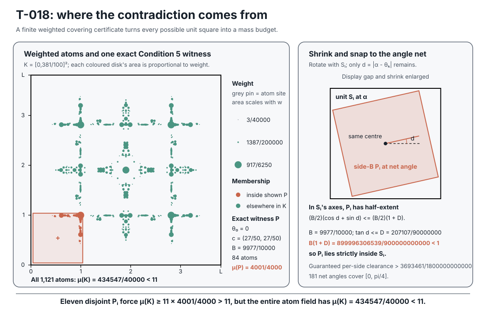
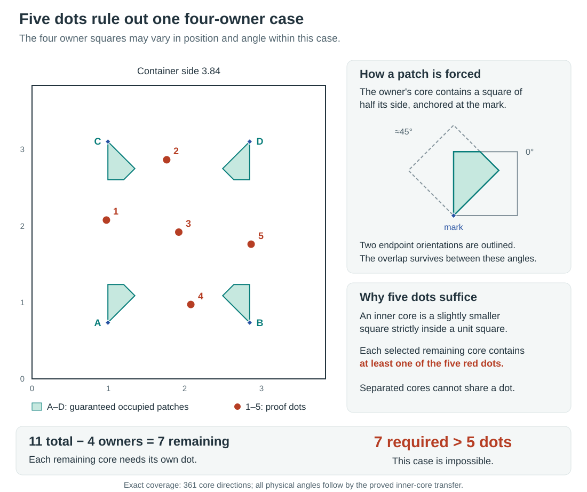
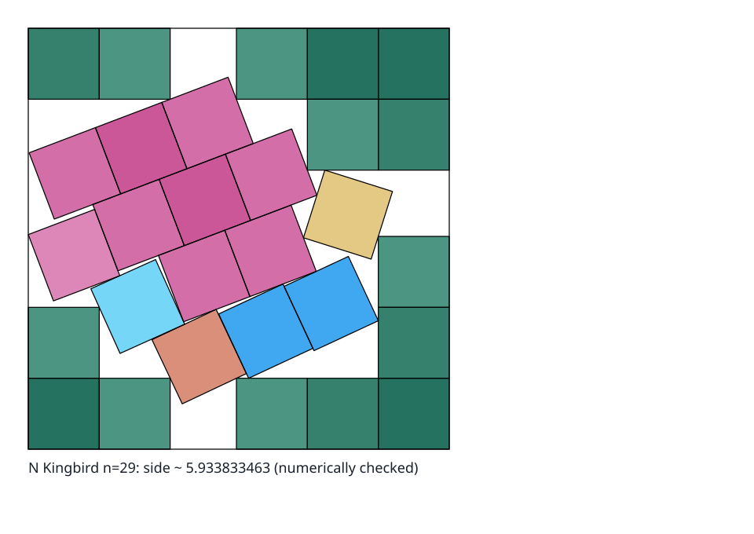
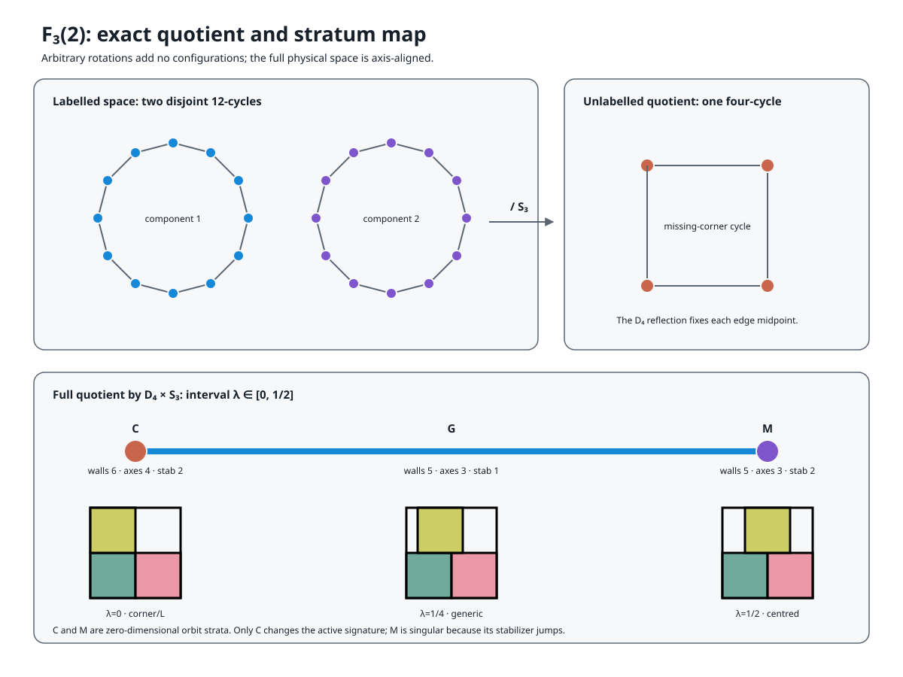

# Tutorial: Square Packing from First Principles

**Audience:** anyone arriving at this repository without a background in the problem.

**Owns:** the conceptual on-ramp—what the objects are, why the approach is shaped the
way it is, and what the research has and has not established.

**Does not own:** the state of the program.
Every result, status, count and verdict lives in [`SYNOPSIS.md`](SYNOPSIS.md), which is
authoritative wherever the two appear to differ.

Several outside ideas do real work here—linear programming in
[§2](#2-the-configuration-space), then algebraic number fields, constrained optimality,
rigidity, certified numerics, and symbolic elimination in
[§5](#5-algebra-versus-numerics), and group actions and branch and bound in
[§9](#9-how-an-optimality-proof-is-built).
Each is introduced where it is first needed, and [§12](#12-further-reading) says where
to learn it properly.
[§11](#11-a-notation-card) collects every symbol on one page.

For the methods that produced record packings, see
[How Record Square Packings Are Found](https://jlevy.github.io/squares/papers/square-packing-methods-survey.html),
which connects geometric construction, annealing, surgery, and local refinement to the
published packing histories.

## Contents

1. [The Problem](#1-the-problem)
2. [The Configuration Space](#2-the-configuration-space)
3. [Cells, Basins, and Two Traps](#3-cells-basins-and-two-traps)
4. [The Corner](#4-the-corner)
5. [Algebra Versus Numerics](#5-algebra-versus-numerics)
6. [What Is Built, and What Is Not](#6-what-is-built-and-what-is-not)
7. [How the Search Is Approached, and Why](#7-how-the-search-is-approached-and-why)
8. [What Is Known, and What Is Not](#8-what-is-known-and-what-is-not)
9. [How an Optimality Proof Is Built](#9-how-an-optimality-proof-is-built)
10. [A Vocabulary Card](#10-a-vocabulary-card)
11. [A Notation Card](#11-a-notation-card)
12. [Further Reading](#12-further-reading)
13. [Where to Go Next](#13-where-to-go-next)

## 1. The Problem

$s(n)$ is the side of the smallest square that contains $n$ non-overlapping unit
squares, each free to translate **and rotate**. Here, “smallest” is exact rather than
approximate: the set of achievable sides is closed, so the infimum is attained and a
best packing exists ([Martin 2000](#12-further-reading)).

Two bounds are immediate:

- **Area:** $s(n) \ge \sqrt{n}$, because $n$ unit squares have area $n$.
- **Grid:** $s(n) \le \lceil \sqrt{n} \rceil$, by the axis-aligned grid packing.

At $n = 11$ those give $3.3166\ldots \le s(11) \le 4$, and the whole subject lives in
that interval.
For a perfect square $s(m^2) = m$, since the two bounds meet, and there is
nothing to say about the side value.
Some of the most interesting cases lie just above a perfect square, where improving on
the next grid side can require tilted structure.


*Walter Trump’s packing of eleven unit squares, optimal by T-060. Six squares are
axis-aligned; five form an oblique block tilted by about `40.18°`. Segments mark shared
edge intervals and dots mark point contacts, all computed in the construction’s exact
number field and clipped to their participating squares.
The picture certifies the construction; T-060 supplies its global optimality.*

Three features make this different from most optimisation problems.

**Touching is legal, and good packings touch constantly.** Disjointness is required of
*interiors* only.
In the best-known $n = 11$ packing, 14 of the 55 pairs are separated by
exactly zero and 20 corner coordinates lie exactly on the container boundary.
Optimal packings are boundary-constrained.
Some have a **jammed backbone**, a contact-constrained subset that cannot move
collectively, while others contain **rattlers**, squares that can move without changing
the container side, or continuous optimal families.
This is why exactness here is representational rather than numerical
([§5](#5-algebra-versus-numerics)).

**Every upper bound in the history of the subject is a construction.** No
non-constructive upper bound has ever been obtained.
So “searching for a better packing” is not one method among several for improving the
upper bound—it is the only one anybody has.

**$n = 11$ is the first case where genuinely oblique tilt is proved to improve on the
$0^{\circ}$/`45°` class.** Stromquist proved that packings restricted to those two
orientation classes cannot beat $2 + (4/3)\sqrt{2} \approx 3.885618$, which is *worse*
than the best-known packing at $\approx 3.877084$. Stromquist’s result gives a concrete
reason that $n = 11$ differs from the proved tilted cases at $n = 5$ and $n = 10$.
[Section 7](#7-how-the-search-is-approached-and-why) uses that distinction to motivate
its search strategy.

### The state of `n = 11`, in one table

|  | value | status |
| --- | --- | --- |
| best-known packing (upper bound) | $3.8770835\ldots$ | Trump 1979, a construction |
| verified lower bound | $3.8770835\ldots$, Trump’s side exactly | Ahmed 2026, Astra-assisted and building on this project and Kleddamag; machine-checked here and reviewed, review record pending ([T-060](packing/frontier/RESULTS.md), `V3/C3`) |
| earlier verified lower bound | $31/8 = 3.875$, strict | Kleddamag 2026, [developed from T-026’s certificate](packing/frontier/RESULTS.md) and confirmed here by two complete coverage methods (T-037); superseded by T-060 |
| strongest first-party lower bound | $3.8269975\ldots$ | T-033, T-026’s atoms on a finer net; the point-only T-018 proof is explained [below](#how-a-weighted-atomic-lower-bound-proof-works) |
| gap between the verified bounds | $0$ | settled: $s(11)$ is Trump’s side |

[T-022](packing/cases/n11_fractional_certificate/t-022-dilation-limit-proof.md) refines
the point-certificate bound to $3.8100257\ldots$.
[T-024](packing/cases/n11_fractional_certificate/t-024-dilation-limit-proof.md) rechecks
the point atoms on a finer direction net and proves $s(11) \ge 3.8166095\ldots$.
[T-025](packing/cases/n11_threshold_certificate/t-025-verifiable-claim-191-50.md)
introduces threshold atoms and directly proves $s(11) \ge 191/50 = 3.82$.
[T-026](packing/cases/n11_threshold_certificate/t-026-verifiable-claim-dilation-limit.md)
proves
$s(11) \ge 955000 \cdot \sqrt{518400042893309449}/179696714646249 = 3.8264474\ldots$,
those same atoms re-certified on a finer direction net and dilated; T-033 repeats it on
a net twice as fine for $3.8269975\ldots$. Kleddamag’s $s(11) > 31/8$ starts from
T-026’s certificate and restricts coverage to what a real parent square needs; it lies
$0.048$ above T-033 and about $0.0021$ below Trump’s packing.
T-026 checks a finite certificate on the finer net, proves that common scaling preserves
its coverage and budget whenever the strict containment inequality holds, and uses
rational density to establish the displayed `≥` bound.
This is a proof of the lower bound, not a weaker kind of assertion.
The phrase *dilation-limit proof* names how the theorem is derived; it is not an
assurance grade.

Under [this repository’s epistemic scale](epistemics.md), T-026 is `V3/C3`:
machine-checked, with its review record pending.
`V3` means the result has exact or interval-certified evidence, a frozen certificate, a
replay command, and a passing replay; `C3` means that certificate was replayed here.
The finite certificate’s coverage condition was confirmed by two distinct methods, an
exact event-cell sweep and an interval branch-and-bound, which the register records as
an attribute beside the rung rather than as a rung of its own; they share the
certificate data and theorem, so two methods do not mean two independent proofs.
A
[mapped, non-superseded source-distinct review](docs/project/reviews/review-2026-09-10-t025-t026-verifiable-claims.md)
of the complete T-026 claim, including the threshold count, finite decision, dilation,
and endpoint inference, is retained; rung 4 on either axis also needs a second
adversarial review by a distinct reviewer and a retained human oversight record, and
rung 5 formal verification reviewed by human experts, so until those records exist the
result stays at `V3/C3` (it held `V4/C5` before the ladder change of 2026-09-30). These
labels describe the retained evidence and confirmation; the mathematical claim is the
proved lower bound above.

The detailed lesson below starts with the simpler point-only T-018 certificate;
[the standalone v0.4.4 explainer](https://jlevy.github.io/squares/papers/n11-lower-bounds-explainer.html#proof-of-the-new-lower-bound)
uses it as a visual worked example, then gives the threshold-counting and dilation proof
of T-025 and T-026. The numerical $3.81$ result is not a premise of T-026. Keeping the
T-018 proof in full also gives readers an assurance bridge: its short standard-library
checker exposes the shared geometry and counting mechanism end to end.
That point-certificate checker does not verify the threshold certificates.
The explainer is Part I of a series on $n = 11$, read in order:
[Part II](https://jlevy.github.io/squares/papers/n11-threshold-bound-review.html)
reviews Kleddamag’s certified bound $s(11) > 31/8$ (T-037), and
[Part III](https://jlevy.github.io/squares/papers/n11-optimality-review.html) reviews
the proof that Trump’s packing is optimal (T-060). The linked T-025 and T-026 claim
documents each embed the new standard-library threshold verifier and the exact
certificate bytes it checks; T-026 also embeds and re-derives its dilation record.

Two different quantities get called a gap in this subject, and this document keeps them
apart. The **bound gap** is the distance between the best upper and lower bounds, the
part of $s(n)$ still unknown; for $s(11)$ it is now zero.
A **search gap** is `best_side − standing best`, the signed distance from one packing
this project found to the best one anybody has published, and it is what
[§3](#3-cells-basins-and-two-traps) onward measures.
The first is a property of the problem; the second is a property of a run.

**The previous lower bound also led to a proof repair.** Stromquist stated
$2 + 4/\sqrt{5} = 3.788854382\ldots$ in his
[1984 Memo III, p. 10](packing/resources/papers/stromquist-1984-packing-unit-squares-inside-squares-iii-cases-through-65-and-gardner-conjecture.pdf),
without supplying the unrestricted proof there.
His 2003 Theorem 2 was the published presentation, and this repository found that its
printed proof is **false as printed**: an exact open box of side $10001/10000$ fits the
claimed container and strictly avoids all twelve printed Figure 14 points.
A separately preregistered, source-distinct repair—moving one point from $(.8, 1.85)$ to
$(.79, 1.85)$—restores the whole argument and certifies the same inequality exactly
([exp-016](packing/campaign/series/series-000-smoke-and-calibration/experiments/exp-016-h-010-stromquist-printed-figure14.md),
[exp-017](packing/campaign/series/series-000-smoke-and-calibration/experiments/exp-017-h-041-stromquist-repaired-figure14.md)).
The inequality stands; the printed derivation of it does not.
The synopsis records the repair as **T-4** and the falsification as the round that
terminally refuted the hypothesis it was registered against.
That value is no longer the best lower bound for $n = 11$; displacing it was the point
of the certificate below.

The episode is why this repository treats published proofs as source claims and tests
them with exact counterexample searches.

### How a weighted atomic lower-bound proof works

This subsection is an optional proof deep dive.
Readers who want the configuration and linear-programming foundations first can continue
at [§2](#2-the-configuration-space) and return here later.
After the proof,
[the finite covering LP](#how-the-finite-covering-lp-searches-for-atoms) explains dual
pricing and [conditional covers](#why-condition-on-corner-squares) from the same
definitions.

Every upper bound in this subject is a construction, and a construction can be handed
over and checked. A lower bound has to exclude every packing at once, and this is the
only place in this document where one is proved rather than quoted.
The proof of $s(11) \ge 3.81$, [T-018](packing/frontier/RESULTS.md), uses a finite exact
certificate and is short enough to follow from first principles.

Fix a candidate container $K = [0, L]^2$—here $L = 381/100$. An **atom** is an exact
point $z$ in $K$ together with a nonnegative rational **weight** $w(z)$. An atom has no
width and blocks nothing: it is bookkeeping mass, not a packed square.
For a region $Q$, the **atomic measure** $\mu$ assigns the mass

```text
μ(Q) = Σ { w(z) : the atom z lies in Q }
```

and a closed square **covers mass** $m$ when the weights of the atoms on or inside it
sum to $m$. *Atomic* means every unit of mass sits at one of finitely many points rather
than being spread continuously across the container: the retained $n = 11$ certificate
puts its mass on 1,121 distinct rational sites, all weights positive.

This is a fractional version of an unavoidable point set—the device Stromquist’s own
argument uses, where every admissible square is required to contain a marked point.
Here several atoms may instead contribute fractional weights that add to at least one,
and that flexibility is what lets a covering linear program search for the weights.
Stromquist’s earlier proofs also use geometric helper arguments: his six-square proof
forces one square to contain four of eight dots, and the repaired eleven-square argument
forces one square to contain three of twelve.
Those forced allocations strengthen the final counting contradiction.
The certificate below uses an unconditional weighted cover; the
[memo review](docs/project/research/research-2026-09-07-stromquist-memos-and-helper-arguments.md)
examines how the helper steps could be made systematic.
The weighted-certificate theorem is Burns’s and Massaccesi’s; the instance and the
generator that found it are this project’s. The finished proof uses none of the
search—only the frozen rational atoms, the nonnegativity premise, and five exact
conditions.

| Condition | Exact fact in the $n = 11$ certificate | Its job in the proof |
| --- | --- | --- |
| **Condition 1** | The weighted atoms are invariant under the container’s $D_4$ symmetries (the four rotations and four reflections of a square) | Reflect an orientation onto the net’s arc without changing any covered mass |
| **Condition 2** | `μ(K) = 434547/40000 = 10.863675`, which is below 11 | Supply less total mass than eleven packed squares would have to consume |
| **Condition 3** | A net of 181 exact directions reaches $\pi/4$ | Put every reduced square orientation between two checked directions |
| **Condition 4** | $B(1 + D) < 1$, for $B = 9977/10000$ and $D = 207107/90000000$ | Fit a closed side-`B` square at a nearby net direction strictly inside any unit square |
| **Condition 5** | Every admissible side-`B` square, at every net direction, covers mass at least $4001/4000$ | Give each inner square strictly more than one unit of mass |

**The counting contradiction.** Suppose eleven unit squares did fit in $K$ with disjoint
interiors. Inside each one put the side-`B` square that **Conditions 3 and 4** supply.
Those inner squares are closed but lie strictly inside their parents’ interiors, so they
are pairwise disjoint and no atom is counted twice.
**Condition 5** gives each of them mass at least $4001/4000$. Nonnegativity and
**Condition 2** then force a chain that cannot hold:

```text
μ(K) ≥ μ(P₁) + ··· + μ(P₁₁) ≥ 11 × 4001/4000 = 44011/4000 = 11.00275,
yet μ(K) = 434547/40000 = 10.863675.
```

So eleven unit squares do not fit at side $381/100$. Any packing in a smaller container
would also fit inside $K$, and therefore $s(11) \ge 381/100$.

**How 181 directions cover every orientation.** A square is unchanged by a quarter turn,
and a diagonal reflection reduces its angle into $[0, \pi/4]$ while **Condition 1**
leaves every covered mass alone.
The net directions are $\theta_r = 2 \arctan(t_r)$, carried as rational half-angle
tangents $t_r$ so that their sines and cosines stay rational.
For an arbitrary reduced angle, take the nearer endpoint of the net interval containing
it and call the angular error $d$; the net’s spacing bounds $\tan d \le D$ exactly.
Measured along the unit square’s own axes, a side-`B` square at that net direction
reaches from the shared centre by at most

```text
(B/2)(cos d + sin d) ≤ (B/2)(1 + D) < 1/2
```

so it fits strictly inside the unit square.
That shrink is the bridge from a continuum of orientations to a finite net, and it is
what stops the argument from assuming an unchecked orientation behaves like a sampled
one.

**How event cells cover every centre.** Even at one fixed direction the inner square has
continuously many admissible centres.
Rotate the frame to align with that square.
For a single atom, the centres whose closed side-`B` square covers it form a closed
axis-aligned rectangle.
The edges of all 1,121 rectangles cut the region of admissible centres into finitely
many open **event cells**, and inside one event cell exactly the same atoms are covered,
so the covered mass is constant.
On a cell boundary a closed square can only gain atoms, and because every weight is
nonnegative its mass cannot fall.
Scoring every reachable open cell therefore decides the true minimum over every centre
rather than over a grid of sampled ones—which is what makes **Condition 5** a statement
about the continuum instead of a survey of it.

**Why nonnegativity is essential.** It does two jobs, and neither is decorative.
A subset cannot carry more mass than the whole container, which is what makes the
counting chain valid; and adding boundary atoms cannot lower an event cell’s score,
which is what makes the finite sweep a minimum rather than an estimate.
Allow negative weights and both fail: an atom gained on a boundary could reduce a score,
and negative mass outside the eleven inner squares could make the container’s total
misleadingly small.

The proof and the computation meet at **Condition 5**. Symmetry, total mass, the net’s
endpoint and the shrink are short rational calculations a reader can redo by hand.
**Condition 5** is the large finite lemma, and it is what the exact event-cell sweep and
the method-distinct interval branch and bound in
[`sqpack.fractional`](packing/src/sqpack/fractional/certificate.py) each decide from the
certificate’s frozen bytes, agreeing on $4001/4000$ to the digit.



#### How the finite covering LP searches for atoms

A **site** and a square **pose** play different roles.
A site is a point where the search may put an atom.
A pose is one square at one centre and angle.
In the proof regime above, the admissible side-`B` net squares form a family containing
all the strict inner cores used by the proof.
Choose a finite site set $\mathcal{X}$ and a finite pose set $\mathcal{P}$. The covering
linear program is

```text
minimise    Σ { w(x) : x ∈ 𝒳 }
subject to  Σ { w(x) : x ∈ 𝒳 and x ∈ Q } ≥ 1    for every Q ∈ 𝒫
            w(x) ≥ 0                              for every x ∈ 𝒳.
```

The matrix has one row per pose and one column per site.
Its objective asks for the least total dot weight that covers every held pose by at
least one. This finite program is only the search problem.
Omitting poses makes it easier, while restricting the atom locations to held sites makes
it harder, so its value has no general ordering against the unrestricted continuum
problem.

The generator repairs the two omissions in opposite directions.
**Row generation** searches all event cells for a pose whose current covered mass is
below one and adds its constraint.
Adding a row can raise the covering objective.
**Column generation** adds a promising atom site, giving the primal more freedom, so the
objective can fall or stay fixed.
The finished certificate still needs the shrink, boundary, and all-angle arguments
already given above.
In particular, its closed side-`B` cores lie strictly inside the physical unit squares;
otherwise two touching physical squares could share a boundary atom and invalidate the
counting sum.

The dual program explains which missing site to try.
It puts a nonnegative weight $y(Q)$ on each held pose and maximises their total weight,
subject to

```text
depth_y(x) = Σ { y(Q) : Q ∈ 𝒫 and x ∈ Q } ≤ 1    for every held site x ∈ 𝒳.
```

The poses with $y(Q) > 0$ form the dual’s **support**. The dual can be read as a
**fractional packing**: poses may overlap, and fractions of many poses may pass through
one point, provided their total depth at each held site is at most one.
This is not a physical packing of disjoint unit squares.
Duality says its total weight lower-bounds the minimum covering mass for the same finite
rows and columns.

Now evaluate `depth_y(x)` at a site not yet in $\mathcal{X}$. If it exceeds one, the
current dual violates the constraint that this missing column would impose.
Its reduced cost is `1 − depth_y(x)`, so negative reduced cost identifies a useful
candidate atom location.
This search for a missing site is called **pricing**. The symmetric implementation adds
the point’s entire $D_4$ orbit $O$, obtained by the container’s rotations and
reflections, and checks that the whole orbit is absent.
One orbit variable assigns the same per-point weight to its images: its objective cost
is $\lvert O\rvert$, and its coefficient in pose row $Q$ is the number of orbit points
inside $Q$. The symmetrised dual has equal depth at all orbit images, so the orbit’s
reduced cost is `|O|(1 − depth_y(x))` and has the same sign as the pointwise expression.
Adding the orbit creates one primal orbit variable and one aggregated dual constraint.
It need not force a strict objective change: a different old dual optimum may survive.
Determining the new optimum requires resolving the enlarged LP.

A support cap can hide that signal.
For a toy point, suppose the first 32 support rows contribute depth $0.94$ and the
remaining positive rows contribute $0.12$. The capped family reports $0.94 \le 1$, while
the full family reports $1.06 > 1$ at the same point.
Those numbers are illustrative, not a measured result.

[H-135](packing/campaign/hypotheses/H-135-paired-full-support-pricing.md) turns that
example into a controlled test.
It uses **one** finite LP solve and one largest-first sequence of positive dual entries
retained under the protocol’s selection threshold, rationalised once; `paired32` takes
the first 32 entries and `full` takes them all.
Success requires one new point whose complete $D_4$ orbit is absent and whose exact
rational depths at the same point satisfy

```text
depth_paired32(x) ≤ 1 < depth_full(x).
```

That outcome would show that the 32-row cap hides a violation in this rationalised
proposal. It would not establish a strict objective improvement, identify the cause of
any historical stall, certify the rounded weights as a feasible or optimal dual, or
prove a packing bound.
Here “full” means the positive support of this one finite solution, not all square poses
in the continuum. The dated
[exp-134 protocol](packing/campaign/series/series-000-smoke-and-calibration/experiments/exp-134-paired-full-support-pricing.md)
is published but unrun, so it carries no verdict.
That experiment transports the retained state to unit-square poses for a pricing
mechanism test; it is not the side-`B` primal-cover theorem used by T-018.

The threshold explains what either side can eventually prove.
An exact atomic cover of all admissible strict cores with total mass below 11, together
with the transfer above, excludes eleven physical squares.
Conversely, an exact fractional family of total weight at least 11 whose depth is at
most one at **every** possible atom location would rule out that unconditional cover
route for the fixed core family.
It would not exhibit a physical packing or rule out other proofs.
The
[retained side-`B` depth-one baseline](packing/campaign/series/series-000-smoke-and-calibration/results/agenda-025/bc-232-disposition.md)
at $L = 191/50$ has mass $21342289572/2055263195 \approx 10.3842$, below 11, so it is
inconclusive: it is neither the desired cover below 11 nor an obstruction at that
threshold. A later
[88-core family](docs/project/research/research-2026-09-10-x027-fractional-duality.md)
at the same side and core size has total mass exactly 11 and point depth at most one.
It therefore obstructs every unconditional point-atom cover below mass 11 on that fixed
core domain. Scaling the cores and placements by $10000/9977$ gives a mass-eleven family
of full unit squares in side $38200/9977$; selecting any individually defined core
inside each parent preserves the point-depth inequality.
This extends the point-only obstruction to those selections at that side and above.
It does not apply below that side or to threshold charges, conditional domains, or
restrictions that depend on the other packed squares.

#### Why condition on corner squares?

An unconditional cover treats each square alone.
Structural information can instead split the possible packings into cases and give each
case its own atomic measure.
Only proved restrictions on corner ownership, wall contacts, angles, or compatibility
may remove poses. Every hypothetical packing must belong to a case, and its certificate
must cover every legal core throughout that case’s continuous parameter range.

A **strict core** is a slightly smaller square—side $9977/10000$ here—placed strictly
inside a physical unit square.
The strict inset makes the closed cores of non-overlapping physical squares disjoint,
including at their boundaries.
A **corner owner** is one of four distinct physical unit squares whose selected core
contains a chosen **mark**, a specified point near a container corner.
The owner may still move and rotate within its case.
A **guaranteed footprint** is a fixed closed polygon that lies inside the owner’s
selected core for every pose allowed by the case.
It records area that is certainly occupied even though the owner’s exact pose is
unknown.



*The proved five-dot exclusion for one selected four-owner branch at `L = 96/25`. The
corner shapes are the regions guaranteed to lie in the four owner cores; the five dots
pierce every selected remaining net core.
The drawing explains the logic; the linked records supply the exact check and the
geometric proof that extends it to every physical angle.*

Here is the counting argument for that branch.

1. Four distinct corner owners are already identified, so an eleven-square packing would
   have $11 - 4 = 7$ other squares.
2. Every strict core of a remaining square must avoid the four guaranteed footprints.
3. Use the five fixed dots shown in the figure.
   Their exact coordinates and the full worked example are in the
   [sprint report](packing/campaign/series/series-000-smoke-and-calibration/results/agenda-032/sprint-report.md).
4. The
   [exact full-net replay](packing/campaign/series/series-000-smoke-and-calibration/results/agenda-032/exp-144-four-owner-endpoint-full-net-replay.json)
   checks all 361 chosen core orientations and finds that every admissible remaining net
   core contains at least one of those dots.
   The reviewed shrink-and-snap argument transfers the finite orientation check to
   physical squares at every angle
   ([five-dot transfer review](packing/campaign/series/series-000-smoke-and-calibration/results/agenda-032/proofs/five-dot-transfer-review.md)).
5. **No dot can serve two cores:** each strict core lies inside a different physical
   square’s interior, and those interiors do not overlap.
   Five dots can therefore meet at most five residual cores, fewer than the seven the
   branch requires.

This proves that an eleven-square packing at side $96/25$ cannot belong to this selected
branch. The result is registered as [T-023](packing/frontier/RESULTS.md).
It does not prove a new lower bound for $s(11)$. The corner-owner theorem permits other
owner classes and sectors, so a global result would need to prove that every
hypothetical packing admits at least one valid selection excluded by a conditional
certificate. Excluding every raw label or every permitted combination is sufficient but
stronger than this selection requirement.
The
[numerical source receipt](packing/campaign/series/series-000-smoke-and-calibration/results/agenda-032/exp-143-four-owner-footprint-cover.json)
records how the five dots were found; the exact replay and transfer review establish the
covering claim.

To follow $n = 11$ past this tutorial’s scope, read the synopsis’s
[`n = 11`, End to End](SYNOPSIS.md#n--11-end-to-end).
That section is a dated account of the case before T-060 settled it.
It covers the ceilings these certificate languages reach, the external certificate that
held the verified lower bound before T-060, and why no counting certificate can prove
$s(11)$ equal to Trump’s side.

## 2. The Configuration Space

A **configuration** places every square and fixes the container.
Square $i$ has a centre $(x_i, y_i) \in \mathbb{R}^2$ and an angle
$\theta_i \in [0, \pi/2)$, and the container has side $s$. Angles stop at $\pi/2$
because a unit square is unchanged by a quarter turn, so larger angles name poses
already counted.

Throughout, a subscript $i$ picks out one square and a bare letter is the whole
$n$-vector: $\theta = (\theta_1, \ldots, \theta_n)$ is all $n$ angles at once, and $x$
and $y$ are the $n$ centre coordinates each.
So “fix the angles” always means fix all $n$ of them.
Counting scalars, a configuration is $3n + 1$ real numbers—**34 at $n = 11$**.
[§11](#11-a-notation-card) collects every symbol used in this document.

Read naively, this is a 34-dimensional nonconvex problem with $C(11,2) = 55$ disjunctive
constraints, and it is not obvious where to push.
The central structural insight of this project is that the naive reading is the wrong
decomposition.

### The cell decomposition

Two convex polygons have **disjoint interiors** exactly when some line separates them,
weakly—touching is allowed, and the separating line may run along the shared edge.
For polygons it suffices to test lines parallel to their edges.
A square has two distinct edge normals, since opposite edges are parallel, so each pair
of squares has four candidate axes, and for each axis a choice of which square lies on
the low side.

> A **cell** of configuration space is a choice, for each of the $C(n,2)$ pairs, of one
> candidate separating axis together with an order.
> A configuration *lies in* a cell when those choices genuinely separate those pairs in
> that order.

Four axes times two orders is eight choices per pair, so there are at most $8^{C(n,2)}$
cells—about $4.7 \times 10^{49}$ at $n = 11$. Most are empty, because the choices must
be jointly realisable by an actual configuration, but even as a crude bound the number
says what kind of difficulty the discrete half carries.

Now fix the angle vector $\theta$ **and** fix a cell.
Write $R_i$ for rotation by $\theta_i$, so the four corners of square $i$ are
$(x_i, y_i) + R_i\cdot(\pm\tfrac{1}{2}, \pm\tfrac{1}{2})$, and write
$o_{ik} \in \mathbb{R}^2$ for those four corner offsets, $k = 1\ldots4$. Four things
become true at once:

1. Once $\theta_i$ is fixed, the offsets $o_{ik}$ are **constants**, so every corner is
   an affine function of the centre alone.
2. Containment is **linear**: each corner satisfies $0 \le x_i + o_{ik,x} \le s$ and
   $0 \le y_i + o_{ik,y} \le s$, writing $o_{ik,x}$ and $o_{ik,y}$ for the two
   components of $o_{ik}$. Note $s$ appears here, and only here, as a variable.
3. Separation along a *fixed* axis is a **linear** inequality.
   For axis $\nu$ and the order $i$ before $j$, every corner of $i$ projects at or
   before every corner of $j$:
   $\langle \nu, (x_i,y_i) + o_{ik} \rangle \le \langle \nu, (x_j,y_j) + o_{jl} \rangle$
   for all $k, l$. Because the cell fixes both $\nu$ and the order, there is no absolute
   value and no case split left.
4. The objective is $s$ itself, which is **linear**.

So the whole problem, restricted to one cell at fixed angles, is

```
minimise    s
over        x₁…xₙ, y₁…yₙ, s          (2n + 1 variables; 23 at n = 11)
subject to  0 ≤ xᵢ + oᵢₖ,ₓ ≤ s       for every square i and corner k
            0 ≤ yᵢ + oᵢₖ,ᵧ ≤ s
            ⟨ν_ij, (xᵢ,yᵢ) + oᵢₖ⟩ ≤ ⟨ν_ij, (xⱼ,yⱼ) + oⱼₗ⟩   for every pair (i,j)
```

with every $o_{ik}$ and every axis $\nu_{ij}$ a constant, determined by $\theta$ and the
cell. That is the result the synopsis calls **T-2**.

**Why that is good news.** A **linear program** minimises a linear objective over linear
inequalities. Its feasible region is a polyhedron.
For the feasible packing LP above, whose finite optimum is attained and whose feasible
region has vertices, one can choose an optimum at a vertex.
The class is solvable in polynomial time and is fast in practice; representative project
solves took about `1.28 ms` in the
[recorded infrastructure benchmark](docs/project/research/research-2026-08-22-infrastructure-for-packing-exploration.md).
Two further properties matter later.
The set of constraints holding with equality at the optimum is its **active set**, and
the corresponding **optimal basis** is the subset of them the solver uses to pin the
vertex down; [§4](#4-the-corner) turns entirely on what happens when that basis changes.
And a linear program can be solved *exactly* over rational coefficients, which is why
the floating-point floor in [§5](#5-algebra-versus-numerics) is a limit of the
implementation rather than of the mathematics.
[§12](#12-further-reading) points to a proper treatment.

The solver this project actually calls is **HiGHS**, an open-source high-performance
linear and mixed-integer optimizer, reached through SciPy.
It works in floating point, so it does not return the exact optimum of the cell it is
given—it returns one within a declared **feasibility tolerance**, the margin by which a
returned solution is allowed to violate its own constraints.
That tolerance is where the floor in [§8](#8-what-is-known-and-what-is-not) comes from,
and setting it too loosely once produced a packing that violated its own separation
constraint, and so a side below the standing record.

**All the nonconvexity has been pushed into exactly two places**: the trigonometric
dependence of the offsets and axes on the angles, and the *discrete* choice of cell.
That factorisation—a small continuous part times a large combinatorial part—is the
premise underneath almost everything else here.

The two independent formulations use different constraint assemblies but describe the
same feasible set. `sqpack.research.quench` uses one separation row per pair;
`cases.trump11.independent_lp_cell` uses sixteen, one per ordered corner pair, for
$1{,}056 = 16 \times (11 + 55)$ rows at $n = 11$. They share no constraint-assembly
code.

The check that makes it concrete: read the cell off the exact certificate for the best
known $n = 11$ packing (eleven angles and fifty-five axis choices, and nothing else),
rebuild the linear program from scratch, and solve it.
**The centres are never given to the solver**—they are what it reconstructs.
It returns the published side to $4.4 \times 10^{-16}$ and every centre to
$1.3 \times 10^{-15}$.

### Thirty-four dimensions become one

An **angle class** is a set of squares constrained to share one angle.
Trump’s packing uses only **two**: six squares at $0^{\circ}$, and five sharing a single
oblique angle. Call that shared angle $a$, so the full angle vector is
$\theta = (0, 0, 0, 0, 0, 0, a, a, a, a, a)$ up to relabelling—one free number in place
of eleven.

Hold the cell fixed, vary $a$, and solve the linear program of the previous section at
each value. That defines a function of one real variable,

```
φ(a) = the optimal side s of Trump's cell, with the five tilted squares at angle a
```

so $\varphi: [0, \pi/2) \to \mathbb{R}$, and it is the entire problem restricted to this
cell. Write $a^{\ast}$ for the angle that minimises it.
A `*` marks a distinguished value of a symbol rather than one fixed relation: $a^{\ast}$
is a minimiser, and $s^{\ast}$ in [§7](#7-how-the-search-is-approached-and-why) is the
standing best for an $n$, which is not known to be a minimum in the open cases.
A 2,001-point scan of $[38^{\circ}, 42^{\circ}]$ independently puts the lowest grid
sample within one step of Trump’s published tilt and locates the neighbourhood of the
minimiser $a^{\ast} \approx 40.18^{\circ}$.

Trump’s angle is not an input to that computation.
It is **the argument that minimises a one-dimensional function anyone can plot.** In
this particular structured cell, the centres remain LP variables and only one nonlinear
angle parameter remains.
This is evidence that angle-class models can compress record cells dramatically; it is
not a theorem that class count equals the local dimension of the full packing problem.
Other records already use more classes—six, numerically, at $n = 29$—and every proposed
compression must be checked on its own contact structure.



*The reported `n = 29` record is a useful larger-scale check: six orientation classes
across 29 squares. The retained roughly 100-digit source is evaluated at 160 decimal
digits of working precision and passes all 406 pair checks at tolerance `1e-80`; that
numerically checks the construction without verifying it or turning it into an exact
certificate or an optimality proof.*

## 3. Cells, Basins, and Two Traps

Both traps below arose in retained experiments and changed the project’s definitions.

### The quench map

Borrowed from Stillinger and Weber’s *inherent structure* decomposition: the **quench
map** sends a configuration to the pose that a deterministic refinement returns.
A **basin**, or **point-basin** where the distinction matters, is the preimage of one
returned pose. The atlas ultimately wants a coarser, mathematically stable relation on
connected terminal components; the current point keys do not yet provide it.

A quench map is a general notion; this project uses one particular algorithm, and the
specifics matter for what follows.
It has two nested loops, not one.

**The inner loop makes the side a function of the angles.** Given a pose, the cell is
*read off it*: for each pair, take the candidate axis of greatest separation, together
with the sign saying which square is low.
That cell defines the linear program of [§2](#2-the-configuration-space), which is
solved in the $2n + 1$ centre-and-side variables.
But the solution may lie in a *different* cell from the one it was solved in, so its
value is an upper bound that depends on where the caller started.
That path dependence would make $s(\theta)$ ill-defined and leave any angle search
optimising a moving target.
So the loop re-reads the cell from the solution and re-solves until the cell it reads
back is the cell it was given—a **cell fixed point**. It can also stop unsettled, with a
typed reason, and an unsettled result is exploratory data rather than a converged
endpoint.

**The outer loop moves the angles.** It works one angle class at a time, minimising each
by golden-section bracketing inside a window that narrows only when a whole sweep fails
to improve.
No derivative is used—deliberately, for the reason [§4](#4-the-corner) gives.
A final optional pass brackets each of the $n$ angles individually, to test whether a
class-converged pose is genuinely stationary or an artifact of the tolerance that
decided which angles count as one class.
The sweeps stop when none improves, or a tolerance, sweep cap, or wall-clock budget is
reached.

So: **read the cell, solve to a cell fixed point, bracket the angle classes, repeat.**

The knobs are real—a class-merge tolerance, a window schedule, budgets—and that is
exactly why a basin defined by this map inherits them.
It is also why the free-angle pass exists.
Note too that changing the refiner changes the map, and therefore changes what “basin”
refers to: swapping angle descent for class bracketing, which [§4](#4-the-corner) does,
is a different quench and a different decomposition.

Two derived words carry the project’s central diagnostic:

- **Polish:** refinement *within* the basin you are already in.
  This is what the quench does, and all it does.
- **Exploration:** reaching a *different* basin.
  Nothing in the toolkit does this reliably at $n = 11$.

A gap therefore decomposes into a **polish failure** (right region, weak refinement) or
an **exploration failure** (wrong region, and refinement cannot help).
Which one a number represents **cannot be read off the number**; you establish it by
running the refiner and seeing whether the gap moves.

### Trap 1—a fixed-angle cell solve is not a basin

A cell fixes only the discrete separating axes and orders.
The **fixed-angle LP subproblem** fixes both a cell and an angle vector; a basin does
neither, because the quench may change angles and cross cells.
A configuration can therefore sit at exactly its fixed-angle cell optimum and still be
far from its quench endpoint, with all the remaining gap in the angles and none in the
centres.

**A fixed-angle solve that stops improving has exhausted only the variables it may move;
it has not converged to a local optimum of the full problem.** Watching it flatten and
concluding “wrong basin” is exactly what the *right* basin looks like when the residual
is angular.

An agent built a fixed-angle probe, called it “the quench”, and **retracted a correct
finding** when it stalled ([D-029](defects.md)). On one $n = 10$ start: the annealer
output and the fixed-angle solve agree to every digit at $+5.6440 \times 10^{-4}$, and
the full quench with its angle half reaches $+4.4409 \times 10^{-16}$.

The renderer guide retains the
[shared-scale Göbel source-return diagnostic](packing/atlas/rendering/README.md#n--10-numerical-comparison):
the start is close but not settled, while the full quench returns to the proved-side
geometry.

### Trap 2—a point-basin need not be a terminal component

A deterministic quench still returns an individual pose.
The problem is that its local optimum can lie on a connected terminal family, so
point-preimages split the component-level object the programme actually wants to count.

At $n = 3$ the exact side-2 optimum contains a connected **sliding family**: centres
$(1/2,1/2)$, $(3/2,1/2)$, and $(t, 3/2)$ for $t \in [1/2, 3/2]$. One connected optimal
component, infinitely many distinct coordinate keys.
The quench lands wherever in the flat region it happened to enter, and every symptom
mimics a real discovery—distinct coordinates, distinct keys, two rows in the store—while
the side agrees exactly and, along the family’s open stratum, so does the contact
certificate (the wall endpoints carry a different one).

The object that survives this trap has been computed exactly, and the figure below is
its map. $F_3(2)$ is the space of *all* packings of three unit squares in the side-2
container—and since $s(3) = 2$ is proved, that is the complete optimum space, not a
sample of it. With the squares labelled, the space is two disjoint circles, each a cycle
through twelve discrete states, cross-checked against the published hard-squares
computation of the same space.
Forgetting the labels—quotienting by the symmetric group $S_3$—merges the two circles
into one: relabelling was separating configurations the mathematics does not
distinguish.
Quotienting also by the container’s eight symmetries $D_4$ folds that circle
to the closed interval $\lambda \in [0, 1/2]$, where $\lambda = \min(t - 1/2, 3/2 - t)$
is the slider parameter above with the reflection $t \leftrightarrow 2 - t$ divided out.
Three strata remain: the corner pose at $\lambda = 0$, the generic slide, and the
centred pose at $\lambda = 1/2$.



*Each quotient stage kills one wrong identity—relabellings and container symmetries are
not new basins—and the interval kills the rest: four exact sample poses with four
distinct geometric keys, two contact signatures, and three strata are one connected
component.*

That is why this object is a permanent known-answer control rather than an illustration.
A frozen component-assignment policy is accepted only if it recovers this interval, and
the $n = 4$ quotient point, exactly while rejecting every shortcut:
[exp-032](packing/campaign/series/series-000-smoke-and-calibration/experiments/exp-032-h-021-terminal-component-controls.md)
proposed geometric keys, contact signatures, finite samples, labelled states, and
floating-point matches as component identities, and all seven such mutations were
refused. Passing that gate is what admitted the bounded $n = 5$ connectivity work below,
and this map is the only exact ground truth behind open question 1 in
[§8](#8-what-is-known-and-what-is-not).

The same phenomenon appears at $n = 5$. After one symmetry action and relabelling, two
retained poses with different coordinate keys lie on one exact continuous family in a
fixed-angle cell.
An apparent escape direction is ruled out, but the remaining directions
and global connectivity are still open.
The constrained-optimality language needed for the sharper statement is introduced in
[§5](#contact-graphs-stationary-branches-and-rattlers).

The project’s term for this is a **terminal family**. The nullity of the appropriate
independent active-constraint Jacobian, after quotienting symmetries and accounting for
inequalities and stratum changes, is its **linearized dimension**. It equals local
dimension only on a regular constant-rank stratum, or after a separate integrability
argument. At a singular constraint, nullity can overstate the local dimension: $x^2 = 0$
has Jacobian nullity one at zero but local dimension zero.
**Raw contact counts cannot supply even the linearized rank**—contacts may be dependent,
one contact description may encode several scalar conditions, and angles and cells may
change along a motion.
Subtracting contacts from variables is not a rigidity calculation, and the project has a
logged defect for having done it.

### The generalized lesson, learned twice

- **First version.** Whatever defines a basin must be independent of the *search’s* own
  knobs. A quench that merged nearby angles would make “basin” depend on a merge
  tolerance.
- **Second version.** It must also be independent of the *representation’s* knobs, and
  must not presume a structure—discreteness—that the mathematics does not supply.

Both have the same cause as Trap 1: the representation fixes more than the mathematics
does. The first lesson was documented; the same argument implied the second, but it was
not documented.

## 4. The Corner

$\varphi(a)$ is not smooth at its minimum.
Refined finite differences give one-sided rise rates of about $0.1747$ to the left and
$0.384$ to the right per radian, stable over five decades.
In the conventional signed derivative, these are about $-0.1747$ and $+0.384$. Two
independent LP formulations agree: $0.1747$/`0.3839` at a ratio of $2.1973$, and
$0.1747$/`0.3841` at a ratio of $2.198$. **The derivative does not vanish at the
optimum; it jumps.**

**Why.** Where the LP’s optimal *basis* is locally constant, $\varphi$ is smooth and its
derivative reads off that basis.
A corner occurs where the optimal basis switches as the angle crosses $a^{\ast}$.
Because a basis is only a subset of the active rows, a basis switch alone does not show
that the full active-contact set changed.

**What it bought.** Replacing smooth descent with a **bracketing search over merged
angle classes**—a method that tolerates non-smoothness—and changing nothing else took
$n = 5$ from descent’s $3.2 \times 10^{-8}$ to $2.2 \times 10^{-15}$, and $n = 10$ from
$4.5 \times 10^{-3}$ to $1.3 \times 10^{-15}$. Measured from the annealer output both
quenches start from, that is $3.4 \times 10^{-8}$ and $5.3 \times 10^{-3}$ respectively.
All four figures are medians over the five tested seeds; the worst $n = 5$ seed stays at
$6.2 \times 10^{-8}$.

**What it did not buy.** Nothing at $n = 11$, where the same substitution moves the
annealer’s $8.8 \times 10^{-2}$ only to $6.3 \times 10^{-2}$. And it is *not* a theorem
that derivative-free methods must fail: Powell and Nelder–Mead did worse than descent on
the tested starts, in this implementation, which is method-selection evidence and not an
impossibility result.
The kink also lives on a one-dimensional slice, so it is **not** by itself a rigidity
proof for the full packing.

The synopsis presents this measurement-to-method chain as a full worked example.

## 5. Algebra Versus Numerics

### Why exactness is not optional

Floating-point evaluation can certify a strict inequality when a sound error bound stays
away from zero.
It cannot infer that an **unrecognised near-contact** is exactly equal to
zero merely because a computed residual is small.

For Trump’s algebraic coordinates rounded to f64, the current float verifier needs a
tolerance to accept the true contacts.
That tolerance is a blind spot that also accepts overlaps smaller than itself; setting
it to zero rejects this true packing instead.
Both failure modes are demonstrated by a negative control in this directory.
**There is no tolerance in this predicate that both accepts Trump’s rounded packing and
rejects all violations**, and raising precision shrinks the blind spot without turning a
small residual into an equality proof.

Generic interval evaluation does not by itself fix this identification problem.
An enclosure lying strictly above zero *is* a proof of strict separation, while a
finite-width enclosure of an unrecognised near-contact normally cannot distinguish exact
zero from a tiny violation.
Structural simplification can produce $[0,0]$, and certified root methods can prove
existence and uniqueness of a solution satisfying contact equations.
What interval evaluation alone cannot do is promote an approximate coordinate residual
to an unknown exact contact.
The final verifier therefore needs an exact representation or an independently certified
equality system, not a contact tolerance.

The fix is therefore **representational rather than numerical**: work in the real
algebraic number field the packing actually lives in, where equality is decidable.

**One predicate, four scalar types.** That fix is affordable because of a property of
the geometry: every quantity the separating-axis test evaluates is a *polynomial* in the
configuration variables—four candidate axes, eight dot products per axis, no divisions
and no square roots.
So a single implementation is correct over `f64`, over intervals, and over an exact
field; only the scalar type and the sign decision change.
The verifier here is written once and instantiated at each, which is why “work exactly”
is a choice about where to spend time rather than a second codebase.

**What it costs, and therefore where to spend it.** Exactness is not uniformly
expensive. The representative measurements below come from the
[infrastructure benchmark](docs/project/research/research-2026-08-22-infrastructure-for-packing-exploration.md):

| Operation | Cost |
| --- | --- |
| Separating-axis pair test, `f64`, compiled | 57 ns |
| The same test, Python float backend | 2,726 ns |
| One $\mathbb{Q}(\alpha)$ multiplication at degree 8, the $n = 11$ field, pure Python | 215.5 µs |
| The same, with a compiled bignum backend (benchmarked; not integrated) | 1.2 µs |
| One $\mathbb{Q}(\alpha)$ multiplication at degree 62 | 13 ms |
| Complete exact verification of Trump’s packing, all 55 pairs | 0.35 s |

At current sizes, complete exact verification costs less than a second, so it is not the
present bottleneck.
The cost is not flat: one exact multiplication climbs from `215.5 µs`
at degree 8 to `13 ms` at degree 62 in pure Python, and even the compiled backend’s
advantage over pure Python grows with degree—`177×` at 8, `578×` at 62—so exact
arithmetic is most expensive exactly where the problem is hardest.
That is the standing reason it stays out of the search loop.

The useful frame is three budgets rather than one.
An *agent* tier at 1–10 s per operation, where a proof or a verification lives and
nothing needs optimising; an *interactive* tier at 10 ms–1 s; and an *inner loop* at 10
ns–1 µs executed $10^9$–`1e12` times, which is `f64` and always will be.
Screen in floating point, refine in floating point, decide in the number field.

### The number field

A **real algebraic number field** $\mathbb{Q}(\alpha)$ is what you get by adjoining one
real algebraic number $\alpha$ to the rationals.
The procedure:

1. **Recover the field.** Put the configuration in $\mathbb{Q}(\alpha)$ for a single
   **primitive element** $\alpha$, with a known minimal polynomial $f$ and an isolating
   interval that contains the intended real root of $f$ and no other.
2. **Represent** elements as polynomials in $\alpha$ of degree $< \deg f$ with rational
   coefficients, reduced modulo $f$. Arithmetic is exact.
3. **Decide equality exactly.** For an element $\beta$, $\beta = 0$ exactly when its
   reduced representative is the zero polynomial.
   *This is where touching contacts get certified.*
4. **Decide sign exactly**—evaluate that representative on the isolating interval with
   rational interval arithmetic, bisecting when the enclosure straddles zero.
   This terminates because a nonzero representative of degree $< \deg f$ cannot vanish
   at $\alpha$, since $f$ is the minimal polynomial.
5. **Run separation and containment** using only those two decisions.
   No floating point appears anywhere.

For Trump’s packing the field is $\mathbb{Q}(u)$ with $u = \tan(a/2)$, of degree 8. A
useful subtlety: $\cos a$, $\sin a$, $\tan(a/2)$ and $s$ are all algebraic, but **the
angle $a$ itself, in radians, is transcendental** by Lindemann–Weierstrass.
The algebra lives in the trigonometric values, never in the angle.

### How many roots does a packing need?

Step 1 says “a single primitive element” as though one always suffices.
It does, and the reason is worth stating, because the obvious guess—that a configuration
with $3n + 1$ algebraic coordinates might need many—is wrong.

**One, always.** By the primitive element theorem every finite extension of $\mathbb{Q}$
is simple, since characteristic zero makes every finite extension separable.
So however many algebraic coordinates a packing has, each with its own degree, there is
a single $\alpha$ whose powers express all of them, and every coordinate becomes a
polynomial in $\alpha$ with rational coefficients.
Only one *root* of $f$ is the intended one, which is why an isolating interval is part
of the field data rather than an optimisation.

**Of what degree, though, is not bounded.** The theorem gives no bound; the degree is
whatever the active contact system forces after elimination.
It is 8 for Trump’s $n = 11$ packing, and reaches 62 elsewhere in the record table.
It is not a function of $n$: at a Pythagorean tilt such as $\arctan(3/4)$ every
coordinate is rational and the degree is 1. Which fields and degrees actually occur, and
how they follow from the contact mechanism, is an open question in the registry rather
than something known.

**And the guarantee is not pointwise.** The optimal *side* is algebraic, by a standard
argument this directory does not otherwise use.
The half-angle substitution $u = \tan(\theta/2)$ turns $\cos \theta$ and $\sin \theta$
into rational functions of $u$, so validity defines a semialgebraic set over
$\mathbb{Q}$ with no transcendental functions anywhere.
The set of achievable sides is a projection of that set, and by the Tarski–Seidenberg
theorem a projection of a semialgebraic set is semialgebraic—hence a finite union of
points and intervals with algebraic endpoints, whose infimum is algebraic.
An individual optimal *configuration* need not be.
Where the optimum is a positive-dimensional family, the family is cut out by polynomials
but a point on it carries a free parameter: the $n = 3$ sliding family in
[§3](#3-cells-basins-and-two-traps) is $(t, 3/2)$ for $t \in [1/2, 3/2]$, and $t$ may be
transcendental.

So “recover the field” is well posed for a **rigid** optimum, whose active constraints
pin it down, and ill posed for an arbitrary point on a family.
That is the same distinction [§3](#3-cells-basins-and-two-traps) draws between a
point-basin and a terminal component, arrived at from the algebraic side.

### Assurance, method, and precision

Never extrapolate across an assurance or arithmetic boundary.

| Assurance | What it means |
| --- | --- |
| `reported` | A named source states the claim; this project has not established it independently |
| `numerically-checked` | A finite calculation checked the scoped predicates under an explicit method, precision, rounding, and tolerance |
| `verified` | An exact check, rigorous interval certificate, or complete proof decides the claim and its preconditions |

The **method** is recorded separately.
Witness and machine-check evidence uses four tokens:

| Method | What it is |
| --- | --- |
| `numerical-f64` | Hardware floating point; says exactly what arithmetic was used |
| `numerical-multiprecision` | Higher precision, which must state the actual digits or bits and the tolerance—it does not mean unlimited precision |
| `interval-certified` | Rigorous interval arithmetic, which can certify a strict inequality |
| `exact-algebraic` | Exact replay in the packing’s own number field, where equality is decidable |

The first two methods are tolerance-based.
`interval-certified` uses rigorous numerical enclosures; `exact-algebraic` uses exact
arithmetic. Either supports `verified` only when the scoped certificate and its
preconditions are checked.
No amount of ordinary finite-precision checking buys that status: **a numerical result
remains numerical at tolerance $10^{-100}$.** Actual precision, rounding, and tolerance
are recorded alongside the method rather than implied by it.
Frontier proof evidence uses three further tokens—`published-proof`, `proof-audited`,
and `proof-assistant-checked`—for claims whose warrant is an argument rather than a
computation.

`beat_record: true` requires `assurance: verified`. A negative numerical gap is a
candidate or solver error, never a formal discovery—a rule that caught a critical defect
when a loose LP tolerance returned a packing violating its own separation constraint.
Even a verified feasible witness establishes only an upper bound; optimality needs a
matching verified lower bound.

### Contact graphs, stationary branches, and rattlers

An exact reconstruction needs more information than a contact graph.
A **contact graph** has one vertex per square and an edge for each touching pair, with
optional wall vertices for boundary contacts.
It says who touches whom, but not which equation makes them touch.
For rotated squares, that equation also depends on whether the features are corner-edge,
edge-edge, or wall contacts; which square owns the supporting axis; the separation order
and sign; and the angle and wall chart.
A **typed contact** retains those choices.

Fixing one consistent set of types gives a smooth **support branch** of the otherwise
disjunctive feasible set.
A complete branch contains one typed constraint for every square pair and wall,
including inequalities that are not tight.
Write the configuration vector as

```text
q = (s, x_1, y_1, theta_1, ..., x_n, y_n, theta_n)
```

and its clearance inequalities as $g_j(q) \ge 0$. Row $j$ is **active** when
$g_j(q) = 0$. A **feature tie** occurs when several support descriptions apply at the
same geometry, as at a corner-corner touch admitted by more than one owner-axis choice.
The model must keep every applicable branch at a tie rather than choose whichever type a
floating-point residual happens to prefer.

Fritz–John stationarity supplies the first-order equation on one branch.
At a branch minimum there are nonnegative multipliers $\eta$ for the side objective and
$\kappa_j$ for the constraints, not all zero, such that

```text
η ∇_q s - sum_j κ_j ∇_q g_j = 0,    κ_j g_j(q) = 0.
```

Here $\nabla_q$ means the gradient with respect to the side, centres, and angles
collected in $q$. When $\eta > 0$, rescaling it to one gives the **normal**, or
ordinary, Fritz–John branch and a **Karush–Kuhn–Tucker (KKT)** multiplier certificate.
When $\eta = 0$, the objective drops out and a nontrivial dependence among active
constraint gradients gives an **abnormal Fritz–John branch**. A proved **constraint
qualification**—a suitable local regularity condition on those gradients—can rule
abnormal branches out.
Without one, omitting them makes an enumeration incomplete.
Redundant or tied active rows can let one geometry admit both normal and abnormal
certificates, so the two cases classify multiplier certificates rather than disjoint
sets of geometries.

Activity and multiplier support are different.
An active row may have $\kappa_j = 0$: this is a **zero multiplier**, a tight contact
that carries no first-order balance in that particular certificate.
The rows with positive multipliers form the **positive multiplier support**. The contact
graph induced by those rows may be smaller than the active contact graph and need not be
connected.

A **rattler** is a square, or a cluster of squares, that can move locally within a cage
while the remainder stays jammed.
The jamming literature calls that rigid or force-carrying remainder the **backbone**.
This project’s proposed **typed stationary backbone** is a broader proof record.
It retains all configuration variables and every typed pair and wall constraint, then
records the active subset, positive and zero multiplier states, support orders, angle
charts, symmetry labels, and rattler attachments together with the continuous equations
they index. Rattlers and inactive noncontact inequalities remain in the global
feasibility problem even when they do not appear in the positive multiplier support.

These notions answer different questions.
**Stationarity** is a necessary first-order condition for a branch minimum; **rigidity**
means there is no nontrivial feasible local motion after declared symmetries are
removed; and **local isolation at fixed side** says a proved fixed-side neighbourhood
contains no other feasible pose.
Passing any of them does not exclude a better packing elsewhere, so none by itself
proves global optimality.

### From a numeric solution to an exact one

This is the step that turns a 15-digit float vector into an algebraic number, and the
mechanism is not the obvious one.

You cannot “solve the constraints in the field”, for two independent reasons: you do not
know the field yet—it is the *output*—and the packing constraints are **inequalities**,
whose minimiser is not a solution of the constraint system.

The actual trick:

> **The numerical solution’s job is to say which inequalities are tight.
> Then you throw the numbers away and solve an equality system.**

The contact structure is the discrete hypothesis that crosses the float-to-exact
boundary. Numerical coordinates may seed high-precision root finding or select a
candidate root, but the final certificate must not trust them.
Once the active constraints are hypothesized, the corresponding equalities are something
algebra can solve and the complete packing can be independently rechecked.

1. **Numeric solve**—propose, then quench.
2. **Read off the contact structure**—which corner touches which edge, which corner
   touches which wall, which squares share an angle class.
   Everything downstream rests on this guess.
3. **Write and reduce the contact equations.** The unreduced system still contains the
   centres. In several published rigid constructions, the chosen typed contact
   structure—often reported informally as a contact graph—lets one eliminate those
   centres and leave only $s$ and the distinct non-axis-aligned angles: two unknowns at
   $n = 11$, three at $n = 17$. That reduction must be derived from the particular
   contact equations; angle-class count alone does not perform it.
4. **Close an underdetermined system analytically.** A local extremum of $s$ on the
   constraint manifold forces a rank drop, so the missing equations are
   Jacobian-determinant conditions—Lagrange/Fritz–John in determinant form.
   The condition is necessary rather than sufficient; roots that are not extrema are
   culled when the reconstruction is verified.
   The practical point is not elegance: it keeps the problem **root-finding**, which
   reaches thousands of digits, rather than **minimization**, which does not reach the
   precision the next step needs.
5. **Solve exactly**—either by elimination (Gröbner basis in lex order, or resultants)
   or by high-precision Newton followed by an **integer relation** algorithm (PSLQ/LLL)
   that recognises the minimal polynomial.
6. **Certify.** Both routes produce *guesses*, and both guesses must be discharged.

**The two guesses, and why they matter more than the algebra.**

- *The contact structure.* Step 2 decided that a residual separation at the solver
  floor—`1e-11` and below—is exactly zero.
  It might not be. Nothing in steps 3–5 rechecks this, so the reconstruction must be
  re-verified independently—numerical proximity does not guarantee algebraic
  correctness.
- *The minimal polynomial.* Integer relation finds a **relation**, not a proof.
  A degree-8 relation holding to 500 digits is overwhelming evidence and zero proof.
  Irreducibility over $\mathbb{Q}$ must be checked, the intended real root must be
  isolated from the others, and the result substituted back exactly.

Certified numerics—interval-Newton, Krawczyk, Smale’s α-theory—can discharge an
existence-and-uniqueness claim for a root of the declared contact equations.
They do not identify the contact structure or recover a number field by themselves.
A complete promotion still needs those discrete and algebraic claims bound to the
certified root.

There is also a robust route that does not identify the source pose exactly: replace
decimal centres and rotations by exact rational data, add an explicit side relaxation,
and verify the resulting construction.
This can prove a slightly weaker upper bound when the numerical pose has enough
geometric slack. It does not certify the original decimal coordinates or preserve the
reported value.

## 6. What Is Built, and What Is Not

The capability boundary is stable even as individual tools change:

- numerical search and refinement propose candidate configurations;
- exact arithmetic or rigorous intervals can verify a scoped witness, certificate, or
  local statement once all of its preconditions are explicit;
- a fixed-angle LP settles only its declared cell and angles; and
- stationarity, rigidity, and fixed-side local isolation do not prove global optimality.

None of the listed capabilities proves global optimality by itself.
[T-060](packing/frontier/RESULTS.md) proves it at $n = 11$ by composing exact exclusions
over a complete pattern cover, a symmetry reduction, a root induction with a capture
graph, and exact local isolation; it is machine-checked here and reviewed, with its
review record pending.
A different route, a complete typed-stationary enumeration, would additionally need
every support branch, including ties, abnormal Fritz–John cases, zero multipliers,
inactive inequalities, and rattlers, followed by a global completeness argument.
Describing that proof object does not establish it.

The [synopsis capability ladder](SYNOPSIS.md#verification-capability-ladder) owns the
current implementation status and separates built paths, ordinary engineering, and
mathematically contingent steps.
`packing-validate --list`, run from `packing/`, is the live command inventory.
[Section 8](#8-what-is-known-and-what-is-not) records the claims actually established,
with their assurance and scope.

## 7. How the Search Is Approached, and Why

There are two layers: the catalogue of everything anyone has ever used, and the strategy
this project actually adopted.

### The catalogue

Twenty-eight search strategies in four families, each cited by the hypotheses that use
them, so the ledger can report which whole families remain untried:

- **Constructive:** grids, hand geometric insight, $45^{\circ}$ tilted families,
  diagonal strips, strip-plus-L augmentation, rational-slope tilts, composition and
  self-similarity, parametric families, asymptotic border constructions.
  *Every record before 2000 came from here.*
- **Stochastic search:** simulated annealing (the current workhorse), billiard and
  inflation, basin hopping, nonlinear programming, SAT/CP, branch and bound over contact
  classes, evolutionary methods.
- **Exact refinement:** fixing a typed contact structure and solving the polynomial
  system, rigidity-guided enumeration, interval-verified local optima.
- **Workflow:** the human-computer loop against a public record table, which is how the
  tables actually advance.

A parallel catalogue of thirty proof strategies in six families covers the lower-bound
side.

### The strategy: why pointing should beat scaling

> **A validated map of terminal components is the intended deliverable, and records are
> corollaries.**

The reasoning: annealing-class methods sample basins roughly in proportion to their
**volume at the sampling temperature**, so they find the funnel whose *entropy* wins,
not the funnel whose *optimum* wins.
The canonical precedent is the 38-atom Lennard-Jones cluster, whose global minimum sits
at the bottom of a narrow funnel beside a broad one that captures almost every unbiased
run.

If that transfers, scaling the same proposer merely multiplies samples against a small
fixed probability, and the response is to point search rather than enlarge it.

**That reasoning is a precedent, not a measurement.** It enters as a reason to expect a
direction to be productive, never as a fact about this landscape.
Contact counts do not establish rigidity; rigidity does not establish rare attraction;
another author’s basin counts are a property of *their* proposer, not of the problem.
The premise is registered as a hypothesis with a kill criterion—if record basins turn
out to be hit at rates comparable to the modal basin, the cartography program stands
down and the campaign reverts to throughput.

### Steering: keep the loss, change what you keep

The obvious response to “the objective does not reward what we want found” is to reshape
the objective. Two things are wrong with it.

Reshaping the objective creates two problems.
First, a naive contact reward favours grid-like arrangements, the opposite of the
intended direction. Note the shape of the trap, because it recurs: the grid is
high-contact *and common*; the record is high-contact *and rare*. **Any single scalar
they share cannot separate them.**

**A reshaped loss can change the minimizers** unless equivalence is proved.
Lexicographic tie-breaking, potential shaping, or an auxiliary term that vanishes on
exactly the same minimizers may preserve the target, but that preservation becomes a
separate proof obligation rather than an intuition.

The alternative keeps the objective and changes *what is retained*: a quality-diversity
archive keyed by structural descriptors.
In exploration mode, a taboo on canonical keys can avoid spending proposal budget on a
named endpoint. In measurement mode, repeated hits are essential data for
proposer-conditioned frequency and uncertainty, so they must be counted rather than
suppressed. The intelligence and the risk concentrate in descriptor design: descriptors
must come from verified canonical data rather than raw floats, must be axes of
*mechanism*, and must be combined so as to separate the grid funnel from oblique
structure.

### Relaxation ladders: turn rare-event search into path-following

Embed the hard instance in a one-parameter family whose far end is easy, then track
solutions along the parameter instead of searching for them cold.

| Ladder | Parameter | Easy end | What to watch |
| --- | --- | --- | --- |
| container inflation | slack $\delta$ in side $s^{\ast} + \delta$ | large $\delta$: hypothesized broader accessibility | basin splits and merges; the first observed or certified $\delta$ at which a named target is reachable |
| superdisk | exponent $p$ in $\lvert x\rvert^{2p} + \lvert y\rvert^{2p} \le 1$ | $p = 1$: circles, orientation-free; $p \to \infty$: the square limit | where orientation symmetry breaks |
| boundary layer | frozen grid bulk | the pure grid | whether a sheared band re-synchronizes |

Container inflation is the primary one, and it can pay three ways from one computation:
a method that may *walk into* regions direct sampling never hits, the barrier scale a
map wants anyway, and a scalar hardness measurement.
That scalar becomes well posed only after naming the proposer, target component or
event, success threshold, and whether the quantity is an observed branch-entry scale or
a certified clearance barrier.
Boundary-layer reduction is strictly a *reduction*, not a relaxation: the slice may
exclude the true optimum, and that risk is stated rather than hidden.

### Calibration must match mechanism, not just difficulty

The proved cases used as positive controls, $n = 5$ and $n = 10$, are both $45^{\circ}$
mechanisms (the other proved small cases are plain grids).
They validate **machinery**, not **strategy**—an engine can take them to machine
precision and remain structurally blind to the irrational oblique tilt that $n = 11$
demands and that no proved case exercises.

So record-*finding* needs its own targets, chosen by mechanism: the nearest case whose
record uses genuinely oblique structure, the target at small inflation (which gives a
graded progress metric along a tracked branch, without assuming continuity across
bifurcations), and basin-entry tests that separate “search cannot find the region” from
“the refiner cannot hold it”—two failures with identical symptoms and different fixes.

The result that most sharpened this: the annealer, pointed at $n = 17$, reported $5.0$—
the trivial grid—on every one of five binary64 screening seeds
([exp-011](packing/campaign/series/series-000-smoke-and-calibration/experiments/exp-011-h-020-n17.md)),
against Bidwell’s 1998 record of $4.6755$. Because that miss is at a second, independent
cell whose record needs oblique structure, the failure is not specific to $n = 11$;
whether it covers every oblique target is an inference the registry states as such, not
a theorem.

### Near-misses are the data

A serious campaign produces thousands of non-record endpoints.
They are not waste—they are the map, the training set for descriptors, the sample for
structure-versus-rarity laws, and the denominator for any coverage claim.

## 8. What Is Known, and What Is Not

What has been established, with the exact limit of each claim, and then what is
genuinely open, ranked by how much of the program rests on it.
Assurance and method follow [§5](#5-algebra-versus-numerics).
Provenance is a separate fact from assurance, so each row states it.
A published result checked here is a **confirmation**; the evidence register separates
those (`previously-published`) from elementary facts nobody claims (`common-knowledge`).
A result first established here is **apparently novel**—new to the best of this
project’s knowledge from the archived corpus, an assessment of the search done rather
than an assertion of priority—and no external referee has reviewed it, however strong
its formal assurance.
The synopsis’s
[Assurance, Methods, and Claims](SYNOPSIS.md#assurance-methods-and-claims) owns the
definition and the one-place list of apparently novel results.
For $n = 11$ in particular, [`n = 11`, End to End](SYNOPSIS.md#n--11-end-to-end) keeps,
as a dated account from before T-060 settled the case, the bracket as it then stood,
what each result does and does not prove, and the hypotheses and ideas then open, under
the same distinctions.

### Established

| Result | Assurance or basis | What it does *not* say |
| --- | --- | --- |
| Fixing the angles and every pair’s separating axis makes minimising $s$ a linear program | proved | Nothing about *which* cell is best; that choice is the combinatorial hard part |
| Trump’s 1979 packing is valid, over $\mathbb{Q}(u)$ of degree 8, with 14 pairs at exactly zero separation | verified (`exact-algebraic`); a published construction, confirmed here | Nothing about optimality; it is an upper bound |
| [`s(11) ≥ 2 + 4/√5`](packing/campaign/series/series-000-smoke-and-calibration/experiments/exp-017-h-041-stromquist-repaired-figure14.md) | verified (`exact-algebraic`) | Not attributed to Stromquist, not externally peer-reviewed, and it does not close the gap to Trump |
| [T-025](packing/cases/n11_threshold_certificate/t-025-verifiable-claim-191-50.md) proves $s(11) \ge 191/50 = 3.82$; [T-026](packing/cases/n11_threshold_certificate/t-026-verifiable-claim-dilation-limit.md) proves $s(11) \ge 3.8264474\ldots$ | Both are `V3/C3`: machine-checked exact and interval-certified evidence with passing replay, distinct exact event-cell and interval coverage decisions, and mapped non-superseded reviews; the human oversight record rung 4 needs is pending | Neither result determines $s(11)$ or closes the gap to the best-known packing; `V5` or external review would be a separate assurance step |
| [T-060](packing/frontier/RESULTS.md): Trump’s packing is optimal, so $s(11) = 3.8770835\ldots$, his side exactly | `V3/C3`: machine-checked here and reviewed, review record pending. Ahmed’s proof, Astra-assisted and building on this project and Kleddamag; a published result confirmed here | It does not assert that the optimal packing is unique, and it is not formal. The checks here share arithmetic and construction primitives with the source, so they are not a fully independent implementation |
| [Stromquist’s *printed* 2003 argument fails](packing/campaign/series/series-000-smoke-and-calibration/experiments/exp-016-h-010-stromquist-printed-figure14.md): an exact **open** box of side $10001/10000$ fits the claimed container and avoids all twelve printed Figure 14 points | verified (`exact-algebraic`) | It refutes the printed derivation, not the inequality, which the repaired cover independently certifies. Both this falsification and the adjacent repair are this project’s findings |
| [Trump’s pose is locally isolated at fixed side](packing/campaign/series/series-000-smoke-and-calibration/experiments/exp-013-h-026-trump-tangent.md): 128 branchwise linearized systems, each of exact rank 33 with a strictly positive exact stress | verified (`exact-algebraic`) | Consequently, it is a strict local minimum of side in the anchored pose–side chart, modulo finite symmetries. This is not global optimality or an explicit isolation radius. Apparently novel here, not externally peer-reviewed |
| The one-dimensional class-angle optimum is a corner, with signed one-sided derivatives of about $-0.1747$ and $+0.384$ per radian | numerically checked (`numerical-f64`) | It is one slice. It is not a rigidity proof, and not a theorem that every derivative-free method fails. This project’s measurement |
| The exact optimal configuration spaces at [`n = 3`](packing/campaign/series/series-000-smoke-and-calibration/experiments/exp-014-h-032-n3-optimal-moduli.md) and [`n = 4`](packing/campaign/series/series-000-smoke-and-calibration/experiments/exp-015-h-032-n4-optimal-moduli.md) | verified (`exact-algebraic`) | Only those two moduli spaces are classified here; the optimal side values at $n = 5$ and $n = 6$ are proved, but their optimal configuration spaces are not classified here. The labelled and unlabelled $n = 3$ pieces agree with published computations; the rotation exclusion and full quotients are established here, with no novelty claim |
| Refinement is not the current bottleneck: the same floating-point LP refiner takes the tested proved-control starts to the analytic optima (residuals $\approx10^{-15}$) and leaves the tested $n = 11$ starts $6 \times 10^{-2}$ short | numerically checked (`numerical-f64`) | The solver floor is about $10^{-11}$ in the side, so read smaller residuals as “at the floor”; and it does not establish *why* the $n = 11$ starts are far away |

### Open

**1. How to identify terminal components.** Point-basins are well-defined, but at
$n = 3$ an exact connected sliding family shows that they can split one connected
terminal component into infinitely many endpoint keys.
The store therefore counts endpoint keys, which may split one component into several
rows, and the denominator of “rare” is not yet a number.
This makes the rarity premise **untestable rather than merely untested**, which is a
stronger objection than doubting it.
Settling it takes Jacobian nullity, feasible tangent directions, and certified
continuation. It is not a code change; it is the shape of the deliverable.

**2. Whether record packings are rare under a named proposer.** The cartography strategy
rests on this, and it has never been measured, because it is a query over the census in
(1). The kill criterion is written down: if record basins are hit at rates within about
ten times the modal basin’s, the strategy stands down and the campaign reverts to
throughput.

**3. Whether any proposer can reach an oblique record.** Two negative measurements: at
$n = 11$ five seeds land in a band five times narrower than the remaining gap, and at
$n = 17$ the annealer returns the trivial $5\times5$ grid on every seed against a record
of $4.6755$. What is unknown is whether the named alternatives, none of which is built,
would do better.

**4. A simpler proof of $s(11)$.** T-060 settles $s(11)$ at Trump’s side at `V3/C3`,
machine-checked with its review record pending; what stays open is a shorter argument,
the oversight record that lifts it to `V4/C4`, and a formal check at `V5`.

**5. What a floating LP result means below $10^{-11}$.** The floor comes from HiGHS’s
own feasibility tolerance—pinned at $10^{-10}$, the strictest value it accepts—under
which post-checked side residuals bottom out near $10^{-11}$, about five orders above
`f64` machine epsilon: a property of the solver, not of the hardware.
Many rounds sit on it, and no comparison finer than the floor is admissible.
The general fix is an exact LP over certified rational or algebraic coefficients; a
purely rational LP applies only when the fixed-angle cell has rational coefficients.
That solver is unbuilt.

**6. Whether endpoint results reproduce across machines.** Endpoint identity depends on
floating-point behaviour in a degenerate linear program, and the same seed can reach a
different endpoint under a different toolchain.
This is why portable mathematical predicates and provenance-bound characterization are
being separated into different surfaces.

**7. Whether $s(17)$ is Bidwell’s side.** The bracket is
$4.66044 < s(17) \le 4.675530\ldots$, and a proof by the shape that settled $n = 11$ is
in progress, with its cover and its local half proved and its global half and capture
not. [§9](#9-how-an-optimality-proof-is-built) explains the machinery in general, and
[the `n = 17` explainer](docs/project/n17-optimality-explainer.md) gives the case’s
numbers, records and status, with no forecast of success.

Items 1 and 2 decide whether the cartography strategy is sound.
Items 3, 5, and 6 have concrete experimental or engineering paths.
Item 4 is what remains at $n = 11$ now that T-060 has determined $s(11)$: a shorter
proof is mathematical work, not an engineering task whose tractability is established.
Item 7 is the one open case with a proof under way, and the only one whose remaining
steps are named.

## 9. How an Optimality Proof Is Built

[§1](#how-a-weighted-atomic-lower-bound-proof-works) proved a lower bound by counting,
and [§6](#6-what-is-built-and-what-is-not) said that
[T-060](packing/frontier/RESULTS.md) settled $n = 11$ by composing exact local
isolation, a complete pattern cover with exclusions, a symmetry reduction and a capture
graph.
This section explains those pieces in general, as they apply to any $n$ whose best
known packing is to be proved optimal.
$n = 11$, where the proof is complete, and $n = 17$, where one is in progress, supply
the illustrations; the [`n = 17` explainer](docs/project/n17-optimality-explainer.md)
gives that case’s numbers, records and status, and nothing below is a result about it.

### Three parts

A counting certificate proves $s(n) \ge L$ for a side $L$ strictly below the best known
side, and cannot reach the known side itself, for the reason the synopsis’s
[`n = 11` account](SYNOPSIS.md#n--11-end-to-end) gives.
Proving that a known packing is optimal needs an argument of a different shape, in three
parts.

- **The local half.** Nothing near the known packing is smaller: every packing whose
  coordinates lie within an explicit radius of it, in a sense the theorem makes precise,
  has side at least the known side, with equality only on the known packing or its
  family.
- **The global half.** Every packing of side at most the known side falls into one of
  finitely many **occupancy states**, and every state but the known one is proved
  impossible.
- **Capture.** A packing in the known state is close enough to the known packing for the
  local half to apply.

The first is a theorem about a neighbourhood whose radius is a number such as $1/5000$.
The second is a finite case analysis over regions of width about $0.7$. The third
bridges those two scales, and it is the part with the most engineering in it.

### The cap above the optimum

The global half does not work at the known side, which is an algebraic number of some
degree, but at a **cap**: a rational container side $U$ slightly above it.
Two facts make a cap the right object.
Any packing of side $S \le U$ sits centred inside $[0, U]^2$, so a state proved
impossible at the cap is impossible at every smaller side, the known side included.
And the known packing must itself be a legal case, with room: its state must survive
every exclusion, and no translation the cap allows may carry it across the seam between
two states. The $n = 11$ proof ran everything at a cap about $2 \times 10^{-21}$ above
Trump’s side; the $n = 17$ work runs its exclusions at $1169/250$, about
$5 \times 10^{-4}$ above the known side.

A cap that serves exclusion can defeat capture.
Near a known packing the side rises at some least rate $\kappa$ per unit of displacement
in the softest direction.
At a cap $U$, a packing can therefore move about $(U - s^{\ast})/\kappa$ in that
direction and still have side at most $U$; those are packings of side above the optimum,
and no sound argument excludes them.
If that distance exceeds the local half’s radius $r$, the claim “every packing in the
known state with side at most the cap lies within $r$ of the known packing” is false.
Capture therefore needs a cap within about $r\kappa$ of the known side, which for
$n = 17$ means a second cap $U'$, taken from a rational enclosure of the known side,
with the cover’s cells kept in the frame of the first and only the wall bounds moved
([specification, section 4.1](docs/project/reviews/review-2026-10-02-n17-kernel-adaptation-spec.md)).
At $n = 11$ one cap served both purposes, because $2 \times 10^{-21}$ is far below any
local radius.

### The centre box and capacity-one covers

Why a finite list of states exhausts every packing takes four steps, each of which is an
exact statement a checker proves.

**Centres lie in a box.** A unit square inside $[0, U]^2$ has its centre at least $1/2$
from every wall, since its reach along a wall normal is
$(\lvert\cos\theta\rvert + \lvert\sin\theta\rvert)/2 \ge 1/2$. So every centre lies in
the **centre box** $[1/2, U - 1/2]^2$.

**Finitely many closed cells cover the box.** A **cover** is a list of closed polygons,
called **cover cells** here, whose union is the centre box; the proof is an exact sweep,
or an inclusion–exclusion sum showing the union’s area equals the box’s, since a closed
cover with no missing area has no missing point.
The $n = 11$ cover had 16 Voronoi cells; the $n = 17$ cover has 24: four corner squares,
twelve wall rectangles and eight interior Voronoi cells.

**Each cell holds at most one centre.** This is **capacity one**, and the basic proof is
a distance argument.
Every unit square contains the open disc of radius $1/2$ about its centre, so two
squares with disjoint interiors have centres at least $1$ apart, in every orientation,
and a closed cell of diameter strictly below $1$ holds at most one centre.
The strictness matters: two squares both oriented along a chord of length exactly one
touch edge to edge with the chord’s endpoints as their centres, so a closed cell of
diameter one can hold two.
The $n = 11$ cells all had diameter below one.
A cell against a wall can be wider than that and still have capacity one, because the
wall stops one square from retreating: the **depth-width wall lemma** bounds the
separating gap of two contained squares with centres in a cell of depth $d$ from the
wall and width $w$ along it by $G(c, s) = cd + sw - 1 - \tfrac{c}{2}(c + s - 1)$ for a
separating normal $(c, s)$ in the quarter circle, and if $\max G < 0$ no such pair
exists. The lemma is sharp, so the condition is also necessary, and a checker proves the
sign on closed rational angle intervals
([lemma review](docs/project/reviews/review-2026-10-02-n17-depth-width-wall-lemma.md)).
The $n = 17$ wall and corner cells rest on it.

**So every packing names a state.** Assign each centre a closed cell containing it.
Capacity one makes any such assignment injective, so the $n$ centres name $n$ distinct
cells: an $n$-subset of the cover, which is an **occupancy state**. A cover of $N$ cells
has $\binom{N}{n}$ states, and that binomial is the whole census before any exclusion.
Cells may overlap, in which case a packing with a centre in an overlap names more than
one state; that is harmless for exclusion, since a certificate about closed cells holds
under any assignment, and it matters for capture, which must know that the known
packing, with every motion that keeps its side, lies in exactly one state with a margin.

The cell count drives the census.
Sixteen cells for eleven squares give $\binom{16}{11} = 4{,}368$ states; the 20-cell
cover the $n = 11$ proof first tried would have given $167{,}960$, and a grid for
$n = 17$ with some cells of capacity two counted like a 30-cell cover, over a hundred
million states. A minimal cover of capacity-one cells is the single largest factor in
whether the global half is affordable
([bulk-exclusion design](docs/project/reviews/review-2026-10-02-n17-bulk-exclusion-design.md)).

### Symmetry and orbits

The container has eight symmetries, the dihedral group $D_4$ of
[§1](#how-a-weighted-atomic-lower-bound-proof-works)’s Condition 1. When a cover is
invariant under a group of those symmetries, each symmetry permutes its cells, and a
symmetry carries a packing in one state to a packing in the image state; so a state is
impossible exactly when all its images are.
An **orbit** is a state together with its images, and proving one representative proves
the orbit.

How many orbits there are is not the state count divided by the group’s order, because a
symmetric state has fewer distinct images than the group has elements.
**Burnside’s lemma** gives the count as the average, over the group, of the number of
states each symmetry fixes.
The $n = 11$ cover was invariant only under the half-turn, and no 11-subset of its 16
cells is fixed by a half-turn with no fixed cell, since a fixed subset would be a union
of pairs and so of even size; the lemma gives $(4{,}368 + 0)/2 = 2{,}184$ orbits, and
$D_4$ entered that proof at the end, through a bridge, rather than in the census.
The $n = 17$ cover is invariant under all of $D_4$, and some of its states are fixed by
reflections, so its orbit count exceeds one eighth of its state count; a brute-force
reduction of every state to its least image is the check on the lemma.

### Sub-pattern exclusion by containment

A **sub-pattern** is a set of $k$ cells.
It is **forbidden** when $k$ unit squares, each centred in its own cell of the set, at
any orientations, inside the cap container, cannot have pairwise disjoint interiors.
The other $n - k$ squares are unconstrained, which is what makes a forbidden sub-pattern
transfer: every state containing it, or any symmetric image of it, is impossible,
whatever the other cells do.
One certificate of arity five to seven can exclude hundreds of states at $n = 11$ and
tens of thousands at $n = 17$. At $n = 11$, 59 such certificates excluded 1,904 of the
2,180 cases; the remaining 276 needed a geometric exclusion each, at about 636
CPU-seconds apiece.

The counting is done by an exact **consumer**: it enumerates every state, removes those
containing an image of a certified pattern, and takes the union as a set, never by
subtracting counts, since two patterns’ exclusions overlap.
The known packing’s state must survive every certificate; one that excludes it is a
soundness failure of the prover, not a result.

### Selection versus certification

Which sub-patterns to try to certify is a search problem, and a heuristic may propose
them. A **selector** searches hard for a placement of each candidate pattern, by penalty
descent from many starts, and **flags** the pattern when every attempt leaves positive
penetration. A flag certifies nothing.
It is a failed search, and the number it reports is the best violation found, not a
margin: at $n = 17$ the reviewers’ own searches found placements violating by less than
the selector’s figures.
A **false flag** is a pattern the search failed to place although a placement exists,
and its cost is what makes a prover necessary rather than a formality: at $n = 17$, two
flags that a later search placed would together have removed half the census, and an
exclusion built on them would have been a wrong proof with a plausible count.
The selector proposes, the prover certifies, and only what the prover certifies enters
the consumer.

### What makes a certificate admissible

Two kinds of prover have been used here, and they share no code.
An **ownership induction** keeps, for each **owner** (a cell with one square in it), a
closed partition of the square’s orientation into **angle rows**, each with a
**residual**, the closed polygons holding every centre the owner can have at those
angles, and an **owned hull** of points proved to lie strictly inside the square in
every surviving pose.
One step updates one owner against the others: it removes centres that would put another
owner’s owned point inside the square, removes centres at which the square would overlap
a partner in every pose the partner can still take (a **collision region**), and proves
by an exact sweep that what is left is covered by the proposed residuals; points inside
the square at every surviving pose are promoted into the hull.
The node **closes** when some owner has no pose left or two owned hulls meet, and a
**stall** is a sound statement that these rows exclude nothing.
An **interval branch and bound** instead branches on the $k$ angles and decides the
centres on each angle box by a linear program; the solver only proposes multipliers, and
a node closes only when their combination, evaluated with every operation rounded
outward, stays strictly positive on the whole box, a **Farkas closure**. A run that
reaches its resolution floor or depth cap is unresolved, never certified.
At $n = 17$ each prover closed a pattern the other could not.

A closure is not yet a result.
A **certificate** is a saved object, named by the hash of its canonical bytes, that a
reader can check without the program that produced it.
Admitting one asks for four things.

1. **A fresh-process re-check** of the saved objects, with the producer never imported.
2. **Independent verification** in separately written code that imports nothing from the
   prover, together with a mutation suite: deliberately unsound variants of the objects,
   or of the prover, that the checker must refuse.
   At $n = 17$ the branch and bound’s own witness-path controls caught four of sixteen
   unsound mutants and the certificate check every one that produced an invalid record,
   which is why the certificate check, not the controls, is the admission gate.
3. **Falsifier controls**: patterns that must *not* close, run through the same code at
   the same settings, such as the known packing’s own sub-patterns and the certified
   pattern with one cell removed, which the selector places.
4. **A ledger** that records each certificate as pending or admitted, with the review
   that admitted it; the census counts only admitted entries, reports pending ones as a
   separate projection, and refuses to report any count at all if an entry fails a
   check.

### A local minimum modulo sliders

The local half for an isolated packing, such as Trump’s at $n = 11$, is **local
isolation**: within an explicit rectangle around the known pose, no other feasible pose
exists, and the known pose spans the container, so no smaller side fits there.
A known packing need not be isolated.
At $n = 17$ one square is free and three slide without changing the side, and the local
half must then be a **local minimum modulo sliders**: with the free square dropped and
the slides left free in a declared box, every packing whose remaining coordinates lie
within a radius $r$ of the family’s lies on the family, which spans the container at
every slide.

The proof is first-order with a worst-case remainder.
A **stress** is a set of nonnegative weights on the tight contact and wall rows whose
weighted sum of gradients is exactly the side’s gradient; it is first-order stationarity
and nothing more. If the rows with positive weight span every direction except the
sliders, then for each signed coordinate direction there is a nonnegative combination of
rows, a **dual**, that pushes a displaced packing back by its displacement.
Each row’s curvature over the box is bounded by a rational constant.
The **ratio test** compares them: if a packing in the box were off the family, some
coordinate would be the most displaced relative to its radius; the dual for that
direction says the first-order terms push it back by at least its displacement, while
the curvature constants say the remainders can push it out by at most a multiple of the
displacement squared; and when that multiple times the radius is below the displacement
the only solution is zero.
The same arithmetic, replayed on the $n = 11$ duals, reproduces that proof’s worst ratio
exactly.

The theorem’s two premises matter more than its arithmetic.
The radius $r$ the ratio test certifies is the **capture target**: the global half must
deliver packings within $r$, in the theorem’s frame and angle chart, or the local half
does not apply. And the slider box is a premise the local theorem cannot supply for
itself: with the free square dropped, nothing in the theorem bounds how far the sliders
go, and a claim that quantifies over every physically feasible slide can be false,
because exchanging two squares can give a valid packing of the same side far outside the
box. The usable theorem therefore carries the occupancy state as a premise, and a
separate lemma shows that the free square’s cell bounds the slides
([composition review](docs/project/reviews/review-2026-10-02-n17-local-half-composition.md)).

### Capture

Capture must show that every packing in the known state, at the capture cap, lies within
the local radius of the known packing, in the frame the local theorem uses.
The engine is the ownership induction again, now with every owner contracting, and its
power lies in the angle rows: inside a narrow row the angle contributes half the row’s
width rather than its whole range, positions contract to that scale, rows die, and the
width of an owner’s surviving rows shrinks by a **contraction factor** $g$ per round of
updates. The number of rounds grows like $\log(1/r)/\log(1/g)$, so the radius is a weak
cost driver and $g$ and the number of leaves dominate; a factor near one is a stall
whatever the radius.
When an owner’s residual becomes bimodal the tree branches on a closed predicate, and
the far leaves end in contradictions.
At $n = 11$ the factor averaged about $0.84$, the tree had ten nodes and four leaves,
and the checker replay cost about two CPU-hours; the discovery cost of the splits and
orders was never published, and it is the larger unknown
([capture costing](docs/project/reviews/review-2026-10-02-n17-capture-feasibility.md)).
Soundness has one more control: after every certified update the known packing’s exact
pose must still lie in some live row of every owner, and losing it is a failure of the
prover, not a discovery.

### Why exact arithmetic dominates the cost

Every prover above works in exact rational arithmetic, because its conclusions are
theorems about every packing and a tolerance would be a hole.
Every clip and hull multiplies denominators, so the cost of a step grows with the depth
of the induction; the $n = 11$ root needed an integer homogeneous backend for tens of
millions of inequalities.
In the ownership induction the collision regions dominate, since each tests every vertex
of a region against every facet of a Minkowski difference for every live row of a
partner; in the branch and bound the cost is the node count, which multiplies as the
margin of the pattern shrinks.
Three things keep it tractable: a strict core and a chart that make every test a
polynomial inequality, as in [§5](#5-algebra-versus-numerics); certificates that are
independent of each other, so they run in parallel without coordination; and the
division of labour in which a floating-point producer proposes and an exact checker
decides, so the search is cheap and only the proof is exact.
A compiled evaluator for the per-node bounds is the obvious further speed-up, and at
$n = 17$ it is unbuilt.

## 10. A Vocabulary Card

Every word below is used narrowly here, and each earns a row by being one a general
reader would otherwise read loosely.
Symbols are in [§11](#11-a-notation-card), and [`SYNOPSIS.md`](SYNOPSIS.md#terminology)
is the authority for everything it defines.
Several rows below are local to this document: the covering-LP terms introduced above,
**terminal set**, which the synopsis uses without defining, and **feasibility
tolerance**, which belongs to the solver rather than to the project.
The stationary-backbone terms are shared with the current exploration and agenda, but
they describe a proposed completeness object rather than a built global enumerator.
The rows from **cap** down belong to the optimality-proof machinery of
[§9](#9-how-an-optimality-proof-is-built).
The order is by dependency, so it reads top to bottom.

Three words carry controlled multiple senses—**cell**, **quench** and
**exploration**—and the rule for each is given with it.

| Term | Means |
| --- | --- |
| **configuration** | A placement of all $n$ squares plus the container: $3n + 1$ coordinates |
| **cell** | A choice of separating axis and order for every pair. Always the configuration-space object; write *instance cell* for a sweep position, *event cell* for a region of centres and *cover cell* for a region of the centre box, never bare “cell” for any of them |
| **atom** / **weight** | An exact point in a candidate container, and the nonnegative rational amount of bookkeeping mass assigned to it. An atom has no area and is not a packed square |
| **atomic measure** / **mass** | The rule assigning a region the sum of the weights of its atoms, boundary atoms included; the mass is what that rule returns |
| **site** / **pose** | A candidate atom location, and one square at one centre and angle. In the covering LP, sites are columns and poses are rows |
| **direction net** | The finite set of exact square orientations a certificate checks. A strict shrink condition lets a nearby net direction stand in for any orientation at all |
| **event cell** | One open region of admissible centres on which the set of atoms a square covers is constant. Not a configuration-space cell, and never written bare |
| **weighted fractional unavoidable-set certificate** | A finite weighted atom set whose total mass is below $n$ but whose mass is at least one in every prescribed inner square; with the direction and shrink conditions, that tension is a lower bound on $s(n)$ |
| **individual-side certificate** / **dilation-limit proof** | An individual-side certificate instantiates one finite certificate at its named container side. A dilation-limit proof combines exact certificates at approaching sides with a density argument to prove the displayed $s(n) \ge L$. Both yield proved lower bounds; the terms distinguish proof constructions, not verification levels |
| **core** / **trace** / **charge** | A core is the shrunken closed square selected inside a physical unit square. Its trace on a finite site set $S$ is the subset of $S$ it contains. Its charge is the sum contributed by the point and threshold atoms it triggers |
| **row generation** / **column generation** | Adding a deficient square-pose constraint, or adding a candidate atom site. Rows restrict the cover; columns give it more choices |
| **dual depth** / **pricing** | The sum of dual pose weights covering one point, and the search for an absent site where that depth exceeds one |
| **dual support** / **fractional packing** | The held poses with positive dual weight, and their interpretation as weighted, possibly overlapping squares whose depth is capped at one at the held sites. It is not a physical packing |
| **quench** | The map sending a configuration to the local optimum a deterministic refinement carries it to, and this project’s implementation of it. Write *quench map* where the distinction matters. Includes the angle half |
| **basin** / **point-basin** | The set of configurations one quench carries to a single returned pose. Defined relative to that quench, so a different refiner gives a different decomposition; too fine when one terminal component is a family |
| **polish** | Refinement within the basin you are in. This is what the quench does, and all it does |
| **exploration** | Reaching a different basin. Write *packing exploration* for this project directory and *exploration report* for an `X-NNN` artifact |
| **polish failure** / **exploration failure** | The two ways a search gap can decompose: a gap the refiner closes, versus one that survives it. Which one a number is cannot be read off the number |
| **proposer** / **refiner** | The two halves of the search loop—what emits candidates, and what improves them. Named apart because the measurement that matters is which is failing |
| **terminal set** | The configurations a quench can return: the local optima of the problem |
| **terminal component** | A connected component of the terminal set, the intended atlas object; current endpoint keys do not certify it |
| **terminal family** | A terminal component that is not an isolated point |
| **contact graph** | One vertex per square and one edge per touching pair, optionally with wall vertices. It records incidence, not the feature or branch equation that realizes the contact |
| **typed contact** | A contact plus its corner, edge, or wall features; owner square and axis; separation order and sign; and chart data—the information needed to write one branch equation |
| **support branch** | One smooth piece of the disjunctive feasible set obtained by fixing a consistent typed separation for every square pair and a typed description for each wall row |
| **active constraint** / **active set** | A branch inequality that is tight, and the set of all such rows. The active set can be larger than the positive multiplier support |
| **feature tie** | A geometry where several support descriptions are simultaneously valid. Every applicable typed branch must be retained |
| **Fritz–John stationarity** | The first-order multiplier condition necessary at a constrained branch minimum. Satisfying it produces a stationary candidate, not a proof of minimality |
| **normal (ordinary) Fritz–John branch** / **abnormal Fritz–John branch** | The cases where the objective multiplier is respectively positive or zero. The normal case gives a KKT multiplier certificate. One geometry may admit both certificate types; only a proved constraint qualification lets an enumeration omit every abnormal branch |
| **zero multiplier** / **positive multiplier support** | A tight row with zero coefficient in one stationary certificate, and the smaller set of rows whose coefficients are positive. Neither is the complete contact set |
| **rattler** | A square or cluster with feasible local motion inside a cage while the remainder stays jammed. Its variables and inequalities remain part of global feasibility |
| **typed stationary backbone** | The proposed branch record containing all configuration variables and every typed pair and wall constraint, followed by its active subset, multiplier states and support, charts, symmetries, rattler attachments, and the continuous stationary equations they index |
| **stationarity** | Satisfaction of a necessary first-order condition on a declared branch. It does not by itself imply rigidity, local minimality, or global optimality |
| **rigidity** | No non-trivial feasible local motion, under a declared quotient. Contact counts are evidence for it, never a proof of it |
| **corner** / **kink** | A point where one-sided derivatives differ, so the derivative fails to exist rather than becoming large |
| **angle class** | A set of squares constrained to share one angle |
| **descriptor** | A structural coordinate of a packing—contacts, angle classes, symmetry—used to steer search toward diversity rather than toward loss |
| **bound gap** | The distance between the best-known upper and lower bounds for an $n$; a property of the problem |
| **search gap** | `best_side − standing best`, signed; a property of one run |
| **standing best** | The best side ever published for that $n$—an upper bound, not known to be optimal in the open cases |
| **feasibility tolerance** | The margin by which HiGHS may let a returned solution violate its own constraints. Pinned at the strictest value it accepts, and the origin of the $10^{-11}$ floor—a property of the solver, not of the hardware |
| **assurance** | `reported`, `numerically-checked`, or `verified`; method, actual precision, tolerance, and origin stay separate |
| **atlas** | The deduplicated store of endpoints for an $n$. Code exists; it stores endpoint keys, which are not certified terminal components |
| **census** | An enumeration of an $n$’s basins run to saturation. Code exists; saturation is unreachable while the counted object is undefined |
| **cap** | A rational container side slightly above the known side, at which the global half of an optimality proof works. An exclusion at the cap holds at every smaller side; capture needs a cap so close to the known side that every packing it admits in the known state lies within the local radius |
| **cover cell** / **capacity one** | One closed region of a finite cover of the centre box, and the proved property that it holds at most one centre: by diameter below one for interior cells, by the depth-width wall lemma for wall and corner cells |
| **occupancy state** / **orbit** | The set of cover cells a packing’s centres name, one each, so an $n$-subset of the cover; and a state together with its images under the container’s symmetries. Proving one representative proves the orbit |
| **sub-pattern** / **forbidden** | A set of cover cells, and the proved fact that that many squares cannot sit in them with disjoint interiors inside the cap container. A forbidden sub-pattern excludes every state containing it or any image of it |
| **selector** / **prover** / **consumer** | The heuristic that proposes sub-patterns and certifies nothing; the exact engine that certifies one; and the exact enumeration that removes the states a certified pattern excludes, as a set |
| **flag** / **false flag** | A sub-pattern the selector failed to place, reported with the best violation found rather than a margin; and such a pattern for which a placement exists. One false flag can remove half the census, which is why only the prover counts |
| **owner** / **owned hull** | A cover cell with one square in it, in the ownership-induction kernel; and the convex set of points proved to lie strictly inside that square in every pose that survives |
| **angle row** / **residual** / **collision region** | One closed interval of an owner’s orientation chart; the closed polygons holding every centre the owner can have at those angles; and the centres at which the owner would overlap a partner in every pose the partner can still take |
| **closure** / **stall** | A node ending with an owner that has no pose, or two owned hulls meeting; and a node that stops changing with poses left, a sound statement that these rows exclude nothing |
| **Farkas closure** | In the interval branch and bound, a node closed by a nonnegative multiplier combination of its rows that stays strictly positive on the whole box under outward rounding; the solver proposes the multipliers and the arithmetic certifies them |
| **certificate** / **admission** / **ledger** | A saved object a reader can check without the producer; the review that lets the census use it, after a fresh-process re-check, an independent verification and falsifier controls; and the file that records which certificates are admitted and which pending |
| **falsifier control** | A pattern that must *not* close, run through the same code at the same settings as a closure, such as the known packing’s own sub-patterns |
| **slider** / **local minimum modulo sliders** | A coordinate along which the known packing moves without changing its side; and the theorem that nothing within an explicit radius in the other coordinates is smaller, with the sliders left free in a box |
| **ratio test** | The first-order argument with a worst-case remainder: for every signed coordinate, a certified dual pushes a displaced packing back by its displacement while the curvature constants let the remainders push it out by at most a multiple of its square; a ratio below one forces zero displacement |
| **capture** / **capture-target theorem** | The step proving that every packing in the known state at the capture cap lies within the local radius of the family; and the composed local theorem it must reach, whose premises are the state and the radius |
| **contraction factor** | The ratio of an owner’s residual extent after a round of kernel updates to its extent before. The rounds capture needs grow like the logarithm of the radius divided by the logarithm of this factor, so a factor near one is a stall, whatever the radius |

## 11. A Notation Card

Symbols are grouped by topic.
A subscript $i$ always picks out one square; a bare letter is the whole $n$-vector.
$i$ and $j$ index squares and $r$ indexes net directions; none of the three has a row
below. $k$ and $l$, which index the four corners of one square, get one because they
appear inside $o_{ik}$.

| Symbol | Type | Means |
| --- | --- | --- |
| $n$ | integer | How many unit squares are being packed |
| $s(n)$ | real | The optimal side: the smallest container that fits $n$ unit squares |
| $m$ | integer | A perfect-square root, in $s(m^2) = m$ |
| $K$ | square | The candidate container $[0, L]^2$ a lower-bound certificate rules out |
| $L$ | positive rational | A candidate container side; $381/100$ in T-018 and $96/25$ in the cited ownership work |
| $z$, $w(z)$ | point, nonnegative rational | An atom’s location and its weight |
| $Q$ | region | A region whose atomic mass is being measured, usually a closed side-`B` square |
| $\mu$ | atomic measure | $\mu(Q)$ is the sum of $w(z)$ over the atoms $z$ in $Q$ |
| $\mathcal{X}$, $\mathcal{P}$ | finite sets | The held atom sites and held square poses in a covering LP |
| $y(Q)$ | nonnegative real | The dual weight assigned to held pose $Q$ |
| `depth_y(x)` | nonnegative real | The sum of $y(Q)$ over held poses containing point $x$; pricing searches for an absent site where it exceeds one |
| $B$ | positive rational | The shrunken square side in a certificate; $9977/10000$ in T-018 |
| $P_j$ | square | The closed side-`B` square placed strictly inside packed unit square $j$ |
| $t_r$, $\theta_r$ | rational, angle | A net direction’s half-angle tangent and the direction itself: $\theta_r = 2 \arctan(t_r)$ |
| $d$ | angle | The difference between a square’s reduced orientation and the nearest net direction |
| $D$ | nonnegative rational | The largest tangent of a half-gap between adjacent net directions |
| $k$, $l$ | integer | Corner indices, $1\ldots4$, as in $o_{ik}$ and $o_{jl}$ |
| $s$ | real, variable | The container side being minimised. Distinct from $s(n)$, which is the answer; $s$ is what the program solves for |
| $(x_i, y_i)$ | $\mathbb{R}^2$ per square | The centre of square $i$ |
| $x$, $y$ | $\mathbb{R}^n$ each | All $n$ centre coordinates |
| $\theta_i$ | $[0, \pi/2)$ | The angle of square $i$ |
| $\theta$ | $\mathbb{R}^n$ | The angle vector $(\theta_1, \ldots, \theta_n)$—all $n$ angles at once |
| $R_i$ | $2\times2$ matrix | Rotation by $\theta_i$ |
| $o_{ik}$ | $\mathbb{R}^2$ | Corner offset: corner $k$ of square $i$ sits at $(x_i, y_i) + o_{ik}$. Constant once $\theta_i$ is fixed. $o_{ik,x}$ and $o_{ik,y}$ are its components |
| $\nu$ | unit $\mathbb{R}^2$ | A separating axis; $\nu_{ij}$ is the one a cell assigns to the pair $(i, j)$ |
| $C(n,2)$ | integer | The number of unordered pairs of squares |
| $a$ | real | The angle shared by one angle class; at $n = 11$, the tilt of Trump’s five-square block |
| $a^{\ast}$ | real | The value of $a$ minimising $\varphi$ |
| $\varphi$ | $[0, \pi/2) \to \mathbb{R}$ | The optimal side of a fixed cell as a function of its one free class angle |
| $s^{\ast}$ | real | The standing-best side for an $n$, used as the base of an inflation ladder $s^{\ast} + \delta$. Not a minimiser: whether it equals $s(n)$ is the open question |
| $t$ | real | The slider parameter of the $n = 3$ terminal family |
| $F_3(2)$ | space | All packings of three unit squares in the side-2 container—the complete $n = 3$ optimum space |
| $S_3$, $D_4$ | groups | The six relabellings of three squares, and the eight symmetries of the square container |
| $\lambda$ | $[0, 1/2]$ | The $n = 3$ family’s coordinate after both quotients: $\lambda = \min(t - 1/2, 3/2 - t)$ |
| $\alpha$ | algebraic | A primitive element: the single number generating a packing’s field $\mathbb{Q}(\alpha)$ |
| $f$ | polynomial | The minimal polynomial of $\alpha$; $\deg f$ is the field’s degree |
| $\beta$ | element of $\mathbb{Q}(\alpha)$ | An arbitrary field element, represented by a polynomial in $\alpha$ of degree $< \deg f$ |
| $u$ | algebraic | The primitive element for Trump’s packing, $u = \tan(a/2)$, of degree 8 |
| $q$ | $\mathbb{R}^{3n+1}$ | The support-branch configuration vector collecting $s$ and every square’s centre and angle |
| $g_j$ | real-valued function | Clearance in support-branch row $j$; feasibility is $g_j(q) \ge 0$ and the row is active when $g_j(q) = 0$ |
| $\eta$ | nonnegative real | The objective multiplier in the tutorial’s Fritz–John equation |
| $\kappa_j$ | nonnegative real | The multiplier on branch constraint $g_j$ in that equation |
| $\delta$ | real | Slack in a container-inflation ladder |
| $p$ | real | The exponent in the superdisk family $\lvert x\rvert^{2p} + \lvert y\rvert^{2p} \le 1$; $p = 1$ is a circle and $p \to \infty$ approaches a square |
| $U$, $U'$ | positive rationals | The exclusion cap, a rational side just above the known one, and the capture cap, closer still |
| $G(c, s)$ | real-valued function | The depth-width wall lemma’s bound on the separating gap of two squares with centres in a wall cell, for the separating normal $(c, s)$; the cell has capacity one when $\max G < 0$ |
| $d$, $w$ | positive rationals | In [§9](#9-how-an-optimality-proof-is-built) only: a wall cell’s depth from the wall and width along it |
| $k$ | integer | In [§9](#9-how-an-optimality-proof-is-built) only: the arity of a sub-pattern, its number of cells |
| $r$ | positive rational | A local theorem’s radius: how far, in each non-slider coordinate, its conclusion reaches from the known packing |
| $g$ | positive real | The contraction factor of one round of capture |

Two collisions are worth naming because they come from outside this document.
Smale’s **α-theory**, in [§5](#5-algebra-versus-numerics), has nothing to do with the
primitive element $\alpha$. And the neighbouring research reports use $\theta$ for what
this document calls $a$, and $u_i$ for a per-square half-angle parameter rather than a
single primitive element.
Two more come from the optimality records, which this document follows in
[§9](#9-how-an-optimality-proof-is-built) alone: $g$ there is a contraction factor
rather than a clearance function $g_j$, and $d$ and $w$ are a wall cell’s depth and
width rather than an angular error and an atom’s weight.

[Part II](https://jlevy.github.io/squares/papers/n11-threshold-bound-review.html) of the
$n = 11$ series, the review of Kleddamag’s $s(11) > 31/8$, defines a few symbols of its
own, which are local to it: the parent side $A$, the least charge $\Gamma$ of an
assigned core, the total budget $M$, and a row $(a, b, t, B)$, an interval $[a, b]$ of
parent half-angle tangents with its core’s direction $t$ and side $B$. Its $B$ is the
shrunken side above, one for each row; its $a$ and $b$ are a row’s ends, not the
angle-class angle $a$ of this card.

## 12. Further Reading

The concepts this document leans on, and where to learn each properly.
Nothing here is required to follow the argument; it is what to read when a step feels
asserted rather than explained.

**Linear programming** ([§2](#2-the-configuration-space)). Any standard
treatment—Chvátal’s *Linear Programming*, or Boyd and Vandenberghe’s *Convex
Optimization* for the wider setting.
What matters here is the geometry of the feasible polyhedron, the notion of a basis and
of degeneracy, and duality; [§4](#4-the-corner)’s mechanism is a change of optimal basis
and is hard to read without it.

**Real algebraic number fields** ([§5](#5-algebra-versus-numerics)). Cohen’s *A Course
in Computational Algebraic Number Theory* covers primitive elements, minimal
polynomials, and real root isolation.
The primitive element theorem itself is in any graduate algebra text.

**Certified and interval numerics** ([§5](#5-algebra-versus-numerics)). Moore, Kearfott
and Cloud’s *Introduction to Interval Analysis* for the arithmetic; Rump’s surveys for
interval-Newton and Krawczyk; Smale’s α-theory for the existence-and-uniqueness style of
certificate the same section mentions.

**Symbolic elimination** ([§5](#5-algebra-versus-numerics)). Cox, Little and O'Shea's
*Ideals, Varieties, and Algorithms* for Gröbner bases, lexicographic order, and
resultants—the tools that turn a contact system into a minimal polynomial.

**Real semialgebraic geometry** ([§5](#5-algebra-versus-numerics)). Bochnak, Coste and
Roy’s *Real Algebraic Geometry*, or Basu, Pollack and Roy’s *Algorithms in Real
Algebraic Geometry*, for the Tarski–Seidenberg theorem and quantifier elimination over
the reals—the results behind “the optimal side is algebraic”.

**Integer relation** ([§5](#5-algebra-versus-numerics)). The PSLQ and LLL algorithms,
and specifically what they do and do not prove: they find a relation, which is evidence,
and never a proof that the relation is exact.

**Optimality conditions** ([§5](#5-algebra-versus-numerics)). Lagrange multipliers in
the classical case, Fritz–John and KKT for inequalities.
Fritz–John retains an objective multiplier and remains necessary without the regularity
assumptions KKT needs; a constraint qualification is what permits the abnormal
zero-objective-multiplier branch to be discarded.
The rank condition supplies the missing equations in determinant form, but it is only a
necessary condition.

**Rigidity and jamming** ([§5](#contact-graphs-stationary-branches-and-rattlers)).
Connelly–Whiteley on second-order rigidity and Donev et al.
on jamming, stresses, and rattlers provide the method language collected in the
archive’s
[rigidity sources](packing/resources/README.md#rigidity-and-verification-method-sources).
They are analogues whose hypotheses must be re-established for rotating squares and
their nonsmooth feature ties, not imported theorems about $s(11)$.

**Energy landscapes** ([§7](#7-how-the-search-is-approached-and-why)). Stillinger and
Weber’s inherent-structure decomposition, which the quench map is borrowed from; and
Doye, Miller and Wales on the 38-atom Lennard-Jones cluster, the double-funnel precedent
the rarity premise rests on.

**Group actions and Burnside’s lemma** ([§9](#9-how-an-optimality-proof-is-built)). Any
introductory text on finite groups or enumerative combinatorics; what is counted here is
occupancy states up to the container’s symmetries, and the lemma is why the count is not
the state count divided by the group’s order.

**Branch and bound with certified pruning** ([§9](#9-how-an-optimality-proof-is-built)).
Neumaier’s survey *Complete search in continuous global optimization and constraint
satisfaction* for the general method, and Farkas’s lemma in any linear programming text
for why a nonnegative combination of valid rows that stays positive proves a box empty.
The interval sources above supply the outward rounding.

**The problem’s own literature.** Every source below is archived locally under
[`resources/`](packing/resources/README.md) and is greppable, with two exceptions: the
two record constructions survive through the archived survey and record-table captures
rather than papers of their own.
Trump’s 1979 packing is documented there and by this directory’s exact certificate; his
2023 author writeup is retained with a faithful extraction, which the archive README
records, while the original 1979 communication is not, and Bidwell’s 1998 record
likewise has no retained first-party document:

- Stromquist (2003), *Packing 10 or 11 unit squares in a square*—the $s(10)$ proof, the
  $s(11)$ lower-bound value, and the $0^{\circ}$/`45°` class bound
- Trump (1979), the $n = 11$ construction that is still the standing upper bound
- Friedman, *Packing Unit Squares in Squares: A Survey and New Results* (DS7)—the survey
  the frontier corpus is checked against
- Erdős and Graham (1975), the asymptotic waste line of work
- Nagamochi (2005), the general lower bound covering most open cases in the corpus
- Bidwell (1998), the $n = 17$ record, the nearest genuinely oblique one
- Montanher et al. (2018), a rigorous computer-assisted optimality proof for rotatable
  unit squares in a container—three squares in a circle—and, until T-060 proved $s(11)$,
  the only one this project knew of
- Martin (2000), the compactness results behind “the infimum is attained”
- Dewar (2024), direction-typed contact graphs for homothetic oriented squares—useful
  combinatorial method evidence, not a completeness theorem for the global $n = 11$
  search

### What does the arithmetic here

The exact algebra does not require a computer algebra system.
An optional system is used only to rederive one constant.

- **Exact $\mathbb{Q}(\alpha)$ arithmetic is hand-rolled and standard library only.**
  Elements are polynomials with exact rational coefficients reduced modulo the minimal
  polynomial; equality is a zero-representative test and sign is rational-interval
  bisection. No floating point appears in either decision.
- **A computer algebra system is optional**, used in one place to rederive a constant
  the verifier already carries.
- **The linear programs go through HiGHS**, called from SciPy, whose feasibility
  tolerance is the origin of the floor discussed in
  [§8](#8-what-is-known-and-what-is-not).
- **The screening annealer is compiled**, for the reasons in
  [§5](#5-algebra-versus-numerics)’s cost table.
- **Named but deliberately unbuilt:** a compiled bignum backend for the algebraic
  scalar, a dedicated Gröbner engine for elimination, and any proof-assistant
  formalisation.

## 13. Where to Go Next

| If you want | Read |
| --- | --- |
| the state of the program, and every result with its status | [`SYNOPSIS.md`](SYNOPSIS.md)—**start here after this page** |
| the $n = 17$ optimality proof in progress, with its numbers, records and status | [The `n = 17` explainer](docs/project/n17-optimality-explainer.md) |
| what is in the directory and how to run it | [`README.md`](README.md) |
| every rule the directory runs on, and which are machine-checked | [`conventions.md`](conventions.md) |
| the mutable size-by-size experiment priority queue | [Basin confidence ladder](packing/campaign/agendas/agenda-001-basin-confidence-ladder.md) |
| what has gone wrong and what now stops it recurring | [`defects.md`](defects.md) |
| the mathematics of $s(11)$ in depth | [Packing 11 Unit Squares](docs/project/research/research-2026-08-22-packing-11-unit-squares.md) |
| the whole $n = 11$ story before T-060, from what a proof must do to what was left | [`n = 11`, End to End](SYNOPSIS.md#n--11-end-to-end) |
| how record packings are constructed, searched, refined and certified | [How Record Square Packings Are Found](https://jlevy.github.io/squares/papers/square-packing-methods-survey.html) |
| implementation methods and solver tooling | [Algorithms and Tooling](docs/project/research/research-2026-08-22-square-packing-algorithms-and-tooling.md) |
| why pointing should beat scaling | [A Search Philosophy](docs/project/research/research-2026-08-23-search-philosophy-and-landscape-cartography.md) |
| what is known for every $n \le 324$ | [`frontier/`](packing/frontier/README.md) |

<!-- This document follows common-doc-guidelines.md.
See github.com/jlevy/practical-prose and review guidelines before editing.
-->
