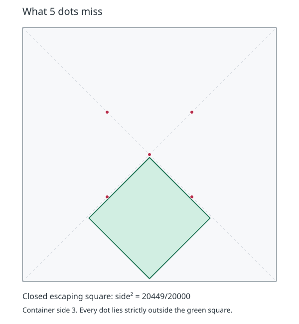

# Stromquist’s 1984 Memos and Systematic Dots Proofs

**Status:** source review, independently reviewed derivations, and finite controls
complete. All 66 full-checkpoint steps passed at `dd92b2a0`; final source and record
deltas receive pre-push validation.\
**Owner:** `think-7u4s`.\
**Entry:** W1 source survey, W2 factual review, W3 mathematical synthesis, then W7
commissioning of a finite incidence control.

Walter Stromquist’s three memoranda were retrieved on August 24, 2026, and archived as
PDFs, unaltered OCR, and checked reading aids.
His correspondence, supplied by the project owner, prompted this review of what the
memoranda establish, what they assert, and what this project has independently verified.

## The Author’s Clarification and the Historical Corrections

In a subsequent note supplied by the project owner on September 7, Stromquist clarified
that his intended small improvement was the twenty-six-square packing in Memo III. He
also said that the comparison could be mistaken and that he had not checked his
eighteen- or twenty-six-square packings against Friedman’s page.
This supersedes the earlier inference in this review that he meant the eleven-square
chronology. The
[dedicated n=26 verification](research-2026-09-07-stromquist-n26-verification.md) checks
the construction and the current catalogue independently.

The chronology correction remains supported by the source.
[Memo III](../../../packing/resources/papers/stromquist-1984-packing-unit-squares-inside-squares-iii-cases-through-65-and-gardner-conjecture.pdf),
dated November 15, 1984, states on printed page 10 that general packings require

$$
s(11)\geq 2+\frac45\sqrt5=2+\frac4{\sqrt5}\approx3.788854382.
$$

The parenthetical passage states the unrestricted result and says the preceding
restricted-orientation argument can be adapted; it does not supply that general proof.
The journal presentation appeared in 2003. The chronology is therefore *stated in 1984,
published in 2003*. The scan, rather than the damaged OCR, was checked for this formula.

The long research report already acknowledged the 1984 assertion, but the README and
explainer’s introductory chronology did not.
The project owner identified the current [explainer](https://jlevy.github.io/squares/)
as the version Stromquist almost certainly read.
The live page retrieved on September 7 carried `DRAFT v0.2.1-dd36800e` and the same two
chronological shortcuts as the local baseline `07e82d1e`: a first improvement in 23
years and the statement that Stromquist settled ten squares in 2003.

The ten-square date also needs correction.
[Memo II](../../../packing/resources/papers/stromquist-1984-packing-unit-squares-inside-squares-ii-ten-unit-squares.pdf)
is dated October 15, 1984, and gives the ten-square proof.
Its journal presentation appeared in 2003. Unlike Memo III’s unrestricted eleven-square
aside, Memo II contains the argument itself.

## Other Information Recovered

| Item | Source and finding | Disposition |
| --- | --- | --- |
| Independent eleven-square construction | Memo III, pp. 2–4, credits Mats Gustafsson and Magnus Thulin and cites Gardner’s November 1980 column | Add this credit to the explainer’s construction note. Retain Trump’s 1979 attribution, supported separately by his archived 2023 author note. |
| Six-square proof | Memo I, pp. 13–19, excludes adjacent isolated marks using a segment-length budget of `1/2`, then forces four of eight final marks into one box | Expand the reading aid and commission the finite allocation checker described below. |
| Variable points and alternative covers | Memo II, pp. 10–15, replaces marks and forces intersections with short segments before its last cover | Include this mechanism in the research synthesis; it supports branch-dependent covers and witnesses that vary along a segment. |
| Restricted eleven-square proof | Memo III, pp. 6–10, uses localization, a forced triple and a twelve-point cover at `2 + (4/3)sqrt(2)` | Preserve its `0°`/`45°` restriction; it is not the unrestricted `s(11)` bound. |
| Small-case history | Memo III, p. 6, describes `n=14,15,24` as elementary and credits Bajmóczy for `n=7`; pp. 2–5 present then-new `n=18,26` constructions | Preserve these as historical claims and constructions. They do not replace the current frontier or certify an omitted proof. |
| Source formula slips | Memo I, p. 8, reverses a monotonicity word; Memo II, p. 8, typesets a sum where its preceding equation and figure use a product | Add page-local reading notes. Preserve original PDFs and raw OCR. |
| The 2003 proof defects | None of the three memos supplies the repaired unrestricted Figure 14 coordinates. Memo II’s numerical table uses a different parameter from the later erroneous row | Keep the project’s one-coordinate repair source-distinct; do not substitute a different table row as its correction. |
| Our case-proof descriptions | Several case summaries substituted generic pure dots counting for the cited geometric arguments | Correct the descriptions for `n=6,7,8,14,15`, preserve each established bound and its verification status, and reconnect three cases to the already archived El Moumni source. D-479 records the shared error. |

All 47 scanned pages were visually inspected.
The [archive index](../../../packing/resources/README.md) links the expanded reading
aids; the
[independent incorporation review](../reviews/review-2026-09-07-stromquist-incorporation.md)
ranks the possible hints.
The historical corrections change attribution and exposition, not the numerical bounds
or verification classifications.

The case-description audit supplies further examples of the helper mechanism.
Kearney–Shiu §3 uses two seven-point unavoidable lattices and geometric cases for six
squares. El Moumni’s intended seven-square proof, printed pp.
282–288, starts with four marks, localizes escaping squares, and uses segment lengths;
its known printed defects D-344 through D-347 remain, and the case retains independent
Nagamochi evidence. For eight and fifteen squares, El Moumni’s Proposition 3 and §3, pp.
288–289, use parallel-segment intersection lengths.
Friedman gives separate pure point-cover proofs in DS7, Theorems 3 and 4. His
fourteen-square proof, Theorem 8 and Figures 31–33, uses twelve almost-unavoidable
points, five geometric cases and conditional covers.
The twenty-four-square description is supported by his explicit twenty-three-point cover
in Theorem 5 and Figure 27. The corrected
[case records](../../../packing/frontier/README.md) identify these routes without
treating a source-method correction as a new proof.

Memo III, pp. 2–5, labels the eighteen-square construction `(7 + sqrt(7))/2` new; the
current source register credits Pertti Hämäläinen in 1980 for the same value and
arrangement. The
[subsequent source audit](research-2026-09-07-stromquist-n26-verification.md) resolves
this as independent rediscovery: Gardner’s later account and Ellsworth’s catalogue
metadata acknowledge Stromquist’s 1984 construction while preserving Hämäläinen’s
earlier priority.
The memo’s twenty-six-square construction, approximately `5.650629`, is
larger than Friedman’s 1997 `(7 + 3sqrt(2))/2`, approximately `5.621320344`. Ellsworth’s
[historical catalogue](https://kingbird.myphotos.cc/packing/squares_in_squares__compared.html)
already credits the cubic-root construction to Stromquist in 1984 and lists the later
Friedman improvement alongside it.
The [follow-up verification](research-2026-09-07-stromquist-n26-verification.md)
addresses the author’s clarification; the current upper bound remains unchanged.
The current attributions are supported by
[Friedman’s survey, Figures 7 and 9](https://erich-friedman.github.io/papers/squares/squares.html).

## From Helper Arguments to Reusable Proof Components

The [mathematical review](../stromquist-helper-arguments-math-review.md) derives the
conditional weighted counting lemma and maps it to existing eleven-square work.
It separates three components: geometry constrains which marks can lie together, a
finite allocation calculation keeps all possible cases, and a final cover supplies a
counting contradiction.
The new code makes the middle and final arithmetic components reusable.

Under Memo I’s named geometric premises, the exact enumerator recovers four allocations
forming one dihedral orbit.
Removing the premises exposes additional allocations; the retained
[control output](../../../packing/cases/stromquist/memo1-incidence.json) records them
all. The surviving allocation forces the geometric question onto one center block.
Assuming its additional two forced marks and the final eight-point cover, the occupancy
calculation returns five as the maximum possible block count.
This is a conditional reproduction of the finite argument, not an independent replay of
the memo’s geometric lemmas.

A further
[independent segment-helper derivation](../reviews/review-2026-09-07-stromquist-segment-helper.md)
now proves the local adjacent-singleton exclusion, Memo I’s Lemma 8. One square must
occupy more than `1/2` of two critical segments; the neighboring square leaves less than
`1/2` in the complementary components connected to the first square’s dot.
Convexity and disjointness give the contradiction.
The proof covers independent orientations, axis endpoints and strict boundary
inequalities, and avoids relying on the source figures’ contact-normalization arguments.
A second mathematics reviewer and the coordinator checked the complete case split.

Any feasible unconditional weighted covering measure can be averaged over the eight
symmetries of the container without changing its total mass or weakening any covering
inequality. For that unrestricted weighted problem, dropping symmetry alone cannot
improve the optimum.
A fixed site catalogue or a bound on the number of atoms is a separate restriction.
The
[independent review](../reviews/review-2026-09-07-stromquist-incorporation.md#why-removing-symmetry-alone-is-insufficient)
gives the complete averaging argument.

The email’s no-pure-dots observation concerns unweighted hitting sets with at most five
points. The independently reviewed
[five-point obstruction](../reviews/review-2026-09-07-n6-pure-dots-obstruction.md) and
its
[quantitative refinement](../reviews/review-2026-09-07-n6-quantitative-piercing-bound.md)
establish the following statement for arbitrary point placements:

$$
L\ge L_0=\frac{12+2\sqrt2}{5}\approx2.965685425
\quad\Longrightarrow\quad
\text{every five-point set in }[0,L]^2\text{ misses an open unit square.}
$$

Thus ordinary five-dot counting cannot prove the sharp six-square bound by approaching
container side three from below.
This proves a precise version of the limitation Stromquist described.
The proof is this project’s derivation prompted by his email; his original unpublished
argument and its priority have not been recovered.
The threshold is sufficient, not claimed optimal, and the statement does not exclude
fractional weighted certificates.

A rational version supplies a constructive control: every five-point set in `[0,3]^2`
misses a **closed** square of side at least `101/100`. The
[exact witness constructor](../../../packing/cases/stromquist/five_point_obstruction.py)
enumerates the finite translation-event partition for axis-aligned squares and then
tries four fixed diamonds.
It verifies the returned square and every separation in rational arithmetic.
The retained
[JSON controls](../../../packing/cases/stromquist/five-point-obstruction.json) test
representative branches; the continuum theorem rests on the written case proof, not
these finite examples.
The sharper endpoint above uses open diamonds and is a separate analytic result.

Bašić and Slivková’s published piercing bound supplies an upper bound of seven near side
three. Combined with the derivation above, this gives `6 <= π(U_L) <= 7` on `[L_0,3)`,
where `U_L` is the family of open unit squares contained in the side-`L` container.
Their exact-side value `π(U_3)=9` does not apply below three.
The quantitative review derives the interval from their Theorem 7 and records the
checked literature. No new packing lower bound follows from this piercing obstruction.

## Work Allocation

Each planned slice was allotted at most thirty minutes.
These estimates set no scientific budget or expectation of a new bound.

| Slice | Output | Owner |
| --- | --- | --- |
| Source review | Verify the author’s links, inspect all three memos, deepen the archive’s reading aids, and rank possible small revisions | Source reviewer |
| Paper audit and synthesis | Correct the current historical claims; classify pure, weighted, and conditional dots arguments against existing research | Coordinator and independent paper reviewer |
| Conditional control | Implement and review the finite incidence part of Memo I’s six-square proof, with its geometric premises explicit | Mathematics worker and independent reviewer |
| Integration | Retain the control output, explain the next mathematical dependency, format the documents, and run applicable validation | Coordinator |

The campaign handoff remains in force: H-124’s fixed collision-augmented near-axis
representation has no allocated retry or sweep, and the H-114 feature assessment remains
the selected next step.
This six-square control launches no eleven-square target experiment.

## Commissioning Criterion and Outcome

The criterion fixed before implementation required the control to enumerate Memo I’s
finite allocations under explicitly named geometric premises and recover exactly one
orbit under square symmetries.
It then had to check that an unavoidable set of eight distinct sites, four consumed by
one forced box, allows at most `1 + (8 - 4) = 5` pairwise disjoint boxes.

An independently written enumeration had to agree, and premise-removal controls had to
expose the additional allocations excluded by the helper premises.
The control had to distinguish unused sites from sites allocated to a box and reject
invalid incidences or overlapping ownership.

The control met this criterion: four allocations, one dihedral orbit, agreement with an
independent enumerator, and additional allocations under each removed premise.
The exact occupancy calculation gives five; replacing the forced four-site block by
three sites gives six, demonstrating the helper’s necessary extra consumption.

**Evidence limit:** the incidence control does not independently prove the geometric
lemmas or improve a packing bound.
The five-dot obstruction is a separate analytic derivation.
A complete geometric replay remains a dependency.
No campaign hypothesis receives a mathematical verdict from commissioning.

## Follow-up Dependencies

The local segment helper is proved analytically.
Making it executable requires exact segment clipping, the component accessible from the
distinguished dot, wall and facet inequalities, and universal positivity checks.
The full Memo I replay also needs Lemmas 6–7, its assertion about exactly two covered
marks, the center-block implication `EH => EHJK`, and the final eight-point cover.
These remaining dependencies are tracked as `think-0krc`. They lead toward a validated
helper component for later pairwise or conditional weighted searches.

Stromquist’s later note resolves which small revision he intended, and the
[n26 review](research-2026-09-07-stromquist-n26-verification.md) also resolves the
eighteen-square construction’s independent-rediscovery attribution.
The remaining historical questions are the intern’s name and the original no-pure-dots
argument; whether the unrestricted eleven-square adaptation was written down before
2003; and whether further memos or proofs of the briefly asserted small cases survive.
These historical questions are not premises of the results above.

Memo III, p. 12, proposes a fourth memorandum on asymptotics or computerized searches
only *if it is written*; no fourth memo was located.
His publication page labels the series “1984–85,” although all three linked title pages
are dated 1984. Whether that range refers to an unlinked note or revision remains open.

<!-- This document follows common-doc-guidelines.md.
See github.com/jlevy/practical-prose and review guidelines before editing.
-->
