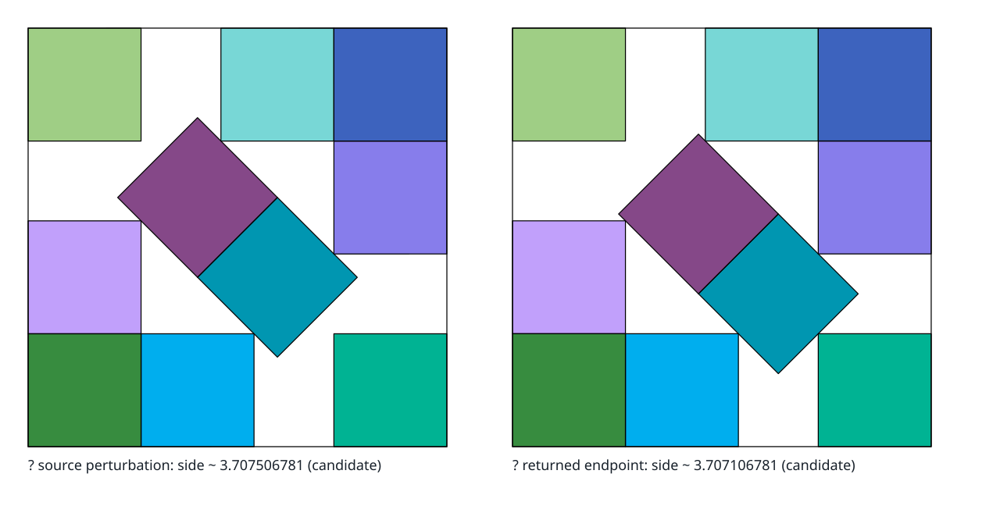

# Square Packing

A self-contained project directory: the research reports, the local archive of the
literature they cite, the exact verifier and search engine, and the experiment record of
running them.

`s(n)` is the side of the smallest square holding `n` non-overlapping unit squares.
The motivating case is `n = 11`, the smallest instance of this problem that is still
open. Its best-known packing dates from 1979. The familiar lower-bound value was stated
in 2003, but
[exp-016](campaign/series/series-000-smoke-and-calibration/experiments/exp-016-h-010-stromquist-printed-figure14.md)
finds an exact gap in the printed proof;
[exp-017](campaign/series/series-000-smoke-and-calibration/experiments/exp-017-h-041-stromquist-repaired-figure14.md)
certifies a source-distinct repair of the same inequality.
Roughly `0.088` in side length remains between that bound and the 1979 construction.


*Walter Trump’s 1979 construction: six axis-aligned squares around a five-square oblique
block. Translucent tempered-yellow segments and dots mark exact edge and point contacts.
It is a certified upper bound, not a proof of optimality.*

Work is organized at three levels.
Four **operating principles** define what quality means and which concerns may veto
promotion. Six **workflow entry points** define the purpose and durable output of one
phase of work. A bounded **slice** is the smallest action taken inside that phase.
Keeping these levels separate lets an agent emphasize one dimension without silently
changing the kind of work it promised to do.
The focus is primary, not exclusive: the other three principles continue to constrain
and contribute to the phase.

**New here?** [`TUTORIAL.md`](TUTORIAL.md) is the first-principles orientation: what the
objects are, why the approach is shaped the way it is, and what is established versus
open. Read it once, then [`SYNOPSIS.md`](SYNOPSIS.md) for the state of the program.

## Operating Principles

Successful research here is the result of four principles held in balance.
None can stand in for another, and each has a preeminent goal:

| Principle | Agent focus | Preeminent goal |
| --- | --- | --- |
| **Correctness** | Soundness | Formal validation checkable by third parties, and cross-validation of every claim and report against known research—accurate surveys of prior work included |
| **Process** | Discipline | Operational discipline: results delivered efficiently, priorities balanced, and every piece of work traceable to what happened and when |
| **Insight** | Creativity | Extreme freedom to understand the problem creatively and to form a wide range of hypotheses, using all available information and tooling |
| **Efficiency** | Infrastructure | Iteration on every layer of the stack, as fast as possible, through efficient algorithms and systems engineering |

Balance carries one asymmetry.
Correctness and process hold vetoes—no claim is promoted past its evidence, and no round
counts if it cannot be reconstructed—while insight is never blocked from proposing, and
efficiency may never relax either control to go faster.

### Workflow Entry Points

Choose the workflow whose promised output matches the work, then choose the operating
focus that will judge it.
The full entry, exit, and transition contracts live in the
[synopsis](SYNOPSIS.md#workflow-entry-contracts).

| ID | Workflow | Enter when | Durable result | Usual handoff |
| --- | --- | --- | --- | --- |
| W1 | `research-pass` | The source record or research document is incomplete | Corrected research prose, source notes, and explicit gaps | W2 |
| W2 | `factual-review` | Existing claims need a correctness-only audit | Findings, authorized bounded corrections, or defects; no new theory smuggled into the review | W3 or W4 |
| W3 | `insight-iteration` | Current evidence needs new explanations or hypotheses | Candidate `X-NNN`/`H-NNN` items with mechanisms, falsifiers, and information value | W6 |
| W4 | `process-review` | Work is hard to reconstruct or the discipline itself needs review | Process findings, beads, and narrowly scoped contract or check changes | W5 or the next owning workflow |
| W5 | `efficiency-loop` | A measured bottleneck limits useful iterations | A baseline, profile, equivalence-safe change, and measured decision | W6 |
| W6 | `research-loop` | A registered hypothesis has a fixed criterion, regime, budget, and instrument contract | A frozen instrument and one or more `exp-NNN` records, raw evidence, verdicts, and a current ledger | W2 for promoted or high-risk claims; otherwise W3 or another W6 slice |

Bounded implementation stays inside the workflow that owns its promised result: W1 or W2
may correct research prose, W3 may implement a bounded exploratory derivation or
visualization without spending an undeclared experiment budget, W4 may repair a process
contract, W5 may implement a measured speedup, and W6 may build or repair the instrument
for its registered round before measurement begins.
Use `general-improvement` only for genuine repository maintenance whose output belongs
to none of W1–W6. It is not a core-work catchall or permission to mix several purposes
without checkpoints.

One workflow phase is active at a time in each independently tracked agent session.
It declares a workflow, one primary focus, an objective, expected output, validating
command, kill condition, fallback, start, and deadline.
Other principles still constrain the work.
Actual outcome and evidence are recorded when the phase closes.
Start a new phase when the workflow or focus changes; a focus-only change may repeat the
same workflow and is not a workflow switch.
Switch only at a planned or evidence checkpoint, on a user request, or when the active
premise is falsified.
Close the prior phase with its evidence, stop reason, and next action before opening the
next.

### W6: The Research Loop

W6 is the recurring experiment loop that turns a registered hypothesis into durable
evidence. It is the final research work, not an umbrella name for every kind of session:
creative execution is expected inside the registered question, criterion, regime,
budget, and stop rule, but those constraints stay fixed for the round.

```
W3 insight iteration ──> H-NNN ──> W6 research loop ──> exp-NNN + raw evidence
        ^                                      │                    │
        └──────── successor hypotheses <── W2 factual review <─────┘
```

W1 keeps the research record complete enough to orient the loop.
W4 improves its discipline, and W5 removes measured bottlenecks.
W6 itself does not change a criterion, repair the process, or invent a replacement
hypothesis mid-round.
It executes the preregistered question under a declared budget, records every outcome,
and stops at the criterion or clock.
An independent W2 pass is required before a promoted, novel, disputed, or otherwise
high-risk claim moves forward.
Routine W6 rounds whose preregistered guards and independent replay already decide the
stated criterion may proceed directly to W3 or another W6 slice.
The [campaign runbook](campaign/README.md) owns those mechanics; the agenda orders ready
cells, and the [ledger](campaign/ledger.md) is generated from the artifacts rather than
typed.

### Work Units at a Glance

The [synopsis](SYNOPSIS.md#work-units-and-records) owns the exact vocabulary.
The short hierarchy is:

| Unit | Meaning |
| --- | --- |
| Packing exploration | This self-contained project directory: research, code, sources, and records |
| Campaign | The durable, multi-session square-packing research program and its shared record contract |
| Series | One campaign-wide tooling regime and comparability boundary; `series-000` is a documented legacy exception awaiting migration |
| Agent session | One bounded interval of orchestrated work, containing one or more workflow phases |
| Workflow phase / slice | One declared purpose and focus / one time-bounded action inside it |
| Hypothesis / experiment | One falsifiable claim / one durable recorded round testing it |
| Run / result / ledger | One tool invocation / one typed observation / the generated view of the record |

### The Record, by ID

Every artifact the loop touches carries a typed id.
The one-line meanings; [`conventions.md`](conventions.md) is the definitive registry of
every id class and naming rule, and [`SYNOPSIS.md`](SYNOPSIS.md#terminology) carries the
full definitions:

| Id | Names |
| --- | --- |
| `H-NNN` | A registered hypothesis or open question, with its criterion and budget written before measurement |
| `X-NNN` | An exploration report: the recorded idea source hypotheses are mined from |
| `exp-NNN` | One experiment: the durable artifact for one research round, which may aggregate several raw runs |
| `series-NNN` | One campaign tooling regime; experiments also record their narrower subject and provenance |
| `session-NNN` | One agent session: entry workflow, ordered phase history, budget, evidence, stop reason, and handoff |
| `agenda-NNN` | One mutable coordination queue ordering bounded cells by dependency and readiness |
| `BC-NNN` | One cell in an agenda’s priority queue, currently the basin-map confidence ladder |
| `D-NNN` | One defect: what went wrong, what caught it, and what now stops it recurring |
| `T-N` | The synopsis’s shorthand for a theoretical result established in this repository |
| `think-xxxx` | One bead: a tracked work item in the `tbd` queue |

### Essential Terms

The eight words a reader meets everywhere here, in one line each;
[`SYNOPSIS.md`](SYNOPSIS.md#terminology) owns the full definitions:

| Term | Means |
| --- | --- |
| **configuration** | A placement of all `n` squares plus the container side: `3n + 1` coordinates |
| **cell** | A choice of separating axis and order for every pair of squares; at fixed angles, one cell is one linear program |
| **quench** | The deterministic refinement carrying a configuration to a local optimum |
| **basin** | For a fixed deterministic quench, the preimage of one returned pose; this point-basin can split one connected terminal component |
| **polish** vs **exploration** | Refining within the basin you are in, versus reaching a different one |
| **standing best** | The best side ever published for that `n`—an upper bound, not known optimal in open cases |
| **gap** | `best_side − standing_best`, always signed |
| **evidence tier** | What a number may claim: `f64_screen`, `polished`, or `exact`—and a record only at `exact` |

The operating documents divide ownership rather than repeat one another:

| Document | Owns |
| --- | --- |
| This README | Operating principles, the compact workflow selector, and repository orientation |
| [Synopsis](SYNOPSIS.md#workflow-entry-contracts) | Full workflow contracts, work-unit vocabulary, transitions, and current technical state |
| [Campaign runbook](campaign/README.md#the-bounded-research-cycle) | W6 experiment mechanics, portable slice protocol, clocks, result routing, and refusal rules |
| [Agent sessions](campaign/agent-sessions/README.md) | Versioned objective, entry workflow, phase history, budget, evidence, stop reason, and handoff |
| [Basin confidence ladder](campaign/agendas/agenda-001-basin-confidence-ladder.md) | Mutable, size-by-size priority queue separating tool validation, measurement validation, and genuine research |
| [Current launch agenda](docs/project/specs/active/plan-2026-08-23-overnight-cartography-run.md) | Broader scientific and operational readiness; the agent loop can work now, while the generic numerical runner remains a no-go |
| [Program review](docs/project/reviews/review-2026-08-23-square-packing-program-and-pr14.md#the-epic-and-its-bead-map) | Four-focus epic, durable findings, and bead map |

## The Autonomous Work Loop

The outer loop is a portable repository protocol, not a feature of one agent platform.
The `tbd` queue owns ready work; an
[agent-session artifact](campaign/agent-sessions/README.md) owns the current workflow
phase, primary focus, objective, clocks, and delegation evidence; commits and research
artifacts own the results.
Changing agents changes the driver, not the work.
Mechanical delegations inherit that phase unless they open independently tracked
sessions.

Breadth lives in [`campaign/ideas.md`](campaign/ideas.md), the hypothesis registry, and
the bead queue. At session entry, declare the workflow, primary focus, expected output,
validation command, kill condition, fallback, start, and deadline; narrowness then lives
in one slice at a time, with hard clocks.
At a checkpoint, close the phase before changing purpose or focus so the ledger can
summarize what kinds of work actually occurred.
The slice protocol, clocks, result routing, budgets, and stop rules are the campaign
runbook’s [bounded research cycle](campaign/README.md#the-bounded-research-cycle); which
validation loop to run at each step is
[`conventions.md`](conventions.md#10-what-the-gate-actually-enforces).
[`packing-campaign`](src/sqpack/campaign/runner.py) stays the smaller tool that executes
already-preregistered numerical rounds, never a second project manager.

## Layout

```
explorations/packing/
├── TUTORIAL.md             First-principles orientation for a newcomer: the objects,
│                           why the approach is shaped this way, what is established
├── SYNOPSIS.md             The technical root: results, status, and the experiment
│                           roll-up. Read this after the tutorial.
├── conventions.md          Every rule this directory runs on, and which are checked
├── development.md          Python 3.14 setup, maturity boundaries, validation loops,
│                           CLI policy, and the refactoring workflow
├── docs/project/           Reports, reviews, specs, postmortems, and historical
│                           handoffs; active specs and the campaign agenda own priority
├── docs/project/research/  The six research reports (see below)
├── campaign/               The experiment record: hypothesis registry, series, rounds,
│                           and a generated ledger. See campaign/README.md.
├── frontier/               What is known about s(n) for every n <= 100: one
│                           schema-validated artifact per case, plus editorial.
│                           See frontier/README.md.
├── golden/                 Stored calibration endpoint snapshots for small PROVED
│                           cases. Mathematical oracle checks are distinct from the
│                           provisional discovery rows
├── atlas/                  Endpoint-observation schema and deterministic SVG gallery.
│                           See atlas/README.md.
├── resources/              Local archive of the primary literature: papers and web
│                           sources, each kept as original, cleaned .md, and raw
│                           extraction. See resources/README.md.
├── src/sqpack/             Maintained package; dependencies flow downward only
│   ├── field.py            E3 exact arithmetic and sign certification
│   ├── verify.py           E3 independent exact/float packing verification
│   ├── render/             E2 deterministic SVG model, safe serializer, visual
│   │                       tokens, static views, exact overlays, and CSS motion
│   ├── research/           E2 quench, canonical identity, atlas, and recognition tools
│   ├── campaign/           E3 campaign state machine and generated ledger
│   └── cli/                Stable, self-documenting command entry points
├── cases/                  E1 retained code scoped to a named n, source, theorem,
│                           hypothesis, or campaign smoke experiment
├── devtools/               Developer-only checkers, source adapters, SVG generators,
│                           and mutation controls
├── benchmarks/             Explicit performance probes, outside the runtime package
├── tests/                  Fast behavior, command, and architecture contracts
├── sqsearch/               Tier-1 screening annealer (Rust)
├── defects.yaml            the defect logbook: every bug and record defect found here
├── defects.schema.yaml     its contract, enforced in the gate
├── defects.md              generated from defects.yaml; never edited by hand
└── frankensim-probe/       two experiments run against Jeffrey Emanuel's FrankenSim,
                            asking whether its certified-arithmetic and RNG layers help
                            here (see that directory's README)
```

## Rendering Packing Figures

`sqpack.render` turns retained pose arrays and exact constructions into deterministic,
self-contained SVG without adding a runtime dependency.
The base overview is compact enough for ordinary Markdown, HTML, Word, PDF, and slide
documents.
Comparison and trajectory views are opt-in; animation is enabled only inside a
`prefers-reduced-motion: no-preference` media query, so unsupported or reduced-motion
renderers show the useful final packing.



*The comparison view holds both panels to one geometric scale.
This retained `n = 10` event is a numerical source-return control, so the figure labels
it as a candidate rather than silently promoting it to an exact proof artifact.*


*The larger `n = 29` example exercises the full 20-color sequence and deterministic
reuse on 29 squares.
It is reconstructed at 160 decimal digits and passes all 406 pairwise separating-axis
checks, so the renderer calls it a verified construction—not an exact certificate or a
proof of global optimality.*

The renderer preserves the input’s evidence tier.
Its caption and metadata distinguish candidates, verified constructions, certified upper
bounds, and proved optima; typography cannot upgrade a numerical candidate.
Exact annotations retain algebraic or rational source expressions in SVG comments and
namespaced metadata while using stable high-precision decimal projections for geometry.
The container and every packed square use the same thin pure-black boundary, so a
contact cannot look like a white gap.
The deterministic 20-color cool palette gives the first eleven square IDs deliberately
separated hues and values, then reuses the fixed sequence for larger packings.
Exact-source adapters attach certified contact geometry: 60%-opaque tempered-yellow
segments show shared boundary intervals, and dots in the same reserved highlight color
show point contacts.
Each mark is clipped to its participating square interiors and sits above the square
fills and below the black outlines.
This layer is shown by default, can be removed with `--no-contacts`, and is never
guessed for numerical candidate poses.

See the [SVG gallery README](atlas/rendering/README.md) for API and CLI examples,
retained fixtures, byte sizes, portability review, and the raster-golden decision.
The [gallery manifest](atlas/rendering/manifest.json) joins each artifact to its
frontier case, evidence tier, view level, motion support, alt text, and exact
regeneration command.
From this directory:

```bash
uv run --frozen --all-extras --group dev python -m devtools.render_packing_gallery --list
uv run --frozen --all-extras --group dev python -m devtools.render_packing_gallery --update
uv run --frozen --all-extras --group dev python -m devtools.render_packing_gallery --check
```

The focused read-only gate is:

```bash
uv run --frozen --all-extras --group dev packing-validate --only "deterministic SVG rendering"
```

## What Has Gone Wrong Here

[`defects.md`](defects.md) is the logbook: every bug, inefficiency and record defect
found in this toolchain, what caught it, and what now stops it recurring.
It is generated from [`defects.yaml`](defects.yaml) and checked in the gate.

It is kept because the aggregate says things no individual bug report can, and two of
those things shape how this directory works:

- **The dangerous defects flatter.** Most soundness failures found here pointed in the
  direction that looks like success, which is why a run that beats the record is treated
  as a bug until proved otherwise.
- **The automated gate is not where soundness failures have been found.** No soundness
  defect in the log was caught by it.
  The rest came from control cells whose answers were known in advance, rules written
  down before the measurement, generated views contradicting their sources, and careful
  reading. Gates confirm what someone already thought to check.

The counts live in [`defects.md`](defects.md), which is generated, and in
[the synopsis](SYNOPSIS.md#the-defect-record), which is reconciled against the same
source in the gate. They are deliberately not repeated here: this paragraph carried them
before, and copied aggregates repeatedly went stale.

## Conventions

[`conventions.md`](conventions.md) is the definitive registry of every convention and
naming this directory runs on: the id scheme across all layers, file naming, artifact
discipline, the evidence tiers and what each may claim, provenance, corrections, and
which rules are machine-checked versus which rest on care.
Read it before adding an artifact, a round, or a tool.

## Reports

Written to be read in this order.
They move from what is known, to how it is computed and checked, to what to build, to
where a proof assistant fits, and finally to how to search: the strategy the tooling
exists to serve.

| Report | Scope |
| --- | --- |
| [Packing 11 Unit Squares in a Square](docs/project/research/research-2026-08-22-packing-11-unit-squares.md) | The mathematics of `s(11)`: what is proved, what is only conjectured, and why the available proof technique cannot close the gap |
| [Algorithms and Tooling for Square Packing](docs/project/research/research-2026-08-22-square-packing-algorithms-and-tooling.md) | How packings are searched for, refined from numerical to exact algebraic form, and verified; who holds the records and with what |
| [FrankenSim as a Rust Toolkit for Square Packing](docs/project/research/research-2026-08-22-frankensim-rust-toolkit-for-square-packing.md) | First-hand study of a large Rust simulation framework as a source of certified-arithmetic and determinism building blocks |
| [Infrastructure for Square-Packing Exploration](docs/project/research/research-2026-08-22-infrastructure-for-packing-exploration.md) | Synthesis of the two above into a build order: three latency tiers, the language boundary, which symbolic layer to use where, and what to deliberately not build |
| [Lean for Square-Packing Proofs and Validation](docs/project/research/research-2026-08-22-lean-for-packing-proofs-and-validation.md) | Where a proof assistant fits: the upper bound is formalisable today and unclaimed, the lemma layer is the diagnostic first target, and certificates make a result checkable by someone who does not trust our code |
| [A Search Philosophy for Square Packing](docs/project/research/research-2026-08-23-search-philosophy-and-landscape-cartography.md) | The strategy layer: why volume-weighted search fails precisely at records, the basin atlas over the LP-quench map as the deliverable, diversity over structural descriptors instead of loss-shaping, the LLM at the structural layer, and relaxation ladders into the hard instances |

These six are the research reports.
For the full document set, including the reviews, the postmortem, the campaign runbook
and what each one owns, see the synopsis’s [document map](SYNOPSIS.md#document-map).

The structured record of the problem’s frontier, meaning the best known packing and best
proved lower bound for every `n ≤ 100` with provenance and per-case editorial, lives in
[`frontier/`](frontier/README.md) as soft-schema artifacts rather than as a table inside
a report, so it can be validated and queried.

Claims in the reports are separated by evidential status (proved, computationally
verified, best known, or asserted-but-unverified) and every citation resolves both to a
full reference and to a local copy in [`resources/`](resources/README.md).

The reports have been through a full technical review (2026-08-22): every substantive
claim re-checked against the archived primary sources, the central algebra re-derived
independently at 50-digit precision, and the findings applied to the documents
themselves. Corrections this produced are recorded in the `n = 11` report’s
[Corrections to Common Summaries](docs/project/research/research-2026-08-22-packing-11-unit-squares.md#corrections-to-common-summaries),
its remaining gaps in
[Open Questions](docs/project/research/research-2026-08-22-packing-11-unit-squares.md#open-questions),
and the prioritized path forward in
[A Research Program](docs/project/research/research-2026-08-22-packing-11-unit-squares.md#a-research-program).

## Plan

The implementation plan for the first experiments, meaning search, verify and iterate on
`n = 11` and `n = 12`, is
[plan-2026-08-22-minimal-packing-toolkit.md](docs/project/specs/active/plan-2026-08-22-minimal-packing-toolkit.md).
It turns the six reports into seven phases and a bead tree, one epic per phase;
`tbd list --spec docs/project/specs/active/plan-2026-08-22-minimal-packing-toolkit.md`
shows the work items and `tbd ready` the unblocked subset.

The implemented engineering reorganization and its evidence are recorded in
[Packing Engineering Maturity and Research-Loop Scalability](docs/project/specs/active/plan-2026-08-24-packing-engineering-maturity.md).
[`development.md`](development.md) is the maintained operating guide for that design.

The current standing review,
[review-2026-08-23-toolkit-docs-and-first-experiments.md](docs/project/reviews/review-2026-08-23-toolkit-docs-and-first-experiments.md),
is the historical source of the initial experiment method and `H-001`–`H-015` register.
Once those claims were codified, their registry artifacts became authoritative; use the
[idea board](campaign/ideas.md) and [generated ledger](campaign/ledger.md) for current
status, not the review’s tables.
The review also contains the proof that fixed angles and a fixed cell reduce the problem
to a linear program.
The synopsis records that current result as [T-2](SYNOPSIS.md#the-cell-decomposition),
backed by two independent implementations.

## Exact Verification

Record packings are published as high-precision decimals, and there is no public tool
that checks one **exactly**. `sqpack` is that check.

Why precision is not enough: a record packing has squares touching at exactly zero
separation, floating point can certify a strict inequality but not an equality, and
every tolerance that accepts the true contacts also accepts overlaps smaller than
itself. The argument in full, with what it cost when ignored, is
[Why Exactness Is Not Optional](SYNOPSIS.md#why-exactness-is-not-optional).
`cases.trump11.verifier_limits` demonstrates both failure modes.

### Use

```shell
uv run --frozen python -m cases.trump11.verify_exact
uv run --frozen python -m cases.trump11.verifier_limits
uv run --frozen python -m benchmarks.exact_verification
uv run --frozen python -m cases.trump11.derive_field
uv run --frozen --group dev packing-validate
```

Only `cases.trump11.derive_field` needs the optional symbolic dependency (SymPy).
The verifier itself is standard library only.

`cases.trump11.verify_exact` output:

```
VALID: 11 squares, 55 pairs tested
  container: 20 corner coordinates exactly on the boundary
  pairs:     14 separated with zero gap, 41 strictly
  field:     Q(u), degree 8, u = tan(a/2)
  P(s) == 0 for the published degree-8 polynomial: True
  s = 3.87708359002281417730789706010096270637645566846
```

The 14 zero-gap pairs are the ones no floating-point verifier can certify.
The 33 leading digits match the value published on the
[Squares in Squares](https://kingbird.myphotos.cc/packing/squares_in_squares.html)
record page, so this is also an independent check of that record.

### Verifying Another Packing

Supply the corners in an exact field and call `verify_packing`:

```python
from sqpack.field import NumberField
from sqpack.verify import verify_packing, exact_sign

field = NumberField(min_poly, isolating_interval)  # coefficients high degree first
squares = [...]  # 11 x 4 corners of FieldElements
print(verify_packing(squares, side, sign=exact_sign))
```

The work is in the first line: recovering the field means reading the published exact
data by hand, once per packing, and
[`cases/trump11/packing.py`](cases/trump11/packing.py) is the worked example.

**The result is a proof only if the field metadata is right, and the constructor does
not yet check that** ([D-053](defects.md), open): verify irreducibility and single-root
isolation yourself before trusting a verdict on a field you supplied.
The [synopsis](SYNOPSIS.md#what-is-built) carries the full caveat; the module docstrings
in [`src/sqpack/`](src/sqpack/) carry the maintained APIs, including the fast
non-certifying float backend.

### Scope

This checks that a *proposed* packing is valid, which is a different and far easier
question than whether it is optimal.
The only rigorous computer-assisted optimality proof for rotatable unit squares in any
container covers three squares in a circle (Montanher et al.
2018); nothing comparable exists for squares in a square.

<!-- This document follows common-doc-guidelines.md.
See github.com/jlevy/practical-prose and review guidelines before editing.
-->
