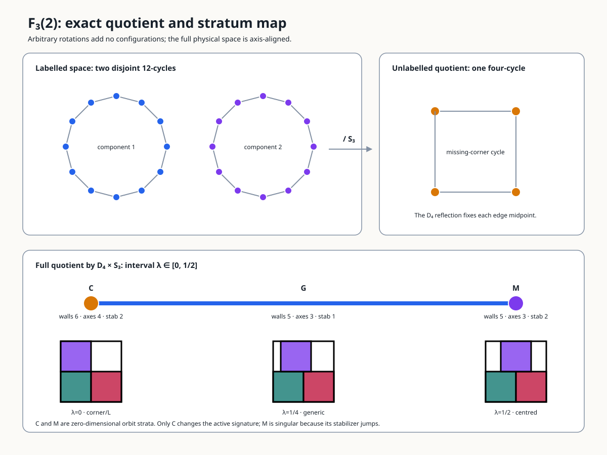

# Tutorial: Square Packing from First Principles

**Audience:** anyone arriving at this directory without a background in the problem.

**Owns:** the conceptual on-ramp—what the objects are, why the approach is shaped the
way it is, and what the research has and has not established.

**Does not own:** the state of the program.
Every result, status, count and verdict lives in [`SYNOPSIS.md`](SYNOPSIS.md), which is
authoritative wherever the two appear to differ.

**Assumes:** no background in the problem.
Four outside ideas do real work here—linear programming in
[§2](#2-the-configuration-space), algebraic number fields in
[§5](#5-algebra-versus-numerics), and certified numerics and symbolic elimination in the
same section.
Each is introduced where it is first needed, and [§11](#11-further-reading)
says where to learn it properly.
[§10](#10-a-notation-card) collects every symbol on one page.

## 1. The Problem

`s(n)` is the side of the smallest square that contains `n` non-overlapping unit
squares, each free to translate **and rotate**. Smallest is exact rather than
approximate: the set of achievable sides is closed, so the infimum is attained and a
best packing exists ([Martin 2000](#11-further-reading)).

Two bounds are immediate:

- **Area:** `s(n) ≥ √n`, because `n` unit squares have area `n`.
- **Grid:** `s(n) ≤ ⌈√n⌉`, by the axis-aligned grid packing.

At `n = 11` those give `3.3166… ≤ s(11) ≤ 4`, and the whole subject lives in that
interval. For a perfect square `s(m²) = m`, since the two bounds meet, and there is
nothing to say about the side value.
Some of the most interesting cases lie just above a perfect square, where improving on
the next grid side can require tilted structure.


*The best-known `n = 11` construction.
Six squares are axis-aligned; five form an oblique block tilted by about `40.18°`.
Segments mark shared edge intervals and dots mark point contacts, all computed in the
construction’s exact number field and clipped to their participating squares.
The picture certifies a construction, not its global optimality.*

Three features make this different from most optimization problems.

**Touching is legal, and good packings touch constantly.** Disjointness is required of
*interiors* only.
In the best known `n = 11` packing, 14 of the 55 pairs are separated by
exactly zero and 20 corner coordinates lie exactly on the container boundary.
Optima are jammed configurations, not interior critical points, which is why exactness
here is representational rather than numerical ([§5](#5-algebra-versus-numerics)).

**Every upper bound in the history of the subject is a construction.** No
non-constructive upper bound has ever been obtained.
So “searching for a better packing” is not one method among several for improving the
upper bound—it is the only one anybody has.

**`n = 11` is the first case where genuinely oblique tilt is proved to improve on the
`0°`/`45°` class.** Stromquist proved that packings restricted to those two orientation
classes cannot beat `2 + (4/3)√2 ≈ 3.885618`, which is *worse* than the best known
packing at `≈ 3.877084`. This is the sharpest available statement of why `n = 11` is
structurally unlike the small proved tilted cases at `n = 5` and `n = 10`. Everything in
[§7](#7-how-the-search-is-approached-and-why) follows from that sentence.

### The state of `n = 11`, in one table

|  | value | status |
| --- | --- | --- |
| best known packing (upper bound) | `3.87708359002281417730789706010096…` | Trump 1979, a construction |
| best lower bound | `2 + 4/√5 = 3.788854382…` | see the note below |
| bound gap | `0.088229208023` | open since 2003 |

Two different quantities get called a gap in this subject, and this document keeps them
apart. The **bound gap** above is the distance between the best upper and lower bounds,
which is what remains unknown about `s(11)`. A **search gap** is
`best_side − standing best`, the signed distance from one packing this project found to
the best one anybody has published, and it is what [§3](#3-cells-basins-and-two-traps)
onward measures. The first is a property of the problem; the second is a property of a
run.

**The lower bound carries a story this project produced.** Stromquist’s 2003 Theorem 2
is the published source, and this repository found that its printed proof is **false as
printed**: an exact open box of side `10001/10000` fits the claimed container and
strictly avoids all twelve printed Figure 14 points.
A separately preregistered, source-distinct repair—moving one point from `(.8, 1.85)` to
`(.79, 1.85)`—restores the whole argument and certifies the same inequality exactly
([exp-016](campaign/series/series-000-smoke-and-calibration/experiments/exp-016-h-010-stromquist-printed-figure14.md),
[exp-017](campaign/series/series-000-smoke-and-calibration/experiments/exp-017-h-041-stromquist-repaired-figure14.md)).
The inequality stands; the printed derivation of it does not.
The synopsis records the repair as **T-4** and the falsification as the round that
terminally refuted the hypothesis it was registered against.

Two lessons in that episode generalize: **a published proof is a source, not an
oracle**, and **the cheapest way to learn something is to try to break a thing you
believe.**

## 2. The Configuration Space

A **configuration** places every square and fixes the container.
Square `i` has a centre `(xᵢ, yᵢ) ∈ ℝ²` and an angle `θᵢ ∈ [0, π/2)`, and the container
has side `s`. Angles stop at `π/2` because a unit square is unchanged by a quarter turn,
so larger angles name poses already counted.

Throughout, a subscript `i` picks out one square and a bare letter is the whole
`n`-vector: `θ = (θ₁, …, θₙ)` is all `n` angles at once, and `x` and `y` are the `n`
centre coordinates each.
So “fix the angles” always means fix all `n` of them.
Counting scalars, a configuration is `3n + 1` real numbers—**34 at `n = 11`**.
[§10](#10-a-notation-card) collects every symbol used in this document.

Read naively this is a 34-dimensional nonconvex problem with `C(11,2) = 55` disjunctive
constraints, and it is not obvious where to push.
The central structural insight of this project is that the naive reading is the wrong
decomposition.

### The cell decomposition

Two convex polygons have **disjoint interiors** exactly when some line separates them,
weakly—touching is allowed, and the separating line may run along the shared edge.
For polygons it suffices to test lines parallel to their edges.
A square has two distinct edge normals, since opposite edges are parallel, so each pair
of squares has four candidate axes, and for each axis a choice of which square lies on
the low side.

> A **cell** of configuration space is a choice, for each of the `C(n,2)` pairs, of one
> candidate separating axis together with an order.
> A configuration *lies in* a cell when those choices genuinely separate those pairs in
> that order.

Four axes times two orders is eight choices per pair, so there are at most `8^C(n,2)`
cells—about `4.7 × 10⁴⁹` at `n = 11`. Most are empty, because the choices must be
jointly realisable by an actual configuration, but even as a crude bound the number says
what kind of difficulty the discrete half carries.

Now fix the angle vector `θ` **and** fix a cell.
Write `Rᵢ` for rotation by `θᵢ`, so the four corners of square `i` are
`(xᵢ, yᵢ) + Rᵢ·(±½, ±½)`, and write `oᵢₖ ∈ ℝ²` for those four corner offsets, `k = 1…4`.
Four things become true at once:

1. Once `θᵢ` is fixed, the offsets `oᵢₖ` are **constants**, so every corner is an affine
   function of the centre alone.
2. Containment is **linear**: each corner satisfies `0 ≤ xᵢ + oᵢₖ,ₓ ≤ s` and
   `0 ≤ yᵢ + oᵢₖ,ᵧ ≤ s`, writing `oᵢₖ,ₓ` and `oᵢₖ,ᵧ` for the two components of `oᵢₖ`.
   Note `s` appears here, and only here, as a variable.
3. Separation along a *fixed* axis is a **linear** inequality.
   For axis `ν` and the order `i` before `j`, every corner of `i` projects at or before
   every corner of `j`: `⟨ν, (xᵢ,yᵢ) + oᵢₖ⟩ ≤ ⟨ν, (xⱼ,yⱼ) + oⱼₗ⟩` for all `k, l`.
   Because the cell fixes both `ν` and the order, there is no absolute value and no case
   split left.
4. The objective is `s` itself, which is **linear**.

So the whole problem, restricted to one cell at fixed angles, is

```
minimise    s
over        x₁…xₙ, y₁…yₙ, s          (2n + 1 variables; 23 at n = 11)
subject to  0 ≤ xᵢ + oᵢₖ,ₓ ≤ s       for every square i and corner k
            0 ≤ yᵢ + oᵢₖ,ᵧ ≤ s
            ⟨ν_ij, (xᵢ,yᵢ) + oᵢₖ⟩ ≤ ⟨ν_ij, (xⱼ,yⱼ) + oⱼₗ⟩   for every pair (i,j)
```

with every `oᵢₖ` and every axis `ν_ij` a constant, determined by `θ` and the cell.
That is the result the synopsis calls **T-2**.

**Why that is good news.** A **linear program** minimises a linear objective over linear
inequalities. Its feasible region is a polyhedron, an optimum is always attained at a
vertex, and the whole class is solvable in polynomial time and very fast in practice—the
solves here take about `1.28 ms`. Two further properties matter later.
The set of constraints holding with equality at the optimum is its **active set**, and
the corresponding **optimal basis** is the subset of them the solver uses to pin the
vertex down; [§4](#4-the-corner) turns entirely on what happens when that basis changes.
And a linear program can be solved *exactly* over rational coefficients, which is why
the floating-point floor in [§5](#5-algebra-versus-numerics) is a limit of the
implementation rather than of the mathematics.
[§11](#11-further-reading) points to a proper treatment.

The solver this project actually calls is **HiGHS**, an open-source high-performance
linear and mixed-integer optimizer, reached through SciPy.
It works in floating point, so it does not return the exact optimum of the cell it is
given—it returns one within a declared **feasibility tolerance**, the margin by which a
returned solution is allowed to violate its own constraints.
That tolerance is where the floor in [§8](#8-what-is-known-and-what-is-not) comes from,
and setting it too loosely once produced a packing that violated its own separation
constraint, and so a side below the standing record.

**All the nonconvexity has been pushed into exactly two places**: the trigonometric
dependence of the offsets and axes on the angles, and the *discrete* choice of cell.
That factorisation—a small continuous part times a large combinatorial part—is the
premise underneath almost everything else here.

Writing the program down is a modelling choice, not a canonical object.
The same feasible set is expressed with one separation row per pair in
`sqpack.research.quench` and with sixteen—one per ordered corner pair—in
`cases.trump11.independent_lp_cell`, which is `1,056 = 16 × (11 + 55)` rows at `n = 11`.
Both are correct, and they share no constraint-assembly code, which is the point.

The check that makes it concrete: read the cell off the exact certificate for the best
known `n = 11` packing (eleven angles and fifty-five axis choices, and nothing else),
rebuild the linear program from scratch, and solve it.
**The centres are never given to the solver**—they are what it reconstructs.
It returns the published side to `4.4e-16` and every centre to `1.3e-15`.

### Thirty-four dimensions become one

An **angle class** is a set of squares constrained to share one angle.
Trump’s packing uses only **two**: six squares at `0°`, and five sharing a single
oblique angle. Call that shared angle `a`, so the full angle vector is
`θ = (0, 0, 0, 0, 0, 0, a, a, a, a, a)` up to relabelling—one free number in place of
eleven.

Hold the cell fixed, vary `a`, and solve the linear program of the previous section at
each value. That defines a function of one real variable,

```
φ(a) = the optimal side s of Trump's cell, with the five tilted squares at angle a
```

so `φ: [0, π/2) → ℝ`, and it is the entire problem restricted to this cell.
Write `a*` for the angle that minimises it.
A `*` marks a distinguished value of a symbol rather than one fixed relation: `a*` is a
minimiser, and `s*` in [§7](#7-how-the-search-is-approached-and-why) is the standing
best for an `n`, which is not known to be a minimum in the open cases.
A 2,001-point scan of `[38°, 42°]` puts the minimum one grid step from `a* ≈ 40.18°`,
Trump’s published tilt.

Trump’s angle is not an input to that computation.
It is **the argument that minimises a one-dimensional function anyone can plot.** In
this particular structured cell, the centres remain LP variables and only one nonlinear
angle parameter remains.
This is evidence that angle-class models can compress record cells dramatically; it is
not a theorem that class count equals the local dimension of the full packing problem.
Other records already use more classes—six, numerically, at `n = 29`—and every proposed
compression must be checked on its own contact structure.


*The reported `n = 29` record is a useful larger-scale check: six orientation classes
across 29 squares. The retained roughly 100-digit source is evaluated at 160 decimal
digits of working precision and passes all 406 pair checks at tolerance `1e-80`; that
numerically checks the construction without verifying it or turning it into an exact
certificate or an optimality proof.*

## 3. Cells, Basins, and Two Traps

The project is most careful here, because both traps were walked into and both cost real
work.

### The quench map

Borrowed from Stillinger and Weber’s *inherent structure* decomposition: the **quench
map** sends a configuration to the pose that a deterministic refinement returns.
A **basin**, or **point-basin** where the distinction matters, is the preimage of one
returned pose. The atlas ultimately wants a coarser, mathematically stable relation on
connected terminal components; the current point keys do not yet provide it.

A quench map is a general notion; this project uses one particular algorithm, and the
specifics matter for what follows.
It has two nested loops, not one.

**The inner loop makes the side a function of the angles.** Given a pose, the cell is
*read off it*: for each pair, take the candidate axis of greatest separation, together
with the sign saying which square is low.
That cell defines the linear program of [§2](#2-the-configuration-space), which is
solved in the `2n + 1` centre-and-side variables.
But the solution may lie in a *different* cell from the one it was solved in, so its
value is an upper bound that depends on where the caller started.
That path dependence would make `s(θ)` ill-defined and leave any angle search optimising
a moving target. So the loop re-reads the cell from the solution and re-solves until the
cell it reads back is the cell it was given—a **cell fixed point**. It can also stop
unsettled, with a typed reason, and an unsettled result is exploratory data rather than
a converged endpoint.

**The outer loop moves the angles.** It works one angle class at a time, minimising each
by golden-section bracketing inside a window that narrows only when a whole sweep fails
to improve.
No derivative is used—deliberately, for the reason [§4](#4-the-corner) gives.
A final optional pass brackets each of the `n` angles individually, to test whether a
class-converged pose is genuinely stationary or an artifact of the tolerance that
decided which angles count as one class.
The sweeps stop when none improves, or a tolerance, sweep cap, or wall-clock budget is
reached.

So: **read the cell, solve to a cell fixed point, bracket the angle classes, repeat.**

The knobs are real—a class-merge tolerance, a window schedule, budgets—and that is
exactly why a basin defined by this map inherits them.
It is also why the free-angle pass exists.
Note too that changing the refiner changes the map, and therefore changes what “basin”
refers to: swapping angle descent for class bracketing, which [§4](#4-the-corner) does,
is a different quench and a different decomposition.

Two derived words carry the project’s central diagnostic:

- **Polish:** refinement *within* the basin you are already in.
  This is what the quench does, and all it does.
- **Exploration:** reaching a *different* basin.
  Nothing in the toolkit does this reliably at `n = 11`.

A gap therefore decomposes into a **polish failure** (right region, weak refinement) or
an **exploration failure** (wrong region, and refinement cannot help).
Which one a number represents **cannot be read off the number**; you establish it by
running the refiner and seeing whether the gap moves.

### Trap 1—a fixed-angle cell solve is not a basin

A cell fixes only the discrete separating axes and orders.
The **fixed-angle LP subproblem** fixes both a cell and an angle vector; a basin does
neither, because the quench may change angles and cross cells.
A configuration can therefore sit at exactly its fixed-angle cell optimum and still be
far from its quench endpoint, with all the remaining gap in the angles and none in the
centres.

The dangerous consequence is a reading that feels safe and is backwards: **a fixed-angle
solve that stops improving has not converged to a local optimum of the problem—it has
run out of things it is allowed to move.** Watching it flatten and concluding “wrong
basin” is exactly what the *right* basin looks like when the residual is angular.

That is not hypothetical.
An agent built a fixed-angle probe, called it “the quench”, and **retracted a correct
finding** when it stalled ([D-029](defects.md)). On one `n = 10` start: the annealer
output and the fixed-angle solve agree to every digit at `+5.6440e-04`, and the full
quench with its angle half reaches `+4.4409e-16`.

The renderer guide retains the
[shared-scale Göbel source-return diagnostic](atlas/rendering/README.md#n--10-numerical-comparison):
the start is close but not settled, while the full quench returns to the proved-side
geometry.

### Trap 2—a point-basin need not be a terminal component

A deterministic quench still returns an individual pose.
The problem is that its local optimum can lie on a connected terminal family, so
point-preimages split the component-level object the programme actually wants to count.

At `n = 3` the exact side-2 optimum contains a connected **sliding family**: centres
`(1/2,1/2)`, `(3/2,1/2)`, and `(t, 3/2)` for `t ∈ [1/2, 3/2]`. One connected optimal
component, infinitely many distinct coordinate keys.
The quench lands wherever in the flat region it happened to enter, and every symptom
mimics a real discovery—distinct coordinates, distinct keys, two rows in the store—while
the side agrees exactly and, along the family’s open stratum, so does the contact
certificate (the wall endpoints carry a different one).

The object that survives this trap has been computed exactly, and the figure below is
its map. `F₃(2)` is the space of *all* packings of three unit squares in the side-2
container—and since `s(3) = 2` is proved, that is the complete optimum space, not a
sample of it. With the squares labelled, the space is two disjoint circles, each a cycle
through twelve discrete states, cross-checked against the published hard-squares
computation of the same space.
Forgetting the labels—quotienting by the symmetric group `S₃`—merges the two circles
into one: relabelling was separating configurations the mathematics does not
distinguish. Quotienting also by the container’s eight symmetries `D₄` folds that circle
to the closed interval `λ ∈ [0, 1/2]`, where `λ = min(t − 1/2, 3/2 − t)` is the slider
parameter above with the reflection `t ↔ 2 − t` divided out.
Three strata remain: the corner pose at `λ = 0`, the generic slide, and the centred pose
at `λ = 1/2`.



*Each quotient stage kills one wrong identity—relabellings and container symmetries are
not new basins—and the interval kills the rest: four exact sample poses with four
distinct geometric keys, two contact signatures, and three strata are one connected
component.*

That is why this object is a permanent known-answer control rather than an illustration.
A frozen component-assignment policy is accepted only if it recovers this interval, and
the `n = 4` quotient point, exactly while rejecting every shortcut:
[exp-032](campaign/series/series-000-smoke-and-calibration/experiments/exp-032-h-021-terminal-component-controls.md)
proposed geometric keys, contact signatures, finite samples, labelled states, and
floating-point matches as component identities, and all seven such mutations were
refused. Passing that gate is what admitted the bounded `n = 5` connectivity work below,
and this map is the only exact ground truth behind open question 1 in
[§8](#8-what-is-known-and-what-is-not).

`n = 3` is small enough to look like a curiosity, so it is worth knowing the same
phenomenon has been pinned down at a size that is not obviously degenerate.
At `n = 5`, two retained poses with different coordinate keys turn out—after one
symmetry action and relabelling—to share a single exact optimal face of one fixed-angle
cell, and that face sits inside an exact two-parameter sheet of optima.
The first-order analysis there admits one direction leaving the sheet, and a
second-order argument then excludes that direction from the true tangent cone.
The remaining directions are unclassified, so this is not a connectivity proof; it is
the strongest exact statement the project has about how sampled endpoints at one open
size actually relate.

The project’s term for this is a **terminal family**, and its definition is deliberately
strict: local dimension is the nullity of the appropriate independent active-constraint
Jacobian, after quotienting symmetries and accounting for inequalities and stratum
changes. **Raw contact counts cannot supply that rank**—contacts may be dependent, one
contact description may encode several scalar conditions, and angles and cells may
change along a motion.
Subtracting contacts from variables is not a rigidity calculation, and the project has a
logged defect for having done it.

### The generalized lesson, learned twice

- **First version.** Whatever defines a basin must be independent of the *search’s* own
  knobs. A quench that merged nearby angles would make “basin” depend on a merge
  tolerance.
- **Second version.** It must also be independent of the *representation’s* knobs, and
  must not presume a structure—discreteness—that the mathematics does not supply.

Both are the same shape as Trap 1: **an object that fixes more than the mathematics
does, mistaken for the mathematics.** The first was written down; the second was
available from the same argument and was not, and that is why it cost more.

## 4. The Corner

`φ(a)` is not smooth at its minimum.
Measuring one-sided slopes and refining the step, both sides converge—to **different**
values near `0.1747` and `0.384` per radian, stable over five decades.
Two independent LP formulations agree: `0.1747`/`0.3839` at a ratio of `2.1973`, and
`0.1747`/`0.3841` at a ratio of `2.198`. **The derivative does not vanish at the
optimum; it jumps.**

**Why.** Where the LP’s optimal *basis* is locally constant, `φ` is smooth and its
derivative reads off the active constraints.
A corner is a **change of optimal basis**—the set of contacts that bind switches as the
angle crosses `a*`.

**What it bought.** Replacing smooth descent with a **bracketing search over merged
angle classes**—a method that tolerates non-smoothness—and changing nothing else took
`n = 5` from descent’s `3.2e-08` to `2.2e-15`, and `n = 10` from `4.5e-03` to `1.3e-15`.
Measured from the annealer output both quenches start from, that is `3.4e-08` and
`5.3e-03` respectively.
All four figures are medians over the five tested seeds; the worst `n = 5` seed stays at
`6.2e-08`.

**What it did not buy.** Nothing at `n = 11`, where the same substitution moves the
annealer’s `8.8e-02` only to `6.3e-02`. And it is *not* a theorem that derivative-free
methods must fail: Powell and Nelder–Mead did worse than descent on the tested starts,
in this implementation, which is method-selection evidence and not an impossibility
result. The kink also lives on a one-dimensional slice, so it is **not** by itself a
rigidity proof for the full packing.

This chain—a measurement, a mechanism, a prediction, and a method built on the
prediction that works—is the campaign operating as designed, and it is the single best
worked example to read in full in the synopsis.

## 5. Algebra Versus Numerics

### Why exactness is not optional

Floating-point evaluation can certify a strict inequality when a sound error bound stays
away from zero.
It cannot infer that an **unrecognised near-contact** is exactly equal to
zero merely because a computed residual is small.

For Trump’s algebraic coordinates rounded to f64, the current float verifier needs a
tolerance to accept the true contacts.
That tolerance is a blind spot that also accepts overlaps smaller than itself; setting
it to zero rejects this true packing instead.
Both failure modes are demonstrated by a negative control in this directory.
**There is no tolerance in this predicate that both accepts Trump’s rounded packing and
rejects all violations**, and raising precision shrinks the blind spot without turning a
small residual into an equality proof.

Generic interval evaluation does not by itself fix this identification problem.
An enclosure lying strictly above zero *is* a proof of strict separation, while a
finite-width enclosure of an unrecognised near-contact normally cannot distinguish exact
zero from a tiny violation.
Structural simplification can produce `[0,0]`, and certified root methods can prove
existence and uniqueness of a solution satisfying contact equations.
What interval evaluation alone cannot do is promote an approximate coordinate residual
to an unknown exact contact.
The final verifier therefore needs an exact representation or an independently certified
equality system, not a contact tolerance.

The fix is therefore **representational rather than numerical**: work in the real
algebraic number field the packing actually lives in, where equality is decidable.

**One predicate, four scalar types.** That fix is affordable because of a property of
the geometry: every quantity the separating-axis test evaluates is a *polynomial* in the
configuration variables—four candidate axes, eight dot products per axis, no divisions
and no square roots.
So a single implementation is correct over `f64`, over intervals, and over an exact
field; only the scalar type and the sign decision change.
The verifier here is written once and instantiated at each, which is why “work exactly”
is a choice about where to spend time rather than a second codebase.

**What it costs, and therefore where to spend it.** Exactness is not uniformly
expensive, and knowing the shape of the cost is what lets you decide:

| Operation | Cost |
| --- | --- |
| Separating-axis pair test, `f64`, compiled | 57 ns |
| The same test, Python float backend | 2,726 ns |
| One `ℚ(α)` multiplication at degree 8, the `n = 11` field, pure Python | 215.5 µs |
| The same, with a compiled bignum backend (benchmarked; not integrated) | 1.2 µs |
| One `ℚ(α)` multiplication at degree 62 | 13 ms |
| Complete exact verification of Trump’s packing, all 55 pairs | 0.35 s |

Two readings. **Exactness is free where it is used**: a whole exact verification costs
less than a second, against seconds for a single agent turn, so optimising it is
optimising noise. **And the cost is not flat**: one exact multiplication climbs from
`215.5 µs` at degree 8 to `13 ms` at degree 62 in pure Python, and even the compiled
backend’s advantage over pure Python grows with degree—`177×` at 8, `578×` at 62—so
exact arithmetic is most expensive exactly where the problem is hardest.
That is the standing reason it stays out of the search loop.

The useful frame is three budgets rather than one.
An *agent* tier at 1–10 s per operation, where a proof or a verification lives and
nothing needs optimising; an *interactive* tier at 10 ms–1 s; and an *inner loop* at 10
ns–1 µs executed `1e9`–`1e12` times, which is `f64` and always will be.
Screen in floating point, refine in floating point, decide in the number field.

### The number field

A **real algebraic number field** `ℚ(α)` is what you get by adjoining one real algebraic
number `α` to the rationals.
The procedure:

1. **Recover the field.** Put the configuration in `ℚ(α)` for a single **primitive
   element** `α`, with a known minimal polynomial `μ` and an isolating interval that
   contains the intended real root of `μ` and no other.
2. **Represent** elements as polynomials in `α` of degree `< deg μ` with rational
   coefficients, reduced modulo `μ`. Arithmetic is exact.
3. **Decide equality exactly.** For an element `β`, `β = 0` exactly when its reduced
   representative is the zero polynomial.
   *This is where touching contacts get certified.*
4. **Decide sign exactly**—evaluate that representative on the isolating interval with
   rational interval arithmetic, bisecting when the enclosure straddles zero.
   This terminates because a nonzero representative of degree `< deg μ` cannot vanish at
   `α`, since `μ` is the minimal polynomial.
5. **Run separation and containment** using only those two decisions.
   No floating point appears anywhere.

For Trump’s packing the field is `ℚ(u)` with `u = tan(a/2)`, of degree 8. A useful
subtlety: `cos a`, `sin a`, `tan(a/2)` and `s` are all algebraic, but **the angle `a`
itself, in radians, is transcendental** by Lindemann–Weierstrass.
The algebra lives in the trigonometric values, never in the angle.

### How many roots does a packing need?

Step 1 says “a single primitive element” as though one always suffices.
It does, and the reason is worth stating, because the obvious guess—that a configuration
with `3n + 1` algebraic coordinates might need many—is wrong.

**One, always.** By the primitive element theorem every finite extension of `ℚ` is
simple, since characteristic zero makes every finite extension separable.
So however many algebraic coordinates a packing has, each with its own degree, there is
a single `α` whose powers express all of them, and every coordinate becomes a polynomial
in `α` with rational coefficients.
Only one *root* of `μ` is the intended one, which is why an isolating interval is part
of the field data rather than an optimisation.

**Of what degree, though, is not bounded.** The theorem gives no bound; the degree is
whatever the active contact system forces after elimination.
It is 8 for Trump’s `n = 11` packing, and reaches 62 elsewhere in the record table.
It is not a function of `n`: at a Pythagorean tilt such as `arctan(3/4)` every
coordinate is rational and the degree is 1. Which fields and degrees actually occur, and
how they follow from the contact mechanism, is an open question in the registry rather
than something known.

**And the guarantee is not pointwise.** The optimal *side* is algebraic, by a standard
argument this directory does not otherwise use.
The half-angle substitution `u = tan(θ/2)` turns `cos θ` and `sin θ` into rational
functions of `u`, so validity defines a semialgebraic set over `ℚ` with no
transcendental functions anywhere.
The set of achievable sides is a projection of that set, and by the Tarski–Seidenberg
theorem a projection of a semialgebraic set is semialgebraic—hence a finite union of
points and intervals with algebraic endpoints, whose infimum is algebraic.
An individual optimal *configuration* need not be.
Where the optimum is a positive-dimensional family, the family is cut out by polynomials
but a point on it carries a free parameter: the `n = 3` sliding family in
[§3](#3-cells-basins-and-two-traps) is `(t, 3/2)` for `t ∈ [1/2, 3/2]`, and `t` may be
transcendental.

So “recover the field” is well posed for a **rigid** optimum, whose active constraints
pin it down, and ill posed for an arbitrary point on a family.
That is the same distinction [§3](#3-cells-basins-and-two-traps) draws between a
point-basin and a terminal component, arrived at from the algebraic side.

### Assurance, method, and precision

Never extrapolate across an assurance or arithmetic boundary.

| Assurance | What it means |
| --- | --- |
| `reported` | A named source states the claim; this project has not established it independently |
| `numerically-checked` | A finite calculation checked the scoped predicates under an explicit method, precision, rounding, and tolerance |
| `verified` | An exact check, rigorous interval certificate, or complete proof decides the claim and its preconditions |

The **method** is recorded separately.
Witness and machine-check evidence uses four tokens:

| Method | What it is |
| --- | --- |
| `numerical-f64` | Hardware floating point; says exactly what arithmetic was used |
| `numerical-multiprecision` | Higher precision, which must state the actual digits or bits and the tolerance—it does not mean unlimited precision |
| `interval-certified` | Rigorous interval arithmetic, which can certify a strict inequality |
| `exact-algebraic` | Exact replay in the packing’s own number field, where equality is decidable |

The first two are numerical and the last two are formal, and no amount of the first buys
the second: **a numerical result remains numerical at tolerance `1e-100`.** Actual
precision, rounding, and tolerance are recorded alongside the method rather than implied
by it. Frontier proof evidence uses three further tokens—`published-proof`,
`proof-audited`, and `proof-assistant-checked`—for claims whose warrant is an argument
rather than a computation.

`beat_record: true` requires `assurance: verified`. A negative numerical gap is a
candidate or solver error, never a formal discovery—a rule that caught a critical defect
when a loose LP tolerance returned a packing violating its own separation constraint.
Even a verified feasible witness establishes only an upper bound; optimality needs a
matching verified lower bound.

### From a numeric solution to an exact one

This is the step that turns a 15-digit float vector into an algebraic number, and the
mechanism is not the obvious one.

You cannot “solve the constraints in the field”, for two independent reasons: you do not
know the field yet—it is the *output*—and the packing constraints are **inequalities**,
whose minimiser is not a solution of the constraint system.

The actual trick:

> **The numerical solution’s job is to say which inequalities are tight.
> Then you throw the numbers away and solve an equality system.**

The contact structure is the discrete hypothesis that crosses the float-to-exact
boundary. Numerical coordinates may seed high-precision root finding or select a
candidate root, but the final certificate must not trust them.
Once the active constraints are hypothesized, the corresponding equalities are something
algebra can solve and the complete packing can be independently rechecked.

1. **Numeric solve**—propose, then quench.
2. **Read off the contact structure**—which corner touches which edge, which corner
   touches which wall, which squares share an angle class.
   Everything downstream rests on this guess.
3. **Write and reduce the contact equations.** The unreduced system still contains the
   centres. In several published rigid constructions, the chosen contact graph lets one
   eliminate those centres and leave only `s` and the distinct non-axis-aligned angles—
   two unknowns at `n = 11`, three at `n = 17`. That reduction must be derived from the
   particular graph; angle-class count alone does not perform it.
4. **Close an underdetermined system analytically.** A local extremum of `s` on the
   constraint manifold forces a rank drop, so the missing equations are
   Jacobian-determinant conditions—Lagrange/Fritz-John in determinant form.
   The condition is necessary rather than sufficient; roots that are not extrema are
   culled when the reconstruction is verified.
   The practical point is not elegance: it keeps the problem **root-finding**, which
   reaches thousands of digits, rather than **minimization**, which does not reach the
   precision the next step needs.
5. **Solve exactly**—either by elimination (Gröbner basis in lex order, or resultants)
   or by high-precision Newton followed by an **integer relation** algorithm (PSLQ/LLL)
   that recognises the minimal polynomial.
6. **Certify.** Both routes produce *guesses*, and both guesses must be discharged.

**The two guesses, and why they matter more than the algebra.**

- *The contact structure.* Step 2 decided that a residual separation at the solver
  floor—`1e-11` and below—is exactly zero.
  It might not be. Nothing in steps 3–5 rechecks this, so the reconstruction must be
  re-verified independently—numerical proximity does not guarantee algebraic
  correctness.
- *The minimal polynomial.* Integer relation finds a **relation**, not a proof.
  A degree-8 relation holding to 500 digits is overwhelming evidence and zero proof.
  Irreducibility over `ℚ` must be checked, the intended real root must be isolated from
  the others, and the result substituted back exactly.

Certified numerics—interval-Newton, Krawczyk, Smale’s α-theory—can discharge an
existence-and-uniqueness claim for a root of the declared contact equations.
They do not identify the contact structure or recover a number field by themselves.
A complete promotion still needs those discrete and algebraic claims bound to the
certified root.

There is also a robust route that does not identify the source pose exactly: replace
decimal centers and rotations by exact rational data, add an explicit side relaxation,
and verify the resulting construction.
This can prove a slightly weaker upper bound when the numerical pose has enough
geometric slack. It does not certify the original decimal coordinates or preserve the
reported value.

How much of that pipeline exists here decides what the word “exact” can mean in this
directory, and the answer is in [§6](#6-what-is-built-and-what-is-not).

## 6. What Is Built, and What Is Not

The synopsis owns the authoritative status; this is its shape.
A documented method here is not necessarily an available one, and the difference decides
what any result can claim.

**The verification and experimental stack is built.** Exact `ℚ(α)` arithmetic with
irreducibility and unique-root checks, rational and algebraic separating-axis
verification, negative controls, the independently rebuilt LP, the numerical
class-bracketing quench, the Rust screening annealer, and the registered repository gate
all exist. `packing-validate --list` is the authoritative inventory.
Formal results built on the proof instruments include the lower-bound falsification and
repair, the optimal configuration spaces at `n = 3` and `n = 4`, and the local-isolation
theorem for Trump’s pose—this project’s results rather than published theorems, with
[§8](#8-what-is-known-and-what-is-not) marking which claims confirm the literature and
which are new here. The quench and annealer remain numerical instruments; listing them
here does not promote their outputs to verified.

**The generic witness boundary and robust rational promotion are built.** One
`Witness/v1` file can be inspected, numerically checked, or exactly verified without
case-specific geometry code.
The retained Schadt `n = 29` decimal pose is numerically checked at 300 digits and
tolerance `1e-100`; a separate robustification produces a slightly larger rational
packing that two exact implementations verify.

```shell
uv run --frozen packing-witness inspect witnesses/schadt-n029-2025-decimal.yaml
uv run --frozen packing-witness check witnesses/schadt-n029-2025-decimal.yaml \
  --method numerical-multiprecision --precision 300 --tolerance 1e-100
uv run --frozen packing-witness verify witnesses/schadt-n029-2025-rational.yaml
```

**Reported-value recovery remains unbuilt and may be mathematically contingent.** The
tool does not yet infer a contact model, certify existence near a contact solution, or
recover a general algebraic witness at the reported value.
A generic interval-existence checker is an understood engineering direction, but
singular, ambiguous, or ill-conditioned contact systems may still defeat it.
The command returns the typed `checker-not-built` gap today rather than pretending every
decimal pose is promotable.

**Three instruments run, but only their narrow event claims are admissible.** The
endpoint store, canonical identity keys, and census all execute.
Current `BasinEvent/v3` receipts can certify a producer-contract outcome and an
independently valid terminal pose on the proved `n = 3, 4` controls.
They cannot certify that two endpoints belong to different connected terminal
components, so counting rows in the store is still not counting basins.
The synopsis names the identity and census blockers.

The synopsis’s
[verification capability ladder](SYNOPSIS.md#verification-capability-ladder) separates
built and sound paths, buildable engineering, and mathematically contingent steps.

## 7. How the Search Is Approached, and Why

There are two layers: the catalogue of everything anyone has ever used, and the strategy
this project actually adopted.

### The catalogue

Twenty search strategies in four families, each cited by the hypotheses that use them,
so the ledger can report which whole families remain untried:

- **Constructive:** grids, hand geometric insight, `45°` tilted families, diagonal
  strips, strip-plus-L augmentation, rational-slope tilts, composition and
  self-similarity, parametric families, asymptotic border constructions.
  *Every record before 2000 came from here.*
- **Stochastic search:** simulated annealing (the current workhorse), billiard and
  inflation, basin hopping, nonlinear programming, SAT/CP, branch and bound over contact
  classes, evolutionary methods.
- **Exact refinement:** fixing the contact graph and solving the polynomial system,
  rigidity-guided enumeration, interval-verified local optima.
- **Workflow:** the human-computer loop against a public record table, which is how the
  tables actually advance.

A parallel catalogue of thirty proof strategies in six families covers the lower-bound
side.

### The strategy: why pointing should beat scaling

> **A validated map of terminal components is the intended deliverable, and records are
> corollaries.**

The reasoning: annealing-class methods sample basins roughly in proportion to their
**volume at the sampling temperature**, so they find the funnel whose *entropy* wins,
not the funnel whose *optimum* wins.
The canonical precedent is the 38-atom Lennard-Jones cluster, whose global minimum sits
at the bottom of a narrow funnel beside a broad one that captures almost every unbiased
run.

If that transfers, scaling the same proposer merely multiplies samples against a small
fixed probability, and the response is to point search rather than enlarge it.

**That reasoning is a precedent, not a measurement.** It enters as a reason to expect a
direction to be productive, never as a fact about this landscape.
Contact counts do not establish rigidity; rigidity does not establish rare attraction;
another author’s basin counts are a property of *their* proposer, not of the problem.
The premise is registered as a hypothesis with a kill criterion—if record basins turn
out to be hit at rates comparable to the modal basin, the cartography program stands
down and the campaign reverts to throughput.

### Steering: keep the loss, change what you keep

The obvious response to “the objective does not reward what we want found” is to reshape
the objective. Two things are wrong with it.

**Auxiliary losses are hackable, and this problem hacks them immediately.** The most
contact-rich arrangements are grid-like, so a naive contact reward steers search *into*
the wide grid funnel—the exact opposite of the intent.
Note the shape of the trap, because it recurs: the grid is high-contact *and common*;
the record is high-contact *and rare*. **Any single scalar they share cannot separate
them.**

**A reshaped loss can change the minimizers** unless equivalence is proved.
Lexicographic tie-breaking, potential shaping, or an auxiliary term that vanishes on
exactly the same minimizers may preserve the target, but that preservation becomes a
separate proof obligation rather than an intuition.

The alternative keeps the objective and changes *what is retained*: a quality-diversity
archive keyed by structural descriptors.
In exploration mode, a taboo on canonical keys can avoid spending proposal budget on a
named endpoint. In measurement mode, repeated hits are essential data for
proposer-conditioned frequency and uncertainty, so they must be counted rather than
suppressed. The intelligence and the risk concentrate in descriptor design: descriptors
must come from verified canonical data rather than raw floats, must be axes of
*mechanism*, and must be combined so as to separate the grid funnel from oblique
structure.

### Relaxation ladders: turn rare-event search into path-following

Embed the hard instance in a one-parameter family whose far end is easy, then track
solutions along the parameter instead of searching for them cold.

| Ladder | Parameter | Easy end | What to watch |
| --- | --- | --- | --- |
| container inflation | slack `δ` in side `s* + δ` | large `δ`: hypothesized broader accessibility | basin splits and merges; the first observed or certified `δ` at which a named target is reachable |
| superdisk | exponent `p` | `p = 1`: circles, orientation-free | where orientation symmetry breaks |
| boundary layer | frozen grid bulk | the pure grid | whether a sheared band re-synchronizes |

Container inflation is the primary one, and it can pay three ways from one computation:
a method that may *walk into* regions direct sampling never hits, the barrier scale a
map wants anyway, and a scalar hardness measurement.
That scalar becomes well posed only after naming the proposer, target component or
event, success threshold, and whether the quantity is an observed branch-entry scale or
a certified clearance barrier.
Boundary-layer reduction is strictly a *reduction*, not a relaxation: the slice may
exclude the true optimum, and that risk is stated rather than hidden.

### Calibration must match mechanism, not just difficulty

The proved cases used as positive controls, `n = 5` and `n = 10`, are both `45°`
mechanisms (the other proved small cases are plain grids).
They validate **machinery**, not **strategy**—an engine can take them to machine
precision and remain structurally blind to the irrational oblique tilt that `n = 11`
demands and that no proved case exercises.

So record-*finding* needs its own targets, chosen by mechanism: the nearest case whose
record uses genuinely oblique structure, the target at small inflation (which gives a
graded progress metric along a tracked branch, without assuming continuity across
bifurcations), and basin-entry tests that separate “search cannot find the region” from
“the refiner cannot hold it”—two failures with identical symptoms and different fixes.

The result that most sharpened this: the annealer, pointed at `n = 17`, reported `5.0`—
the trivial grid—on every one of five binary64 screening seeds
([exp-011](campaign/series/series-000-smoke-and-calibration/experiments/exp-011-h-020-n17.md)),
against Bidwell’s 1998 record of `4.6755`. Because that miss is at a second, independent
cell whose record needs oblique structure, the failure is not specific to `n = 11`;
whether it covers every oblique target is an inference the registry states as such, not
a theorem.

### Near-misses are the data

A serious campaign produces thousands of non-record endpoints.
They are not waste—they are the map, the training set for descriptors, the sample for
structure-versus-rarity laws, and the denominator for any coverage claim.

## 8. What Is Known, and What Is Not

What has been established, with the exact limit of each claim, and then what is
genuinely open, ranked by how much of the program rests on it.
Assurance and method follow [§5](#5-algebra-versus-numerics).
Provenance is a separate fact from assurance, so each row states it.
A published result checked here is a **confirmation**; the evidence register separates
those (`previously-published`) from elementary facts nobody claims (`common-knowledge`).
A result first established here is **apparently novel**—new to the best of this
project’s knowledge from the archived corpus, an assessment of the search done rather
than an assertion of priority—and no external referee has reviewed it, however strong
its formal assurance.
The synopsis’s
[Assurance, Methods, and Claims](SYNOPSIS.md#assurance-methods-and-claims) owns the
definition and the one-place list of apparently novel results.

### Established

| Result | Assurance or basis | What it does *not* say |
| --- | --- | --- |
| Fixing the angles and every pair’s separating axis makes minimising `s` a linear program | proved | Nothing about *which* cell is best; that choice is the combinatorial hard part |
| Trump’s 1979 packing is valid, over `ℚ(u)` of degree 8, with 14 pairs at exactly zero separation | verified (`exact-algebraic`); a published construction, confirmed here | Nothing about optimality; it is an upper bound |
| [`s(11) ≥ 2 + 4/√5`](campaign/series/series-000-smoke-and-calibration/experiments/exp-017-h-041-stromquist-repaired-figure14.md) | verified (`exact-algebraic`) | Not attributed to Stromquist, not externally peer-reviewed, and it does not close the gap to Trump |
| [Stromquist’s *printed* 2003 argument fails](campaign/series/series-000-smoke-and-calibration/experiments/exp-016-h-010-stromquist-printed-figure14.md): an exact **open** box of side `10001/10000` fits the claimed container and avoids all twelve printed Figure 14 points | verified (`exact-algebraic`) | It refutes the printed derivation, not the inequality, which the repaired cover independently certifies. This project’s finding, like the repair beside it |
| [Trump’s pose is locally isolated](campaign/series/series-000-smoke-and-calibration/experiments/exp-013-h-026-trump-tangent.md): 128 branchwise linearized systems, each of exact rank 33 with a strictly positive exact stress | verified (`exact-algebraic`) | Not global optimality, and not an explicit isolation radius. It holds in the anchored pose-side chart, modulo finite symmetries. Apparently novel here, not externally peer-reviewed |
| The one-dimensional class-angle optimum is a corner, with one-sided slopes of `0.1747` and `0.384` per radian | numerically checked (`numerical-f64`) | It is one slice. It is not a rigidity proof, and not a theorem that every derivative-free method fails. This project’s measurement |
| The exact optimal configuration spaces at [`n = 3`](campaign/series/series-000-smoke-and-calibration/experiments/exp-014-h-032-n3-optimal-moduli.md) and [`n = 4`](campaign/series/series-000-smoke-and-calibration/experiments/exp-015-h-032-n4-optimal-moduli.md) | verified (`exact-algebraic`) | Only those two moduli spaces are classified here; the optimal side values at `n = 5` and `n = 6` are proved, but their optimal configuration spaces are not classified here. The labelled and unlabelled `n = 3` pieces agree with published computations; the rotation exclusion and full quotients are established here, with no novelty claim |
| Refinement is not the current bottleneck: the same floating-point LP refiner takes the tested proved-control starts to the analytic optima (residuals `≈1e-15`) and leaves the tested `n = 11` starts `6e-02` short | numerically checked (`numerical-f64`) | The solver floor is about `1e-11` in the side, so read smaller residuals as “at the floor”; and it does not establish *why* the `n = 11` starts are far away |

### Open

**1. What a basin is.** The definition presumes each terminal set is a point, and at
`n = 3` an exact connected sliding family shows it need not be.
So the store counts endpoint keys, which may split one component into several rows, and
the denominator of “rare” is not yet a number.
This makes the rarity premise **untestable rather than merely untested**, which is a
stronger objection than doubting it.
Settling it takes Jacobian nullity, feasible tangent directions, and certified
continuation. It is not a code change; it is the shape of the deliverable.

**2. Whether record packings are rare under a named proposer.** The cartography strategy
rests on this, and it has never been measured, because it is a query over the census in
(1). The kill criterion is written down: if record basins are hit at rates within about
ten times the modal basin’s, the strategy stands down and the campaign reverts to
throughput.

**3. Whether any proposer can reach an oblique record.** Two negative measurements: at
`n = 11` five seeds land in a band five times narrower than the remaining gap, and at
`n = 17` the annealer returns the trivial `5×5` grid on every seed against a record of
`4.6755`. What is unknown is whether the named alternatives, none of which is built,
would do better.

**4. What `s(11)` actually is.** The interval `[3.788854, 3.877084]` has stood since
2003 and neither end is known to be tight.
The upper bound is a construction nobody has beaten; the lower bound is now certified
here but is not claimed to be sharp.

**5. What a floating LP result means below `1e-11`.** The floor comes from HiGHS’s own
feasibility tolerance—pinned at `1e-10`, the strictest value it accepts—under which
post-checked side residuals bottom out near `1e-11`, about five orders above `f64`
machine epsilon: a property of the solver, not of the hardware.
Many rounds sit on it, and no comparison finer than the floor is admissible.
The general fix is an exact LP over certified rational or algebraic coefficients; a
purely rational LP applies only when the fixed-angle cell has rational coefficients.
That solver is unbuilt.

**6. Whether endpoint results reproduce across machines.** Endpoint identity depends on
floating-point behaviour in a degenerate linear program, and the same seed can reach a
different endpoint under a different toolchain.
This is why portable mathematical predicates and provenance-bound characterization are
being separated into different surfaces.

Items 1 and 2 decide whether the cartography strategy is sound.
Items 3, 5, and 6 have concrete experimental or engineering paths.
Item 4—determining `s(11)`—is the central open mathematical problem, not an engineering
task whose tractability is established.

## 9. A Vocabulary Card

Every word below is used narrowly here, and each earns a row by being one a general
reader would otherwise read loosely.
Symbols are in [§10](#10-a-notation-card), and [`SYNOPSIS.md`](SYNOPSIS.md#terminology)
is the authority for everything it defines.
Two rows below are local to this document: **terminal set**, which the synopsis uses
without defining, and **feasibility tolerance**, which belongs to the solver rather than
to the project. The order is by dependency, so it reads top to bottom.

Three words carry controlled multiple senses, and the rule for each is given with it.

| Term | Means |
| --- | --- |
| **configuration** | A placement of all `n` squares plus the container: `3n + 1` coordinates |
| **cell** | A choice of separating axis and order for every pair. Always the configuration-space object; write *instance cell* for a sweep position, never bare “cell” |
| **quench** | The map sending a configuration to the local optimum a deterministic refinement carries it to, and this project’s implementation of it. Write *quench map* where the distinction matters. Includes the angle half |
| **basin** / **point-basin** | The set of configurations one quench carries to a single returned pose. Defined relative to that quench, so a different refiner gives a different decomposition; too fine when one terminal component is a family |
| **polish** | Refinement within the basin you are in. This is what the quench does, and all it does |
| **exploration** | Reaching a different basin. Write *packing exploration* for this project directory and *exploration report* for an `X-NNN` artifact |
| **polish failure** / **exploration failure** | The two ways a search gap can decompose: a gap the refiner closes, versus one that survives it. Which one a number is cannot be read off the number |
| **proposer** / **refiner** | The two halves of the search loop—what emits candidates, and what improves them. Named apart because the measurement that matters is which is failing |
| **terminal set** | The configurations a quench can return: the local optima of the problem |
| **terminal component** | A connected component of the terminal set, the intended atlas object; current endpoint keys do not certify it |
| **terminal family** | A terminal component that is not an isolated point |
| **rigidity** | No non-trivial feasible local motion, under a declared quotient. Contact counts are evidence for it, never a proof of it |
| **corner** / **kink** | A point where one-sided derivatives differ, so the derivative fails to exist rather than becoming large |
| **angle class** | A set of squares constrained to share one angle |
| **descriptor** | A structural coordinate of a packing—contacts, angle classes, symmetry—used to steer search toward diversity rather than toward loss |
| **bound gap** | The distance between the best known upper and lower bounds for an `n`; a property of the problem |
| **search gap** | `best_side − standing best`, signed; a property of one run |
| **standing best** | The best side ever published for that `n`—an upper bound, not known to be optimal in the open cases |
| **feasibility tolerance** | The margin by which HiGHS may let a returned solution violate its own constraints. Pinned at the strictest value it accepts, and the origin of the `1e-11` floor—a property of the solver, not of the hardware |
| **assurance** | `reported`, `numerically-checked`, or `verified`; method, actual precision, tolerance, and origin stay separate |
| **atlas** | The deduplicated store of endpoints for an `n`. Code exists; it stores endpoint keys, which are not certified terminal components |
| **census** | An enumeration of an `n`’s basins run to saturation. Code exists; saturation is unreachable while the counted object is undefined |

## 10. A Notation Card

Symbols, in the order the document introduces them.
A subscript `i` always picks out one square; a bare letter is the whole `n`-vector.
`i` and `j` index squares and have no row below; `k` and `l`, which index the four
corners of one square, get one because they appear inside `oᵢₖ`.

| Symbol | Type | Means |
| --- | --- | --- |
| `n` | integer | How many unit squares are being packed |
| `s(n)` | real | The optimal side: the smallest container that fits `n` unit squares |
| `m` | integer | A perfect-square root, in `s(m²) = m` |
| `k`, `l` | integer | Corner indices, `1…4`, as in `oᵢₖ` and `oⱼₗ` |
| `s` | real, variable | The container side being minimised. Distinct from `s(n)`, which is the answer; `s` is what the program solves for |
| `(xᵢ, yᵢ)` | `ℝ²` per square | The centre of square `i` |
| `x`, `y` | `ℝⁿ` each | All `n` centre coordinates |
| `θᵢ` | `[0, π/2)` | The angle of square `i` |
| `θ` | `ℝⁿ` | The angle vector `(θ₁, …, θₙ)`—all `n` angles at once |
| `Rᵢ` | `2×2` matrix | Rotation by `θᵢ` |
| `oᵢₖ` | `ℝ²` | Corner offset: corner `k` of square `i` sits at `(xᵢ, yᵢ) + oᵢₖ`. Constant once `θᵢ` is fixed. `oᵢₖ,ₓ` and `oᵢₖ,ᵧ` are its components |
| `ν` | unit `ℝ²` | A separating axis; `ν_ij` is the one a cell assigns to the pair `(i, j)` |
| `C(n,2)` | integer | The number of unordered pairs of squares |
| `a` | real | The angle shared by one angle class; at `n = 11`, the tilt of Trump’s five-square block |
| `a*` | real | The value of `a` minimising `φ` |
| `φ` | `[0, π/2) → ℝ` | The optimal side of a fixed cell as a function of its one free class angle |
| `s*` | real | The standing-best side for an `n`, used as the base of an inflation ladder `s* + δ`. Not a minimiser: whether it equals `s(n)` is the open question |
| `t` | real | The slider parameter of the `n = 3` terminal family |
| `F₃(2)` | space | All packings of three unit squares in the side-2 container—the complete `n = 3` optimum space |
| `S₃`, `D₄` | groups | The six relabellings of three squares, and the eight symmetries of the square container |
| `λ` | `[0, 1/2]` | The `n = 3` family’s coordinate after both quotients: `λ = min(t − 1/2, 3/2 − t)` |
| `α` | algebraic | A primitive element: the single number generating a packing’s field `ℚ(α)` |
| `μ` | polynomial | The minimal polynomial of `α`; `deg μ` is the field’s degree |
| `β` | element of `ℚ(α)` | An arbitrary field element, represented by a polynomial in `α` of degree `< deg μ` |
| `u` | algebraic | The primitive element for Trump’s packing, `u = tan(a/2)`, of degree 8 |
| `δ` | real | Slack in a container-inflation ladder |
| `p` | real | The exponent of a superdisk relaxation |

Two collisions are worth naming because they come from outside this document.
Smale’s **α-theory**, in [§5](#5-algebra-versus-numerics), has nothing to do with the
primitive element `α`. And the neighbouring research reports use `θ` for what this
document calls `a`, and `u_i` for a per-square half-angle parameter rather than a single
primitive element.

## 11. Further Reading

The concepts this document leans on, and where to learn each properly.
Nothing here is required to follow the argument; it is what to read when a step feels
asserted rather than explained.

**Linear programming** ([§2](#2-the-configuration-space)). Any standard
treatment—Chvátal’s *Linear Programming*, or Boyd and Vandenberghe’s *Convex
Optimization* for the wider setting.
What matters here is the geometry of the feasible polyhedron, the notion of a basis and
of degeneracy, and duality; [§4](#4-the-corner)’s mechanism is a change of optimal basis
and is hard to read without it.

**Real algebraic number fields** ([§5](#5-algebra-versus-numerics)). Cohen’s *A Course
in Computational Algebraic Number Theory* covers primitive elements, minimal
polynomials, and real root isolation.
The primitive element theorem itself is in any graduate algebra text.

**Certified and interval numerics** ([§5](#5-algebra-versus-numerics)). Moore, Kearfott
and Cloud’s *Introduction to Interval Analysis* for the arithmetic; Rump’s surveys for
interval-Newton and Krawczyk; Smale’s α-theory for the existence-and-uniqueness style of
certificate the same section mentions.

**Symbolic elimination** ([§5](#5-algebra-versus-numerics)). Cox, Little and O'Shea's
*Ideals, Varieties, and Algorithms* for Gröbner bases, lexicographic order, and
resultants—the tools that turn a contact system into a minimal polynomial.

**Real semialgebraic geometry** ([§5](#5-algebra-versus-numerics)). Bochnak, Coste and
Roy’s *Real Algebraic Geometry*, or Basu, Pollack and Roy’s *Algorithms in Real
Algebraic Geometry*, for the Tarski–Seidenberg theorem and quantifier elimination over
the reals—the results behind “the optimal side is algebraic”.

**Integer relation** ([§5](#5-algebra-versus-numerics)). The PSLQ and LLL algorithms,
and specifically what they do and do not prove: they find a relation, which is evidence,
and never a proof that the relation is exact.

**Optimality conditions** ([§5](#5-algebra-versus-numerics)). Lagrange multipliers in
the classical case, Fritz-John and KKT for inequalities.
The relevant fact is that a local extremum on a constraint manifold forces a rank drop,
which is what supplies the missing equations in determinant form.

**Energy landscapes** ([§7](#7-how-the-search-is-approached-and-why)). Stillinger and
Weber’s inherent-structure decomposition, which the quench map is borrowed from; and
Doye, Miller and Wales on the 38-atom Lennard-Jones cluster, the double-funnel precedent
the rarity premise rests on.

**The problem’s own literature.** Every source below is archived locally under
[`resources/`](resources/README.md) and is greppable, with two exceptions: the two
record constructions survive through the archived survey and record-table captures
rather than papers of their own.
Trump’s 1979 packing is documented there and by this directory’s exact certificate—his
2023 writeup was not retrievable, which the archive README records—and Bidwell’s 1998
record likewise:

- Stromquist (2003), *Packing 10 or 11 unit squares in a square*—the `s(10)` proof, the
  `s(11)` lower-bound value, and the `0°`/`45°` class bound
- Trump (1979), the `n = 11` construction that is still the standing upper bound
- Friedman, *Packing Unit Squares in Squares: A Survey and New Results* (DS7)—the survey
  the frontier corpus is checked against
- Erdős and Graham (1975), the asymptotic waste line of work
- Nagamochi (2005), the general lower bound covering most open cases in the corpus
- Bidwell (1998), the `n = 17` record, the nearest genuinely oblique one
- Montanher et al. (2018), the only rigorous computer-assisted optimality proof for
  rotatable unit squares in any container—three squares in a circle
- Martin (2000), the compactness results behind “the infimum is attained”

### What does the arithmetic here

Worth knowing, since a project doing exact algebra might be assumed to depend on a
computer algebra system, and this one does not.

- **Exact `ℚ(α)` arithmetic is hand-rolled and standard library only.** Elements are
  polynomials with exact rational coefficients reduced modulo the minimal polynomial;
  equality is a zero-representative test and sign is rational-interval bisection.
  No floating point appears in either decision.
- **A computer algebra system is optional and marginal**, used in one place to re-derive
  a constant the verifier already carries.
- **The linear programs go through HiGHS**, called from SciPy, whose feasibility
  tolerance is the origin of the floor discussed in
  [§8](#8-what-is-known-and-what-is-not).
- **The screening annealer is compiled**, for the reasons in
  [§5](#5-algebra-versus-numerics)’s cost table.
- **Named but deliberately unbuilt:** a compiled bignum backend for the algebraic
  scalar, a dedicated Gröbner engine for elimination, and any proof-assistant
  formalisation.

## 12. Where to Go Next

| If you want | Read |
| --- | --- |
| the state of the program, and every result with its status | [`SYNOPSIS.md`](SYNOPSIS.md)—**start here after this page** |
| what is in the directory and how to run it | [`README.md`](README.md) |
| every rule the directory runs on, and which are machine-checked | [`conventions.md`](conventions.md) |
| the mutable size-by-size experiment priority queue | [Basin confidence ladder](campaign/agendas/agenda-001-basin-confidence-ladder.md) |
| what has gone wrong and what now stops it recurring | [`defects.md`](defects.md) |
| the mathematics of `s(11)` in depth | [Packing 11 Unit Squares](docs/project/research/research-2026-08-22-packing-11-unit-squares.md) |
| how packings are found, refined and verified | [Algorithms and Tooling](docs/project/research/research-2026-08-22-square-packing-algorithms-and-tooling.md) |
| why pointing should beat scaling | [A Search Philosophy](docs/project/research/research-2026-08-23-search-philosophy-and-landscape-cartography.md) |
| what is known for every `n ≤ 100` | [`frontier/`](frontier/README.md) |

The documents here are unusually willing to say what they have *not* established.
That is deliberate: most of the soundness failures logged here pointed in the
**flattering** direction, where the error looks like success.
A hedge in this directory is usually carrying weight.

<!-- This document follows common-doc-guidelines.md.
See github.com/jlevy/practical-prose and review guidelines before editing.
-->
