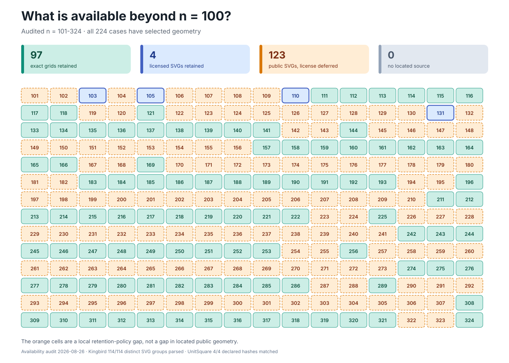

# Prospective Packing Atlas, `n = 101..324`

This directory separates two questions that are easy to conflate: whether usable
geometry has been located for a case, and whether that geometry can be retained and
normalized in this repository.



## What the Audit Establishes

Within the audited `n = 101…324` range, every one of the 224 cases has selected
geometry. The current gaps are therefore in local retention and normalization, not in
locating a construction for an `n` in this range.

| Status | Cases | Meaning |
| --- | ---: | --- |
| Exact grid retained | 97 | The catalogue’s stated no-tilt grid rule is generated locally with exact coordinates. |
| Licensed SVG retained | 4 | UnitSquare geometry for `n = 103`, `105`, `110`, and `131` is retained under the licence identified in its dataset metadata. |
| Public SVG located; retention deferred | 123 | Kingbird geometry was fetched and parsed during the access audit, but the inspected catalogue page states no express reuse terms, so its SVG files are not retained. |
| No selected geometry located | 0 | No case in this audited range currently falls into this category. |

The zero in the last row is scoped evidence, not a claim that the search covered every
site, publication, or unpublished construction.
Source selection is recorded as *provisionally complete* against the retained catalogue
and UnitSquare evidence, with an access audit dated 2026-08-26. Extending the range
beyond `n = 324` or surveying other authorities is new research work.

## What Is Already Local

[`manifest.json`](manifest.json) indexes a license-safe seed of 101 normalized witnesses
and house renderings: the 97 exact grids and four UnitSquare cases.
It deliberately excludes the 123 Kingbird-selected cases pending licence review.
That exclusion does not mean their geometry is unavailable on the public web; it means
this repository has not established a basis for retaining the upstream SVG files.

[`source-availability-101-324.json`](source-availability-101-324.json) is the complete
machine-readable selection and provenance map.
The SVG is a generated view of that record.
Neither artifact contains contact, rigidity, chunk, or packing-grammar annotations, and
neither makes an optimality claim.

## Remaining Work

The next corpus-extension pass should:

1. resolve whether the 123 Kingbird SVGs can be retained, or obtain equivalent geometry
   from a source with explicit reuse terms;
2. normalize any newly eligible geometry to `Witness/v1`, validate feasibility at the
   assurance supported by the source, and render it with the house renderer; and
3. start a separate availability audit for any range beyond `n = 324` rather than
   treating it as covered by this map.

## Rebuild

From `explorations/packing`:

```bash
uv run --frozen --all-extras --group dev python -m devtools.map_prospective_sources --check
uv run --frozen --all-extras --group dev python -m devtools.build_prospective_atlas --check
```

Omit `--check` from the first command to regenerate the availability JSON and its SVG
view. Use `python -m devtools.build_prospective_atlas --update` to rebuild the 101-case
license-safe seed after its source selection changes.

<!-- This document follows common-doc-guidelines.md.
See github.com/jlevy/practical-prose and review guidelines before editing.
-->
