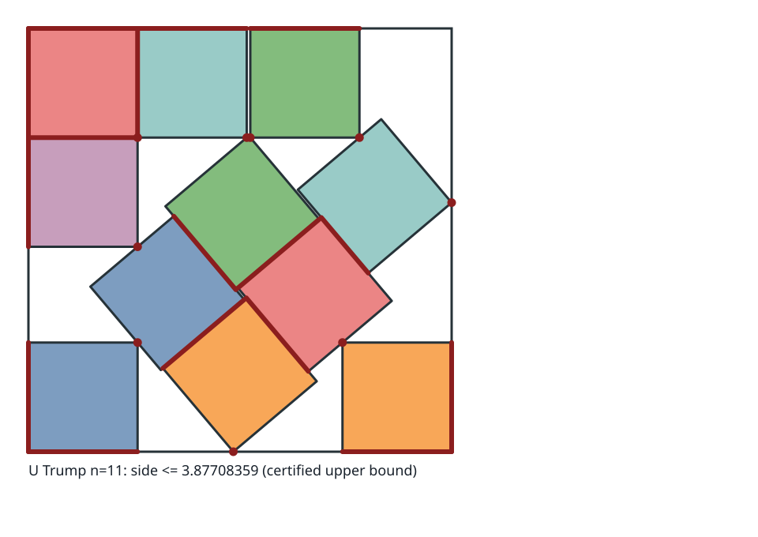
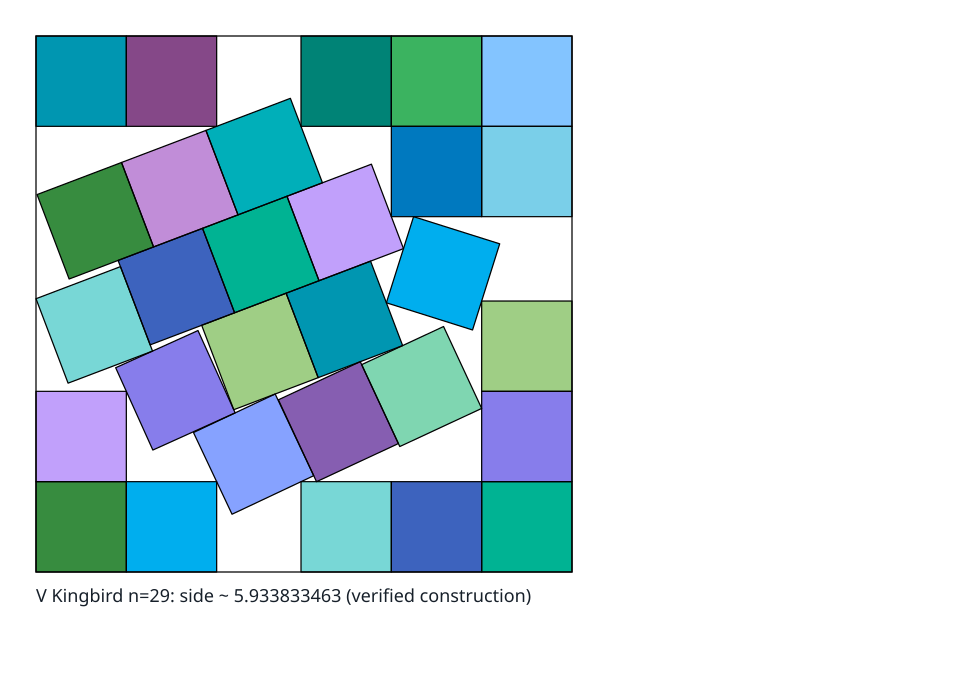

# Frontier: what is known about `s(n)`, case by case

`s(n)` is the side of the smallest square holding `n` non-overlapping unit squares.
This folder is the structured record of what is known for each `n ≤ 100`: one artifact
per case, carrying the best known packing, the best proved lower bound, the provenance
of both, and links into the local literature archive — plus an editorial section on each
that says what the numbers do not.

## Rendered Cases

The frontier and the figure atlas meet through
[`../atlas/rendering/manifest.json`](../atlas/rendering/manifest.json).
Each manifest entry binds an `n`, evidence tier, view level, alt text, retained SVG,
matching frontier file, and exact regeneration command.
That keeps a figure discoverable without making presentation data authoritative over a
case’s mathematical frontmatter.



*The `n = 11` overview is one of five retained known answers.*



*The larger `n = 29` example exercises deterministic palette reuse while preserving the
source’s status as a verified numerical construction.
The other entries exercise an exact moduli map, a certified trajectory, and a numerical
start/final comparison.*

From the exploration root, list or rebuild every discoverable example with:

```bash
uv run --frozen --all-extras --group dev python -m devtools.render_packing_gallery --list
uv run --frozen --all-extras --group dev python -m devtools.render_packing_gallery --update
```

Every currently rendered case embeds its own artifact below the frontmatter.
The deterministic SVG gate checks those links, the gallery documentation, the manifest,
and the regenerated bytes together.

## Structure here, tables there, generated in between

The research documents keep their tables — a reader should get the whole picture of the
problem from the report alone, without opening this folder.
This folder holds the same facts in a form a tool can read, so they can be queried,
plotted, and checked.

**The duplication is deliberate and it cannot drift**, because the Markdown tables in
the reports are *generated* from these files by
[`devtools.render_research_tables`](../devtools/render_research_tables.py), between
`<!-- BEGIN GENERATED: … -->` markers, and `packing-validate` fails if any is stale:

```shell
uv run --frozen python -m devtools.render_research_tables
uv run --frozen python -m devtools.render_research_tables --check
```

Four tables are generated this way: the open frontier (65 rows), the solved cases (35),
and the search and proof strategy catalogues (20 and 30). Editing a fact means editing
the data here and re-rendering; editing a generated table by hand will be caught.

That the structure earns its keep is not a hypothesis.
The first version of the frontier table was written by hand into the research document
and got a headline claim wrong; generating it from data caught the error immediately
(see [The next family to fall](#the-next-family-to-fall) below).

Each `n-NNN.md` is a [softschema](https://github.com/jlevy/softschema) artifact: YAML
frontmatter carrying the structured payload, validated against
[`square-packing-case.schema.yaml`](square-packing-case.schema.yaml), followed by a
Markdown body that is purely reader-facing.

**The frontmatter is authoritative.** A consumer reads the YAML and must not parse the
body prose for structured values.
The body is where judgement, history, and caveats live — the things that would be lies
if forced into a field.

```bash
# validate one case, or all of them
uvx softschema@latest validate n-011.md
for f in n-*.md; do uvx softschema@latest validate "$f" >/dev/null || echo "FAIL $f"; done
```

## Every file here is a soft-schema artifact

All six data files declare a contract, point at a compiled JSON Schema, and validate at
`status: enforced`. Nothing in this folder is structured-looking YAML that nothing
checks.

| File(s) | Profile | Schema |
| --- | --- | --- |
| `n-001.md` … `n-100.md` | `frontmatter-md` | `square-packing-case.schema.yaml` |
| `search-strategies.yaml`, `proof-strategies.yaml` | `pure-yaml` | `strategy-catalogue.schema.yaml` |
| `asymptotic-waste-bounds.yaml` | `pure-yaml` | `asymptotic-waste-bounds.schema.yaml` |
| `source-availability.yaml` | `pure-yaml` | `source-availability.schema.yaml` |

```shell
uv run --frozen python -m devtools.validate_schemas
```

`packing-validate` runs that check, so an artifact cannot drift from its schema
unnoticed.

**A caveat about how the pure-YAML files are validated.** softschema’s spec defines the
`pure-yaml` profile, and its library implements it correctly — but as of 0.6.1 the CLI
reads every artifact with the frontmatter reader and builds its contract without a
profile, so `softschema validate` rejects a conforming pure-YAML file with
`no_frontmatter`. Filed upstream as
[jlevy/softschema#38](https://github.com/jlevy/softschema/issues/38), with a reduction
showing the library returns `valid` for the same file when the profile is set
explicitly.

Until that lands, `devtools.validate_schemas` validates the pure-YAML datasets against
the *same compiled schema the CLI would use*, so `status: enforced` on those files is a
fact rather than an aspiration.
The Markdown artifacts are additionally checkable with the CLI directly:

```bash
uvx softschema@latest validate n-011.md
```

Leaving them declared-but-unchecked was the alternative, and it is the exact failure
this project keeps finding in its own sources: a claim of rigour that nothing tests.

The schemas are written to catch real mistakes, not to decorate.
Verified by negative control — each of these is rejected: a search entry carrying a
proof `status` field (or vice versa, enforced by a JSON Schema conditional on `kind`),
an invented `blocker` value, an upper-bound `exponent` below the `0.5` floor that
Roth–Vaughan establish, a catalogue `count` disagreeing with its entry list, and a case
`status` outside `{proved, open}`.

## What is in a case

The payload fields are documented in the schema.
The ones that carry the most weight:

- `status` — `proved` or `open`. 35 of the 100 are proved.
- `upper_bound` — the best known packing: value, exact form, algebraic degree, minimal
  polynomial, whether it is rigid, whether it has been analytically optimized, how it
  was found, and by whom.
- `lower_bound` — the best proved bound and, crucially, **which argument supplies it**
  (`area`, `nagamochi`, `monotonicity`, `unavoidable_points`, `perfect_square`,
  `counting`). This is the field that shows where the proof machinery actually reaches.
- `resources` — citation keys with paths into [`../resources/`](../resources/README.md)
  and a `retrieved` flag.
- `verified_here` — claims independently re-derived in this repository, not taken on
  authority.

## The strategy catalogues

[`search-strategies.yaml`](search-strategies.yaml) and
[`proof-strategies.yaml`](proof-strategies.yaml) carry two working inventories of the
field and adjacent methods: 20 search strategies and 30 proof strategies or candidates.
They are broad research maps, not claims of an exhaustive history; several entries are
explicitly unused on this problem.
Each entry has an `id`, `name`, `mechanism`, `family`, a status (`outcome` for search,
`status` for proof), a `note`, and any citation `refs`.

The `family` field is what makes them worth plotting.
Grouped, the asymmetry that explains why this problem is stuck becomes a picture rather
than a paragraph:

|  | search | proof |
| --- | --- | --- |
| entries | 20 | 30 |
| families | 4 | 6 |
| entries that have produced results here | 11 | 17 |
| largest working family | constructive (9 of 20) | **unavoidable points (10 of 30)** |

Ten of the seventeen working proof strategies are the *same idea* refined — place
points, prove they are unavoidable, count — while on the search side four genuinely
different families have each produced records.
The other ten-entry proof family, the transversal and wider packing-and-covering
toolkit, is almost entirely **unapplied** to `s(n)`. That contrast is the clearest
single argument that the lower-bound side has room its practitioners have not used.

## What the corpus shows

Counts below are computed from the artifacts, not asserted.

**The lower-bound frontier is one theorem.** Of the 65 open cases, **63** have
Nagamochi’s general closed form as their best proved lower bound.
Exactly two — `n = 11` and `n = 12` — are governed by anything bespoke, and both trace
to Stromquist’s single 2003 argument.
Nothing in this table has been improved since 2005.

**The search frontier is much healthier.** Of the 65 open cases, 31 are still held by
the trivial grid, but the remaining 34 carry real constructions: 15 hand-built, 11 from
simulated annealing (all dated 2024–2026), 5 diagonal strips, 3 extensions of smaller
records. Records move monthly; bounds do not.

**Algebraic degree explodes past `n = 11`.** Degrees recorded in the catalogue for
`n ≤ 100` run 4, 5, 6, 8, 12, 18, 20, 24, 42, 44. Every *proved* case is degree ≤ 2.
That gap between what is certifiable and what is conjectured is the subject’s central
obstruction.

### The next family to fall

Ranked by gap, the four smallest open cases at `n ≤ 100` are:

| `n` | gap | record | note |
| --- | --- | --- | --- |
| 97 | 0.0557 | grid | `10² − 3` |
| 78 | 0.0627 | grid | `9² − 3` |
| 61 | 0.0718 | grid | `8² − 3` |
| 11 | 0.0882 | Trump 1979 | the famous case |

Three of the four are consecutive unproved members of the family `s(m² − 3) = m`, which
is **proved exactly for `m = 3, 4, 5, 6, 7`** (that is
`s(6), s(13), s(22), s(33), s(46)`) and conjectured beyond.
Their gaps are small because Nagamochi’s bound is nearly tight there, and their
conjectured optima are **integers** — the case the existing proof technique is built
for.

They are, on this evidence, the most tractable unproved cases in the table, and they are
essentially undiscussed in the literature.

`n = 11` is the smallest gap among cases with a *non-trivial* record, and it is not
close: the next such case is `n = 19` at `0.4215`, nearly five times wider.
That is the correct form of a claim the research document originally overstated.

## Cross-references

- The narrative and the mathematics:
  [`../docs/project/research/research-2026-08-22-packing-11-unit-squares.md`](../docs/project/research/research-2026-08-22-packing-11-unit-squares.md)
- Algorithms, verification and tooling:
  [`../docs/project/research/research-2026-08-22-square-packing-algorithms-and-tooling.md`](../docs/project/research/research-2026-08-22-square-packing-algorithms-and-tooling.md)
- The literature archive these artifacts cite:
  [`../resources/README.md`](../resources/README.md)
- The exact verifier: [`../README.md`](../README.md)

## Provenance and regeneration

Upper bounds, degrees, minimal polynomials, rigidity flags, analytic status and
attributions were parsed from the archived record catalogue capture
(`../resources/web/kingbird-squares-in-squares.md`, retrieved 2026-08-22). Lower bounds
were computed from four sources and the strongest taken.
The proved set and its attributions come from the research document’s own analysis,
which is sourced to the individual papers.

Editorial bodies for `n = 5, 10, 11, 12, 13, 17, 22, 23, 46, 51, 100` are hand-written.
The rest are generated from the structured fields, and say only what those fields
support — they are accurate, not padded.
Adding editorial to a case is just editing its body; nothing regenerates over it.

**Known limits.** The catalogue is parsed as annotation text, so an entry phrased
unusually can be miscounted; `improved_by` in particular under-reports where the
catalogue uses “Refound”, “Optimized by”, or prose.
Tilt angles are recorded only for the handful of cases where this research established
them. Nothing here should be treated as more authoritative than the archived capture it
came from.

<!-- This document follows common-doc-guidelines.md.
See github.com/jlevy/practical-prose and review guidelines before editing.
-->
