# `s(5)` — solved

`s(5) = 2 + ½√2 ≈ 2.70710678`. The first case where tilting beats the grid: four squares
sit in the corners and the fifth is rotated **45°** in the middle.
A 3×3 grid would need side 3, so the tilt buys `0.293`.

*This export follows an exact feasible segment between two optimal poses.
Its contact marks describe certified contacts at the final endpoint and appear only when
the animation arrives there.
The SVG falls back to that endpoint when animation is unsupported or reduced.*

## Why this case matters out of proportion to its size

It is the smallest instance of the phenomenon that makes the whole subject hard.
Up to `n = 4` the answer is the obvious grid; at `n = 5` the optimum is irrational and
the optimal packing is not axis-aligned.
Everything downstream — Erdős–Graham’s asymptotic tilted constructions, Gardner’s
conjecture, the difficulty at `n = 11` — is this observation iterated.

Note the *degree*: `2 + ½√2` is algebraic of degree 2. Every solved case in this
catalogue has `s(n)` of degree ≤ 2. That contrast makes the degree-8 `n = 11`
construction a warning that familiar unavoidable-point arguments may need richer
geometry; no degree ceiling for that proof method is established here.

<!-- This document follows common-doc-guidelines.md.
See github.com/jlevy/practical-prose and review guidelines before editing.
-->
