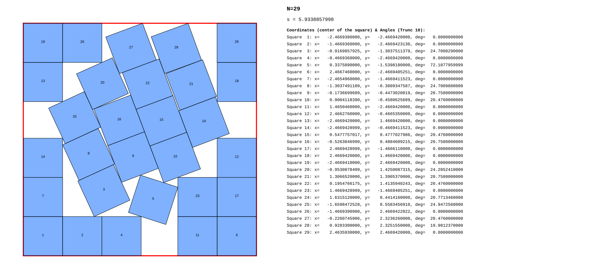

# Improved Upper Bound for s(29): Packing 29 Squares in Squares

## Abstract
This repository presents a new best known packing for the Squares in Squares packing problem for n=29. The discovered $s(29)\approx$ 5.9338857998 improves the previous best known packing by Gensane and Ryckelynck.

## Results

|  | Value | Reference |
| :--- | :--- | :--- |
| **Previous Record** | 5.9343418049 | Thierry Gensane & Philippe Ryckelynck (2004) |
| **New Solution** | 5.9338857998 | Thomas Schadt (2025) |
| **Improvement** | $\Delta \approx$ $4.56 \times 10^{-4}$ | |

## Visualization

## Coordinates
The precise (105 decimal places) s, coordinates and rotation angles for all 29 squares can be found in the file [squares.txt](squares.txt). 
The format for the squares is: `index, x center, y center, angle (degrees)`.

## Verification
To verify the validity of this packing this python code [check](check.py) was used.
For $\epsilon=10^{-100}$ it confirms the packing which is more than enough to show that this is a new best packing since it beats the packing of Gensane and Ryckelynck by $4.56 \times 10^{-4}$.

## Methodology
The solution was found using C++ code with data type float.
After finding the initial solution the solution was relaxed so that the precision is at least $10^{-100}$. This was done in C++ with the boost library.
Finally the solution was checked with python code also with a precision of $10^{-100}$.
This particular solution is most certainly not fully optimized, and minor improvements can still be made.

## License
This project is licensed under the MIT License, see [LICENSE](LICENSE) 
