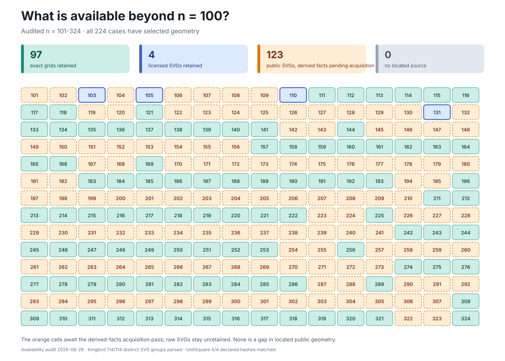

# Packing Atlas

The atlas connects retained packing observations and abstract enumeration records to
stable, document-ready views.
Its collections have deliberately different claim semantics:

| Collection | Contents | Claim boundary |
| --- | --- | --- |
| [`atlas.schema.yaml`](atlas.schema.yaml) and [`rendering/`](rendering/README.md) | Typed endpoint observations and explanatory figures indexed by [`manifest.json`](rendering/manifest.json) | A view may expose retained evidence but cannot promote its tier |
| [`known-best/`](known-best/README.md) | One normalized construction and house SVG for every `n = 1..100`, plus separate calibration annotations | Feasible retained constructions; no new optimality or H-044 verdict |
| [`prospective/`](prospective/README.md) | Complete source-availability map for `n = 101..324` and the license-safe normalized seed | Source corpus only; contact and hypothesis annotations are prohibited |
| [`enumerated/`](enumerated/README.md) | All 11,013 abstract signed-contact orbits at scaffold size five | Incidence labels only; no geometry, realization, feasibility, or packing claim |

Within every collection, data and presentation remain separate.
An atlas row or abstract identity owns typed content; an SVG is a deterministic view of
that content. Drawing an object cleanly cannot turn a candidate into a certificate, a
source listing into geometry, or an abstract contact graph into a packing.

## At a Glance

[](known-best/known-best-1-100.svg)

*All 100 retained known-best constructions in row-major order.
Each tile shows `n`, the reported side upper bound and, where `s(n)` is still open, the
best proved lower bound, starred where this project proved it; the linked SVG remains
sharp at any zoom level.*



*Every case in the audited `n = 101…324` range has selected geometry.
Green and blue cells are retained here.
Orange cells have public SVG geometry that passed the access and parser audit, but the
files are not retained because the inspected catalogue states no express reuse terms.
This is a local retention-policy gap, not a located-source gap.*

Specialized figures—including certified contacts, trajectories, exact moduli, and the
diagnostic start/final comparison—remain in the focused
[renderer gallery](rendering/README.md).

## Add or Regenerate an Example

From `packing`, inspect and rebuild the current set with:

```bash
uv run --frozen --all-extras --group dev python -m devtools.render_packing_gallery --list
uv run --frozen --all-extras --group dev python -m devtools.render_packing_gallery --update
uv run --frozen --all-extras --group dev python -m devtools.render_packing_gallery --check
```

To add a case, adapt its typed retained source to a `PackingFrame` or
`PackingTrajectory`, add the render and manifest entry in
[`devtools/render_packing_gallery.py`](../devtools/render_packing_gallery.py),
regenerate, and embed the listed artifact in the corresponding `frontier/n-NNN.md` body.
The deterministic SVG gate checks the manifest, documentation links, safe SVG subset,
and retained bytes together.

<!-- This document follows common-doc-guidelines.md.
See github.com/jlevy/practical-prose and review guidelines before editing.
-->
