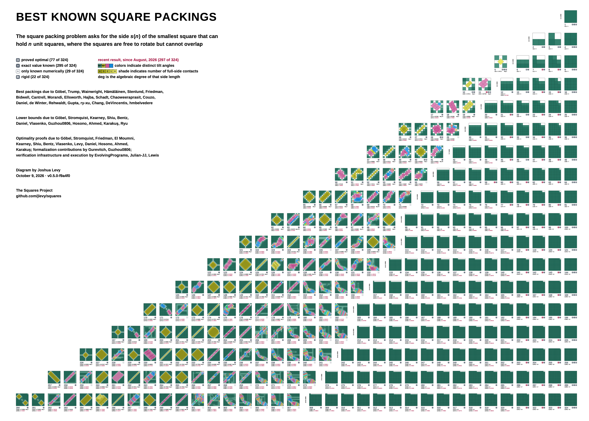

# Known-Best Packing Atlas, `n = 1..324`

This atlas retains one complete geometry record for every frontier case from $n = 1$
through $n = 324$ and renders every record with the repository’s deterministic house
renderer. The machine-readable discovery layer is [`manifest.json`](manifest.json).
The range widened from 100 on 2026-09-07 under
[the expansion plan](../../../docs/project/specs/active/plan-2026-09-07-atlas-expansion-to-324.md).
Two composites are drawn from it: the published figure of the first hundred, with its
10-by-10 layout, and a poster of the whole corpus beside it.
The calibration annotations further down stay pinned to the first hundred by design.

Everything in this directory is generated.
[FIGURE-PLAYBOOK.md](FIGURE-PLAYBOOK.md) is the playbook for both: how to rebuild them,
where each fact on them comes from, what a third would take, and how the poster’s byte
budget was measured.

## The figure, `n = 1..100`

[](known-best-1-100.svg)

The composite is a native 10-by-10 SVG, not a screenshot montage.
Its 5,050 square polygons come from the same normalized witnesses as the individual
figures under [`rendering/`](rendering/).

The composite ships in four forms, all drawn from that one SVG in one build:

| File | Size | For |
| --- | --- | --- |
| [`known-best-1-100.svg`](known-best-1-100.svg) | 2400 × 2896 units | the source; scales to anything |
| [`known-best-1-100.png`](known-best-1-100.png) | 2400 × 2896 px | the GitHub-facing raster preview |
| [`known-best-1-100@2x.png`](known-best-1-100@2x.png) | 4800 × 5792 px | attaching, or downscaling for social media |
| [`square-packings-100-20261008.pdf`](square-packings-100-20261008.pdf) | 25 × 30.17 in | printing; vector, so text stays selectable |

Each export carries the SHA-256 of its source SVG, so `--check` rejects any one of them
that has fallen behind the drawing.
The 2x raster is scaled by a whole number rather than to a round pixel width: a
fractional scale lands every edge on a fractional pixel boundary, and the antialiasing
shades the rasteriser then invents cost more bytes than the extra pixels do.
Rendered from this SVG, a 4096-pixel-wide export is 1,440,555 bytes for 20.2 megapixels
where the 2x export is 1,294,216 for 27.8.

## The poster, `n = 1..324`

[](known-best-1-324.svg)

Every case the register holds, at the figure’s card scale, arranged in a triangle: row
$k$ holds $n = (k-1)^2 + 1$ through $k^2$. All eighteen rows are complete and
right-aligned; the final row has thirty-five cards.
The packing drawings and card scale remain unchanged.
A $k×k$ grid label marks each row’s first retained regular axis-aligned grid packing;
the two-line label gives its dimensions above `GRID`, and the card retains its ordinary
count. Where irregular packings precede it, an extra gap of half a drawing width (79
units) separates the groups horizontally.
Every row uses the same 360-unit pitch, with more space between rows for a taller
overall shape; rows that are all grid receive no added horizontal gap.
The poster draws 52,650 square polygons from the same witnesses.
Its title, complete legend, explanation, construction credits and closing project
details form one block in the upper-left whitespace, leaving the bottom for the final
row of packings. Title and documentation are left-aligned; the legend has two
left-aligned columns, four status rows beside four recency, color and degree rows.
The last right-column item reads “deg is the algebraic degree of that side length,”
without a badge. The first two tilt-color swatches carry black $90^\circ$ and $45^\circ$
labels.
The information starts at the left edge of the first drawing in the final row; at
least 120 units of outside clearance keep the grid labels inside the page margins.
One dark $R$ means known rigid; its verification status, dates and sources remain in the
structured metadata.
The two-line definition uses 57-unit type; the following legend, credits and closing use
48-unit type in one shared Arial-first body font at weight 700. The definition and all
body lines use normalized leading 1.50, giving the 48-unit lines a uniform 72-unit
baseline pitch. Section gaps remain clear; the packing drawings and card captions keep
their original scale.
The triangle’s bound captions use five decimal places, one fewer than the figure,
leaving room for the algebraic degree; a longer degree label can shorten the adjacent
side caption to four places.
Upper bounds round upward and lower bounds downward; stored bounds retain their full
precision. “Best packings due to” begins three balanced lines naming all twenty recorded
construction finders and improvers once.
Complete canonical names stay intact, newest first by each author’s latest attributed
found or source date; balancing preserves that order.
A later improver’s source does not redate inherited authors.
The nine construction source keys remain in the metadata and the separate bibliography.
A section gap separates the credits from the diagram credit, followed by the data date,
a middle dot and the generated edition stamp.
A blank line precedes exactly “The Squares Project” and “github.com/jlevy/squares”.
Both lines use the same 48-unit body font, weight and leading as the legend and credits.
They are plain black text without a hyperlink or PDF annotation, and start flush with
the information block’s left edge.
The poster has no subtitle.
Its two-line definition appears above the legend: “The square packing problem asks for
the side $s(n)$ of the smallest square that can hold $n$ unit squares, where the squares
are free to rotate but cannot overlap.”
Both composites apply the recent accent independently to a new upper bound, lower bound
or optimality proof: a new proof of an older packing colors its optimality badge, not
its upper bound.
The image above is the raster; the vector it was drawn from is one click
away, and the PDF is a 86.95-by-68.77-inch page.

| File | Size | For |
| --- | --- | --- |
| [`known-best-1-324.svg`](known-best-1-324.svg) | 8347 × 6602 units | the source; scales to anything |
| [`known-best-1-324.png`](known-best-1-324.png) | 8347 × 6602 px | the raster embedded above |
| [`square-packings-324-20261008.pdf`](square-packings-324-20261008.pdf) | 86.95 × 68.77 in | printing; vector, so text stays selectable |

The poster publishes one raster and a vector PDF. The rectangular poster’s 2x raster
measured 5,055,264 bytes for 83 megapixels; the poster publishes a single preview, while
the PDF preserves every square at any zoom.
The link-preview card is one page’s unfurl, which the figure above supplies.

The poster also draws a square more cheaply than the figure does, because ten times as
many of them will not fit in a file anyone should clone.
The poster drops the per-square `data-*` facts, states the stroke once per card instead
of once per polygon, and rounds coordinates to three decimals.
Measured on the rectangular poster, those choices reduced the house encoding’s 490 bytes
a square to 117.7. The triangle uses the same encoding.
All three departures are recorded in the drawing’s own metadata, the facts they drop are
still carried per case by [`rendering/`](rendering/) and
[`composite-figure.json`](composite-figure.json), and each was measured before it was
chosen:

```bash
uv run --frozen --all-extras --group dev python -m devtools.build_known_best_atlas --report
```

[The playbook](FIGURE-PLAYBOOK.md#the-two-composites) has the measurements and what each
one bought.

## The regularized views

[`regularized/`](regularized/index.json) holds exact derived views of 55 records,
written by `python -m devtools.regularize_axis_components --update-atlas`, checked by
digest with `--check-atlas` and re-derived with `--verify-atlas`. A view straightens
near-axis squares and slides axis-aligned ones into exact contact at the certified side,
verified twice over the rationals; it never replaces a witness, changes a side or
promotes a tier. The selected website drawings use these verified views directly; the
index and source records retain their provenance.
Exploration
[X-049](../../campaign/explorations/X-049-families-shading-and-the-large-n-limit.md#exact-regularization)
explains why and what it changes.

`--check-atlas` runs in the records tier on every pull request.
`--verify-atlas` is the deferred step `regularized atlas views re-derive exactly`, on a
`regularized-views` runner of its own in both the deep gate and the post-merge
checkpoint
([development.md](../../../development.md#the-deep-gate-the-deferred-surface-before-the-merge)).

**The 87 refused Kingbird-derived records stay refused.** Their 36-digit poses overlap
by a rounding sliver at centre dilation 1, the only factor the layer uses.
`promote_rational` would try wider ones: it scales every centre about the container’s
centre by $1 + 10^{-p}$, $p = 31, 29, \ldots, 3$, and keeps the first exact packing
within $10^{-9}$ of the printed side.
The tool’s `--smallest-dilation` flag runs that ladder.
On 2026-10-02 it was run over the 89 records refused at that time, and the census’s
`--witness` mode shaded each source and view.
The later SQUISH import replaces two of those source poses with exactly feasible
rational packings; the historical census below describes the earlier poses:

| Smallest verifying dilation | Records | Views below the register’s verified bound | Light green, house rule | Light green, stage rule |
| --- | ---: | ---: | --- | --- |
| $1 + 10^{-31}$ | 53 | 49 | 1,355 → 1,353 | 1,355 → 1,353 |
| $1 + 10^{-29}$ | 33 | 23 | 731 → 731 | 731 → 731 |
| $1 + 10^{-27}$ | 3 | 3 | 93 → 93 | 93 → 93 |
| All | 89 | 75 | 2,179 → 2,177 | 2,179 → 2,177 |

Every view passed both exact verifiers, and none made a square lighter or needed a hold.
The views still fail the claim boundary, for two reasons:

- **Most would promote a tier.** For 73 of the 89 the register’s verified upper bound is
  the grid ceiling, because the Kingbird catalogue is reported evidence that has never
  been replayed. An exactly verified view there is a rational packing 0.05 to 0.46 below
  that bound. A drawing would then carry a certificate the register does not.
  At $n = 17$ and $n = 29$ the view lies $10^{-22}$ and $5 \times 10^{-20}$ below the
  certified endpoint the register holds, which is the same promotion at smaller scale.
- **The rest would change the side.** For the other 14 the register already verifies the
  reported bound, but a dilated view’s container is $2.9 \times 10^{-31}$ to
  $8.8 \times 10^{-29}$ larger than the printed side and lies above the verified bound,
  and every centre has moved.
  That is not the author’s packing at the certified side.

What it would buy is two squares.
The views’ remaining light faces are structural: 3,873 face a tilted neighbour, 132 face
a hole, and 129 face an offset row, with no slack.
Only one square at $n = 85$ and one at $n = 227$ compact, by 0.37 and 0.29. Every other
move snaps shut a gap the dilation itself opened.
The flag stays in the tool as the instrument that measured this.
A view framed by it is a scratch artifact and never part of the layer.

## What the drawings are drawn from

The pipeline has four separate layers:

1. exact canonical grids, attributed Kingbird-derived numerical facts, source packets’
   derived facts, or retained UnitSquare SVG renderings;
2. normalized [`Witness/v2`](../../witnesses/witness.schema.yaml) geometry;
3. numerical or exact feasibility receipts at the assurance the source supports; and
4. deterministic SVGs under [`rendering/`](rendering/).

Chunk decompositions do not belong in the source witness.
They live in separate, regenerable annotation artifacts with their detector version,
deterministic objective, tolerances, and limitations.
The current annotations are explicitly calibration-only because the 1–100 corpus was
inspected during their design.
This prevents a taxonomy invented from the corpus from being counted as independent
confirmation on the same corpus.

[`chunk-components.json`](chunk-components.json) is the exploratory layer that tests the
assembly intuition without crossing that boundary.
At the registered `1e-6`-radian angle and `1e-3` contact tolerances, 1,782 of 1,860
squares in the 36 non-grid records belong to a multi-square same-angle contact
component.
Twenty-five of those 36 records use no more than six such components and three
singletons. This is strong evidence for a broad **contact-assembly** description.
It is not yet evidence that every component is one of the enumerator’s narrower bar, L,
or rectangle skeletons.

The 36 non-grid records contain 169 multi-square components: 55 contact chains and 114
cyclic patches. Contact-normal equalities alone leave 859 internal slide degrees before
overlap intervals or wall contacts are applied, and 792 squares are wall-seated at the
registered contact tolerance.
A connected contact assembly is therefore not automatically a rigid chunk; the next
grammar must retain and price those slides.

The retained maximal-lattice detector establishes that stricter decomposition directly
for only 21 of 100 records.
Its other 79 results are recorded as `not-established`, not as failures: a maximal
polyomino may split into two allowed chunks.

[`chunk-partitions.json`](chunk-partitions.json) performs that split with a bounded,
deterministic exact-cover search over contiguous bars, filled rectangles, and corner Ls.
It certifies all 64 grid-derived records and 3 of 36 non-grid records inside the
six-chunk/two-free budget.
Two non-grid cases are conclusively outside that budget, 23 have no partition in this
candidate universe, and eight are search-capped and therefore indeterminate after the
declared 10,000-state limit.
The broad contact result and the narrow partition result therefore point in the same
direction: same-angle assembly is common, but rigid integer-lattice chunks are too
narrow as the only grammar for the interesting records.

The partition atlas evaluates every allowed exact free-square count, prefers an
in-budget certificate when one exists, then minimizes free squares before chunk count.
If an earlier free-count slice is capped, a later in-budget certificate still proves
existence, but the retained selection marks its free-square and chunk minimality as
indeterminate. A later out-of-budget certificate leaves both budget membership and
`F`/`C` minimality indeterminate; likewise, any later capped slice leaves an earlier
out-of-budget certificate indeterminate.
The atlas reports exact and near bands separately and types state-cap and
candidate-universe limitations.
It is calibration evidence only and emits no H-044 verdict.
The contrast is useful rather than embarrassing.
It says the corpus supports the chunk intuition while the current grammar and detector
do not yet support the proposed coverage claim.

[`chunk-evidence-profile.json`](chunk-evidence-profile.json) condenses the full non-grid
census into 36 source-stratified rows.
Its [`house-rendered overview`](evidence/non-grid-chunk-evidence-profile.svg) shows
contact coverage, component count, free squares, largest component, internal slide
degrees, the narrow partition disposition, and the broad-budget flag for every case.
Ten cases are fully covered, 27 cover at least 90 percent, 33 cover at least 75 percent,
and 35 cover at least half; $n = 5$ is the lone zero-contact outlier.
Orange row outlines identify the only registered-to-regularized changes ($n = 68$, $69$,
and $71$) instead of hiding tolerance sensitivity in an aggregate.

[`contact-assembly-grammar.yaml`](contact-assembly-grammar.yaml) records the proposed
revision as a versioned, schema-checked draft.
It keeps rigid lattice chunks as a strict subgrammar and adds contact scaffolds whose
tangential slides remain LP variables.
Its complexity tuple charges free squares, assemblies, internal slide degrees, angle
classes, mandatory contacts, and largest assembly size.
No scalar budget is frozen yet.

[`contact-enumeration-pricing.json`](contact-enumeration-pricing.json) prices the first
target-free implementation without reading atlas geometry.
Exact connected labeled counts grow from 15,104 at size 4 to 9,684,224 at size 5. The
exhaustive size-4 control reduces to 124 canonical labels and local LP solves; 26 pass
the local equations, which accept one fitted-angle class only and still omit walls,
non-edge separation, and container fit.
Mixed angle classes fail before an LP solve.
The isomorph-free size-5 path reduces 1,533,696 topology colorings to 11,013 exact
orbits. Those abstract representatives are retained without geometry or local LP
outcomes; the earlier 9,296,855,040-image raw path remains only a differential oracle.

[`contact-full-cell-control.json`](contact-full-cell-control.json) is a separate
literal, source-free structural control for CG-010. Its three-square axis-aligned L has
eight available non-edge axis-and-order branches; the retained fixture selects one raw
cell, checks all 48 D4-by-relabeling images, emits one canonical label, and performs
zero LP solves. The artifact validates representation, canonicalization, typed caps, and
work accounting only.
It contains no centres, side, geometry, container-fit result, packing feasibility claim,
or optimality claim.

[`contact-overlays.json`](contact-overlays.json) indexes five deterministic visual
strata from the registered descriptive census: $n = 11$, $28$, $40$, $68$, and $89$.
Every SVG under [`contact-overlays/`](contact-overlays/) uses the same house renderer as
the base atlas. Dashed orange lines join square centres or a centre to a seated wall;
they show tolerance-qualified graph incidence, not exact physical contact loci or
rigidity. The numerical overlay feature is deliberately distinct from the renderer’s
certified exact-contact feature, and the gallery remains calibration-only.

## Coverage Policy

Exact integer records use a canonical row-major subset of the corresponding grid.
Noninteger catalogue records use attributed Kingbird-derived numerical center and angle
facts retained in Witness/v2; the upstream SVGs are not retained in this source
inventory because the review located no express redistribution terms.
This is a conservative retention policy, not a legal conclusion.
The newer public UnitSquare renderings superseded the older Kingbird geometry at
$n = 68, 69, 103, 105, 110$ and $131$; their six-decimal polygon coordinates are
explicitly recorded as rendering-derived numerical evidence, not as the unavailable
interval boxes named in their metadata.
None draws one now: Couzo’s packings supersede five of them, and $n = 69$ moved on
2026-10-05 to the catalogue’s later side for the same packing, David Ellsworth’s
optimization (T-088).

At $n = 69, 83$ and $87$ the catalogue facts are not read from the SVG itself, which the
session that took in their September 2026 sides could not fetch, but from Evan Daniel’s
binary64 parse of it, pinned at a commit of `evand/square-packing`; each witness names
that file in `source.revision` and says so in its limitations.
`devtools.derive_kingbird_facts --compare-parse` measures that parse against this
repository’s own: at the 90 counts whose witnesses were read from their own pictures,
every side agrees and every pose agrees to one binary64 ulp.
Before the three were taken in it also compared $n = 83$ and $87$, whose retained
witnesses still described the pictures the catalogue had replaced, and those two were
the only ones that differed.

At 50 counts the drawing is a parallel project’s packing, read from its source packet’s
derived facts: Francisco Couzo’s at 49 counts from $n = 68$ to $307$ (T-056), seven of
them, $n = 208, 209, 228, 263, 272, 303$ and $306$, from his revision of 3 October 2026
(T-092), and Joost de Winter’s at $n = 211$ (T-057), the first drawing of 211 squares
that is not the grid.
Neither source publishes a licence, so the packets keep the centres and angles and the
upstream digests, never the files, as for Kingbird.
Each of these packings is also certified exactly here, which the case record carries in
its verified lane; the atlas witness itself stays the numerical one.

Every witness limits its claim to feasibility of the retained construction.
The phrase “known best” comes from the frontier register and never turns a numerical
witness into an optimality proof.

## Rebuild

From `packing`:

```bash
uv run --frozen --all-extras --group dev python -m devtools.build_known_best_atlas --check
uv run --frozen --all-extras --group dev python -m devtools.census_known_best_chunks --check
uv run --frozen python -m devtools.render_known_best_contact_overlays --check
uv run --frozen python -m devtools.profile_known_best_chunks --check
uv run --frozen python -m devtools.price_contact_enumeration --check
```

Source acquisition is an explicit network operation and is not part of CI:

```bash
uv run --frozen --all-extras --group dev python -m devtools.build_known_best_atlas --fetch
uv run --frozen --all-extras --group dev python -m devtools.build_known_best_atlas --update
```

The first command acquires only missing UnitSquare assets unless `--refresh` is
requested; Kingbird live audits are ephemeral and write no geometry.
The second rebuilds witnesses, individual house renderings, the manifest, and frontier
witness links from retained inputs.
For a layout change, `--update-composite-records` refreshes only the composite geometry
in the manifest and figure record, refusing changes to case facts or legend totals.
Commit those data records and re-pin the release before redrawing the composites.
The two composites and their exports are drawn apart, by `--update-composites`, at a
version bump or on demand; each states the data commit it was drawn from, and
`--check-composites` holds it to that statement without rebuilding anything
([the figure playbook](FIGURE-PLAYBOOK.md#rebuild-it)). `--report` measures what those
exports cost — bytes, square polygons, bytes per square, and how each composite encodes
a square — without rebuilding anything.
Rasters are drawn by cairosvg, the same renderer that draws the PDFs, so every export of
one drawing agrees; check mode reads the embedded source-SVG receipt without invoking a
renderer at all. Git remains the integrity boundary for co-committed outputs.
Upstream asset integrity uses only hashes declared independently by a source; the PNG’s
local source-SVG receipt tracks derivation and is not source evidence.

<!-- This document follows common-doc-guidelines.md.
See github.com/jlevy/practical-prose and review guidelines before editing.
-->
