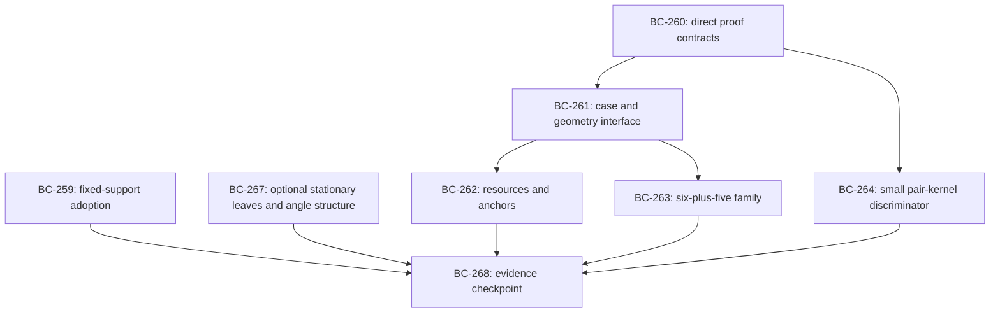

# Agenda 027 — Compatibility and Restricted Families

**Prepared; execution has not started.**
[X-017](../explorations/X-017-compatibility-and-complete-case-covers.md) owns the
critical assessment, mathematical distinctions, and complete source-to-record map.
This agenda owns the prospective actions.
Epic `think-sz5t` owns the program; `think-adfk` owns the completed intake and planning.

## Parallel Ownership

Agenda 024 runs under a different coordinator.
This branch continues the existing sequences with X-017, Agenda 027, H-111–117 and
BC-258–268; its owning bead and draft PR record that allocation.
The
[exploration’s numbering audit](../explorations/X-017-compatibility-and-complete-case-covers.md#starting-point-what-the-previous-work-established)
accounts for the current source records and the superseded exploration placeholders.
[Conventions](../../../conventions.md#1-identity) owns the sequential rule.
Check known parallel work before assigning another ID and again before integration.
Any actual collision is resolved with all affected references in the same change.

No `depends_on` edge points to BC items in Agenda 024, 025 or 026. Existing evidence is
a reusable input, and imported conclusions still require the review their use needs.
A source checkpoint, budget expiry, interruption or completion does not activate,
terminate or reprice this agenda.
Neither this agenda nor its reviewers owns the other coordinator’s clocks or records.

## Proposed Opening Allocation

The next coordinating entry is W2 factual review: dispatch BC-259 and BC-260
independently. A third reviewer may take BC-267 while the coordinator handles source
binding, protocol design and integration.
Use at most the available three worker slots plus the coordinator; the slots are a
capacity limit, not a reason to manufacture work.

After the relevant direct contracts pass, BC-261 builds the smallest shared
geometry/certificate interface.
It feeds the two principal pilots, BC-262 and BC-263. The support review is independent
of both. The physical stationarity review is needed only by a leaf that actually invokes
original stationary equations.
BC-264 can be priced independently once its kernel contract is accepted.

The diagram shows evidence flowing to a checkpoint, not a requirement to wait for all
lanes. BC-268 is takeable after a useful result or refusal and closes only the assessed
scope. Candidate-led resource extensions and the two-angle successor remain tentative.

## Budgets and Readiness

The proposed first checkpoint is within about four active hours, with slices no longer
than 30 minutes and a 20-minute integration reserve.
These are planning estimates.
No current execution clock, target allocation, or runtime claim is created by publishing
this agenda. At launch, the session records actual starts, dependencies, host load and
disjoint assignments.
Replan future slices from observed cost.

Every research pilot follows the same sequence: source or known controls, independent
instrument acceptance, frozen concrete protocol, one bounded target, independent replay,
and an evidential disposition.
H-111 and H-114–117 are open questions until a narrower test claim is prospectively
codified. H-112/113 already state falsifiable full-family claims, but a partial pilot
does not accept them.
Do not create an experiment to count planning as research.

Only ready review/design work is initially takeable; no target instrument is declared
ready by this plan. Failure of a sufficient proof method or an incomplete cover is
unresolved at its scope, not a counterexample or a whole-method impossibility theorem.

## How to Choose Between the Alternatives

| Direction | Evidence that earns expansion | Reason to reprice or redirect |
| --- | --- | --- |
| Resource/anchor | A complete nontrivial domain closes, or resources create a clearly simpler explicit residual relative to the same geometry alone | Repeated refinement leaves the same large residual or almost all minima are zero |
| Six-plus-five | A complete angle interval or family closes with reusable certificates and every alternative accounted for | Only samples, the retained Trump graph, or unrelated tiny boxes are handled |
| Pair kernel | An exact family obstruction, or useful margin with bounded unresolved continuum obligations | Feature growth outpaces pair-domain verification with no new closed scope |
| Selective resource | A concrete candidate improves the limiting domain and has a priced universal check | The only result is a new representation or sample-only gain |
| Physical structure | A reviewed implication simplifies a real residual or proves an exact equality under complete alternatives | Finiteness or descriptor counts substitute for a useful case price |

Record actual work and exact mathematical scope separately.
Compare costs only on matched tasks and regimes.
No percentage of sampled failures or descriptor count substitutes for complete
configuration coverage.

At checkpoint, keep a parallel allocation if the programs continue to answer distinct
useful questions. Recommend replacement of an older allocation only through a documented
evidence comparison and coordination with its owner; do not silently change that run.
No new global lower bound or theorem promotion is part of this planning block.

<!-- This document follows common-doc-guidelines.md.
See github.com/jlevy/practical-prose and review guidelines before editing.
-->
