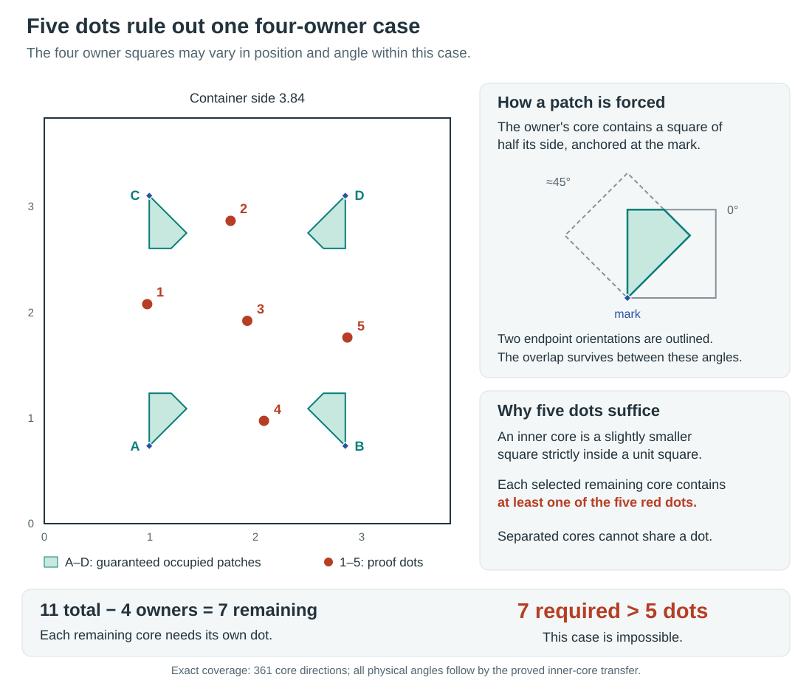

# Five Dots Exclude One Four-Owner Branch at $q=3.84$

This sprint proved that one specified four-owner branch cannot occur in a packing of
eleven unit squares inside a square of side $q=96/25=3.84$. The certificate uses four
guaranteed occupied regions and five fixed points.
It does not cover every possible choice of owners, marks, and orientation classes, so it
does not change the global bound for eleven squares.

## Why This Branch Is Impossible

All lengths are in units of the side of a packed square.

1. **Start with eleven squares.** Suppose eleven unit squares fit without overlapping
   inside the square container of side $3.84$.

2. **Select four owners.** An **owner** is one of four distinct packed squares selected
   using a prescribed **mark**, a point near a container corner.
   An **owner class** restricts the square’s position and orientation relative to its
   mark. The precise inner-core condition is given below.
   This branch uses the reflected copy of one prescribed class at each corner.
   The general owner theorem provides the four distinct owners, but does not force every
   packing into this particular four-class combination.

3. **Use the area each owner must occupy.** Every owner allowed by one of these classes
   contains a closed rational **patch**, shown in green below.
   The bottom-left patch is the overlap of two half-side squares anchored at its mark,
   one at $0^\circ$ and one just below $45^\circ$. The geometric proof shows that this
   overlap remains occupied between those retained endpoints.
   Reflecting this construction gives the other three patches.
   The four selected owners therefore occupy all four green patches.



*The certified branch.
The four green patches are guaranteed occupied by four distinct owners.
The five red points meet every permitted remaining core after the exact orientation
check and geometric transfer.
The inset shows how two extreme owner orientations force one common patch.*

4. **Cover the seven remaining squares with five dots.** Removing the four owners leaves
   seven packed squares.
   Inside each, choose an **inner core**, a concentric square of side $0.9977$ that lies
   strictly inside its unit-square parent.
   The seven remaining cores are called **residual cores**; they must avoid the four
   closed green patches.
   The exact check and the angle-transfer proof together show that every permitted
   residual core contains at least one of the five fixed red points.
   Such a point is called a **piercing dot**.

5. **Count.** The packed unit-square parents have disjoint interiors.
   Their strictly contained inner cores are therefore separated and cannot share a dot.
   Seven residual cores would need seven distinct piercing dots, but only five exist.
   This contradiction excludes the prescribed four-owner branch.

No optimization claim is needed for this argument.
The result excludes one branch; it does not complete the owner case split or change the
global packing bound.

## Why the Check Covers Every Angle

The exact computation works with rational geometry.
Its **direction net** is a finite list of 361 canonical square orientations, where
orientations that differ by a quarter turn represent the same square.
The chosen core side

$$
B=9977/10000
$$

is small enough that every physical unit square, at any angle, strictly contains a
same-centre side-$B$ core at a nearby net orientation.
This strict containment also gives every residual core positive clearance from the
closed owner patches.

For the bottom-left owner, the selected core contains $m_1=(3152/3175,2336/3175)$.
Choose its two perpendicular signed axes so that the displacement from this mark to the
core centre has nonnegative projections on both axes.
Order them so that the second is a counterclockwise quarter-turn of the first.
The first axis has direction $0\leq\theta\leq\theta_*$, where $\theta_*$ is the retained
rational endpoint just below $45^\circ$. Neither axis needs to point directly at the
core centre. Horizontal and vertical reflections give the other three owner classes and
patches.

For a fixed orientation, an **event cell** is a region of possible core centres in which
the set of contained dots does not change.
The exp144 reader checked every reachable event cell in the strict residual domain for
each of the 361 orientations, without using a symmetry fold.
Its five rational dots are

| Dot | Coordinates |
| ---: | --- |
| 1 | $(73/75,187/90)$ |
| 2 | $(793/450,43/15)$ |
| 3 | $(48/25,48/25)$ |
| 4 | $(187/90,73/75)$ |
| 5 | $(43/15,793/450)$ |

The reader initially assigned every dot the same weight

$$
\beta=\frac{1000001}{1000000}.
$$

Every core’s covered weight is an integer multiple of $\beta$, and the exact minimum
over the complete net is $\beta>0$. Dividing all five weights by $\beta$ therefore gives
five unit-weight dots while preserving coverage.

The remaining transfer is geometric.
Every physical parent contains its selected net core, every selected owner contains its
green patch, and every actual remaining core lies in the strict residual domain.
Nonnegative weights and closed-core incidence extend event-cell coverage to event
boundaries. Thus the finite exact check applies to the physical squares at arbitrary
angles.

The evidence has three separate parts:

- The [exp144 receipt](exp-144-four-owner-endpoint-full-net-replay.json) proves positive
  five-dot coverage on all 361 rational-net orientations.
- The [endpoint-footprint review](proofs/endpoint-footprint-review.md) proves the common
  patch between the retained endpoint orientations.
- The [five-dot transfer review](proofs/five-dot-transfer-review.md) checks the saved
  dots, strict residual domain, full-net requirement, and transfer to arbitrary physical
  angles.

## How the Certificate Was Found

The sprint separated numerical searches, exact finite checks, and analytic transfer so
that each result keeps its proper scope.
A cover’s **mass** is the total weight assigned to all its dots.
A **numerical** result here is a floating-point covering calculation on a stated finite
set of sites and orientations; it finds candidates but does not certify them.
An **exact** result uses rational arithmetic for every case in its declared finite
domain.

| Experiments | Result | Evidential scope |
| --- | --- | --- |
| [exp135](../../experiments/exp-135-fixed-corner-residual-cover-pilot.md), [exp136](../../experiments/exp-136-repaired-fixed-corner-pilot.md) | The first fixed-corner run exposed a thin-cell defect. The repaired nine-orientation run needed about $7.804878$ units of covering weight for the remaining cores. | Numerical pilot for four literal flush corner squares; no exact or generic-owner conclusion. |
| [exp137](../../experiments/exp-137-corner-dual-salvage.md), [exp138](../../experiments/exp-138-four-owner-dual-salvage.md), [exp141](../../experiments/exp-141-independent-dual-salvage-audit.md) | An existing fractional family—a weighted collection of possible cores with total weight through any point at most one—retained less than the required weight after the owner restrictions. Exp141 independently confirmed the saved result. | Exact negative result for that source family; it does not prove that a residual cover exists or rule out new cores and weights. |
| [exp139](../../experiments/exp-139-fixed-corner-full-net-replay.md) | The weakest core received only $760979/800000$ weight. Scaling every weight so that weakest value became one gave total weight $31219612/3804895\approx8.205118$. | Exact cover for the literal four-flush-corner case, still above the required total of seven. |
| [exp140](../../experiments/exp-140-h139-owner-footprint-matched-gain.md), [exp142](../../experiments/exp-142-one-owner-completion.md) | Exp140 stopped before its area cases ran. Exp142 completed four nine-orientation programs: no owner restriction $11.884615$, avoid the mark $11.574515$, avoid a guaranteed triangle $10.555556$, and avoid the larger patch $10.388889$. | Numerical evidence that known occupied area helps for one owner; the larger-patch result remains above the required total of ten. |
| [exp143](../../experiments/exp-143-h141-four-owner-footprint-matched-gain.md), [exp144](../../experiments/exp-144-five-dot-full-net-replay.md) | The four-owner numerical screen found the five-dot candidate on nine orientations. Exact exp144 then checked the unchanged dots on all 361 orientations. | Exp143 found the candidate; exp144 plus the analytic transfer proves the single branch exclusion above. |

The exp144 reader evaluated 589,549 dense event cells and reported 12.76 seconds inside
the exact loop; the externally measured bounded process took 28.95 seconds.
The source-bound receipt records five dots of total mass $5\beta$ and exact minimum
$\beta$, hence normalized mass five.

The point-extension lemma explains why footprints matter.
Adding one unit-weight dot at an owned mark turns any cover of the cores avoiding that
mark into a global cover.
One mark can therefore account for at most one unit of saving, and four marks for at
most four. The larger reductions in the patch calculations come from guaranteed occupied
area. See the [point-extension lemma](proofs/point-extension-lemma.md) and the
[owner-footprint contract](proofs/owner-footprint-contract.md).

## Scope, Assurance, and Next Work

The composed result is registered as [T-023](../../../../../frontier/RESULTS.md), at
**V3/C3, significance S3**. Here V3 means that the complete physical implication
includes audited analytic proof; C3 records the exact replay and its controls, without
claiming independent methods.
The finite-net part alone reaches V4, exact computational verification.
The two evidence entries preserve this distinction, and
[H-142](../../../../hypotheses/H-142-five-dot-full-net-cover.md), BC-313, session113 and
exp144 identify the hypothesis, agenda cell, session and experiment that produced it.

The branch uses one choice among $16^4=65{,}536$ raw four-owner class combinations.
The owner theorem supplies four distinct owners but does not supply this particular
four-class combination in every packing.
Nor does the exact replay assert that seven additional unit squares can coexist with the
owners; it proves that they cannot in the conditioned branch.
The global $n=11$ bracket is unchanged.

### What Is Missing for a Stronger Global Bound

The main gap is **case coverage**. The owner theorem puts every hypothetical packing
into some permitted owner combination; T-023 excludes only one specified combination.
To exclude all eleven-square packings at side $3.84$, every permitted combination must
either receive a valid residual cover or be ruled out by another geometric argument.
A complete exclusion at any side above the current lower bound $3.810025723614703\ldots$
would already improve the result.

The next uncertainty is whether guaranteed patches retain enough geometric information.
A cover must catch every individually permitted residual core, including cores that
could never coexist in a seven-square packing.
Failure to find a cover can therefore mean that the relaxation is too weak, that the
chosen dots are inadequate, or that the search is incomplete.
It does not by itself mean that the branch admits a packing.

The [gaps and routes to a global bound](gaps-to-global-bound.md) explains the
alternatives: reuse the existing certificate across more classes, find new weighted
covers, refine owner poses or add compatibility restrictions, combine structural
exclusions, and reconsider the target side or the unconditional pricing reserve.
Each route has a different missing premise and a different next test.
The five-dot result demonstrates one useful instance; it does not yet establish how many
further cases these routes can settle.

### Ordered Continuation

The immediate assurance task is an independent implementation of the footprint-union and
five-dot check.
A draft was archived as untested before a late temporary-work report said
that four controls plus the formatter, linter, and type checker passed.
It was not integrated, no exp145 was registered or run, and it is not additional
scientific evidence.
The retained draft is in
[unrun-independent-audit](unrun-independent-audit/check_five_dot_cover.py.txt).

After the independent check, the next research task is to extend the certificate across
owner classes before launching a broad LP campaign:

1. Transform the four footprints and five dots together under valid container
   symmetries.
2. Reuse the certificate when a new guaranteed footprint union contains a certified
   union, checking union containment exactly.
3. Screen unresolved classes with a small portfolio of five- and six-dot patterns and
   retain exact uncovered-core witnesses.
4. Refine owner position and angle only where the coarse classes leave uncovered cases.

Shared marks or overlapping class labels do not create additional owners.
Every successful candidate still needs a complete orientation check and the strict-core
transfer, and the final case ledger must cover every possible owner combination before a
global exclusion can follow.

The campaign record and the
[session113 report](../../../../agent-sessions/session-113-conditional-owner-sprint.md)
retain the full commands, source commits, wall times, model populations, token counts,
and negative results.
At the sprint closeout, the change-scoped push gate passed 45 selected checks in 127.89
seconds, including 880 tests; the integrated hosted full validation also passed its
exhaustive tests. The later publication CI found absolute local links in this report and
the transfer review.
The post-sprint milestone corrects them and adds a regression check that rejects such
links even when they resolve on the author’s computer.
The measured session interval ended at 05:16:31Z with 7,074 seconds of coordinator
elapsed time, 25,148.756 seconds of summed agent work, 973 responses, and 518,705 output
tokens, of which 177,319 were reasoning output.
The publication tail followed the cutoff, so these usage figures remain a lower bound on
the full interval. The figure, tutorial revision and T-023 registration are post-sprint
documentation work; they add no experiment run and are not included in the frozen
session113 usage receipt.
The separate native usage attempt for `05:16:31Z–05:55:48Z` failed validation:
`devtools.codex_task_tree_delta` reported that cumulative agent-wait seconds decreased
from `2208.02` to `1840.904`. No new delta receipt or cost total was accepted.
`think-86ax` tracks the accounting repair and subsequent remeasurement; the frozen
sprint receipt remains unchanged.
The completed [Agenda032](../../../../agendas/agenda-032-conditional-owner-sprint.md)
and [current handoff](../../../../../../SYNOPSIS.md#current-handoff) assign the next
ordered slice to `think-yhw2`, with fresh preregistration and separately tallied usage.

The committed figure is a static SVG with no JavaScript.
From `packing/`, regenerate it and its PNG preview with:

```bash
uv run --frozen --all-extras --group dev python -m devtools.render_owner_five_dot_figure --png
```

<!-- This document follows common-doc-guidelines.md.
See github.com/jlevy/practical-prose and review guidelines before editing.
-->
