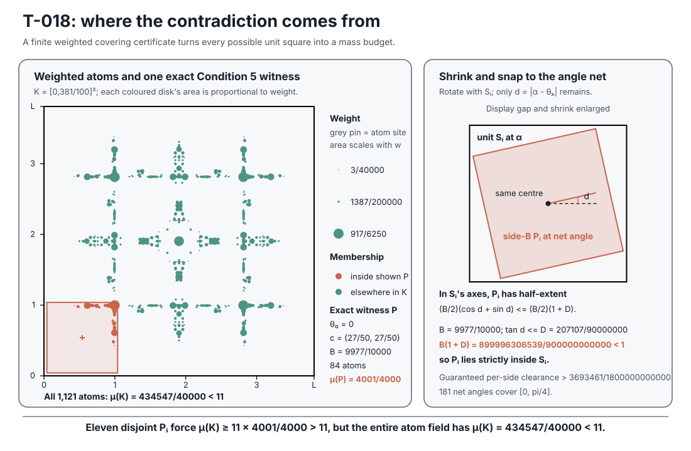

# One-minute proof that `s(11) ≥ 381/100`

Let `K = [0,381/100]²`, and let `μ` be the nonnegative atomic measure satisfying Facts
1–4 below. Suppose `K` contains eleven unit squares `S_i` with disjoint interiors.
Reduce each orientation modulo `π/2`. If it exceeds `π/4`, temporarily replace `S_i` by
`r(S_i)`, where `r(x,y) = (y,x)`. Since `r(K) = K` and `μ(rA) = μ(A)`, the transformed
square has an angle `α_i ∈ [0,π/4]` without changing the mass argument.

Because `0 = θ_0 ≤ α_i ≤ π/4 ≤ θ_180`, the nearer endpoint of the net interval
containing `α_i` has error `d` with `tan d ≤ D`. Its concentric closed side-`B` square
has half-extent

```text
(B/2)(cos d + sin d) ≤ (B/2)(1 + D) < 1/2,
```

along either axis of `S_i`, so it lies in `int(S_i)`. Fact 4 gives it mass at least
`4001/4000`; reflect it back if necessary and call it `P_i`.

The closed squares `P_i` are disjoint, hence

```text
μ(K) ≥ Σ_i μ(P_i) ≥ 11·4001/4000 > 11,
```

contrary to `μ(K) = 434547/40000 < 11`. Thus no packing fits in `K`; any smaller
container embeds in `K`, so `s(11) ≥ 381/100`. Only coordinate-swap invariance is used;
full D4 invariance is stronger than necessary, and no compactness claim is needed.



## The four exact facts

1. The 1,121 rational atoms lie in `K`, have nonnegative weights, are invariant under
   coordinate swap, and have total weight `434547/40000 < 11`.
2. With `T = 207107/500000`, `t_k = Tk/180`, and `θ_k = 2 arctan(t_k)`,
   `T² + 2T − 1 = 309449/250000000000 > 0`; therefore `θ_180 ≥ π/4`.
3. `D = max_{0≤k<180} tan((θ_{k+1}−θ_k)/2)` equals
   `max (t_{k+1}−t_k)/(1+t_k t_{k+1}) = 207107/90000000`, and
   `B(1 + D) = 899996306539/900000000000 < 1` for `B = 9977/10000`.
4. For every `k = 0,…,180`, every contained closed side-`B` square at orientation `θ_k`
   has mass at least `4001/4000`.

Facts 1–3 are direct rational checks; Fact 4 is the exhaustive computation below.
Its 181 asserted minima are not by themselves a proof.

## Exact finite form of fact 4

For each `k`, put

```text
c_k = (1 − t_k²)/(1 + t_k²),   s_k = 2t_k/(1 + t_k²),
h_k = (B/2)(c_k + s_k).
```

The required finite lemma is that, for every `(X,Y) ∈ [h_k,L−h_k]²`,

```text
Σ w_i ≥ 4001/4000,
```

where the sum is over exactly those atoms satisfying

```text
|c_k(x_i−X) + s_k(y_i−Y)| ≤ B/2,
|−s_k(x_i−X) + c_k(y_i−Y)| ≤ B/2.
```

Every number here is rational.
At fixed `k`, rotate the centre to `(U,V)`. Each atom then contributes on one closed
axis-aligned rectangle, whose four edge coordinates join a finite event grid.
Covered mass is constant on every open grid cell.
On an event boundary it can only increase, because the rectangles are closed and all
weights are nonnegative.
It is therefore enough to score every open event cell meeting the rotated
feasible-centre square.

The standard-library-only [`minimal_verify.py`](minimal_verify.py) does exactly that
with integer prefix sums.
It binds the retained file’s SHA-256
`b121edbd044b6f326022d8783551efd947c95eec2738269857d039358ac6ae6a`, examines 567,130,649
feasible cells, recomputes the minimum `4001/4000`, and scales every weight by
`3999/4001` to exhibit a must-refuse C4 witness at `3999/4000`. The larger
self-contained verifier in [`thirdparty/verify.py`](thirdparty/verify.py), when pointed
explicitly at the current certificate, independently obtains the same minimum, directly
re-summing each direction’s minimizing witness and any requested sampled feasible cells.
The separate interval branch-and-bound in
[`../../src/sqpack/fractional/interval.py`](../../src/sqpack/fractional/interval.py)
checks a doubled 361-direction net without using the reflection premise and obtains the
same one-point enclosure.
The older third-party package’s [`check.py`](thirdparty/check.py) provides the
independent known-answer control and fully checks the retained `19/5` rung, but is not
evidence for the extra `1/100` proved here.

<!-- This document follows common-doc-guidelines.md.
See github.com/jlevy/practical-prose and review guidelines before editing.
-->
