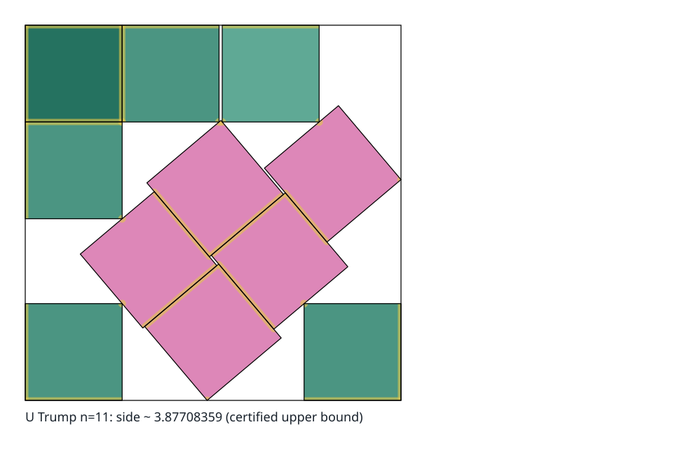

# `s(11)` — solved

**Verified exact value, 2026-09-30.** $s(11) = T$, the side of Walter Trump’s 1979
packing: $T = (6u+4)/(1+2u-u^2) = 3.87708359002281417730789706010096\ldots$, where $u$
is the unique root in $(9/25, 37/100)$ of $5u^8-10u^7-2u^6+14u^5+12u^4-6u^3+2u^2+2u-1$.
The exact witness gives the upper bound ([T-011](RESULTS.md)); independent exact replay
of Queuingtheorydotcom/11SquaresOptimal’s proof inputs gives the matching unrestricted
lower bound ([T-060](RESULTS.md), `V3/C3/S5`: machine-checked, review record pending).
The [proof review](../../docs/project/reviews/review-2026-09-29-n11-optimality.md) and
[retained evidence](../resources/web/n11-optimality-2026-09-29/README.md) identify the
shared mathematical dependencies and the four stale digests in the publisher’s cached
audits. This verifies global optimality.

**Unique, 2026-10-06.** [T-112](RESULTS.md) registers the corollary that follows
directly from T-060: its endpoint argument covers a packing of side exactly $T$ as well
as a smaller one, and there it forces Trump’s construction, so every optimal packing is
Trump’s after one of the eight symmetries of the container and a relabelling of the
squares (`V3/C2/S3`; the step at side $T$ is prose and adds no computation).
No earlier source found states it:
[Trump’s 2023 note](../resources/papers/trump-2023-packing-11-unit-squares.raw.md) and
[Friedman’s survey](../resources/papers/friedman-ds7-packing-unit-squares-in-squares.md)
call the packing rigid, a local property, and the
[upstream proof](../resources/web/n11-optimality-2026-09-29/source/PROOF.md#8-complete-case438-capture-and-the-exact-u-to-t-bridge)
states uniqueness only within its case 438. At ten squares
[Stromquist](../resources/papers/stromquist-1984-packing-unit-squares-inside-squares-ii-ten-unit-squares.md)
gives three different optimal packings, so a solved count need not have a unique
optimum.

**Explained in Papers I, II and III**, one series read in order:
[Part I](https://jlevy.github.io/squares/papers/n11-lower-bounds-explainer.html) (T-018,
T-025 and T-026),
[Part II](https://jlevy.github.io/squares/papers/n11-threshold-bound-review.html)
(T-037) and
[Part III](https://jlevy.github.io/squares/papers/n11-optimality-review.html) (T-060).

**Lean formalization, 2026-10-06.** The whole claim is one Lean 4 theorem,
`ElevenSquare.optimality` in
[Queuingtheorydotcom/11SquaresFormalized](https://github.com/Queuingtheorydotcom/11SquaresFormalized),
whose author, Ahmed, posts on X as
[@ManassehA06](https://x.com/ManassehA06/status/2107508501610217640) and announced the
formalization there on 6 October 2026: the optimality “has been formalized in lean
thanks to Astra and Claude”.
The owner [quoted that post](https://x.com/ojoshe/status/2107513739222380935) the same
day with the formalization’s context, calling it “a Lean formalization from @ManassehA06
assembled over the last few days, with assistance from @ctjlewis @guzhou0806 and
others”. The
[statement audit](../../docs/project/reviews/review-2026-10-06-n11-lean-formalization-statement-audit.md)
reads its statement as exactly $s(11) = T$ over this record’s model: closed unit squares
with independent rotations, boundary contact allowed and open interiors disjoint.
The source reports that its full verification run, in a private repository and resumed
from earlier validated receipts, passed with its final axiom audit; by that audit the
theorem rests on Lean’s three standard axioms and on 13,308 `native_decide` axioms, so
it trusts Lean’s compiler as well as its kernel.
It is recorded as the source’s report on T-060 (`E-n011-lean-formalization-report`,
[packet](../resources/web/queuingtheorydotcom-n11-lean-2026-10-06/README.md)) and moves
no rung. The full build was not repeated here; the 18 modules that define the statement
and Trump’s packing at side $T$ were, on the standard axioms alone
(`E-n011-lean-statement-closure-build`). No complete build this record can rest on, and
no human expert’s review of the formalization, is retained yet.

**Historical lower bound, 2026-09-30.** Ke Wang and Can Li’s certificate (Zenodo
23038546, 29 September 2026, [T-061](RESULTS.md)) proves
$s(11) > 3875000000/999999999 = 3.875000003875\ldots$, $31/7999999992$ above $31/8$. It
is Kleddamag’s certificate below with thirteen threshold-charge orbits raised, which
lifts the minimum core charge to 1,000,047,559 on every interval, and with the parent
and every core side scaled by $999999999/1000000000$; eleven cores then exceed the
budget 11,000,095,024 by 428,125 units.
The step is slack spent rather than new structure: the scale factor $1 - 2\cdot10^{-9}$
already fails at row 615, so these data give at most about twice the step.
Kleddamag’s own weights, scaled the same way and not reweighted, also pass a full sweep,
so the reweighting is not needed for the bound
([receipt](../resources/web/wang-li-n11-2026-09-29/receipts/scale-only/run.log)). The
authors’ two verifiers and Kleddamag’s own Python and JavaScript sweeps pass on the
retained certificate, and this repository’s native interval coverage accepts all 12,028
rows, so the bound stands at `V3/C3` on two machine methods, a strict bound that T-060’s
equality supersedes.
The packet is
[wang-li-n11-2026-09-29](../resources/web/wang-li-n11-2026-09-29/README.md), and the
[mathematical review](../../docs/project/reviews/review-2026-09-30-issue-247-wang-li-n11.md)
re-derives every hypothesis at the scaled sides.
The release makes no statement about AI assistance; on jlevy/squares#247 the authors
wrote that “AI assistance was used for most of the computational exploration, code
drafting and checking, organization of verification outputs, and preparation of the
written materials.”

**Earlier verified lower bound, 2026-09-22.** Kleddamag’s pinned v1.0.2 certificate
proves $s(11) > 31/8 = 3.875$. Both complete exact source sweeps passed locally across
all 12,028 parent-angle intervals, with minimum charge 999,962,528 units and total
budget 10,999,479,944 units: eleven cores exceed that budget by 107,864 units.
The complete source, proof dependencies and replay records are retained in the
[external certificate packet](../resources/web/external-square-certificates-2026-09-22/README.md).
The
[mathematical review](../../docs/project/reviews/review-2026-09-22-kleddamag-n11-mathematics.md)
checks the threshold budgets, strict core containment, complete centre domains, exact
arithmetic and boundary argument.
The
[replay receipt](../resources/web/external-square-certificates-2026-09-22/receipts/n11/full-replay/RESULT.json)
and
[independent audit](../resources/web/external-square-certificates-2026-09-22/receipts/n11/independent-audit.json)
support `V3/C3` by themselves, as one machine method: the Python and JavaScript scanners
implement the same event-cell method.
The source’s `ATTRIBUTION.md` says the work builds on Joshua Levy, the squares project,
developing its certificate from this repository’s `T-026`, that its JavaScript checker
adapts Guzhou0806 / N17 project’s R038 checker, and that it inherits the Levy, Guzhou
and Mira lineage of the $s(17)$ work; its `AUTHORS.md` says Kleddamag commissioned and
directed the research and OpenAI Codex developed the mathematical and computational
continuation.

Session 153’s
[complete native decision](../campaign/agent-sessions/session-153-native-full.json)
independently certifies all 12,028 rows by directed-rounding box coverage and direct
threshold counting.
Every row reaches the exact charge threshold, with zero stalled boxes
and no exhausted budgets or refutations.
The
[native mathematical review](../../docs/project/reviews/review-2026-09-22-native-n11-parent-core.md)
checks the full parent-centre domains, strict core containment and the complete transfer
to unit-square packing.
The two complete coverage methods confirm the strict $31/8$ bound at `V3/C3`, two
methods, with the review record pending.
This confirms Kleddamag’s published bound without a new result identifier.
Tokoharu’s separately replayed rectangle-density bound $381/100$ is numerically weaker.
Tokoharu’s README says parts of the work were produced with AI assistance under human
direction.

The certified interval before T-060 was
$3875000000/999999999 < s(11) \le 3.87708359002281417730789706010096\ldots$ (T-061), and
$3.875 < s(11)$ under T-037 before that.
T-060 closes that gap at Trump’s exact algebraic endpoint.

The earlier first-party lower bounds remain in the register as history and method
evidence. T-026’s exact lower bound is
`955000*sqrt(518400042893309449)/179696714646249 = 3.826447410572939744...`, proved by
an exact dilation-limit argument at `V3/C3` (it held `V4/C5` until 2026-09-30). T-033
tightens the same retained family to the exact lower bound
`955000*sqrt(2073600042893309449)/359341754646249 = 3.826997548829543...` at `V3/C3`;
its certificate was decided by both the exact event-cell sweep and a distinct interval
branch and bound, while the load-bearing dilation step has one exact-algebraic decision.
The external certificate closes **95.89%** of the interval between T-026 and Trump’s
construction, the correctly rounded percentage in the supplied post.
The two routes share the certificate data and theorem statement.
For T-033, that pair confirms the source certificate by distinct methods, but the bound
is derived from it by a single exact-algebraic step, and a derived claim takes the
minimum over its parts.
The derivation sets the rung.
No review of that derivation is mapped; T-026’s mapped source-distinct review is scoped
to the 1440-step claim.

The upper construction has stood since 1979. The previous lower bound was Stromquist’s
`2 + 4/sqrt(5) = 3.788854…`, stated in
[1984, Memo III, p. 10](../resources/papers/stromquist-1984-packing-unit-squares-inside-squares-iii-cases-through-65-and-gardner-conjecture.pdf)
and published in 2003. On 2026-09-04, a first-party weighted fractional unavoidable-set
certificate at side $381/100$ ([`T-018`](RESULTS.md)) proved that eleven unit squares do
not fit in a container of side $3.81$. The recorded source search found no intervening
improvement. An exact refinement of the containment step and the resulting strict
rational-dilation family then prove the lower bound
`38100*sqrt(8100042893309449)/899996306539 = 3.810025723614703...`
([`T-022`](RESULTS.md)). On 2026-09-09 the same atoms, re-certified on the 1440-step
direction net at the larger shrink the finer net admits, and dilated by the same
argument, prove the lower bound
`3175000*sqrt(518400042893309449)/598960960743657 = 3.816609502788862...`
([`T-024`](RESULTS.md)).

T-018’s certificate moved the bound by about $+0.021146$; T-022 adds another
$0.0000257236147034$, T-024 another $0.0065837792$, T-025 another $0.0033904972$, T-026
another $0.0064474106$, and T-033 another $0.0005501383$, for total first-party movement
of about $+0.038143167$ beyond Stromquist before the stronger external replay recorded
above.

One thousand one hundred and twenty-one weighted atoms on a D4-symmetric site set carry
total mass $434547/40000$, and every placement of a shrunken square covers mass at least
$1$, the least being $4001/4000$; the certificate is decided from its frozen bytes by an
exact event-cell sweep and by an interval branch and bound that agree on that value to
the digit. Two rungs are retained below it: $19/5$, the value that first passed
Stromquist, and a calibration rung at $189/50 = 3.78$, *below* Stromquist’s bound, where
the same construction proves nothing new; it was run first on purpose, as the diagnostic
registered in advance.
Stromquist’s own value keeps its place in the record: exp-017 supplies the independent
exact certificate for it after exp-016 refuted his printed Figure 14 cover, and that
history is unaffected.
Side $3.82$ was attacked from both sides and neither route closes: two independent site
sets stop at a covering value of exactly eleven, and the rejection route’s exact maximum
depth caps its feasible total at $1152/175$ against the eleven a ceiling needs.
That is recorded as measurement, not as a claim about the covering value.
On 2026-09-09 the rejection route closed: an exact depth-one family of eighty-eight
closed $B$-squares at six net directions, of total weight exactly eleven, retained as
`campaign/series/series-000-smoke-and-calibration/results/agenda-034/ceiling-family-191-50.json`
and decided both by the ceiling verifier and by an independent reader written from the
statement, proves that no D4-symmetric point-atom measure of mass below eleven exists at
$3.82$ for the retained shrink on any net containing those six directions.
The plateau is therefore a theorem about the method, and the recorded restricted optima
of exactly eleven were reading it; scaled to unit squares the same family caps the
one-body point method at unit side $3.8288$.

[T-023](RESULTS.md) excludes one specified four-owner case at side $96/25 = 3.84$: four
guaranteed occupied patches leave a residual domain pierced by five fixed dots, so at
most five further squares fit where eleven would require seven.
The composed result is V3/C3: an exact complete-net check plus audited geometric
transfer to arbitrary physical angles.
It does not cover every owner combination and does not change either verified bound.
The
[illustrated report](../campaign/series/series-000-smoke-and-calibration/results/agenda-032/sprint-report.md)
gives the statement, experiments, proof links and ordered continuation.

[T-031](RESULTS.md) excludes the all-free (octagon) corner class at the same side
$96/25$: a weighted fractional certificate of mass $10868617/1000000$ on the row domain
clipped by the four corner triangles `x + y <= 1/2` charges at least $2000013/2000000$
to every admissible core avoiding them, so every packing of eleven unit squares in a
square of side $3.84$ has a square meeting an open corner triangle at some corner.
Both gate routes decide the frozen bytes (V3/C3: the two routes are one gate invocation,
so they count as one machine method).
The all-deep class is separately outside the point language for every site set, so the
corner tree cannot close at this side by clipping alone; the exclusion changes no bound.
These $3.84$ case exclusions remain historical method evidence.
The new global lower bound already excludes every packing at that side, so closing more
classes there would no longer advance the strongest numerical bound.
The register therefore marks `T-031` superseded by [`T-060`](RESULTS.md), since it
states nothing about packings beyond its exclusion, and `T-023` superseded in part: its
count, at most five squares beside the four owners and nine in all, is a statement about
ten squares, which `T-060` does not reach.

*Six axis-aligned squares surround a five-square block at an algebraic tilt near
`40.18°`. Segments and dots show exact edge and point contacts.
The witness supplies the upper bound; T-060 supplies the matching global lower bound.*

## Why the former gap was difficult

The best known packing is Walter Trump’s, found in 1979 and reportedly computed on an
HP-67 programmable calculator.
Six squares are axis-aligned and five form a tightly constrained block tilted at
$a \approx 40.1819372903^\circ$—an angle that is neither 0° nor 45°, which is what makes
the case famous. Its contact equations determine the displayed side value, a root of an
irreducible degree-8 polynomial over $\mathbb{Q}$. Exp-013 now supplies an exact
qualitative local certificate: every branchwise fixed-side linearized cone is zero, so a
finite- branch subsequence argument locally isolates the pose.
That local certificate does not supply a numerical isolation radius or the global proof;
the latter is the separately verified T-060 result above.

That degree explained why the earlier low-degree approaches were inconclusive.
Before T-060, every solved case had $s(n)$ of degree ≤ 2, while familiar
unavoidable-point arguments produced low-degree thresholds.
The corpus contains no theorem bounding the algebraic degree such arguments can certify.
A degree-8 target may demand richer geometry, but it does not by itself rule out the
method.

## What rigidity does and does not buy

A complete local rigidity certificate now controls the packing in some neighborhood.
The tangent-cone computation does not quantify that neighborhood; the separate BC-240
packet does, and its radius is retained rather than registered (see the `rigidity` scope
above). The exact contact equations make its algebraic value computable, but this local
certificate says nothing about whether a *different* contact class does better.
T-060’s global exclusion and capture argument supplies that missing step.
Fifty years of search, including a purpose-built inflation/billiard algorithm, has not
found one. Global solvers are not part of that record: no global solver runtime has been
measured here, and the hybrid-strategy review of 2026-09-07 says so in as many words.
That once raised confidence in the conjecture but supplied no proof: a search that fails
to find something better has certified nothing.

Since 2026-09-24 the register also holds a statement about every packing in one
restricted family that contains Trump’s packing.
Freeze the five tilted squares to within $10^{-6}$ of Trump’s tilt in the half-tangent
and keep the other six axis-aligned: [`T-035`](RESULTS.md) reduces every packing in that
family at side at most $U$ to the BC-240 ball around Trump’s labelled pose, by a closed
exact cell tree that an independent reader replayed in full, and [`T-036`](RESULTS.md)
composes it with BC-240’s first clause, so no packing in the family has side below $U$
and only Trump’s pose, up to quarter turns and relabelling, attains it.
It is the first optimality statement with an equality case for a family containing
Trump’s packing; Stromquist’s $0^\circ$/`45°` bound is an earlier restricted-orientation
statement. It says nothing about any other tilt and moves no bound on $s(11)$; its
certificate tree is retained outside the record, which keeps a manifest of it.
[`T-060`](RESULTS.md) has since settled $s(11) = T$, Trump’s side, which is `T-036`’s
$U$, and that gives every packing of eleven squares, in the family or not, a side of at
least $T$, so the register marks `T-036` superseded in part by it.
Its equality case followed on 6 October 2026: [`T-112`](RESULTS.md), the uniqueness
corollary of `T-060`, makes Trump’s packing the only one at $T$ up to the container’s
symmetries and relabelling, in the family or not.
Each of the two implies a part of `T-036` and together they imply all of it; the
register marks it superseded in part by each, since it has no mark for a supersession
that two results make jointly.

## The most misunderstood point in the literature

Stromquist’s 2003 paper is routinely described as having *proved* Trump’s packing
optimal. It did not.
It stated a lower bound of $3.788854$, which does not match $3.877084$; exp-016 also
shows that its printed Figure 14 proof is false.
Exp-017 independently restores the same lower bound with a source-distinct repaired
point set. What Stromquist did prove without that repair was **Gardner’s conjecture** —
that $n = 11$ is the first case requiring non-45° orientations — by bounding the 0°/45°
class below at $3.885618$ and pointing at Trump’s smaller value.
A qualitative question resolved while the quantitative optimum stayed open.

## Provenance of the exact solution

Distinct from the packing itself, and a second source of confusion.
Gensane and Ryckelynck (2005) computed the first exact algebraic characterization, by a
14-equation Maple elimination, publishing the cosine of an angle offset 45° from the
standard tilt — verified here to be $\cos(45^\circ - a)$. Their paper’s claim to have
“improved” $n = 11$ refers to sharpening the *recorded decimal* for Trump’s own
configuration from $3.8772$ to $3.87708359$, not to a denser packing.
David Ellsworth obtained the reduced degree-8 minimal polynomial in June 2023 and showed
two contact equations suffice where fourteen had been used; Boris Alexeev confirmed it
independently thirteen hours later by a different method.

## Formal results replayed in this repository

The evidence references above keep three questions separate: what a source reports, what
is formal, and what this repository has replayed or audited independently.
The exact separating-axis verification, all 128 linearized-cone certificates, and the
exp-017 repaired lower-bound certificate are reproducible with
`uv run --frozen --group dev packing-validate`. The 14 pairs that touch with *exactly
zero* gap are the ones no floating-point checker can certify, which is the practical
reason exact arithmetic is needed at all.

## The Exact-Containment Limit Corollary

The retained $381/100$ certificate proves slightly more than its own container side.
Dilating every atom position, the container side, and the shrunken side by one factor
$q$ leaves Conditions 2 and 3 unchanged, carries Condition 1 equivariantly, and
preserves Condition 5 through inverse dilation of placements.
The frozen theorem bounds the angular support coarsely by $1 + D$. The exact worst-case
support factor is `(1 + D)/sqrt(1 + D^2)`, so strict containment after scaling is the
rational test $q^{2} B^{2}(1 + D)^{2} < 1 + D^{2}$. The strict family has factor
supremum `10000*sqrt(8100042893309449)/899996306539` and side supremum
`38100*sqrt(8100042893309449)/899996306539 = 3.810025723614703...`.

Set `C_022 = 38100*sqrt(8100042893309449)/899996306539`. `T-022` proves that $C_{022}$
is a lower bound for $s(11)$. For any real side below it, rational density supplies one
of the strict rational no-fit sides above that candidate; a packing in the smaller
container would embed in that larger one.
This uses the infimum definition of $s(11)$, not compactness or attainment.
The conclusion is the ordinary non-strict lower bound `s(11) >= C_022`. The direct
certificate family covers strict rational sides below $C_{022}$; the sharpened
containment test is equality at $C_{022}$, so the proof does not supply an
individual-side certificate at $C_{022}$ or establish $s(11) > C_{022}$. The theorem is
the displayed lower bound.
This is the supremum only for uniform fixed-`B` dilation with one concentric core and
strict support containment; stronger use of the same atom or coverage-cell data remains
open. The exact proof, source hash, full five-condition replay, and refusal boundary are
in the
[T-022 proof packet](../cases/n11_fractional_certificate/t-022-dilation-limit-proof.md).

`T-024` applies the same argument to the same atoms on a finer net.
Condition 4 ties the shrink to the net’s largest half-gap tangent $D$, so a finer net
admits a larger shrunken side; the frozen T-018 weights, multiplied by one rational
factor, still cover every closed core on the 1440-step net once the shrink is
$2494953/2500000$, and the resulting certificate at $381/100$ was decided by both routes
of the retention gate.
Its strict dilation family has side supremum
`3175000*sqrt(518400042893309449)/598960960743657 = 3.816609502788862...`. Rational
density and upward embedding therefore prove the displayed non-strict lower bound.
The proof has no individual-side certificate at that algebraic value.
A 720-step certificate is retained beside it, with its own lower bound, because it is
the rung the standalone reader also decides.
The exact ceiling family at $191/50$ shows that no certificate of this one-body form can
be dilated past unit side $3.8288$, so the route ends about $0.011$ above these
certificates; the proof, the crossing measurements and the replay commands are in the
[T-024 proof packet](../cases/n11_fractional_certificate/t-024-dilation-limit-proof.md).

The same corollary runs on threshold atoms without a new theorem, which is what `T-026`
below does with T-025’s. The one thing the argument needs beyond the point case is that
every threshold atom’s points scale with the point atoms: a core’s trace on the scaled
points is the trace of its preimage on the unscaled ones, so `Condition 5'` survives
inverse dilation for the reason `Condition 5` does.

## The Threshold Certificate at `191/50`

`T-025` leaves that route rather than extending it, and it is the first certificate here
to pass the point method’s own ceiling.
Beside 584 point atoms it carries 320 *threshold atoms*: a threshold atom $(S, k, w)$
charges $w$ to every admissible core containing at least $k$ of the points of `S`, and
because pairwise disjoint cores divide `S` between them, one such atom can charge at
most `floor(|S| / k)` of them — so `w floor(|S| / k)` of budget pays for it.
Every one of these is $2$-of-`3`, buying two points’ worth of coverage for one point’s
worth of budget. The total budget is $685457679/62500000 = 10.967322864$, below eleven
with margin $0.032677136$; the least charge over every event cell at every one of the
181 net directions is $100000203/100000000$; its historical conclusion was
`s(11) >= 191/50 = 3.82` at V3/C3 (it held V4/C5 until 2026-09-30). The finite
certificate is instantiated at its named side, $191/50$; no dilation family is part of
T-025. The frozen bytes were decided by the same two-route gate the fractional rungs use
— the exact event-cell sweep and the interval branch and bound — which agree on the
least charge to the digit, and the theorem was attacked in a
[source-distinct adversarial review](../../docs/project/reviews/review-2026-09-09-threshold-certificate-theorem.md)
before the certificate was registered.
The exact ceiling family above is what makes this the only way past $3.82$ for a
certificate of this shape: no D4-symmetric point-atom measure of mass below eleven
exists at this side, and the threshold atoms carry $2.293641$ of budget the point method
cannot have. The statement, the counting proof, the frozen premises and the replay
commands are in the
[T-025 proof packet](../cases/n11_threshold_certificate/t-025-threshold-certificate-proof.md).

`T-026` put those same atoms on a finer net.
Condition 4 ties the shrink to the net’s largest half-gap tangent $D$, so the 1440-step
net admits a larger shrunken side; the frozen weights, multiplied by the single rational
factor $500000000/498684619$, charge every closed core of side $249507/250000$ at every
direction of that net, one $10^{-7}$ grid step above the largest shrink at which the
finer net fails. The rescaled budget is $5483661432/498684619 = 10.996251384$, still
below eleven, and both routes of the retention gate return least cell charge exactly
$1$. Dilating that certificate under T-022’s sharpened containment test, then applying
rational density and upward embedding, proved the historical first-party bound
$3.826447410572939\ldots$, which T-033 later tightened.
The 720-step rung retained beside it has lower-bound value $3.825347845913112\ldots$, so
$0.0011$ of that was what halving $D$ bought and nothing else.
The proof, crossing measurements, and replay commands are in the
[T-026 proof packet](../cases/n11_threshold_certificate/t-026-dilation-limit-proof.md).

`T-033` turns the same lever once more, and it is the last turn worth much.
The 2880-step net halves $D$ again, to $207107/1440000000$ over its 2881 directions, and
the crossing shrink does not move: the same frozen atoms at the same weights still
charge every closed core of side $249507/250000$, now at every direction of the doubled
net, so the rescaled budget and the least cell charge are `T-026`’s unchanged and the
two records differ in `direction_steps`, in their `id` and `provenance`, and in no other
field. Both routes of the retention gate accept the frozen bytes and agree at exactly
$1$. The same dilation argument with the new $D$ gives the displayed T-033 supremum,
$0.000550138$ above `T-026`’s value — half of what the previous doubling bought, which
is what halving $D$ alone predicts.
The direct certificate family for T-033 covers strict rational sides below its displayed
supremum; the sharpened containment test is equality there, so the proof supplies no
individual-side certificate at the supremum and establishes no strict inequality there.
The side $191/50$ remains the largest side with an individual-side certificate in the
retained T-025/T-026/T-033 fixed-core family at the time T-033 was registered.
The rescaled budget sits within $0.004$ of the eleven a certificate may not reach, and
the registered side is within $0.000550$ of $955000/249507$, the ceiling the retained
shrink leaves for any further refinement.
That ceiling is below $31/8$, the external bound verified on 2026-09-22 as T-037, and
T-060 has since settled $s(11) = T$, so unchanged-family net refinement cannot improve
the global bound. Changed weights, sites, parent domains, and charge atoms remain
separate hypotheses.
`T-033` reuses T-022’s argument unchanged, at the same $B$ and a halved $D$, so it has
no proof packet of its own and cites T-026’s; that derivation step is decided by one
entry of one method.
The result is `C3`, machine-replayed here, and no review of it is mapped.
The frozen bytes, the limit record and the replay commands are in the
[case package](../cases/n11_threshold_certificate/), and the run that produced them is
in the
[exp-226 receipt](../campaign/series/series-000-smoke-and-calibration/results/agenda-041/exp-226-n11-net2880-receipt.md).

<!-- BEGIN verification code: written by devtools.render_case_verifiers -->

## Verification Code

The programs behind this case’s verified bounds, by their evidence.
The code column says how the code that ran stands to the code its producer used.
[`VERIFIERS.md`](VERIFIERS.md) says what each program is and whose it is.

| bound | evidence | run | code | programs |
| --- | --- | --- | --- | --- |
| verified lower | `E-n011-global-optimality-independent` | audited here | shared components | `V-n11-optimality-checkers` (first-party); `V-check-n11-final-composition` (first-party, premises) |
| verified upper | `E-n011-trump-upper` | replayed here | independent | `V-sqpack-verify` (first-party) |

<!-- END verification code -->

<!-- This document follows common-doc-guidelines.md.
See github.com/jlevy/practical-prose and review guidelines before editing.
-->
