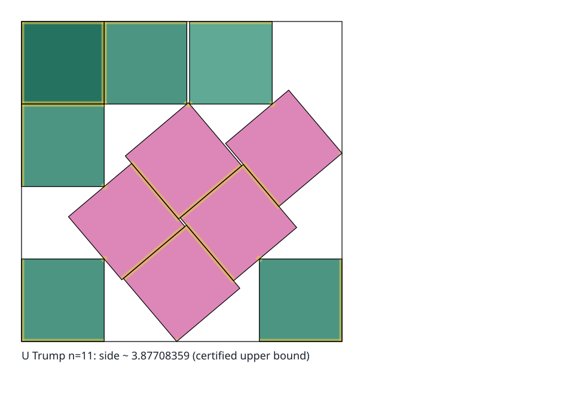

# Mathematical Background and Source Lemmas

Selected first-principles exposition, literature references and Stromquist's source lemmas. The transcription preserves its explicit proof-gap warnings. Its references to unavailable figures are historical; the restricted assessment in file 12 supplies the concrete points and domains used by the current program. The older printed Figure 14 argument must not be treated as a valid global proof.

## Current Qualifications to the Historical Sources

The tutorial's blanket statement that proof-assistant formalization is unbuilt is historical. File 02 distinguishes the later Lean source proofs from a replayed formal build and from end-to-end certificate formalization. Degree eight is not a proved obstruction to unavoidable-set methods.

Dewar's extracted contact bounds assume the weak generic condition on radii stated in Theorem 1.1. Eleven equal unit widths violate it: choose one coefficient +1, another -1 and nine zeroes. Thus the 2n-2 formula cannot be used here as a contact cap. The raw excerpts at the end preserve the archive's extraction typography.

<a id="source-1"></a>

## Source 1: `TUTORIAL.md`

Snapshot `4d305597a505`, source lines 35-123.

<a id="source-1-1-the-problem"></a>

#### 1. The Problem

`s(n)` is the side of the smallest square that contains `n` non-overlapping unit
squares, each free to translate **and rotate**. Here, “smallest” is exact rather than
approximate: the set of achievable sides is closed, so the infimum is attained and a
best packing exists ([Martin 2000](16-mathematical-background-and-literature.md#source-4-11-further-reading)).

Two bounds are immediate:

- **Area:** `s(n) ≥ √n`, because `n` unit squares have area `n`.
- **Grid:** `s(n) ≤ ⌈√n⌉`, by the axis-aligned grid packing.

At `n = 11` those give `3.3166… ≤ s(11) ≤ 4`, and the whole subject lives in that
interval. For a perfect square `s(m²) = m`, since the two bounds meet, and there is
nothing to say about the side value.
Some of the most interesting cases lie just above a perfect square, where improving on
the next grid side can require tilted structure.



*The best-known `n = 11` construction.
Six squares are axis-aligned; five form an oblique block tilted by about `40.18°`.
Segments mark shared edge intervals and dots mark point contacts, all computed in the
construction’s exact number field and clipped to their participating squares.
The picture certifies a construction, not its global optimality.*

Three features make this different from most optimisation problems.

**Touching is legal, and good packings touch constantly.** Disjointness is required of
*interiors* only.
In the best-known `n = 11` packing, 14 of the 55 pairs are separated by
exactly zero and 20 corner coordinates lie exactly on the container boundary.
Optimal packings are boundary-constrained.
Some have a **jammed backbone**, a contact-constrained subset that cannot move
collectively, while others contain **rattlers**, squares that can move without changing
the container side, or continuous optimal families.
This is why exactness here is representational rather than numerical
([§5](16-mathematical-background-and-literature.md#source-3-5-algebra-versus-numerics)).

**Every upper bound in the history of the subject is a construction.** No
non-constructive upper bound has ever been obtained.
So “searching for a better packing” is not one method among several for improving the
upper bound—it is the only one anybody has.

**`n = 11` is the first case where genuinely oblique tilt is proved to improve on the
`0°`/`45°` class.** Stromquist proved that packings restricted to those two orientation
classes cannot beat `2 + (4/3)√2 ≈ 3.885618`, which is *worse* than the best-known
packing at `≈ 3.877084`. Stromquist’s result gives a concrete reason that `n = 11`
differs from the proved tilted cases at `n = 5` and `n = 10`.
[Section 7](14-search-and-near-tight-evidence.md#source-2-7-how-the-search-is-approached-and-why) uses that distinction to motivate
its search strategy.

<a id="source-1-the-state-of-n--11-in-one-table"></a>

##### The state of `n = 11`, in one table

|  | value | status |
| --- | --- | --- |
| best-known packing (upper bound) | `3.87708359002281417730789706010096…` | Trump 1979, a construction |
| proved lower bound explained here | `381/100 = 3.81` | [T-018 (source archive)](https://github.com/jlevy/squares/blob/4d305597a505ebfbe85f1851fa7148374661e622/packing/frontier/RESULTS.md), an exact weighted atomic certificate; see [below](07-standalone-381-proof.md#source-1) |
| gap between these bounds | about `0.067084` | still open |

The technical record retains the small refinement `s(11) ≥ 3.810025723614703…` in the
[T-022 proof packet](08-dilation-limit.md#source-1).
It is a weak limit bound and does not decide fit at that endpoint; the table uses the
simpler certificate bound proved below.

Two different quantities get called a gap in this subject, and this document keeps them
apart. The **bound gap** is the distance between the best upper and lower bounds, which
is what remains unknown about `s(11)`. A **search gap** is `best_side − standing best`,
the signed distance from one packing this project found to the best one anybody has
published, and it is what [§3](14-search-and-near-tight-evidence.md#source-1-3-cells-basins-and-two-traps) onward measures.
The first is a property of the problem; the second is a property of a run.

**The previous lower bound also led to a proof repair.** Stromquist’s 2003 Theorem 2 was
the published source for `2 + 4/√5 = 3.788854382…`, and this repository found that its
printed proof is **false as printed**: an exact open box of side `10001/10000` fits the
claimed container and strictly avoids all twelve printed Figure 14 points.
A separately preregistered, source-distinct repair—moving one point from `(.8, 1.85)` to
`(.79, 1.85)`—restores the whole argument and certifies the same inequality exactly
([exp-016 (source archive)](https://github.com/jlevy/squares/blob/4d305597a505ebfbe85f1851fa7148374661e622/packing/campaign/series/series-000-smoke-and-calibration/experiments/exp-016-h-010-stromquist-printed-figure14.md),
[exp-017 (source archive)](https://github.com/jlevy/squares/blob/4d305597a505ebfbe85f1851fa7148374661e622/packing/campaign/series/series-000-smoke-and-calibration/experiments/exp-017-h-041-stromquist-repaired-figure14.md)).
The inequality stands; the printed derivation of it does not.
The synopsis records the repair as **T-4** and the falsification as the round that
terminally refuted the hypothesis it was registered against.
That value is no longer the best lower bound for `n = 11`; displacing it was the point
of the certificate below.

The episode is why this repository treats published proofs as source claims and tests
them with exact counterexample searches.

<a id="source-2"></a>

## Source 2: `TUTORIAL.md`

Snapshot `4d305597a505`, source lines 231-380.

<a id="source-2-2-the-configuration-space"></a>

#### 2. The Configuration Space

A **configuration** places every square and fixes the container.
Square `i` has a centre `(xᵢ, yᵢ) ∈ ℝ²` and an angle `θᵢ ∈ [0, π/2)`, and the container
has side `s`. Angles stop at `π/2` because a unit square is unchanged by a quarter turn,
so larger angles name poses already counted.

Throughout, a subscript `i` picks out one square and a bare letter is the whole
`n`-vector: `θ = (θ₁, …, θₙ)` is all `n` angles at once, and `x` and `y` are the `n`
centre coordinates each.
So “fix the angles” always means fix all `n` of them.
Counting scalars, a configuration is `3n + 1` real numbers—**34 at `n = 11`**.
[§10](16-mathematical-background-and-literature.md#source-4-10-a-notation-card) collects every symbol used in this document.

Read naively, this is a 34-dimensional nonconvex problem with `C(11,2) = 55` disjunctive
constraints, and it is not obvious where to push.
The central structural insight of this project is that the naive reading is the wrong
decomposition.

<a id="source-2-the-cell-decomposition"></a>

##### The cell decomposition

Two convex polygons have **disjoint interiors** exactly when some line separates them,
weakly—touching is allowed, and the separating line may run along the shared edge.
For polygons it suffices to test lines parallel to their edges.
A square has two distinct edge normals, since opposite edges are parallel, so each pair
of squares has four candidate axes, and for each axis a choice of which square lies on
the low side.

> A **cell** of configuration space is a choice, for each of the `C(n,2)` pairs, of one
> candidate separating axis together with an order.
> A configuration *lies in* a cell when those choices genuinely separate those pairs in
> that order.

Four axes times two orders is eight choices per pair, so there are at most `8^C(n,2)`
cells—about `4.7 × 10⁴⁹` at `n = 11`. Most are empty, because the choices must be
jointly realisable by an actual configuration, but even as a crude bound the number says
what kind of difficulty the discrete half carries.

Now fix the angle vector `θ` **and** fix a cell.
Write `Rᵢ` for rotation by `θᵢ`, so the four corners of square `i` are
`(xᵢ, yᵢ) + Rᵢ·(±½, ±½)`, and write `oᵢₖ ∈ ℝ²` for those four corner offsets, `k = 1…4`.
Four things become true at once:

1. Once `θᵢ` is fixed, the offsets `oᵢₖ` are **constants**, so every corner is an affine
   function of the centre alone.
2. Containment is **linear**: each corner satisfies `0 ≤ xᵢ + oᵢₖ,ₓ ≤ s` and
   `0 ≤ yᵢ + oᵢₖ,ᵧ ≤ s`, writing `oᵢₖ,ₓ` and `oᵢₖ,ᵧ` for the two components of `oᵢₖ`.
   Note `s` appears here, and only here, as a variable.
3. Separation along a *fixed* axis is a **linear** inequality.
   For axis `ν` and the order `i` before `j`, every corner of `i` projects at or before
   every corner of `j`: `⟨ν, (xᵢ,yᵢ) + oᵢₖ⟩ ≤ ⟨ν, (xⱼ,yⱼ) + oⱼₗ⟩` for all `k, l`.
   Because the cell fixes both `ν` and the order, there is no absolute value and no case
   split left.
4. The objective is `s` itself, which is **linear**.

So the whole problem, restricted to one cell at fixed angles, is

```
minimise    s
over        x₁…xₙ, y₁…yₙ, s          (2n + 1 variables; 23 at n = 11)
subject to  0 ≤ xᵢ + oᵢₖ,ₓ ≤ s       for every square i and corner k
            0 ≤ yᵢ + oᵢₖ,ᵧ ≤ s
            ⟨ν_ij, (xᵢ,yᵢ) + oᵢₖ⟩ ≤ ⟨ν_ij, (xⱼ,yⱼ) + oⱼₗ⟩   for every pair (i,j)
```

with every `oᵢₖ` and every axis `ν_ij` a constant, determined by `θ` and the cell.
That is the result the synopsis calls **T-2**.

**Why that is good news.** A **linear program** minimises a linear objective over linear
inequalities. Its feasible region is a polyhedron.
For the feasible packing LP above, whose finite optimum is attained and whose feasible
region has vertices, one can choose an optimum at a vertex.
The class is solvable in polynomial time and is fast in practice; representative project
solves took about `1.28 ms` in the
[recorded infrastructure benchmark (source archive)](https://github.com/jlevy/squares/blob/4d305597a505ebfbe85f1851fa7148374661e622/docs/project/research/research-2026-08-22-infrastructure-for-packing-exploration.md).
Two further properties matter later.
The set of constraints holding with equality at the optimum is its **active set**, and
the corresponding **optimal basis** is the subset of them the solver uses to pin the
vertex down; [§4](14-search-and-near-tight-evidence.md#source-1-4-the-corner) turns entirely on what happens when that basis changes.
And a linear program can be solved *exactly* over rational coefficients, which is why
the floating-point floor in [§5](16-mathematical-background-and-literature.md#source-3-5-algebra-versus-numerics) is a limit of the
implementation rather than of the mathematics.
[§11](16-mathematical-background-and-literature.md#source-4-11-further-reading) points to a proper treatment.

The solver this project actually calls is **HiGHS**, an open-source high-performance
linear and mixed-integer optimizer, reached through SciPy.
It works in floating point, so it does not return the exact optimum of the cell it is
given—it returns one within a declared **feasibility tolerance**, the margin by which a
returned solution is allowed to violate its own constraints.
That tolerance is where the floor in [§8 (source archive)](https://github.com/jlevy/squares/blob/4d305597a505ebfbe85f1851fa7148374661e622/TUTORIAL.md#8-what-is-known-and-what-is-not) comes from,
and setting it too loosely once produced a packing that violated its own separation
constraint, and so a side below the standing record.

**All the nonconvexity has been pushed into exactly two places**: the trigonometric
dependence of the offsets and axes on the angles, and the *discrete* choice of cell.
That factorisation—a small continuous part times a large combinatorial part—is the
premise underneath almost everything else here.

The two independent formulations use different constraint assemblies but describe the
same feasible set. `sqpack.research.quench` uses one separation row per pair;
`cases.trump11.independent_lp_cell` uses sixteen, one per ordered corner pair, for
`1,056 = 16 × (11 + 55)` rows at `n = 11`. They share no constraint-assembly code.

The check that makes it concrete: read the cell off the exact certificate for the best
known `n = 11` packing (eleven angles and fifty-five axis choices, and nothing else),
rebuild the linear program from scratch, and solve it.
**The centres are never given to the solver**—they are what it reconstructs.
It returns the published side to `4.4e-16` and every centre to `1.3e-15`.

<a id="source-2-thirty-four-dimensions-become-one"></a>

##### Thirty-four dimensions become one

An **angle class** is a set of squares constrained to share one angle.
Trump’s packing uses only **two**: six squares at `0°`, and five sharing a single
oblique angle. Call that shared angle `a`, so the full angle vector is
`θ = (0, 0, 0, 0, 0, 0, a, a, a, a, a)` up to relabelling—one free number in place of
eleven.

Hold the cell fixed, vary `a`, and solve the linear program of the previous section at
each value. That defines a function of one real variable,

```
φ(a) = the optimal side s of Trump's cell, with the five tilted squares at angle a
```

so `φ: [0, π/2) → ℝ`, and it is the entire problem restricted to this cell.
Write `a*` for the angle that minimises it.
A `*` marks a distinguished value of a symbol rather than one fixed relation: `a*` is a
minimiser, and `s*` in [§7](14-search-and-near-tight-evidence.md#source-2-7-how-the-search-is-approached-and-why) is the standing
best for an `n`, which is not known to be a minimum in the open cases.
A 2,001-point scan of `[38°, 42°]` independently puts the lowest grid sample within one
step of Trump’s published tilt and locates the neighbourhood of the minimiser
`a* ≈ 40.18°`.

Trump’s angle is not an input to that computation.
It is **the argument that minimises a one-dimensional function anyone can plot.** In
this particular structured cell, the centres remain LP variables and only one nonlinear
angle parameter remains.
This is evidence that angle-class models can compress record cells dramatically; it is
not a theorem that class count equals the local dimension of the full packing problem.
Other records already use more classes—six, numerically, at `n = 29`—and every proposed
compression must be checked on its own contact structure.

[The high-precision Kingbird packing of twenty-nine unit squares. (source archive)](https://github.com/jlevy/squares/blob/4d305597a505ebfbe85f1851fa7148374661e622/packing/atlas/rendering/kingbird29-overview.svg)

*The reported `n = 29` record is a useful larger-scale check: six orientation classes
across 29 squares. The retained roughly 100-digit source is evaluated at 160 decimal
digits of working precision and passes all 406 pair checks at tolerance `1e-80`; that
numerically checks the construction without verifying it or turning it into an exact
certificate or an optimality proof.*

<a id="source-3"></a>

## Source 3: `TUTORIAL.md`

Snapshot `4d305597a505`, source lines 572-883.

<a id="source-3-5-algebra-versus-numerics"></a>

#### 5. Algebra Versus Numerics

<a id="source-3-why-exactness-is-not-optional"></a>

##### Why exactness is not optional

Floating-point evaluation can certify a strict inequality when a sound error bound stays
away from zero.
It cannot infer that an **unrecognised near-contact** is exactly equal to
zero merely because a computed residual is small.

For Trump’s algebraic coordinates rounded to f64, the current float verifier needs a
tolerance to accept the true contacts.
That tolerance is a blind spot that also accepts overlaps smaller than itself; setting
it to zero rejects this true packing instead.
Both failure modes are demonstrated by a negative control in this directory.
**There is no tolerance in this predicate that both accepts Trump’s rounded packing and
rejects all violations**, and raising precision shrinks the blind spot without turning a
small residual into an equality proof.

Generic interval evaluation does not by itself fix this identification problem.
An enclosure lying strictly above zero *is* a proof of strict separation, while a
finite-width enclosure of an unrecognised near-contact normally cannot distinguish exact
zero from a tiny violation.
Structural simplification can produce `[0,0]`, and certified root methods can prove
existence and uniqueness of a solution satisfying contact equations.
What interval evaluation alone cannot do is promote an approximate coordinate residual
to an unknown exact contact.
The final verifier therefore needs an exact representation or an independently certified
equality system, not a contact tolerance.

The fix is therefore **representational rather than numerical**: work in the real
algebraic number field the packing actually lives in, where equality is decidable.

**One predicate, four scalar types.** That fix is affordable because of a property of
the geometry: every quantity the separating-axis test evaluates is a *polynomial* in the
configuration variables—four candidate axes, eight dot products per axis, no divisions
and no square roots.
So a single implementation is correct over `f64`, over intervals, and over an exact
field; only the scalar type and the sign decision change.
The verifier here is written once and instantiated at each, which is why “work exactly”
is a choice about where to spend time rather than a second codebase.

**What it costs, and therefore where to spend it.** Exactness is not uniformly
expensive. The representative measurements below come from the
[infrastructure benchmark (source archive)](https://github.com/jlevy/squares/blob/4d305597a505ebfbe85f1851fa7148374661e622/docs/project/research/research-2026-08-22-infrastructure-for-packing-exploration.md):

| Operation | Cost |
| --- | --- |
| Separating-axis pair test, `f64`, compiled | 57 ns |
| The same test, Python float backend | 2,726 ns |
| One `ℚ(α)` multiplication at degree 8, the `n = 11` field, pure Python | 215.5 µs |
| The same, with a compiled bignum backend (benchmarked; not integrated) | 1.2 µs |
| One `ℚ(α)` multiplication at degree 62 | 13 ms |
| Complete exact verification of Trump’s packing, all 55 pairs | 0.35 s |

At current sizes, complete exact verification costs less than a second, so it is not the
present bottleneck.
The cost is not flat: one exact multiplication climbs from `215.5 µs`
at degree 8 to `13 ms` at degree 62 in pure Python, and even the compiled backend’s
advantage over pure Python grows with degree—`177×` at 8, `578×` at 62—so exact
arithmetic is most expensive exactly where the problem is hardest.
That is the standing reason it stays out of the search loop.

The useful frame is three budgets rather than one.
An *agent* tier at 1–10 s per operation, where a proof or a verification lives and
nothing needs optimising; an *interactive* tier at 10 ms–1 s; and an *inner loop* at 10
ns–1 µs executed `1e9`–`1e12` times, which is `f64` and always will be.
Screen in floating point, refine in floating point, decide in the number field.

<a id="source-3-the-number-field"></a>

##### The number field

A **real algebraic number field** `ℚ(α)` is what you get by adjoining one real algebraic
number `α` to the rationals.
The procedure:

1. **Recover the field.** Put the configuration in `ℚ(α)` for a single **primitive
   element** `α`, with a known minimal polynomial `f` and an isolating interval that
   contains the intended real root of `f` and no other.
2. **Represent** elements as polynomials in `α` of degree `< deg f` with rational
   coefficients, reduced modulo `f`. Arithmetic is exact.
3. **Decide equality exactly.** For an element `β`, `β = 0` exactly when its reduced
   representative is the zero polynomial.
   *This is where touching contacts get certified.*
4. **Decide sign exactly**—evaluate that representative on the isolating interval with
   rational interval arithmetic, bisecting when the enclosure straddles zero.
   This terminates because a nonzero representative of degree `< deg f` cannot vanish at
   `α`, since `f` is the minimal polynomial.
5. **Run separation and containment** using only those two decisions.
   No floating point appears anywhere.

For Trump’s packing the field is `ℚ(u)` with `u = tan(a/2)`, of degree 8. A useful
subtlety: `cos a`, `sin a`, `tan(a/2)` and `s` are all algebraic, but **the angle `a`
itself, in radians, is transcendental** by Lindemann–Weierstrass.
The algebra lives in the trigonometric values, never in the angle.

<a id="source-3-how-many-roots-does-a-packing-need"></a>

##### How many roots does a packing need?

Step 1 says “a single primitive element” as though one always suffices.
It does, and the reason is worth stating, because the obvious guess—that a configuration
with `3n + 1` algebraic coordinates might need many—is wrong.

**One, always.** By the primitive element theorem every finite extension of `ℚ` is
simple, since characteristic zero makes every finite extension separable.
So however many algebraic coordinates a packing has, each with its own degree, there is
a single `α` whose powers express all of them, and every coordinate becomes a polynomial
in `α` with rational coefficients.
Only one *root* of `f` is the intended one, which is why an isolating interval is part
of the field data rather than an optimisation.

**Of what degree, though, is not bounded.** The theorem gives no bound; the degree is
whatever the active contact system forces after elimination.
It is 8 for Trump’s `n = 11` packing, and reaches 62 elsewhere in the record table.
It is not a function of `n`: at a Pythagorean tilt such as `arctan(3/4)` every
coordinate is rational and the degree is 1. Which fields and degrees actually occur, and
how they follow from the contact mechanism, is an open question in the registry rather
than something known.

**And the guarantee is not pointwise.** The optimal *side* is algebraic, by a standard
argument this directory does not otherwise use.
The half-angle substitution `u = tan(θ/2)` turns `cos θ` and `sin θ` into rational
functions of `u`, so validity defines a semialgebraic set over `ℚ` with no
transcendental functions anywhere.
The set of achievable sides is a projection of that set, and by the Tarski–Seidenberg
theorem a projection of a semialgebraic set is semialgebraic—hence a finite union of
points and intervals with algebraic endpoints, whose infimum is algebraic.
An individual optimal *configuration* need not be.
Where the optimum is a positive-dimensional family, the family is cut out by polynomials
but a point on it carries a free parameter: the `n = 3` sliding family in
[§3](14-search-and-near-tight-evidence.md#source-1-3-cells-basins-and-two-traps) is `(t, 3/2)` for `t ∈ [1/2, 3/2]`, and `t` may be
transcendental.

So “recover the field” is well posed for a **rigid** optimum, whose active constraints
pin it down, and ill posed for an arbitrary point on a family.
That is the same distinction [§3](14-search-and-near-tight-evidence.md#source-1-3-cells-basins-and-two-traps) draws between a
point-basin and a terminal component, arrived at from the algebraic side.

<a id="source-3-assurance-method-and-precision"></a>

##### Assurance, method, and precision

Never extrapolate across an assurance or arithmetic boundary.

| Assurance | What it means |
| --- | --- |
| `reported` | A named source states the claim; this project has not established it independently |
| `numerically-checked` | A finite calculation checked the scoped predicates under an explicit method, precision, rounding, and tolerance |
| `verified` | An exact check, rigorous interval certificate, or complete proof decides the claim and its preconditions |

The **method** is recorded separately.
Witness and machine-check evidence uses four tokens:

| Method | What it is |
| --- | --- |
| `numerical-f64` | Hardware floating point; says exactly what arithmetic was used |
| `numerical-multiprecision` | Higher precision, which must state the actual digits or bits and the tolerance—it does not mean unlimited precision |
| `interval-certified` | Rigorous interval arithmetic, which can certify a strict inequality |
| `exact-algebraic` | Exact replay in the packing’s own number field, where equality is decidable |

The first two methods are tolerance-based.
`interval-certified` uses rigorous numerical enclosures; `exact-algebraic` uses exact
arithmetic. Either supports `verified` only when the scoped certificate and its
preconditions are checked.
No amount of ordinary finite-precision checking buys that status: **a numerical result
remains numerical at tolerance `1e-100`.** Actual precision, rounding, and tolerance are
recorded alongside the method rather than implied by it.
Frontier proof evidence uses three further tokens—`published-proof`, `proof-audited`,
and `proof-assistant-checked`—for claims whose warrant is an argument rather than a
computation.

`beat_record: true` requires `assurance: verified`. A negative numerical gap is a
candidate or solver error, never a formal discovery—a rule that caught a critical defect
when a loose LP tolerance returned a packing violating its own separation constraint.
Even a verified feasible witness establishes only an upper bound; optimality needs a
matching verified lower bound.

<a id="source-3-contact-graphs-stationary-branches-and-rattlers"></a>

##### Contact graphs, stationary branches, and rattlers

An exact reconstruction needs more information than a contact graph.
A **contact graph** has one vertex per square and an edge for each touching pair, with
optional wall vertices for boundary contacts.
It says who touches whom, but not which equation makes them touch.
For rotated squares, that equation also depends on whether the features are corner-edge,
edge-edge, or wall contacts; which square owns the supporting axis; the separation order
and sign; and the angle and wall chart.
A **typed contact** retains those choices.

Fixing one consistent set of types gives a smooth **support branch** of the otherwise
disjunctive feasible set.
A complete branch contains one typed constraint for every square pair and wall,
including inequalities that are not tight.
Write the configuration vector as

```text
q = (s, x_1, y_1, theta_1, ..., x_n, y_n, theta_n)
```

and its clearance inequalities as `g_j(q) >= 0`. Row `j` is **active** when
`g_j(q) = 0`. A **feature tie** occurs when several support descriptions apply at the
same geometry, as at a corner-corner touch admitted by more than one owner-axis choice.
The model must keep every applicable branch at a tie rather than choose whichever type a
floating-point residual happens to prefer.

Fritz–John stationarity supplies the first-order equation on one branch.
At a branch minimum there are nonnegative multipliers `η` for the side objective and
`κ_j` for the constraints, not all zero, such that

```text
η ∇_q s - sum_j κ_j ∇_q g_j = 0,    κ_j g_j(q) = 0.
```

Here `∇_q` means the gradient with respect to the side, centres, and angles collected in
`q`. When `η > 0`, rescaling it to one gives the **normal**, or ordinary, Fritz–John
branch and a **Karush–Kuhn–Tucker (KKT)** multiplier certificate.
When `η = 0`, the objective drops out and a nontrivial dependence among active
constraint gradients gives an **abnormal Fritz–John branch**. A proved **constraint
qualification**—a suitable local regularity condition on those gradients—can rule
abnormal branches out.
Without one, omitting them makes an enumeration incomplete.
Redundant or tied active rows can let one geometry admit both normal and abnormal
certificates, so the two cases classify multiplier certificates rather than disjoint
sets of geometries.

Activity and multiplier support are different.
An active row may have `κ_j = 0`: this is a **zero multiplier**, a tight contact that
carries no first-order balance in that particular certificate.
The rows with positive multipliers form the **positive multiplier support**. The contact
graph induced by those rows may be smaller than the active contact graph and need not be
connected.

A **rattler** is a square, or a cluster of squares, that can move locally within a cage
while the remainder stays jammed.
The jamming literature calls that rigid or force-carrying remainder the **backbone**.
This project’s proposed **typed stationary backbone** is a broader proof record.
It retains all configuration variables and every typed pair and wall constraint, then
records the active subset, positive and zero multiplier states, support orders, angle
charts, symmetry labels, and rattler attachments together with the continuous equations
they index. Rattlers and inactive noncontact inequalities remain in the global
feasibility problem even when they do not appear in the positive multiplier support.

These notions answer different questions.
**Stationarity** is a necessary first-order condition for a branch minimum; **rigidity**
means there is no nontrivial feasible local motion after declared symmetries are
removed; and **local isolation at fixed side** says a proved fixed-side neighbourhood
contains no other feasible pose.
Passing any of them does not exclude a better packing elsewhere, so none by itself
proves global optimality.

<a id="source-3-from-a-numeric-solution-to-an-exact-one"></a>

##### From a numeric solution to an exact one

This is the step that turns a 15-digit float vector into an algebraic number, and the
mechanism is not the obvious one.

You cannot “solve the constraints in the field”, for two independent reasons: you do not
know the field yet—it is the *output*—and the packing constraints are **inequalities**,
whose minimiser is not a solution of the constraint system.

The actual trick:

> **The numerical solution’s job is to say which inequalities are tight.
> Then you throw the numbers away and solve an equality system.**

The contact structure is the discrete hypothesis that crosses the float-to-exact
boundary. Numerical coordinates may seed high-precision root finding or select a
candidate root, but the final certificate must not trust them.
Once the active constraints are hypothesized, the corresponding equalities are something
algebra can solve and the complete packing can be independently rechecked.

1. **Numeric solve**—propose, then quench.
2. **Read off the contact structure**—which corner touches which edge, which corner
   touches which wall, which squares share an angle class.
   Everything downstream rests on this guess.
3. **Write and reduce the contact equations.** The unreduced system still contains the
   centres. In several published rigid constructions, the chosen typed contact
   structure—often reported informally as a contact graph—lets one eliminate those
   centres and leave only `s` and the distinct non-axis-aligned angles: two unknowns at
   `n = 11`, three at `n = 17`. That reduction must be derived from the particular
   contact equations; angle-class count alone does not perform it.
4. **Close an underdetermined system analytically.** A local extremum of `s` on the
   constraint manifold forces a rank drop, so the missing equations are
   Jacobian-determinant conditions—Lagrange/Fritz–John in determinant form.
   The condition is necessary rather than sufficient; roots that are not extrema are
   culled when the reconstruction is verified.
   The practical point is not elegance: it keeps the problem **root-finding**, which
   reaches thousands of digits, rather than **minimization**, which does not reach the
   precision the next step needs.
5. **Solve exactly**—either by elimination (Gröbner basis in lex order, or resultants)
   or by high-precision Newton followed by an **integer relation** algorithm (PSLQ/LLL)
   that recognises the minimal polynomial.
6. **Certify.** Both routes produce *guesses*, and both guesses must be discharged.

**The two guesses, and why they matter more than the algebra.**

- *The contact structure.* Step 2 decided that a residual separation at the solver
  floor—`1e-11` and below—is exactly zero.
  It might not be. Nothing in steps 3–5 rechecks this, so the reconstruction must be
  re-verified independently—numerical proximity does not guarantee algebraic
  correctness.
- *The minimal polynomial.* Integer relation finds a **relation**, not a proof.
  A degree-8 relation holding to 500 digits is overwhelming evidence and zero proof.
  Irreducibility over `ℚ` must be checked, the intended real root must be isolated from
  the others, and the result substituted back exactly.

Certified numerics—interval-Newton, Krawczyk, Smale’s α-theory—can discharge an
existence-and-uniqueness claim for a root of the declared contact equations.
They do not identify the contact structure or recover a number field by themselves.
A complete promotion still needs those discrete and algebraic claims bound to the
certified root.

There is also a robust route that does not identify the source pose exactly: replace
decimal centres and rotations by exact rational data, add an explicit side relaxation,
and verify the resulting construction.
This can prove a slightly weaker upper bound when the numerical pose has enough
geometric slack. It does not certify the original decimal coordinates or preserve the
reported value.

<a id="source-4"></a>

## Source 4: `TUTORIAL.md`

Snapshot `4d305597a505`, source lines 1107-1322.

<a id="source-4-9-a-vocabulary-card"></a>

#### 9. A Vocabulary Card

Every word below is used narrowly here, and each earns a row by being one a general
reader would otherwise read loosely.
Symbols are in [§10](16-mathematical-background-and-literature.md#source-4-10-a-notation-card), and [`SYNOPSIS.md` (source archive)](https://github.com/jlevy/squares/blob/4d305597a505ebfbe85f1851fa7148374661e622/SYNOPSIS.md#terminology)
is the authority for everything it defines.
Two rows below are local to this document: **terminal set**, which the synopsis uses
without defining, and **feasibility tolerance**, which belongs to the solver rather than
to the project.
The stationary-backbone terms are shared with the current exploration and
agenda, but they describe a proposed completeness object rather than a built global
enumerator. The order is by dependency, so it reads top to bottom.

Three words carry controlled multiple senses—**cell**, **quench** and
**exploration**—and the rule for each is given with it.

| Term | Means |
| --- | --- |
| **configuration** | A placement of all `n` squares plus the container: `3n + 1` coordinates |
| **cell** | A choice of separating axis and order for every pair. Always the configuration-space object; write *instance cell* for a sweep position and *event cell* for a region of centres, never bare “cell” for either |
| **atom** / **weight** | An exact point in a candidate container, and the nonnegative rational amount of bookkeeping mass assigned to it. An atom has no area and is not a packed square |
| **atomic measure** / **mass** | The rule assigning a region the sum of the weights of its atoms, boundary atoms included; the mass is what that rule returns |
| **direction net** | The finite set of exact square orientations a certificate checks. A strict shrink condition lets a nearby net direction stand in for any orientation at all |
| **event cell** | One open region of admissible centres on which the set of atoms a square covers is constant. Not a configuration-space cell, and never written bare |
| **weighted fractional unavoidable-set certificate** | A finite weighted atom set whose total mass is below `n` but whose mass is at least one in every prescribed inner square; with the direction and shrink conditions, that tension is a lower bound on `s(n)` |
| **quench** | The map sending a configuration to the local optimum a deterministic refinement carries it to, and this project’s implementation of it. Write *quench map* where the distinction matters. Includes the angle half |
| **basin** / **point-basin** | The set of configurations one quench carries to a single returned pose. Defined relative to that quench, so a different refiner gives a different decomposition; too fine when one terminal component is a family |
| **polish** | Refinement within the basin you are in. This is what the quench does, and all it does |
| **exploration** | Reaching a different basin. Write *packing exploration* for this project directory and *exploration report* for an `X-NNN` artifact |
| **polish failure** / **exploration failure** | The two ways a search gap can decompose: a gap the refiner closes, versus one that survives it. Which one a number is cannot be read off the number |
| **proposer** / **refiner** | The two halves of the search loop—what emits candidates, and what improves them. Named apart because the measurement that matters is which is failing |
| **terminal set** | The configurations a quench can return: the local optima of the problem |
| **terminal component** | A connected component of the terminal set, the intended atlas object; current endpoint keys do not certify it |
| **terminal family** | A terminal component that is not an isolated point |
| **contact graph** | One vertex per square and one edge per touching pair, optionally with wall vertices. It records incidence, not the feature or branch equation that realizes the contact |
| **typed contact** | A contact plus its corner, edge, or wall features; owner square and axis; separation order and sign; and chart data—the information needed to write one branch equation |
| **support branch** | One smooth piece of the disjunctive feasible set obtained by fixing a consistent typed separation for every square pair and a typed description for each wall row |
| **active constraint** / **active set** | A branch inequality that is tight, and the set of all such rows. The active set can be larger than the positive multiplier support |
| **feature tie** | A geometry where several support descriptions are simultaneously valid. Every applicable typed branch must be retained |
| **Fritz–John stationarity** | The first-order multiplier condition necessary at a constrained branch minimum. Satisfying it produces a stationary candidate, not a proof of minimality |
| **normal (ordinary) Fritz–John branch** / **abnormal Fritz–John branch** | The cases where the objective multiplier is respectively positive or zero. The normal case gives a KKT multiplier certificate. One geometry may admit both certificate types; only a proved constraint qualification lets an enumeration omit every abnormal branch |
| **zero multiplier** / **positive multiplier support** | A tight row with zero coefficient in one stationary certificate, and the smaller set of rows whose coefficients are positive. Neither is the complete contact set |
| **rattler** | A square or cluster with feasible local motion inside a cage while the remainder stays jammed. Its variables and inequalities remain part of global feasibility |
| **typed stationary backbone** | The proposed branch record containing all configuration variables and every typed pair and wall constraint, followed by its active subset, multiplier states and support, charts, symmetries, rattler attachments, and the continuous stationary equations they index |
| **stationarity** | Satisfaction of a necessary first-order condition on a declared branch. It does not by itself imply rigidity, local minimality, or global optimality |
| **rigidity** | No non-trivial feasible local motion, under a declared quotient. Contact counts are evidence for it, never a proof of it |
| **corner** / **kink** | A point where one-sided derivatives differ, so the derivative fails to exist rather than becoming large |
| **angle class** | A set of squares constrained to share one angle |
| **descriptor** | A structural coordinate of a packing—contacts, angle classes, symmetry—used to steer search toward diversity rather than toward loss |
| **bound gap** | The distance between the best-known upper and lower bounds for an `n`; a property of the problem |
| **search gap** | `best_side − standing best`, signed; a property of one run |
| **standing best** | The best side ever published for that `n`—an upper bound, not known to be optimal in the open cases |
| **feasibility tolerance** | The margin by which HiGHS may let a returned solution violate its own constraints. Pinned at the strictest value it accepts, and the origin of the `1e-11` floor—a property of the solver, not of the hardware |
| **assurance** | `reported`, `numerically-checked`, or `verified`; method, actual precision, tolerance, and origin stay separate |
| **atlas** | The deduplicated store of endpoints for an `n`. Code exists; it stores endpoint keys, which are not certified terminal components |
| **census** | An enumeration of an `n`’s basins run to saturation. Code exists; saturation is unreachable while the counted object is undefined |

<a id="source-4-10-a-notation-card"></a>

#### 10. A Notation Card

Symbols are grouped by topic.
A subscript `i` always picks out one square; a bare letter is the whole `n`-vector.
`i` and `j` index squares and `r` indexes net directions; none of the three has a row
below. `k` and `l`, which index the four corners of one square, get one because they
appear inside `oᵢₖ`.

| Symbol | Type | Means |
| --- | --- | --- |
| `n` | integer | How many unit squares are being packed |
| `s(n)` | real | The optimal side: the smallest container that fits `n` unit squares |
| `m` | integer | A perfect-square root, in `s(m²) = m` |
| `K` | square | The candidate container `[0, L]²` a lower-bound certificate rules out |
| `L` | positive rational | That container’s side; `381/100` in T-018 |
| `z`, `w(z)` | point, nonnegative rational | An atom’s location and its weight |
| `Q` | region | A region whose atomic mass is being measured, usually a closed side-`B` square |
| `μ` | atomic measure | `μ(Q)` is the sum of `w(z)` over the atoms `z` in `Q` |
| `B` | positive rational | The shrunken square side in a certificate; `9977/10000` in T-018 |
| `Pⱼ` | square | The closed side-`B` square placed strictly inside packed unit square `j` |
| `tᵣ`, `θᵣ` | rational, angle | A net direction’s half-angle tangent and the direction itself: `θᵣ = 2 arctan(tᵣ)` |
| `d` | angle | The difference between a square’s reduced orientation and the nearest net direction |
| `D` | nonnegative rational | The largest tangent of a half-gap between adjacent net directions |
| `k`, `l` | integer | Corner indices, `1…4`, as in `oᵢₖ` and `oⱼₗ` |
| `s` | real, variable | The container side being minimised. Distinct from `s(n)`, which is the answer; `s` is what the program solves for |
| `(xᵢ, yᵢ)` | `ℝ²` per square | The centre of square `i` |
| `x`, `y` | `ℝⁿ` each | All `n` centre coordinates |
| `θᵢ` | `[0, π/2)` | The angle of square `i` |
| `θ` | `ℝⁿ` | The angle vector `(θ₁, …, θₙ)`—all `n` angles at once |
| `Rᵢ` | `2×2` matrix | Rotation by `θᵢ` |
| `oᵢₖ` | `ℝ²` | Corner offset: corner `k` of square `i` sits at `(xᵢ, yᵢ) + oᵢₖ`. Constant once `θᵢ` is fixed. `oᵢₖ,ₓ` and `oᵢₖ,ᵧ` are its components |
| `ν` | unit `ℝ²` | A separating axis; `ν_ij` is the one a cell assigns to the pair `(i, j)` |
| `C(n,2)` | integer | The number of unordered pairs of squares |
| `a` | real | The angle shared by one angle class; at `n = 11`, the tilt of Trump’s five-square block |
| `a*` | real | The value of `a` minimising `φ` |
| `φ` | `[0, π/2) → ℝ` | The optimal side of a fixed cell as a function of its one free class angle |
| `s*` | real | The standing-best side for an `n`, used as the base of an inflation ladder `s* + δ`. Not a minimiser: whether it equals `s(n)` is the open question |
| `t` | real | The slider parameter of the `n = 3` terminal family |
| `F₃(2)` | space | All packings of three unit squares in the side-2 container—the complete `n = 3` optimum space |
| `S₃`, `D₄` | groups | The six relabellings of three squares, and the eight symmetries of the square container |
| `λ` | `[0, 1/2]` | The `n = 3` family’s coordinate after both quotients: `λ = min(t − 1/2, 3/2 − t)` |
| `α` | algebraic | A primitive element: the single number generating a packing’s field `ℚ(α)` |
| `f` | polynomial | The minimal polynomial of `α`; `deg f` is the field’s degree |
| `β` | element of `ℚ(α)` | An arbitrary field element, represented by a polynomial in `α` of degree `< deg f` |
| `u` | algebraic | The primitive element for Trump’s packing, `u = tan(a/2)`, of degree 8 |
| `q` | `ℝ^(3n+1)` | The support-branch configuration vector collecting `s` and every square’s centre and angle |
| `g_j` | real-valued function | Clearance in support-branch row `j`; feasibility is `g_j(q) >= 0` and the row is active when `g_j(q) = 0` |
| `η` | nonnegative real | The objective multiplier in the tutorial’s Fritz–John equation |
| `κ_j` | nonnegative real | The multiplier on branch constraint `g_j` in that equation |
| `δ` | real | Slack in a container-inflation ladder |
| `p` | real | The exponent in the superdisk family `|x|^(2p) + |y|^(2p) <= 1`; `p = 1` is a circle and `p -> infinity` approaches a square |

Two collisions are worth naming because they come from outside this document.
Smale’s **α-theory**, in [§5](16-mathematical-background-and-literature.md#source-3-5-algebra-versus-numerics), has nothing to do with the
primitive element `α`. And the neighbouring research reports use `θ` for what this
document calls `a`, and `u_i` for a per-square half-angle parameter rather than a single
primitive element.

<a id="source-4-11-further-reading"></a>

#### 11. Further Reading

The concepts this document leans on, and where to learn each properly.
Nothing here is required to follow the argument; it is what to read when a step feels
asserted rather than explained.

**Linear programming** ([§2](16-mathematical-background-and-literature.md#source-2-2-the-configuration-space)). Any standard
treatment—Chvátal’s *Linear Programming*, or Boyd and Vandenberghe’s *Convex
Optimization* for the wider setting.
What matters here is the geometry of the feasible polyhedron, the notion of a basis and
of degeneracy, and duality; [§4](14-search-and-near-tight-evidence.md#source-1-4-the-corner)’s mechanism is a change of optimal basis
and is hard to read without it.

**Real algebraic number fields** ([§5](16-mathematical-background-and-literature.md#source-3-5-algebra-versus-numerics)). Cohen’s *A Course
in Computational Algebraic Number Theory* covers primitive elements, minimal
polynomials, and real root isolation.
The primitive element theorem itself is in any graduate algebra text.

**Certified and interval numerics** ([§5](16-mathematical-background-and-literature.md#source-3-5-algebra-versus-numerics)). Moore, Kearfott
and Cloud’s *Introduction to Interval Analysis* for the arithmetic; Rump’s surveys for
interval-Newton and Krawczyk; Smale’s α-theory for the existence-and-uniqueness style of
certificate the same section mentions.

**Symbolic elimination** ([§5](16-mathematical-background-and-literature.md#source-3-5-algebra-versus-numerics)). Cox, Little and O'Shea's
*Ideals, Varieties, and Algorithms* for Gröbner bases, lexicographic order, and
resultants—the tools that turn a contact system into a minimal polynomial.

**Real semialgebraic geometry** ([§5](16-mathematical-background-and-literature.md#source-3-5-algebra-versus-numerics)). Bochnak, Coste and
Roy’s *Real Algebraic Geometry*, or Basu, Pollack and Roy’s *Algorithms in Real
Algebraic Geometry*, for the Tarski–Seidenberg theorem and quantifier elimination over
the reals—the results behind “the optimal side is algebraic”.

**Integer relation** ([§5](16-mathematical-background-and-literature.md#source-3-5-algebra-versus-numerics)). The PSLQ and LLL algorithms,
and specifically what they do and do not prove: they find a relation, which is evidence,
and never a proof that the relation is exact.

**Optimality conditions** ([§5](16-mathematical-background-and-literature.md#source-3-5-algebra-versus-numerics)). Lagrange multipliers in
the classical case, Fritz–John and KKT for inequalities.
Fritz–John retains an objective multiplier and remains necessary without the regularity
assumptions KKT needs; a constraint qualification is what permits the abnormal
zero-objective-multiplier branch to be discarded.
The rank condition supplies the missing equations in determinant form, but it is only a
necessary condition.

**Rigidity and jamming** ([§5](16-mathematical-background-and-literature.md#source-3-contact-graphs-stationary-branches-and-rattlers)).
Connelly–Whiteley on second-order rigidity and Donev et al.
on jamming, stresses, and rattlers provide the method language collected in the
archive’s
[rigidity sources (source archive)](https://github.com/jlevy/squares/blob/4d305597a505ebfbe85f1851fa7148374661e622/packing/resources/README.md#rigidity-and-verification-method-sources).
They are analogues whose hypotheses must be re-established for rotating squares and
their nonsmooth feature ties, not imported theorems about `s(11)`.

**Energy landscapes** ([§7](14-search-and-near-tight-evidence.md#source-2-7-how-the-search-is-approached-and-why)). Stillinger and
Weber’s inherent-structure decomposition, which the quench map is borrowed from; and
Doye, Miller and Wales on the 38-atom Lennard-Jones cluster, the double-funnel precedent
the rarity premise rests on.

**The problem’s own literature.** Every source below is archived locally under
[`resources/` (source archive)](https://github.com/jlevy/squares/blob/4d305597a505ebfbe85f1851fa7148374661e622/packing/resources/README.md) and is greppable, with two exceptions: the
two record constructions survive through the archived survey and record-table captures
rather than papers of their own.
Trump’s 1979 packing is documented there and by this directory’s exact certificate; his
2023 author writeup is retained with a faithful extraction, which the archive README
records, while the original 1979 communication is not, and Bidwell’s 1998 record
likewise has no retained first-party document:

- Stromquist (2003), *Packing 10 or 11 unit squares in a square*—the `s(10)` proof, the
  `s(11)` lower-bound value, and the `0°`/`45°` class bound
- Trump (1979), the `n = 11` construction that is still the standing upper bound
- Friedman, *Packing Unit Squares in Squares: A Survey and New Results* (DS7)—the survey
  the frontier corpus is checked against
- Erdős and Graham (1975), the asymptotic waste line of work
- Nagamochi (2005), the general lower bound covering most open cases in the corpus
- Bidwell (1998), the `n = 17` record, the nearest genuinely oblique one
- Montanher et al. (2018), the only rigorous computer-assisted optimality proof for
  rotatable unit squares in any container—three squares in a circle
- Martin (2000), the compactness results behind “the infimum is attained”
- Dewar (2024), direction-typed contact graphs for homothetic oriented squares—useful
  combinatorial method evidence, not a completeness theorem for the global `n = 11`
  search

<a id="source-4-what-does-the-arithmetic-here"></a>

##### What does the arithmetic here

The exact algebra does not require a computer algebra system.
An optional system is used only to rederive one constant.

- **Exact `ℚ(α)` arithmetic is hand-rolled and standard library only.** Elements are
  polynomials with exact rational coefficients reduced modulo the minimal polynomial;
  equality is a zero-representative test and sign is rational-interval bisection.
  No floating point appears in either decision.
- **A computer algebra system is optional**, used in one place to rederive a constant
  the verifier already carries.
- **The linear programs go through HiGHS**, called from SciPy, whose feasibility
  tolerance is the origin of the floor discussed in
  [§8 (source archive)](https://github.com/jlevy/squares/blob/4d305597a505ebfbe85f1851fa7148374661e622/TUTORIAL.md#8-what-is-known-and-what-is-not).
- **The screening annealer is compiled**, for the reasons in
  [§5](16-mathematical-background-and-literature.md#source-3-5-algebra-versus-numerics)’s cost table.
- **Named but deliberately unbuilt:** a compiled bignum backend for the algebraic
  scalar, a dedicated Gröbner engine for elimination, and any proof-assistant
  formalisation.

<a id="source-5"></a>

## Source 5: `packing/resources/papers/stromquist-2003-packing-10-or-11-unit-squares.md`

Snapshot `4d305597a505`, source lines 1-end.

<a id="source-5-packing-10-or-11-unit-squares-in-a-square"></a>

### Packing 10 or 11 Unit Squares in a Square

**Authors:** Walter Stromquist, Department of Mathematics, Bryn Mawr College, Bryn Mawr, Pennsylvania, USA (walters@chesco.com)
**Venue:** The Electronic Journal of Combinatorics 10 (2003), #R8
**Year:** 2003
**Source:** https://www.combinatorics.org/ojs/index.php/eljc/article/view/v10i1r8
**Archived:** 2026-08-22
**Extraction:** pdfminer.six from the original PDF, cleaned for readability. Raw extraction preserved alongside as `stromquist-2003-packing-10-or-11-unit-squares.raw.md`.

> ⚠️ **Three annotated source issues.** The raw multi-column extraction interleaves the
> fractions in Figure 13's four defining coordinates. The Theorem 2 and Theorem 3
> coordinate lists below were read directly from the rendered primary PDF, page 9.
> The paper's middle numerical row for Lemma 4 is preserved below but followed by an
> explicit algebraic correction. A third note records an escaping box from the printed
> Figure 14 set; it invalidates the proof as printed but not necessarily the theorem,
> because moving `G.x` from `.8` to `.79` appears to repair the finite cover.

---

<a id="source-5-abstract"></a>

#### Abstract

Let $s(n)$ be the side of the smallest square into which it is possible to pack $n$ unit squares. We show that $s(10) = 3 + \sqrt{\frac{1}{2}} \approx 3.707$ and that $s(11) \geq 2 + 2\sqrt{\frac{4}{5}} \approx 3.789$. We also show that an optimal packing of 11 unit squares with orientations limited to $0^\circ$ or $45^\circ$ has side $2 + 2\sqrt{\frac{8}{9}} \approx 3.886$. These results prove Martin Gardner's conjecture that $n = 11$ is the first case in which an optimal result requires a non-$45^\circ$ packing.

---

Let $s(n)$ be the side of the smallest square into which it is possible to pack $n$ unit squares. It is known that $s(1) = 1$, $s(2) = s(3) = s(4) = 2$, $s(5) = 2 + \sqrt{\frac{1}{2}}$, and that $s(6) = s(7) = s(8) = s(9) = 3$. For larger $n$, proofs of exact values of $s(n)$ have been published only for $n = 14$, $15$, $24$, $35$, and when $n$ is a square. The first published proof that $s(6) = 3$ is by Kearney and Shiu [3] and the other results are reported in Erich Friedman's dynamic survey [1].

We prove here that $s(10) = 3 + \sqrt{\frac{1}{2}} \approx 3.707$ (Theorem 1) and that $s(11) \geq 2 + 2\sqrt{\frac{4}{5}} \approx 3.789$ (Theorem 2). The 10-square packings in Figure 1 are optimal. The most efficient known packing of 11 squares, shown in Figure 2 and due to Walter Trump, has side about 3.8772 and includes unit squares tilted at about $40.182^\circ$.

> *[Figure 1: Best packings of 10 squares, with $s = 3 + \sqrt{\frac{1}{2}} \approx 3.707$ -- not extractable from PDF]*

> *[Figure 2: Best known packing of 11 squares (tilt $\approx 40.182^\circ$), with $s \approx 3.8772$ -- not extractable from PDF]*

> *[Figure 3: Optimal $45^\circ$ packing for $n = 11$, with $s \approx 3.886$ -- not extractable from PDF]*

In the case of $n = 11$, we also show that any $45^\circ$ packing---that is, one in which the unit squares are tilted only at $0^\circ$ or $45^\circ$ with respect to the bounding square---must have side at least $2 + 2\sqrt{\frac{8}{9}} \approx 3.886$ (Theorem 3). This bound is realized by the packing by Hamalainen [2] in Figure 3. Together, these results establish the truth of Martin Gardner's conjecture in [7], that $n = 11$ is the first case in which non-$45^\circ$ packings are required.

These results were first reported in [4,5,6]. We take the approach that was used in those memoranda and also used in [1] for establishing lower bounds. For rhetorical reasons, we define a *box* to be the interior of any square of side strictly greater than 1. In order to establish a lower bound of the form $s(n) \geq a$, we prove the equivalent statement that $n$ nonoverlapping boxes cannot be packed inside a square with side exactly $a$. For the most part we treat boxes as if they were unit squares, and rely on the extra margin of size to convert equations into inequalities as needed.

<a id="source-5-1-nonavoidance-lemmas"></a>

#### 1 Nonavoidance Lemmas

In this section we present six "nonavoidance lemmas." Each lemma provides that if the center of a box is in some region, then the box must have a nonempty intersection with certain parts of the region's boundary. Lemmas 1--4 are general in nature, while Lemmas 5 and 6 are needed specifically for the proofs of Theorems 1 and 2 respectively. The lemmas are illustrated in Figure 4.

The first three lemmas are the same as Lemmas 1--3 in [1].

**Lemma 1.** Let $a \leq 1$ and $b \leq 1$. Then any box whose center is in the rectangle $[0, a] \times [0, b]$ must intersect the $x$-axis, the $y$-axis, or the point $(a, b)$.

**Lemma 2.** Let $T$ be a triangle with sides of length at most 1. Then any box whose center is in the interior of $T$ must contain one of the vertices of $T$.

> *[Figure 4: The nonavoidance lemmas -- not extractable from PDF]*

**Lemma 3.** Let $a$ and $b$ satisfy $a \leq 1$, $b \leq 1$, and $a + 2b \leq 2\sqrt{2}$. Then any box whose center is in the rectangle $[0, a] \times [0, b]$ must intersect the $x$-axis, the point $(0, b)$, or the point $(a, b)$.

We use Lemma 3 mainly in the case of $a = 2\sqrt{2} - 2 \approx .828$, $b = 1$, as shown in Figure 4. The other extreme is $a = 1$, $b = \sqrt{2} - \frac{1}{2} \approx .914$.

We need some preparation for Lemma 4. When $2\sqrt{2} - 2 < a < 1$, define $f(a)$ by

$$f(a) = \frac{\cos\theta^*}{1 + \cos\theta^*} + \frac{1 - a\cos\theta^*}{\sin\theta^*} \tag{1}$$

where $\theta^*$ is the smallest positive value of $\theta$ that satisfies

$$2\cos^3\theta - (2a + 2)\cos^2\theta + (a^2 - 2a + 3)\cos\theta - (1 - a^2) = 0. \tag{2}$$

For values of $a$ in the domain of $f$ we always have $0 < \theta^* < 45^\circ$ and $0 < f(a) < 1$.

**Lemma 4.** Let $a$ and $b$ satisfy $2\sqrt{2} - 2 < a < 1$, $0 < b < 1$, $(a, b)$ within 1 of $(0, 1)$, and $b \leq f(a)$. Then any box whose center is in the quadrilateral with vertices $(0, 0)$, $(0, 1)$, $(a, 0)$, and $(a, b)$ must intersect the $x$-axis, the point $(0, 1)$, or the point $(a, b)$.

We rely on these cases of Lemma 4:

| $a$: | $\frac{1}{2} + \sqrt{\frac{1}{8}} \approx .853$ | $\sqrt{\frac{4}{5}} \approx .894$ | $.96$ |
|------|:---:|:---:|:---:|
| $f(a)$: | $.972$ | $.926$ | $.769$ |
| $\theta^*$: | $39.5^\circ$ | $24.1^\circ$ | $17.7^\circ$ |

> ⚠️ **Source erratum in the middle column.** For
> $a=\sqrt{4/5}$, differentiating (3) before squaring requires
> $(1-x)\sqrt{1-x^2}=(1+x)(a-x)$ with $x=\cos\theta$, hence $x\leq a$.
> Squaring introduces the paper's smaller cubic root
> $\theta\approx24.0788^\circ$, for which $\cos\theta>a$; it is extraneous.
> The true minimum is at $\theta\approx31.45595^\circ$ with
> $f(a)\approx0.9145377886$, not $.926$.
> The particular $a=\sqrt{4/5},b=.9$ application is unaffected. The complete
> Theorem 2 cover has a separate Figure 14 failure recorded below.

> *[Figure 5: Proof of Lemma 4 -- not extractable from PDF]*

*Proof.* If a box avoids both the $x$-axis and the point $(0, 1)$, then its edge might as well touch both as shown in Figure 5. Let $(a, b^*)$ be the point at which the box's top edge meets the line $x = a$. The two triangles marked $*$ are congruent. Since $z + z/\cos\theta = 1$, we have $z = \frac{\cos\theta}{1 + \cos\theta}$ and

$$b^* = \frac{\cos\theta}{1 + \cos\theta} + \frac{1 - a\cos\theta}{\sin\theta}. \tag{3}$$

If we fix $a$ in the range $2\sqrt{2} - 2 < a < 1$ and limit $\theta$ to the first quadrant, then the right side of (3) has a unique minimum, which occurs when $\theta < 45^\circ$ and $b^* < 1$. (To verify this, note that $b^*$ is large when $\theta \approx 0$, below 1 when $\theta = 45^\circ$, and decreasing to 1 when $\theta = 90^\circ$, and that the derivative doesn't have enough roots for there to be multiple minima below $45^\circ$.) Setting $db^*/d\theta = 0$, leads to equation (2) above. Therefore $f(a)$ is the minimum value of $b^*$.

If $(a, b)$ is within 1 of $(0, 1)$ but below $(a, f(a))$---and hence below $(a, b^*)$ whatever the value of $\theta$---then $(a, b)$ is clearly inside the box. $\square$

**Lemma 5.** Let $P$ be the pentagon with vertices $(1, 0)$, $(1, 1)$, $(2, 1)$, $(2.12, .9)$, and $(2.12, 0)$. Then any box whose center is in the interior of $P$ must intersect the $x$-axis, the segment from $(1, 0.788)$ to $(1, 1)$, or the segment from $(2, 1)$ to $(2.12, .90)$.

*Proof.* By Lemma 1, any counterexample must include a point to the left of $x = 1$ and a point to the right of $x = 2$. Without loss of generality, the box's boundary touches the $x$-axis and includes the point $(1, .788)$ as shown in Figure 6. Let $\theta$ be the angle of the box with the $x$-axis, as shown.

> *[Figure 6: Proof of Lemma 5 -- not extractable from PDF]*

If $\theta \leq \tan^{-1}(1.2) \approx 50.2^\circ$, then the box must contain the point $(2, 1)$. To see this, we calculate the $x$-coordinate of the point $(x, 1)$ at which the box's upper-right boundary crosses the line $y = 1$:

$$x = 1 + \frac{.212}{\tan\theta} + \frac{\sin\theta + \cos\theta - 1}{\sin\theta\cos\theta}. \tag{4}$$

The last term is the length of the box's intersection with the line $y = 1$, and it exceeds $.828$ for any first-quadrant value of $\theta$, so when $\tan\theta \leq 1.2$ we have

$$x > 1 + \frac{.212}{1.2} + .828 > 2.004,$$

forcing the point $(2, 1)$ to be inside the box.

If $\tan^{-1}(1.2) < \theta \leq \sin^{-1}(.9) \approx 64.2^\circ$, then the box contains the point $(2.12, .9)$. To see this, we compute the $x$-coordinate of the point at which the box's upper-right boundary intersects the line $y = .9$. We obtain

$$x = 1 + \frac{.112}{\tan\theta} + \frac{\sin\theta + \cos\theta - .9}{\sin\theta\cos\theta}. \tag{5}$$

This function reaches its minimum at $\theta \approx 52.6^\circ$, when $x = 2.1256$, so the box's right boundary always passes to the right of $(2.12, .9)$.

If $\sin^{-1}(.9) < \theta$ we need to calculate the coordinates $(x, y)$ of the box's rightmost vertex:

$$x = 1 + \frac{1}{\sin\theta} + \cos\theta - \frac{.788}{\tan\theta}$$

$$y = \sin\theta.$$

Since $.9 < y < 1$, the vertex is to the right of the critical segment if $(x - 2)/(1 - y) > 1.2$. Some calculation shows that

$$\frac{x - 2}{1 - y} = \frac{1 - \cos\theta}{\sin\theta} + \frac{.212(1 + \sin\theta)}{\sin\theta\cos\theta}.$$

When $\sin\theta > .9$ the first term on the right is at least $.6$ and the second term is at least $1$, so the lemma is proved. $\square$

**Lemma 6.** Let $a = \sqrt{\frac{4}{5}} \approx .894$. Then any box whose center is in the pentagon with vertices at $(1, 0)$, $(1, 1)$, $(1 + \frac{1}{2}a, 1.12)$, $(1 + a, 1)$, and $(1 + a, 0)$ must intersect the $x$-axis or one of the vertices.

*Proof.* We may assume that any counterexample involves a box touching the $x$-axis as in Figure 7. If $D(\theta)$ is the length of the intersection of the box with the line $y = 1$, then

$$D(\theta) = \frac{1}{\sin\theta} + \frac{1}{\cos\theta} - \frac{1}{\sin\theta\cos\theta} = \frac{\sin\theta + \cos\theta - 1}{\sin\theta\cos\theta}.$$

> *[Figure 7: Proof of Lemma 6 -- not extractable from PDF]*

Let $\theta_0 = \frac{1}{2}\sin^{-1}(5 - 2\sqrt{5}) \approx 15.9^\circ$; then $D(\theta_0) = a$. If $\theta < \theta_0$ or $\theta > \frac{\pi}{2} - \theta_0$ then $D(\theta) > a$ and the box must intersect $(1, 1)$ or $(1 + a, 1)$. We can therefore assume that $\theta_0 \leq \theta \leq \frac{\pi}{2} - \theta_0$. In this case $\cos\theta + \sin\theta > 1.12$, so the box includes a point above $y = 1.12$. We may assume that the box touches the point $(1 + a, 1)$ and has its apex to the right of the line $x = 1 + \frac{1}{2}a$, as shown in the figure. Now the $y$-coordinate at which the top of the box intersects the line $x = 1 + \frac{1}{2}a$ is given by

$$1 + \left(D(\theta) - \sqrt{\frac{1}{5}}\right)\tan\theta,$$

which by direct computation is equal to $1.1277\ldots$ when $\theta = \theta_0$, and increases with $\theta$. Therefore the box intersects the line above the point $(1 + \frac{1}{2}a, 1.12)$, and must include that point. $\square$

<a id="source-5-2-ten-squares"></a>

#### 2 Ten Squares

**Theorem 1.** Ten pairwise nonintersecting boxes cannot exist in the interior of a square of side $s = 3 + \sqrt{\frac{1}{2}}$.

*Proof.* In this section, fix $s = 3 + \sqrt{\frac{1}{2}}$ and let $S$ be the square $[0, s]^2$. Define ten points $A, B, \ldots, J$ as shown in Figure 8. We set $A = (1, 1)$, $B = (.97, \frac{s}{2})$, and place the other points symmetrically in $S$. Each of the regions outlined in the figure is covered by one of Lemmas 1, 2, or 4 (with $a \approx .853$, $b = .97$). It follows that these ten points are unavoidable in the sense of [1], meaning that any box inside $S$ must contain one of the points. If ten boxes are packed in $S$, each must contain exactly one of them. We name the boxes for the points they contain---A-box, B-box, etc.

> *[Figure 8: Each box contains one of these ten points -- not extractable from PDF]*

The key to the proof is to show that the H-box also contains some point on the short segment from $(2, 1)$ to $(2.12, .9)$. We will prove this fact and then show why it matters.

1. The points remain unavoidable if $B$ is replaced by $B' = (.75, s - 1.96)$. Therefore, the point $B'$ is contained in the B-box. (We now use Lemma 4 with $a = .96$, $b = .75$.)

> *[Figure 9: A-box contains one of $A'$, $A''$ -- not extractable from PDF]*

> *[Figure 10: If A-box contains $A''$, then H-box contains $H' = (2, 1)$ -- not extractable from PDF]*

2. If, now, $A$ is replaced by the two points $A' = (1, s - 2.92)$ and $A'' = (1.2, 1)$, the points remain unavoidable (Figure 9). It follows that the A-box must contain at least one of the points $A'$, $A''$. Note that $s - 2.92 < .788$.

3. If the A-box contains $A'' = (1.2, 1)$, then the points $A$, $A''$, $B'$, $C$ through $G$, $I$, $J$, and $(2, 1)$ form an unavoidable set (Figure 10). All of these are denied to the H-box except for $(2, 1)$, so the H-box contains $(2, 1)$. (This step uses Lemma 3.)

4. If the A-box contains $A' = (1, s - 2.92)$, then the entire segment from $A'$ to $A$ (which includes the segment from $(1, .788)$ to $(1, 1)$) is denied to the H-box, as are points $B$ through $G$, $I$, and $J$. Figure 11 shows a partition of $S$ in which Lemma 5 applies to one of the regions. From this figure, we see that the H-box must touch the segment from $(2, 1)$ to $(2.12, .9)$.

> *[Figure 11: H-box must touch segment -- not extractable from PDF]*

> *[Figure 12: No room for I-box and J-box -- not extractable from PDF]*

In either case, the H-box must contain some point on the indicated segment. In Figure 12 the point of intersection is marked with an asterisk. Seven other asterisks mark other points which must be contained in the B-, D-, F-, and H-boxes by symmetrical arguments. We do not know the locations of these points exactly, but we can tell that each asterisk is within 1 of the center of the square and within 1 of each of the two asterisks nearest to it. Each of the heavy line segments connects two asterisks that must be in the same box.

Now, the thirteen points in Figure 12---the eight asterisks, the points $A$, $C$, $E$, $G$, and the center of the square---clearly form an unavoidable set. All but the center are denied to the I- and J-boxes, and those two boxes cannot both contain the center. This shows that the 10-box packing is impossible. $\square$

<a id="source-5-3-eleven-squares"></a>

#### 3 Eleven Squares

> *[Figure 13: Ten points to avoid and how to avoid them -- not extractable from PDF]*

> *[Figure 14: Twelve points for Theorem 2 -- not extractable from PDF]*

**Theorem 2.** Let $s = 2 + 2\sqrt{\frac{4}{5}} \approx 3.789$. Then eleven non-intersecting boxes cannot exist inside a square of side $s$.

*Proof.* For this proof, fix $s = 2 + 2\sqrt{\frac{4}{5}}$ and let $S = [0, s]^2$. Consider the ten points in Figure 13. Four of these points have coordinates $(1, 1)$, $\left(\frac{s}{2}, 1\right)$, $\left(\frac{3}{2} - \frac{s}{4}, \frac{s}{2}\right)$, $\left(\frac{1}{2} + \frac{s}{4}, \frac{s}{2}\right)$, and the rest are placed symmetrically. The vertical distance between the rows of points is $\frac{s}{2} - 1 = \sqrt{\frac{4}{5}} \approx .894$. The triangles in the figure are all congruent, and the sloping sides have length 1.

Nonavoidance lemmas apply to all of the regions shown except for the rectangles at the top and bottom. If 11 boxes are to be packed into the square, at least one of them must be placed in one of those rectangles, roughly as shown in the figure (up to symmetry). From Lemmas 4 and 6 we can see that this box must contain all three of the points marked "A" in Figure 14:

$$A = \begin{cases} (1, .9) \\ \left(\frac{s}{2}, .9\right) \approx (1.894, .9) \\ \left(1 + \sqrt{\frac{1}{5}}, 1.12\right) \approx (1.447, 1.12) \end{cases}$$

There are nine other points in Figure 14:

$$B = (s - 1, 1) \approx (2.789, 1)$$
$$C = \left(s - .9, \frac{s}{2}\right) \approx (2.889, 1.894)$$
$$D = (s - 1, s - 1) \approx (2.789, 2.789)$$
$$E = \left(\frac{s}{2}, s - .9\right) \approx (1.894, 2.889)$$
$$F = (1, s - 1) \approx (1, 2.789)$$
$$G = (.8, 1.85)$$
$$H = (1.5, 2.1)$$
$$I = (2.1, 2.1)$$
$$J = (2.1, 1.5)$$

> ⚠️ **Source-proof gap in Figure 14.** The outer quadrilateral between
> $A_1=(1,.9)$ and $G=(.8,1.85)$ invokes Lemma 4 with $(a,b)=(.95,.8)$, but the true
> threshold is $f(.95)\approx.798153437834<.8$. More decisively, let
> $L=10001/10000$, choose $\cos\theta=10/\sqrt{829}$ and
> $\sin\theta=27/\sqrt{829}$, and center the open box at
> $(37L/(2\sqrt{829}),11/8)$. It fits in $[0,s]^2$, with its left support at $x=0$,
> and avoids all twelve printed points; the smallest strict avoidance margin is about
> $4.94\times10^{-5}$ at $G$. Thus the next sentence is false for the printed tuple.
> The paper's stated slack is real: replacing only $G$ by $(.79,1.85)$ makes this
> Lemma 4 cell strict while preserving the other outer cells and all interior triangle
> inequalities. That repair is a new, separately checked claim rather than part of the
> source text.

Nonavoidance lemmas apply to all of the regions in this figure. Since three of the twelve points are in one box, there cannot be eleven nonintersecting boxes. This completes the proof of Theorem 2. $\square$

The argument in Figure 14 is not rigid; any point in the figure could be moved by a small amount in almost any direction without causing the argument to fail. The critical distances are all in Figure 13.

<a id="source-5-45-degree-packings"></a>

##### 45-degree packings

We now apply the same technique to the case of $45^\circ$ packings. By considering only boxes that are oriented at $0^\circ$ or $45^\circ$ to the axes ("$0^\circ$ and $45^\circ$ boxes") we can prove stronger forms of some of our lemmas. In particular:

**Lemma 7.** Let $T$ be a triangle, and suppose that the component of any side of $T$ in the direction of any unit vector making an angle of $0^\circ$ or $45^\circ$ with either axis is at most 1. Then any $0^\circ$ or $45^\circ$ box whose center is in the interior of $T$ must contain one of the vertices of $T$.

**Lemma 8.** If $(a, b) = (1, .8)$ or $(a, b) = \left(\frac{2}{3}\sqrt{2}, 2\sqrt{2} - 2\right)$, then any $0^\circ$ or $45^\circ$ box whose center is in the quadrilateral with vertices $(0, 0)$, $(0, 1)$, $(a, 0)$, and $(a, b)$ must intersect the $x$-axis, the point $(0, 1)$, or the point $(a, b)$.

The proofs are easier than in the general case and are omitted. With these more powerful lemmas, we can justify a larger value of $s$ in the following theorem, which is enough to settle Martin Gardner's conjecture.

**Theorem 3.** Let $s = 2 + \frac{4}{3}\sqrt{2} \approx 3.886$. Then eleven non-intersecting boxes cannot exist inside a square of side $s$, if each box has orientation $0^\circ$ or $45^\circ$ with respect to the square.

*Proof.* Now fix $s = 2 + \frac{4}{3}\sqrt{2}$ and let $S = [0, s]^2$. Consider ten points defined exactly as in Figure 13---four of these points have coordinates $(1, 1)$, $\left(\frac{s}{2}, 1\right)$, $\left(\frac{3}{2} - \frac{s}{4}, \frac{s}{2}\right)$, $\left(\frac{1}{2} + \frac{s}{4}, \frac{s}{2}\right)$---but with the new value of $s$. If eleven boxes are to be packed into the square, one of them will have to avoid the marked points. This is impossible for a box with $0^\circ$ orientation.

The interior sloping lines now have length $\sqrt{\frac{10}{9}}$, but their components in the direction of a $45^\circ$ unit vector are at most 1, so Lemma 7 applies to the triangles in the figure. It follows that a $45^\circ$ box that avoids the points must be (up to symmetry) in approximately the position shown in Figure 13. This box must contain three points like those marked "A" in Figure 14, but now they have these coordinates:

$$A = \begin{cases} (1, s - 3) \approx (1, .886) \\ \left(\frac{s}{2}, s - 3\right) \approx (1.943, .886) \\ (1.5, 1.3) \end{cases}$$

The other nine points in Figure 14 become

$$B = (s - 1, 1) \approx (2.886, 1)$$
$$C = \left(s - .8, \frac{s}{2}\right) \approx (3.086, 1.943)$$
$$D = (s - 1, s - 1) \approx (2.886, 2.886)$$
$$E = \left(\frac{s}{2}, s - .8\right) \approx (1.943, 3.086)$$
$$F = (1, s - 1) \approx (1, 2.886)$$
$$G = (.8, s - 2) \approx (.8, 1.886)$$
$$H = (1.7, 2.2)$$
$$I = (2.2, 2.2)$$
$$J = (2.2, 1.7).$$

Again these 12 points form an unavoidable set in the context of $45^\circ$ packings, and since three of them are in one box, there cannot be 11 nonintersecting boxes. This completes the proof of Theorem 3 and establishes the truth of Martin Gardner's conjecture. $\square$

<a id="source-5-references"></a>

#### References

1. Erich Friedman, "Packing Unit Squares in Squares: A Survey and New Results," *The Electronic Journal of Combinatorics* 7 (2002), Dynamic Survey DS#7.

2. Pertti Hamalainen, correspondence, April 20, 1980.

3. Michael J. Kearney and Peter Shiu, "Efficient packing of unit squares in a square," *The Electronic Journal of Combinatorics* 9 (2002), #R14.

4. Walter Stromquist, "Packing unit squares inside squares, I (six unit squares)," Daniel H. Wagner, Associates Memorandum, September 11, 1984.

5. ------, "Packing unit squares inside squares, II (ten unit squares)," DHWA Memorandum, October 15, 1984.

6. ------, "Packing unit squares inside squares, III (Cases with $n \leq 65$ and Martin Gardner's conjecture for $n = 11$)," DHWA Memorandum, November 15, 1984.

7. Martin Gardner, "Mathematical Games" in *Scientific American*, October 1979. (See also November 1979, March 1980, and November 1980.)

<a id="source-6"></a>

## Source 6: `packing/resources/papers/friedman-ds7-packing-unit-squares-in-squares.md`

Snapshot `4d305597a505`, source lines 35-86.

<a id="source-6-1-introduction"></a>

#### 1 Introduction

The problem of packing equal circles in a square has been around for some 40 years and has seen much recent progress [2]. The problem of packing equal squares in a square is only recently becoming well known. Results were less plentiful, as the computer-aided methods available for circles did not generalize for squares, until recently when an effective algorithm was found [20]. We give a few packings which improve upon those in the literature, illustrate a technique for obtaining lower bounds, and exhibit the best known packings for less than one hundred squares.

Let $s(n)$ be the side of the smallest square into which we can pack $n$ unit squares. It is clear that $\sqrt{n} \leq s(n) \leq \lceil\sqrt{n}\rceil$, the first inequality coming from area considerations, and the second coming from the facts that $s(n)$ is non-decreasing and $s(n^2) = n$. It is not hard to show that $s(2) = s(3) = 2$. It is a little harder to show that $s(5) = 2 + 1/\sqrt{2}$ [7].

The number of claims far outweighs the number of published results in this area. Gobel says that Schrijver claims that Bajmoczy proved $s(7) = s(8) = 3$ [7]. Walter Stromquist claimed to have proved $s(6) = 3$ and $s(10) = 3 + 1/\sqrt{2}$, and claimed to know how to prove $s(14) = s(15) = 4$ and $s(24) = 5$ [13]. Trevor Green sent me a proof for $s(6) = 3$. None of these proofs were published. Said El Moumni evidently proved $s(7) = s(8) = 3$ and $s(15) = 4$ [12] but no one was aware of this until recently. Finally, in 2002, Kearney and Shiu published a proof of $s(6) = 3$ [9].

In 2003, Stromquist proved $s(10) = 3 + 1/\sqrt{2}$ [18]. In 2005, Nagamochi proved that $s(n^2 - 2) = s(n^2 - 1) = n$ [19]. Also in 2005, Thierry Gensane and Philippe Ryckelynck published an inflation algorithm for finding good packings and found the first computer packing that might be optimal. [20]. There are many other good packings thought to be optimal, but as of yet no proofs. Here we prove the values of $s(n)$ for square $n$ and $n = 2, 3, 5, 7, 8, 14, 15, 24$, and $35$.

Previous results can be found in Section 2. Recent packings appear in Section 3. In Section 4 we prove some technical lemmas that we use in Section 5 to prove the values of $s(n)$ mentioned above. Lists of the best known upper and lower bounds for $s(n)$ are given in the Appendix. Many of the results given are taken from unpublished letters and manuscripts, and private communications.

<a id="source-6-2-previous-results"></a>

#### 2 Previous Results

Gobel was the first to publish on the subject [7]. He found that $a^2 + a + 3 + \lfloor(a-1)\sqrt{2}\rfloor$ squares can be packed in a square of side $a + 1 + 1/\sqrt{2}$ by placing a diagonal strip of squares at a $45^\circ$ angle. This gives the best known packings for all values of $a$ except for $a = 3$ and $a = 6$ (see Figure 1).

> *[Figure 1: Gobel's diagonal strip packings for $s(5) = 2 + 1/\sqrt{2}$, $s(10) = 3 + 1/\sqrt{2}$, $s(27) \leq 5 + 1/\sqrt{2}$, $s(38) \leq 6 + 1/\sqrt{2}$, $s(52) \leq 7 + 1/\sqrt{2}$, $s(67) \leq 8 + 1/\sqrt{2}$, $s(84) \leq 9 + 1/\sqrt{2}$ -- not extractable from PDF]*

By unrotating some rotated squares in the corner, we get some alternate packings for $n = 10$, $67$, and $84$. (see Figure 2). David Cantell noticed in 2005 that alternative packings exist for $n = 27$, $38$, $52$, and $84$ using a minimum number of rotated squares (see Figure 2) [17].

> *[Figure 2: Alternative packings for $s(10) = 3 + 1/\sqrt{2}$, $s(67) \leq 8 + 1/\sqrt{2}$, $s(84) \leq 9 + 1/\sqrt{2}$, $s(27) \leq 5 + 1/\sqrt{2}$, $s(38) \leq 6 + 1/\sqrt{2}$, $s(52) \leq 7 + 1/\sqrt{2}$, $s(84) \leq 9 + 1/\sqrt{2}$ -- not extractable from PDF]*

It is clear that $n + 2\lfloor s(n) \rfloor + 1$ squares can be packed in a square of side $s(n) + 1$ by packing $n$ squares inside a square of side $s(n)$ and putting the other squares in an "L" around it. The first four packings in Figure 2 are of this form. Packings not containing an "L" of squares we will call primitive packings. From now on, we will only illustrate primitive packings.

Gobel also found that if integers $a$ and $b$ satisfied $a - 1 < b/\sqrt{2} < a + 1$, then $2a^2 + 2a + b^2$ squares can be packed inside a square of side $a + 1 + b/\sqrt{2}$. This is accomplished by placing a $b \times b$ square of squares at a $45^\circ$ angle in the center. This gives the best known packings for $28$, $40$, $65$, and $89$ squares (see Figure 3). Adding an "L" around the packing of 65 squares gives the best known packing of 82 squares. The packing for $n = 40$ is rigid.

> *[Figure 3: Centered diagonal block packings for $s(28) \leq 3 + 2\sqrt{2}$, $s(40) \leq 4 + 2\sqrt{2}$, $s(65) \leq 5 + 5/\sqrt{2}$, $s(89) \leq 5 + 7/\sqrt{2}$ -- not extractable from PDF]*

Charles Cottingham, who improved some of Gobel's packings for $n \leq 49$, was the first to use diagonal strips of width 2 [6]. Soon after he produced a packing of 19 squares with a diagonal strip of width 2, Robert Wainwright improved Cottingham's packing slightly (see Figure 4) [4]. In 2002, David Cantrell found some alternative packings for 19 squares [14].

> *[Figure 4: Packing for $s(19) \leq 3 + 4\sqrt{2}/3$ -- not extractable from PDF]*

In 1980, Evert Stenlund improved many of Cottingham's packings, and provided packings for $n \leq 100$ [6]. His packing of 66 squares uses a diagonal strip of width 3 (see Figure 5). In this packing, the diagonal squares touch only the squares in the upper right and lower left corners. Adding an "L" to this packing gives the best known packing of 83 squares.

> *[Figure 5: Packing for $s(66) \leq 3 + 4\sqrt{2}$ -- not extractable from PDF]*

The best known packings for many values of $n$ are more complicated. Many seem to require packing with squares at angles other than $0^\circ$ and $45^\circ$. In 1979, Walter Trump improved Gobel's packing of 11 squares (see Figure 6). Many people have independently discovered this packing. The original discovery has been incorrectly attributed to Gustafson and Thule [11]. The middle squares are tilted about $40.182^\circ$, and there is a small gap between these squares. This packing is also rigid.

> *[Figure 6: Packing for $s(11) < 3.8771$ -- not extractable from PDF]*

In 1980, Hamalainen improved on Gobel's packing of 18 squares (see Figure 7) [6]. In 1981, Mats Gustafson found an alternative optimal packing of 18 squares (see Figure 7). The middle squares in these packings are tilted by an angle of $\arcsin((\sqrt{7} - 1)/4) \approx 24.295^\circ$. In 2002, David Cantrell found another alternative packing (see Figure 7) [14] that is useful in building the best known packing for $n = 68$ (see Figure 11). In 2004, the computer program of Gensane and Ryckelynck found yet another alternative packing (see Figure 7) [20].

> *[Figure 7: Four alternative packings for $s(18) \leq (7 + \sqrt{7})/2$ -- not extractable from PDF]*

In [3], Erdos and Graham define $W(s) = s^2 - \max\{n : s(n) \leq s\}$. Thus $W(s)$ is the wasted area in the optimal packing of unit squares into an $s \times s$ square. They show (by constructing explicit packings) that $W(s) = O(s^{7/11})$. In [10], it is mentioned that Montgomery has improved this result to $W(s) = O(s^{(3-\sqrt{3})/2 + \varepsilon})$ for every $\varepsilon > 0$.

In [10], Roth and Vaughan establish a non-trivial lower bound for $W(s)$. They show that if <!-- GARBLED: floor function notation lost in extraction; likely $s(s - \lfloor s \rfloor) > 1/6$ --> then <!-- GARBLED: floor function notation lost in extraction; likely $W(s) \geq 10^{-100}\sqrt{s \lvert \lfloor s \rfloor - s + 1/2 \rvert}$ or similar -->. This implies that $W(s)$ is not $O(s^\alpha)$ when $\alpha < 1/2$.

It was conjectured that $s(n^2 - n) = n$ whenever $n$ is small. The smallest known counterexample of this conjecture, due to Lars Cleemann, is $s(17^2 - 17) < 17$. That is, 272 squares can be packed into a square of side 17 in such a way that the square can be squeezed together slightly (see Figure 8). Three squares are tilted by an angle of $45^\circ$, and the other tilted squares are tilted by an angle of $\arctan(8/15)$.

> *[Figure 8: Packing showing $s(272) < 17$ -- not extractable from PDF]*

<a id="source-7"></a>

## Source 7: `packing/resources/papers/dewar-2024-contacts-oriented-squares.raw.md`

Snapshot `4d305597a505`, source lines 1-18.

```text
How many contacts can exist between oriented squares of various
                                                                           sizes?
                                                                                              Sean Dewar∗
arXiv:2210.10422v2 [math.CO] 25 Oct 2023


                                                                                                Abstract
                                                         A homothetic packing of squares is any set of various-size squares with the same orientation
                                                     where no two squares have overlapping interiors. If all n squares have the same size then we can
                                                     have up to roughly 4n contacts by arranging the squares in a grid formation. The maximum
                                                     possible number of contacts for a set of n squares will drop drastically, however, if the size of
                                                     each square is chosen more-or-less randomly. In the following paper we describe a necessary and
                                                     sufficient condition for determining if a set of n squares with fixed sizes can be arranged into a
                                                     homothetic square packing with more than 2n − 2 contacts. Using this, we then prove that any
                                                     (possibly not homothetic) packing of n squares will have at most 2n − 2 face-to-face contacts if
                                                     the various widths of the squares do not satisfy a finite set of linear equations.
```

<a id="source-8"></a>

## Source 8: `packing/resources/papers/dewar-2024-contacts-oriented-squares.raw.md`

Snapshot `4d305597a505`, source lines 64-70.

```text
some very basic linear constraints.
Theorem 1.1. Let r1 , . . . , rn be positive scalars. Then the following statements are equivalent:
  (i) Every homothetic packing of n squares with radii r1 , . . . , rn has at most 2n − 2 contacts.

 (ii) The only function σ : [n] → {−1, 0, 1} with at least 4 zeroes that satisfies the equation
      Pn
       i=1 σi ri = 0 is the zero function.
```

<a id="source-9"></a>

## Source 9: `packing/resources/papers/dewar-2024-contacts-oriented-squares.raw.md`

Snapshot `4d305597a505`, source lines 979-1000.

```text
pi :=
                                              (i − 3, 1)            if i is even,

      and pn = (−4/3, 4/3).

See Figure 7 (left) for the described square packing P with n = 7. We note that P has 2n − 1
contacts. Furthermore, for small perturbations of the vector r where r1 is decreased, we can always
form a square packing similar to that indicated in Figure 7 (right), which will also always have
2n − 1 contacts. Hence there exists a packing of n squares with algebraically independent radii and
2n − 1 contacts.

    Because of Proposition 5.1, we shall restrict which type of contacts we are interested in. Let
P = {S1 , . . . , Sn } be a square packing with Si = ri Rθi S + pi for each i ∈ [n]. We say that the
distinct squares Si and Sj have a face-to-face contact if the set Si ∩ Sj is a line segment [z, z ′ ]
with z 6= z ′ . It is important to note that if the vertex pair {i, j} describe a face-to-face contact,
then θi = θj . Another useful observation is the following: if P is a homothetic square packing
with contact graph G = ([n], E), then the face-to-face contacts of P are exactly the edges in the
symmetric difference of Ex and Ey .

Corollary 5.2. Let r1 , . . . , rn be positive scalars that satisfy the weak generic condition. Then every
packing of n squares with radii r1 , . . . , rn has at most 2n − 2 face-to-face contacts. Furthermore, if
a given square packing has 2n − 2 face-to-face contacts, then it is a homothetic square packing with
```

<!-- This document follows common-doc-guidelines.md.
See github.com/jlevy/practical-prose and review guidelines before editing.
-->
